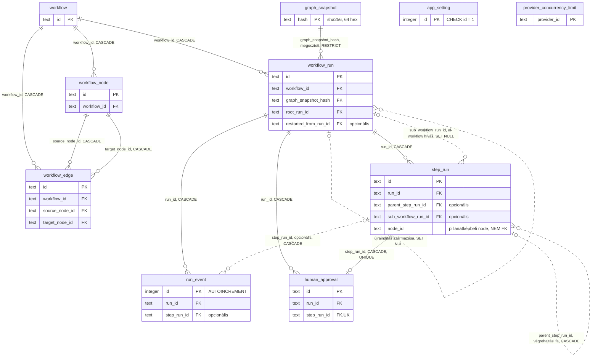

# SPEC-003: Domain modell és perzisztencia

|          |                                                                                                                                                                                                                                                                                                                                                                                      |
| -------- | ------------------------------------------------------------------------------------------------------------------------------------------------------------------------------------------------------------------------------------------------------------------------------------------------------------------------------------------------------------------------------------ |
| Státusz  | tervezet                                                                                                                                                                                                                                                                                                                                                                             |
| Dátum    | 2026-08-27                                                                                                                                                                                                                                                                                                                                                                           |
| Előzmény | [`SPEC-002-csomag-architektura.md`](SPEC-002-csomag-architektura.md) 6. szekció (mappa konvenció), 4. szekció (rétegzés)                                                                                                                                                                                                                                                             |
| Bemenet  | [`../research/2026-08-26-agent-sdk-minimax.md`](../research/2026-08-26-agent-sdk-minimax.md), [`../research/2026-08-26-spec000-kiertekeles.md`](../research/2026-08-26-spec000-kiertekeles.md), [`../research/2026-08-26-toolchain.md`](../research/2026-08-26-toolchain.md), [`../research/2026-08-27-tarolo-motor-ertekeles.md`](../research/2026-08-27-tarolo-motor-ertekeles.md) |
| Kimenet  | 10 tábla a `@easter-workflow-builder/db` csomagban, 12 mappa a `src/` alatt (kilenc téma, három tárgykör tíz témával, a PLAN-004 szerint pontosítva), tartalom szerint címzett és verziózott gráf pillanatkép, két állapotgép, repository réteg                                                                                                                                      |
| Terv     | [`../plan/PLAN-003-domain-perzisztencia.md`](../plan/PLAN-003-domain-perzisztencia.md)                                                                                                                                                                                                                                                                                               |

---

## 1. Cél és hatókör

### Amit eldönt

- A workflow, a futás, a lépés futás, az esemény és az emberi jóváhagyás domain entitásait, a mezőikkel, kötelezőségükkel, idegen kulcsaikkal, kaszkád viselkedésükkel és indexeikkel.
- A gráf pillanatkép alakját, a séma verziózását és azt, mi garantálja a régi futás megjeleníthetőségét.
- A pillanatkép tartalom szerinti címzését: a lenyomat algoritmust, a kanonikus alakot és az ütközés kezelést (5.6), valamint a megosztott sor törlési szabályát (4.15).
- Az esemény tábla normalizált mezőkészletét, a nyers üzenet tárolását, a WebSocket replay sorszámozását.
- A `content_block_delta` jellegű események perzisztálásának kapcsolóját, az alapértelmezését és a futáshoz rögzítését (6.6).
- A futás és a lépés futás állapotgépét, az érvényes átmeneteket, valamint az újraindítás, megszakítás és szerver leállás viselkedését.
- A `packages/db` csomag téma mappáit, a repository réteg műveleteit és azt, hogyan nem kerülhetők meg a séma garanciái.
- A migrációk generálását és futtatását, az adatbázis fájl helyét, a fejlesztői és az éles viselkedést.
- A tesztelés módját valós SQLite ellen, 100 százalékos lefedettséggel, kizárás nélkül.

### Amit NEM dönt el

- Nem tervezi meg a végrehajtó motort (`@easter-workflow-builder/engine`), a HTTP és WebSocket felületet (`apps/server`, `@easter-workflow-builder/protocol`), sem a gráf szerkesztő UI-t (`apps/web`, `@easter-workflow-builder/ui`). A jelen spec csak azt rögzíti, milyen adatot kell tudni kiolvasni és beírni.
- Nem nyúl a provider config fájlokhoz és nem vezet be provider CRUD felületet. A DB kizárólag azonosítóval hivatkozik providerre.
- Nem old fel egyetlen SPEC-000 mérési eredményt sem, és nem ír új drótszintű mérést.
- Nem vezet be adatmegőrzési (retention), tömörítési vagy `VACUUM` szabályt. Erre nincs mérésünk, lásd 13. szekció. A 6.6 delta kapcsoló **nem** megőrzési szabály: nem töröl semmit, hanem arról dönt, hogy egy adott esemény fajta egyáltalán beíródjon-e, és alapértelmezésben beíródik.
- Nem tervez felhasználó kezelést, jogosultságot vagy több felhasználós működést. A rendszer egy felhasználós, egy szerver folyamatos, ez rögzített feltevés (7.4).

### A user négy döntése, amit ez a spec megvalósít

| #   | Döntés                                       | Hol valósul meg                                                              |
| --- | -------------------------------------------- | ---------------------------------------------------------------------------- |
| 1   | Minden futás pillanatképet tárol a gráfról   | 4.9 és 5. szekció, `graph_snapshot` tábla, verziózott dokumentummal          |
| 2   | Nyers SDK üzenet plusz normalizált mezők     | 6. szekció, `run_event` tábla                                                |
| 3   | Végleges törlés mindennel együtt             | 4.15 szekció, `ON DELETE CASCADE` lánc plusz árva söprés, soft delete nélkül |
| 4   | Közös, providerenkénti párhuzamossági korlát | 11. szekció, `provider_concurrency_limit` tábla, alapérték nélkül            |

### A user két további döntése, 2026-08-27

A [`../research/2026-08-27-tarolo-motor-ertekeles.md`](../research/2026-08-27-tarolo-motor-ertekeles.md) mérés 7.2 szekciója két
adatmodell változatot tett a user elé. Mindkettőt elfogadta, és mindkettő ebben a specben valósul meg.

| #   | Döntés                                                        | Hol valósul meg                                                                                     |
| --- | ------------------------------------------------------------- | --------------------------------------------------------------------------------------------------- |
| 5   | A pillanatkép sort a tartalmának lenyomata azonosítja         | 4.9 és 5.6 szekció, `graph_snapshot` tábla `sha256` elsődleges kulccsal, a futás a lenyomatra mutat |
| 6   | Kapcsolható delta perzisztálás, alapértelmezésben kikapcsolva | 6.6 szekció, `app_setting.persist_stream_deltas` és `workflow_run.persisted_stream_deltas`          |

A 3. döntés **nem lazul**: a törlés továbbra is végleges, nincs soft delete, nincs archiválás és nincs
kuka, és a törölt workflow-hoz tartozó minden adat elvész. Az 5. döntés annyit változtat, hogy a
megosztott pillanatkép sort nem kaszkád viszi el, hanem árva söprés, ugyanabban a tranzakcióban (4.15).
Egyetlen sor maradhat meg a söprés után, az is csak akkor, ha **egy másik, nem törölt workflow** futása
hivatkozik rá; ez nem kivétel a 3. döntés alól, mert az a sor nem a törölt workflow adata. A 6. döntés
alapértelmezése a **kikapcsolt állapot**, tehát alapból nem íródik `sdk_stream_event` fajtájú sor; az
indoklás a 6.6 szekcióban áll.

## 2. Megerősített tények, forrással

Ez a szekció az a tényalap, amire a séma épül. Minden sor mögött hivatalos dokumentáció vagy a ténylegesen kiadott csomagforrás áll. Amire nincs forrás, az a 13. szekcióban áll nyitott kérdésként.

| #    | Tény                                                                                                                                                                                                                                                                                                                                                                                   | Forrás                                                                                                                                                                                            |
| ---- | -------------------------------------------------------------------------------------------------------------------------------------------------------------------------------------------------------------------------------------------------------------------------------------------------------------------------------------------------------------------------------------- | ------------------------------------------------------------------------------------------------------------------------------------------------------------------------------------------------- |
| F-1  | SQLite: az idegen kulcs kikényszerítés alapból KI van kapcsolva, és **kapcsolatonként** kell bekapcsolni `PRAGMA foreign_keys = ON` paranccsal                                                                                                                                                                                                                                         | https://sqlite.org/foreignkeys.html                                                                                                                                                               |
| F-2  | A `foreign_keys` pragma többutasításos tranzakción **belül hatástalan**, csendben no-op                                                                                                                                                                                                                                                                                                | https://sqlite.org/foreignkeys.html                                                                                                                                                               |
| F-3  | `better-sqlite3` nem kapcsolja be magától az idegen kulcsokat, a `.pragma()` API-t adja hozzá                                                                                                                                                                                                                                                                                          | https://github.com/WiseLibs/better-sqlite3/blob/master/docs/api.md                                                                                                                                |
| F-4  | `better-sqlite3` szinkron API, támogatja a `:memory:` adatbázist, a `.transaction()` BEGIN/COMMIT/ROLLBACK szemantikájú, `.immediate()` és `.exclusive()` variánssal                                                                                                                                                                                                                   | https://github.com/WiseLibs/better-sqlite3/blob/master/docs/api.md                                                                                                                                |
| F-5  | `better-sqlite3` `options.timeout` dokumentált alapértéke 5000 ms, ez a busy handler                                                                                                                                                                                                                                                                                                   | https://github.com/WiseLibs/better-sqlite3/blob/master/docs/api.md, https://sqlite.org/c3ref/busy_timeout.html                                                                                    |
| F-6  | SQLite alapértelmezett `journal_mode` = `DELETE`, a WAL bekapcsolása `PRAGMA journal_mode = WAL`                                                                                                                                                                                                                                                                                       | https://sqlite.org/wal.html                                                                                                                                                                       |
| F-7  | `:memory:` adatbázison a `journal_mode` csak `MEMORY` vagy `OFF` lehet, a WAL-ra állítás **figyelmen kívül marad**                                                                                                                                                                                                                                                                     | https://sqlite.org/pragma.html#pragma_journal_mode                                                                                                                                                |
| F-8  | WAL módban is egyszerre **egy** író lehet                                                                                                                                                                                                                                                                                                                                              | https://sqlite.org/wal.html                                                                                                                                                                       |
| F-9  | `INTEGER PRIMARY KEY` (rowid alias) újrahasznosíthatja a törölt legnagyobb rowid értéket; az `AUTOINCREMENT` `sqlite_sequence` alapján **soha nem használt, monoton növekvő** értéket ad, hézagokkal                                                                                                                                                                                   | https://sqlite.org/autoinc.html                                                                                                                                                                   |
| F-10 | UNIQUE indexben minden NULL érték különbözőnek számít, tehát több NULL megengedett                                                                                                                                                                                                                                                                                                     | https://www.sqlite.org/lang_createindex.html                                                                                                                                                      |
| F-11 | Az `ON DELETE CASCADE` láncoltan és önhivatkozó táblán is működik; a `PRAGMA recursive_triggers` **nem** befolyásolja; van dokumentált mélységi korlát (`SQLITE_MAX_TRIGGER_DEPTH`, `SQLITE_LIMIT_TRIGGER_DEPTH`)                                                                                                                                                                      | https://www.sqlite.org/foreignkeys.html, https://www.sqlite.org/pragma.html#pragma_recursive_triggers                                                                                             |
| F-12 | `CREATE TABLE` hivatkozhat még nem létező szülő táblára, a hiba csak DML-nél jelentkezik                                                                                                                                                                                                                                                                                               | https://www.sqlite.org/foreignkeys.html                                                                                                                                                           |
| F-13 | Drizzle 0.45.2 SQLite: `integer().primaryKey({ autoIncrement: true })` létezik és `AUTOINCREMENT` kulcsszót generál                                                                                                                                                                                                                                                                    | https://unpkg.com/drizzle-orm@0.45.2/sqlite-core/columns/integer.d.ts, https://orm.drizzle.team/docs/sqlite/column-types                                                                          |
| F-14 | Drizzle 0.45.2 SQLite: a `sqliteTable` harmadik paramétere **tömböt** visszaadó callback; az objektumot visszaadó alak `@deprecated`                                                                                                                                                                                                                                                   | https://unpkg.com/drizzle-orm@0.45.2/sqlite-core/table.d.ts                                                                                                                                       |
| F-15 | Drizzle 0.45.2 SQLite: `references(ref, { onDelete: 'cascade' })` létezik, az `IndexBuilder` ad `.where()` metódust (részleges index), és van `check(name, sql)` a tábla extra configban                                                                                                                                                                                               | https://unpkg.com/drizzle-orm@0.45.2/sqlite-core/columns/common.d.ts, https://unpkg.com/drizzle-orm@0.45.2/sqlite-core/indexes.d.ts, https://unpkg.com/drizzle-orm@0.45.2/sqlite-core/checks.d.ts |
| F-16 | Drizzle 0.45.2 SQLite: `integer({ mode: 'timestamp' })` **másodpercet** tárol (`Math.floor(unix/1000)`), `{ mode: 'timestamp_ms' }` **ezredmásodpercet**; `text({ mode: 'json' })` és `.$type<T>()` létezik                                                                                                                                                                            | https://unpkg.com/drizzle-orm@0.45.2/sqlite-core/columns/integer.js                                                                                                                               |
| F-17 | Drizzle SQLite: **nincs** natív `STRICT` tábla támogatás, sem a `sqliteTable` configban, sem a drizzle-kitben                                                                                                                                                                                                                                                                          | https://unpkg.com/drizzle-orm@0.45.2/sqlite-core/table.d.ts, https://github.com/drizzle-team/drizzle-orm/discussions/2435                                                                         |
| F-18 | `drizzle-orm/better-sqlite3/migrator` `migrate()` **szinkron**, és a `__drizzle_migrations` táblába naplóz (a név `migrationsTable`-lel felülírható)                                                                                                                                                                                                                                   | https://unpkg.com/drizzle-orm@0.45.2/sqlite-core/dialect.js                                                                                                                                       |
| F-19 | `drizzle-kit generate` a séma és az utolsó snapshot diffjéből ír SQL migrációt; a `--custom` kapcsoló üres migrációt generál nyers SQL-hez; a `check` a migrációtörténet konzisztenciáját nézi                                                                                                                                                                                         | https://orm.drizzle.team/docs/sqlite/drizzle-kit-generate, https://orm.drizzle.team/docs/sqlite/drizzle-kit-check                                                                                 |
| F-20 | `better-sqlite3` nem szállít saját TypeScript típust, kell hozzá `@types/better-sqlite3`                                                                                                                                                                                                                                                                                               | https://registry.npmjs.org/better-sqlite3/latest, https://registry.npmjs.org/@types/better-sqlite3/latest                                                                                         |
| F-21 | `node:crypto`: `crypto.hash(algorithm, data[, options])` egyszeri hash API, bekerült a v21.7.0 és a v20.12.0 verzióban, a v25.5.0 és a v24.13.1 óta **nem kísérleti**; az `outputEncoding` dokumentált alapértéke `'hex'`; string bemenetet UTF-8-ként kódol hashelés előtt                                                                                                            | https://nodejs.org/docs/latest-v26.x/api/crypto.html (`crypto.hash` szekció, `meta.added` és `changes` a hivatalos `crypto.json` dokumentum adatban)                                              |
| F-22 | Ugyanez a doksi: "It can be faster than the object-based `crypto.createHash()` when hashing a smaller amount of data (<= 5MB) that's readily available"; a `createHash` szekció ugyanezt a határt mondja fordítva                                                                                                                                                                      | https://nodejs.org/docs/latest-v26.x/api/crypto.html                                                                                                                                              |
| F-23 | Az elérhető hash algoritmusok a platform OpenSSL verziójától függnek; a doksi példaként a `'sha256'` és a `'sha512'` értéket nevezi meg, és a saját `createHash` példája `sha256`; a lista futásidőben a `crypto.getHashes()` hívásból jön                                                                                                                                             | https://nodejs.org/docs/latest-v26.x/api/crypto.html                                                                                                                                              |
| F-24 | SHA-256 üzenet lenyomat mérete 256 bit, azaz 32 bájt, azaz 64 hexadecimális karakter; SHA-512 esetén 512 bit, azaz 128 hexadecimális karakter                                                                                                                                                                                                                                          | https://nvlpubs.nist.gov/nistpubs/FIPS/NIST.FIPS.180-4.pdf (1. ábra táblázata), https://csrc.nist.gov/pubs/fips/180-4/upd1/final                                                                  |
| F-25 | RFC 8785 (JSON Canonicalization Scheme): a kulcsokat rekurzívan, a nyers kulcsnév UTF-16 kódegységei szerint növekvő sorrendben rendezi; a tömb elemsorrend "MUST NOT be changed"; whitespace nem kerül a kimenetbe; a szám és a string szerializálást normatívan az ECMA-262 3.2.2.2 és 3.2.2.3 pontjára delegálja; a `NaN`, az `Infinity` és a lone surrogate hibát **kell** okozzon | https://www.rfc-editor.org/rfc/rfc8785 (3.2.1, 3.2.2.2, 3.2.2.3, 3.2.3 szekció)                                                                                                                   |
| F-26 | ECMA-262 `OrdinaryOwnPropertyKeys`: előbb az egész indexnek megfelelő kulcsok növekvő számsorrendben, utána a többi string kulcs beszúrási sorrendben. A `JSON.stringify` ezt a sorrendet követi, tehát azonos tartalmú, de eltérő beszúrási sorrenddel épített objektum kimenete eltérhet, és az egész indexű kulcsok sorrendje **nem** egyezik az RFC 8785 UTF-16 sorrendjével       | https://tc39.es/ecma262/multipage/ordinary-and-exotic-objects-behaviours.html#sec-ordinaryownpropertykeys, https://tc39.es/ecma262/multipage/structured-data.html#sec-json.stringify              |
| F-27 | SQLite `ON DELETE RESTRICT`: "the application is prohibited from deleting ... a parent key when there exists one or more child keys mapped to it", és a RESTRICT hibája **azonnal** jön, nem az utasítás végén. Ugyanez a doksi mondja ki, hogy "in most real systems, an index should be created on the child key columns of each foreign key constraint"                             | https://sqlite.org/foreignkeys.html (4.3 szekció a RESTRICT szövegre, 3. szekció az index mondatra)                                                                                               |
| F-28 | Drizzle 0.45.2 SQLite: az `UpdateDeleteAction` unió tartalmazza a `'restrict'` értéket, tehát a `references(ref, { onDelete: 'restrict' })` alak létezik; a `default(value)` metódus minden oszlop építőn elérhető                                                                                                                                                                     | https://unpkg.com/drizzle-orm@0.45.2/sqlite-core/foreign-keys.d.ts, https://unpkg.com/drizzle-orm@0.45.2/column-builder.d.ts                                                                      |

**Saját, most futtatott ellenőrzés Node 26.7.0 alatt** (nem hivatkozott forrás, hanem mérés, ezért külön áll):
a `crypto.getHashes()` kimenete tartalmazza a `sha256` értéket, a `crypto.hash('sha256', '{}')` 64 karakteres,
**kisbetűs** hexadecimális szöveget ad
(`44136fa355b3678a1146ad16f7e8649e94fb4fc21fe77e8310c060f61caaff8a`), a `String.prototype.isWellFormed` létezik és a lone surrogate stringre `false`
értéket ad, a `JSON.stringify({ b: 1, a: 2 })` és a `JSON.stringify({ a: 2, b: 1 })` kimenete eltér, az
alapértelmezett `Array.prototype.sort()` az `['b','a','€','A','aa']` tömböt `['A','a','aa','b','€']` sorrendre
rendezi (ez az F-25 UTF-16 szabálya), a `JSON.stringify` az RFC 8785 3.2.2 mintaszámait pontosan a
`[333333333.3333333,1e+30,4.5,0.002,1e-27]` alakra hozza (bájtra az RFC kanonikus mintája), és a
`JSON.stringify({'10':1,'9':2,'a':3})` kimenete `{"9":2,"10":1,"a":3}`, ami az F-26 miatt **eltér** az
RFC 8785 által előírt `"10"`, `"9"`, `"a"` sorrendtől. Az utolsó tény az 5.6 szekció egyik tervezési
megkötésének a bizonyítéka.

Az F-17 következménye, hogy a típus szigorúságot a séma szintjén nem kapjuk meg SQLite oldalról, tehát a repository réteg typeguardjai nem díszítés, hanem az egyetlen szűrő a bejövő értékeken.

Az SDK oldali tények (az `SDKMessage` unió, a session kezelés, a hookok, a `usage` mezők) a research fájlokból jönnek, és a 6. szekció táblázata hivatkozza őket mezőnként. Amit a research nem támaszt alá, az ebben a specben nem szerepel.

## 3. Entitás áttekintés

Tíz saját tábla, plusz a drizzle-kit által kezelt `__drizzle_migrations` (F-18), ami nem a mi sémánk része.

Az alábbi Mermaid `erDiagram` a korábbi ASCII vázlatot váltja fel, nem egészíti ki: pontosan ugyanazt a kapcsolatrendszert írja le, de kardinalitással, kulcsokkal és törlési viselkedéssel együtt, így egyetlen forrás marad a kapcsolatok leírására, és a kettő nem futhat szét egymástól. A `__drizzle_migrations` tábla nem szerepel rajta: nincs idegen kulcsa sem befelé, sem kifelé (3. szekció fenti mondata), tehát a kapcsolati rajzon nem hordozna kapcsolati információt, csak zajt.



**Mit mutat a rajz.** A folytonos vonal _azonosító_ kapcsolat: a gyerek sor nem létezhet a hivatkozott szülő sor nélkül, mert a mutató idegen kulcs kötelező (`NOT NULL`). A szaggatott vonal _nem azonosító_: a mutató mező opcionális, a gyerek sor a hivatkozás nélkül is létezhet. Négy kapcsolat szaggatott, mindegyik opcionális mezőn áll: a `workflow_run.restarted_from_run_id` (önhivatkozás, az újraindítás származása), a `step_run.parent_step_run_id` (önhivatkozás, a végrehajtási fa), a `workflow_run` felől a `step_run.sub_workflow_run_id` (az al-workflow hívást indító lépés) és a `run_event.step_run_id` (futás szintű eseménynél NULL, 6.2). A többi tizenegy kapcsolat folytonos. Minden kapcsolat címkéje a hordozó oszlop nevét és a törlési viselkedést adja meg, a 4.15 szekció lánca szerint. A `graph_snapshot` és a `workflow_run` közötti kapcsolat iránya szándékosan a pillanatképtől a futás felé mutat: minden `workflow_run` pontosan egy `graph_snapshot` sorra hivatkozik (a `graph_snapshot` oldali "pontosan egy" jelölés), egy `graph_snapshot` sorra viszont tetszőleges sok `workflow_run` hivatkozhat (a `workflow_run` oldali "nulla vagy több" jelölés). Ez a **megosztott pillanatkép**, az 5. döntés lényege.

**Mely mezők kerültek a rajzra.** Kizárólag az elsődleges kulcsok, az idegen kulcsok, és két kivétel, ami a kapcsolat megértéséhez kell: a `step_run.node_id`, mert szándékosan **nem** idegen kulcs (4.10), és ezt a rajzon külön meg kell jegyezni, nehogy valaki tévesen kapcsolatnak olvassa; valamint a `graph_snapshot.hash`, ahol a megjegyzés a lenyomat alakját mondja ki. A teljes mezőlista a 4. szekcióban áll; minden más leíró mező (név, státusz, időbélyeg, JSON konfiguráció) szándékosan hiányzik a rajzról, mert a célja a kapcsolatok bemutatása, nem a teljes séma megismétlése.

**Az `app_setting` és a `provider_concurrency_limit` a rajzon kapcsolat nélkül áll.** Egyik táblának sincs idegen kulcsa, és egyik táblára sem mutat idegen kulcs máshonnan (4.13, 4.14). A Mermaid megengedi kapcsolat nélküli entitás felvételét; ez itt szándékos, a teljesség kedvéért szerepelnek, a rajz nem állít róluk mást, mint hogy önállóak.

**Az irány egyirányú.** A `workflow_run` táblának nincs idegen kulcsa a `step_run` felé, a kapcsolatot a `step_run.sub_workflow_run_id` hordozza. Ez azért fontos, mert így a tábla létrehozási sorrend egyértelmű, és nem kell az F-12 szerinti előre hivatkozásra támaszkodni.

**A pillanatkép iránya megfordult.** A `graph_snapshot` sor nem a futás gyereke, hanem a **szülője**: a
hivatkozást a `workflow_run.graph_snapshot_hash` oszlop hordozza. Ebből következik a tábla létrehozási
sorrend is, a `graph_snapshot` táblának a `workflow_run` tábla **előtt** kell léteznie. Az indok az 5.6
szekcióban áll.

**Azonosító típus.** Minden domain entitás elsődleges kulcsa `TEXT`, az alkalmazás által generált UUID, egyetlen kivétellel: a `run_event.id` `INTEGER PRIMARY KEY AUTOINCREMENT` (F-9, F-13), mert ott a szigorúan monoton, soha újra nem használt sorszám maga a funkció (6.3). A UUID azért kell a többinél, mert a gráf pillanatkép a node azonosítókat szövegként hordozza, és a kliens már a szerver válasza előtt hivatkozni tud rájuk.

**Időbélyeg típus.** Minden időbélyeg `integer({ mode: 'timestamp_ms' })`, tehát Unix ezredmásodperc (F-16). Másodperc felbontás nem elég: egy agent lépés alatt másodpercen belül több `stream_event` érkezik, és a transcript sorrendje nem dőlhet el időbélyeg egyenlőségen. A sorrendet amúgy sem az időbélyeg adja, hanem a `run_event.id` (6.3), az időbélyeg megjelenítési és statisztikai mező.

**Logikai érték.** `integer({ mode: 'boolean' })` (F-16).

**JSON oszlop.** `text({ mode: 'json' }).$type<unknown>()` (F-16). A `$type` szándékosan `unknown`, nem a domain típus: az adatbázisból jövő érték nem bizonyíték a típusra, a szűkítést typeguard végzi a repository határon (9.4).

## 4. Entitások mezőnként

A `nem` a "nem kötelező" (nullable) rövidítése. Az `időbélyeg` típus mindenhol `integer timestamp_ms`.

### 4.1 `workflow`

| Oszlop          | Típus     | Kötelező | Megjegyzés                                                                   |
| --------------- | --------- | -------- | ---------------------------------------------------------------------------- |
| `id`            | text      | igen     | elsődleges kulcs, UUID                                                       |
| `name`          | text      | igen     | a felhasználó által adott név                                                |
| `description`   | text      | nem      |                                                                              |
| `provider_id`   | text      | nem      | workflow szintű provider felülírás; NULL esetén a globális alapértelmezés él |
| `created_at_ms` | időbélyeg | igen     |                                                                              |
| `updated_at_ms` | időbélyeg | igen     |                                                                              |

Index: `workflow_updated_at_idx` a `(updated_at_ms)` oszlopon, a lista nézet rendezéséhez.

A `provider_id` oszlopon **nincs** `CHECK` constraint a provider azonosítók felsorolásával. Indok: egy új provider felvétele akkor migrációt igényelne, holott a provider lista backend config fájlokban él. Az érvényességet a repository határon a `ProviderId` typeguard adja (9.4).

### 4.2 `workflow_node`

| Oszlop          | Típus     | Kötelező | Megjegyzés                                                    |
| --------------- | --------- | -------- | ------------------------------------------------------------- |
| `id`            | text      | igen     | elsődleges kulcs, UUID                                        |
| `workflow_id`   | text      | igen     | FK `workflow.id`, `ON DELETE CASCADE`                         |
| `type`          | text      | igen     | `NodeType` unió, lásd 4.3                                     |
| `label`         | text      | igen     | a rajzon megjelenő felirat                                    |
| `position_x`    | real      | igen     | a gráf szerkesztő koordinátája                                |
| `position_y`    | real      | igen     |                                                               |
| `config`        | text json | igen     | a node típusához tartozó beállítás, `unknown` a séma szintjén |
| `created_at_ms` | időbélyeg | igen     |                                                               |
| `updated_at_ms` | időbélyeg | igen     |                                                               |

Index: `workflow_node_workflow_idx` a `(workflow_id)` oszlopon.

**Miért egy JSON oszlop és nem oszlop minden beállításnak.** Az agent lépés beállításai az Agent SDK `Options` mezőit követik, a mezőlista pedig SDK verzióhoz kötött és bővül (research, 3. szekció: "a body mezők listája nyílt és verziónként bővül"). Oszlopokra bontva minden SDK frissítés migrációt kényszerítene ki, és a régi futások pillanatképe akkor is a régi mezőkészletet hordozná. A JSON oszlop plusz a repository határon futó typeguard ugyanazt a szigort adja TypeScript oldalon, migráció nélkül.

### 4.3 Node típusok és a `config` unió

A `NodeType` unió a felhasználó által jóváhagyott tíz típus:

| `type`           | Felelősség                                        | A `config` lényegi mezői                                                                         |
| ---------------- | ------------------------------------------------- | ------------------------------------------------------------------------------------------------ |
| `start`          | belépési pont, bemeneti séma                      | `inputFields: readonly { name, label, valueKind, required }[]`                                   |
| `agent_step`     | a fő típus, egy agent futtatás                    | `AgentStepConfig`, lásd 4.4                                                                      |
| `branch`         | determinisztikus elágazás, **nem** AI             | `expression: string`, `branches: readonly { key, label }[]`, `defaultBranchKey: string \| null`  |
| `fan_out`        | párhuzamos ágak nyitása                           | `itemsExpression: string`, `branchLabelTemplate: string`                                         |
| `join`           | ágak összezárása                                  | `mode: 'merge' \| 'script' \| 'ai_synthesis'`, módonként egy alobjektum                          |
| `loop`           | ciklus vagy retry, iterációszám védelemmel        | `maxIterations: number` (kötelező, alapérték nélkül), `continueExpression: string`               |
| `human_approval` | a futás megáll, amíg a felhasználó nem dönt       | `title: string`, `bodyTemplate: string`                                                          |
| `error_handler`  | hibakezelés és retry policy                       | `maxAttempts: number` (kötelező), `backoffMs: readonly number[]` (kötelező), `handledErrorKinds` |
| `sub_workflow`   | másik workflow hívása, rekurzióvédelemmel         | `targetWorkflowId: string`, `inputMapping: Readonly<Record<string, string>>`                     |
| `script`         | nem AI transzformáció, **később implementálandó** | `source: string`, `runtime: 'expression'`                                                        |

A `join` `ai_synthesis` módja **teljes értékű agent lépés**: az alobjektuma pontosan az `AgentStepConfig` (4.4). A `merge` mód alobjektuma a bemenő ágak összefűzési szabálya, a `script` mód alobjektuma ugyanaz a `ScriptConfig`, mint a `script` node-é.

**A `script` node és a `join` `script` módja tárolható, de nem futtatható.** A séma felkészül rá, a felület kiválaszthatóvá teszi, és modal ablakban "Később implementálandó" jelzést ad. A futás indításakor a validáció elutasítja azt a workflow-t, amiben `script` típusú node vagy `script` módú `join` van, `unimplemented_node_type` hibával. Ez a DB-ben nem `CHECK` constraint, mert a node mentése megengedett, csak a futás indítása nem.

**Iterációszám és retry darabszám.** A `loop.maxIterations`, az `error_handler.maxAttempts` és a `backoffMs` lista **kötelező, szállított alapérték nélkül**. A felhasználó adja meg őket a szerkesztőben. Nincs olyan mérésünk vagy dokumentált szabályunk, amiből ezekre értéket lehetne javasolni, és a projekt szabálya tiltja a becslést. A séma annyit kényszerít ki, ami definíció szerint igaz: az értékek egésznek és pozitívnak kell lenniük, ezt a bemeneti typeguard ellenőrzi.

### 4.4 `AgentStepConfig`

Az agent lépés beállításai. Minden mező forrása az Agent SDK `Options` típusa, ahogy a research 1. szekciója felsorolja. Egyetlen mező sincs kitalálva.

| Mező                              | Típus                                                      | Megjegyzés                                              |
| --------------------------------- | ---------------------------------------------------------- | ------------------------------------------------------- |
| `promptTemplate`                  | `string`                                                   | a lépés bemenete, sablonozva a futás kontextusából      |
| `providerId`                      | `ProviderId \| null`                                       | lépés szintű provider felülírás                         |
| `modelId`                         | `string \| null`                                           | a **wire** modellazonosító, lásd lent                   |
| `effort`, `thinking`              | `string \| null`, `ThinkingMode \| null`                   | `Options.effort`, `Options.thinking`                    |
| `allowedTools`, `disallowedTools` | `readonly string[]`                                        | `Options.allowedTools`, `Options.disallowedTools`       |
| `permissionMode`                  | `string \| null`                                           | `Options.permissionMode`                                |
| `maxTurns`, `maxBudgetUsd`        | `number \| null`                                           | `Options.maxTurns`, `Options.maxBudgetUsd`              |
| `systemPrompt`                    | `string \| { preset, append?, ... } \| null`               | `Options.systemPrompt` két alakja                       |
| `agents`                          | `Readonly<Record<string, AgentDefinition>>`                | `Options.agents`, programozott subagentek               |
| `skills`                          | `readonly string[] \| 'all' \| null`                       | `Options.skills`                                        |
| `mcpServers`                      | `Readonly<Record<string, StorableMcpServer>>`              | csak a szerializálható variánsok, lásd lent             |
| `enabledEngineHooks`              | `readonly EngineHookId[]`                                  | **nem** az SDK `hooks` map, lásd lent                   |
| `cwd`, `additionalDirectories`    | `string \| null`, `readonly string[]`                      | `Options.cwd`, `Options.additionalDirectories`          |
| `sandbox`                         | `SandboxConfig \| null`                                    | `Options.sandbox` mezői a research 1. szekciója szerint |
| `agentTools`                      | `readonly AgentToolId[]`                                   | lépésenként kapcsolható in-process MCP eszközök         |
| `sessionMode`                     | `'isolated' \| 'continued'`                                | lásd 4.5                                                |
| `structuredOutput`                | `{ strategy: StructuredOutputStrategyId, schema } \| null` | lásd 4.6                                                |

**A `modelId` a wire azonosító.** A research 5.1 szekciója szerint a leíró két azonosítót tart külön: a dróton megjelenő `models[].id` és a kliensnek átadott `models[].clientModelIdentifier`. "A UI és a perzisztencia a wire azonosítót mutatja, a kliensnek a suffixes alak megy." A DB tehát a wire azonosítót tárolja, a suffixes alakot a provider leíróból oldja fel a motor.

**Az `mcpServers` nem tartalmazhat titkot.** A tárolható variánsok a `stdio`, `sse` és `http` (research 1. szekció). Az in-process `sdk` variáns nem szerializálható, ezért nem tárolható; az in-process eszközöket az `agentTools` lista adja. A `stdio` variáns `env` mezője helyett a séma **kizárólag `envNames: readonly string[]` értéket tárol**, a `sse` és `http` variáns fejléc értéke helyett `authEnvName: string | null` mezőt. A tényleges értéket a motor a process környezetéből olvassa ki indításkor. Ez a gyökér `CLAUDE.md` "Titok soha nem kerül adatbázisba" szabályának mechanikus megvalósítása.

**Az `enabledEngineHooks` nem az SDK `hooks` mezője.** Az SDK `hooks` opciója callback map (research 1. szekció), tehát nem szerializálható. A DB azt tárolja, hogy a motor melyik saját, beépített hookját kapcsolja be a lépéshez; a motor ebből állítja elő az SDK `hooks` objektumot. Az első verzióban ezt a listát pontosan egy dolog vezérli: az `emit_output_tool` stratégiához tartozó `Stop` hook (4.6).

### 4.5 Session modell

A `sessionMode` két értéke a research 1. szekció "Session kezelés" pontjára képez:

| Érték       | Mit tesz a motor                                                                                                                                |
| ----------- | ----------------------------------------------------------------------------------------------------------------------------------------------- |
| `isolated`  | friss session, sablonozott bemenet, strukturált kimenet. Nincs `resume`.                                                                        |
| `continued` | `resume: <az előző lépés session azonosítója>`; párhuzamos ágnál ugyanez plusz `forkSession: true`, hogy az eredeti session érintetlen maradjon |

A tényleges session azonosítót a lépés futás rögzíti, nem a node config: a `step_run.sdk_session_id`, a `step_run.resumed_from_session_id` és a `step_run.forked_session` oszlop (4.10). A session azonosító a `system` üzenet `subtype: 'init'` alakjából jön (research 1. szekció).

### 4.6 Strukturált kimenet

A `structuredOutput.strategy` értékkészlete a meglévő `StructuredOutputStrategyId` típus a `@easter-workflow-builder/provider-capability` csomagból: `sdk_output_format` és `emit_output_tool`. A séma nem definiál újat.

A `schema` mező JSON Schema dokumentum, `unknown` a séma szintjén, typeguarddal szűkítve.

**Mért kísérő megkötés, ami validációként épül be.** A `maxTurns` alsó korlátja stratégiánként a `ProviderCapabilityDescriptor` `structuredOutput.strategies[].observedRoundTrips` mezőjéből jön, nem a domain rétegben tárolt számból (SPEC-004 11.3 táblázat 3. sora). A mérési eredet megmarad: a research 5.2 szekciója szerint az `sdk_output_format` ágon az M-02 futás `maxTurns: 1` mellett `error_max_turns`-be esett, az `emit_output_tool` ág igénye pedig M-19 mérésből jön. A futás indítási validáció (a motor `capability-policy` témája) ezt a leíróból olvasott minimumot ellenőrzi, és `insufficient_max_turns` hibával utasít el. Ez a szám **mérésből** jön, nem becslésből, és nincs beégetve a domain rétegbe.

### 4.7 `workflow_edge`

| Oszlop           | Típus     | Kötelező | Megjegyzés                                                            |
| ---------------- | --------- | -------- | --------------------------------------------------------------------- |
| `id`             | text      | igen     | elsődleges kulcs, UUID                                                |
| `workflow_id`    | text      | igen     | FK `workflow.id`, `ON DELETE CASCADE`                                 |
| `source_node_id` | text      | igen     | FK `workflow_node.id`, `ON DELETE CASCADE`                            |
| `target_node_id` | text      | igen     | FK `workflow_node.id`, `ON DELETE CASCADE`                            |
| `source_handle`  | text      | nem      | a szerkesztő kimeneti pontja                                          |
| `target_handle`  | text      | nem      | a szerkesztő bemeneti pontja                                          |
| `branch_key`     | text      | nem      | melyik `branch` kimenethez vagy melyik `step_run` állapothoz tartozik |
| `created_at_ms`  | időbélyeg | igen     |                                                                       |

Indexek: `workflow_edge_workflow_idx` a `(workflow_id)`, `workflow_edge_source_idx` a `(source_node_id)`, `workflow_edge_target_idx` a `(target_node_id)` oszlopon.

Az él **nem** hordoz feltétel kifejezést. A feltétel a `branch` node configjában áll, az él csak azt mondja meg, melyik kimeneti ághoz tartozik (`branch_key`). Így egyetlen helyen áll a kifejezés, és nem lehet két él között ellentmondó feltétel.

### 4.8 `workflow_run`

| Oszlop                    | Típus     | Kötelező | Megjegyzés                                                               |
| ------------------------- | --------- | -------- | ------------------------------------------------------------------------ |
| `id`                      | text      | igen     | elsődleges kulcs, UUID                                                   |
| `workflow_id`             | text      | igen     | FK `workflow.id`, `ON DELETE CASCADE`                                    |
| `status`                  | text      | igen     | `RunStatus`, lásd 7.1                                                    |
| `input`                   | text json | igen     | a `start` node bemeneti mezőire adott értékek                            |
| `provider_id`             | text      | igen     | a futásra feloldott provider, indításkor befagyasztva                    |
| `root_run_id`             | text      | igen     | FK `workflow_run.id`, `ON DELETE CASCADE`; gyökér futásnál a saját `id`  |
| `depth`                   | integer   | igen     | 0 a gyökér futásnál, al-workflow hívásnál eggyel több                    |
| `workflow_ancestry`       | text json | igen     | a gyökértől idáig vezető `workflow.id` lista, a rekurzióvédelem bemenete |
| `graph_snapshot_hash`     | text      | igen     | FK `graph_snapshot.hash`, `ON DELETE RESTRICT`; lásd 4.9 és 5.6          |
| `persisted_stream_deltas` | boolean   | igen     | a delta kapcsoló indításkor befagyasztott értéke, lásd 6.6               |
| `restarted_from_run_id`   | text      | nem      | FK `workflow_run.id`, `ON DELETE SET NULL`; újraindítás származása       |
| `created_at_ms`           | időbélyeg | igen     |                                                                          |
| `started_at_ms`           | időbélyeg | nem      | a `running` állapotba lépés ideje                                        |
| `finished_at_ms`          | időbélyeg | nem      | a terminális állapotba lépés ideje                                       |
| `error_kind`              | text      | nem      | gépi hibaosztály, nem szabad szöveg                                      |
| `error_message`           | text      | nem      | a felhasználónak megjelenített üzenet                                    |

Indexek: `workflow_run_workflow_created_idx` a `(workflow_id, created_at_ms)`, `workflow_run_status_idx` a `(status)`, `workflow_run_root_idx` a `(root_run_id)`, `workflow_run_snapshot_idx` a `(graph_snapshot_hash)` oszlopon. Az utolsó nem kényelmi index: az F-27 szerint az idegen kulcs ellenőrzés a gyerek kulcson keres, és index nélkül teljes tábla bejárásra kényszerül, ráadásul a 4.15 árva söprése is ezen a lekérdezésen áll.

**Az al-workflow rekurzióvédelme küszöbszám nélkül működik.** A `workflow_ancestry` a gyökértől idáig vezető workflow azonosítók rendezett listája. Egy `sub_workflow` node indítása előtt a motor megnézi, szerepel-e a cél workflow azonosítója a listában; ha igen, a hívás `workflow_recursion_detected` hibával áll meg. Ez **determinisztikus ciklusfelismerés**, nem mélységi korlát, tehát nem igényel kitalált számot. A `depth` oszlop megjelenítési és diagnosztikai mező, nem korlát.

Az `ON DELETE CASCADE` a `root_run_id` önhivatkozáson azt adja, hogy a gyökér futás törlése az összes al-workflow futását is elviszi, akkor is, ha azok másik workflow-hoz tartoznak (F-11).

### 4.9 `graph_snapshot`

| Oszlop                 | Típus     | Kötelező | Megjegyzés                                                                        |
| ---------------------- | --------- | -------- | --------------------------------------------------------------------------------- |
| `hash`                 | text      | igen     | **elsődleges kulcs**, a `document` `sha256` lenyomata, 64 karakter kisbetűs hex   |
| `document_version`     | integer   | igen     | a dokumentum sémaverziója, kiemelve a JSON-ból                                    |
| `document`             | text json | igen     | a **kanonikus** pillanatkép szöveg, pontosan az a bájtsor, amiből a `hash` lett   |
| `first_captured_at_ms` | időbélyeg | igen     | annak a futásnak az indítási ideje, amelyik ezt a dokumentumot először rögzítette |

Index: `graph_snapshot_version_idx` a `(document_version)` oszlopon. Ez a lekérdezés mögötte: "mely dokumentumok állnak még az N-edik verzión", ami az olvasó lánc karbantartásához kell (5.4).

**A sort a tartalma azonosítja, nem a futás.** Azonos gráfhoz azonos dokumentum, azonos dokumentumhoz egyetlen sor tartozik, és tetszőleges sok futás hivatkozhat rá a `workflow_run.graph_snapshot_hash` oszlopon át. A lenyomat képzése, a kanonikus alak, az ütközés kezelés és a törlési szabály az 5.6 szekcióban áll. A mért indok: 5000 futás ugyanarról a változatlan gráfról a régi modellben 391,0 MiB, az újban 79,7 KiB, a duplikációs arány legrosszabb esetben 5000:1 volt ([`../research/2026-08-27-tarolo-motor-ertekeles.md`](../research/2026-08-27-tarolo-motor-ertekeles.md), 4.3 és 4.4).

**A `first_captured_at_ms` nem futásonkénti mező.** A sor beszúrás után soha nem módosul (5.5), tehát ez az oszlop az **első** rögzítés ideje marad akkor is, ha később további futások hivatkoznak rá. A futásonkénti idő a `workflow_run.created_at_ms` és a `started_at_ms` oszlopban áll, tehát semmi nem vész el.

**Miért külön tábla és nem oszlop a `workflow_run` táblán.** A futás lista lekérdezés (`SELECT ... FROM workflow_run`) így egyáltalán nem érinti a pillanatkép dokumentumot, a pillanatképnek saját, önálló verziószáma és saját, csak beszúrást engedő életciklusa lehet (5.5), és csak így lehet a sort több futás között megosztani.

### 4.10 `step_run`

| Oszlop                        | Típus     | Kötelező | Megjegyzés                                                                   |
| ----------------------------- | --------- | -------- | ---------------------------------------------------------------------------- |
| `id`                          | text      | igen     | elsődleges kulcs, UUID                                                       |
| `run_id`                      | text      | igen     | FK `workflow_run.id`, `ON DELETE CASCADE`                                    |
| `node_id`                     | text      | igen     | a **pillanatképbeli** node azonosító, nem FK a `workflow_node` táblára       |
| `node_type`                   | text      | igen     | a pillanatképből kimásolva, hogy a lista ne igényelje a dokumentum olvasását |
| `parent_step_run_id`          | text      | nem      | FK `step_run.id`, `ON DELETE CASCADE`; a végrehajtási fa                     |
| `iteration`                   | integer   | igen     | ciklus iteráció indexe, alapból 0                                            |
| `attempt`                     | integer   | igen     | retry kísérlet sorszáma, alapból 1                                           |
| `status`                      | text      | igen     | `StepRunStatus`, lásd 7.2                                                    |
| `provider_id`                 | text      | igen     | a lépésre feloldott provider, indításkor befagyasztva                        |
| `model_id`                    | text      | nem      | wire modellazonosító; nem agent lépésnél NULL                                |
| `session_mode`                | text      | nem      | `isolated` vagy `continued`; nem agent lépésnél NULL                         |
| `sdk_session_id`              | text      | nem      | a `system` `init` üzenetből                                                  |
| `resumed_from_session_id`     | text      | nem      | `Options.resume` értéke                                                      |
| `forked_session`              | boolean   | igen     | `Options.forkSession`, alapból hamis                                         |
| `structured_output_strategy`  | text      | nem      | `StructuredOutputStrategyId`                                                 |
| `output`                      | text json | nem      | a lépés kimenete, strukturált kimenetnél a validált objektum                 |
| `result_subtype`              | text      | nem      | az SDK `result` üzenet `subtype` mezője                                      |
| `num_turns`                   | integer   | nem      | az SDK `result` üzenetből                                                    |
| `input_tokens`                | integer   | nem      | összesítés a lépés zárásakor                                                 |
| `output_tokens`               | integer   | nem      | ugyanígy                                                                     |
| `cache_read_input_tokens`     | integer   | nem      | ugyanígy                                                                     |
| `cache_creation_input_tokens` | integer   | nem      | ugyanígy                                                                     |
| `sub_workflow_run_id`         | text      | nem      | FK `workflow_run.id`, `ON DELETE SET NULL`; `sub_workflow` node esetén       |
| `error_kind`                  | text      | nem      |                                                                              |
| `error_message`               | text      | nem      |                                                                              |
| `started_at_ms`               | időbélyeg | nem      |                                                                              |
| `finished_at_ms`              | időbélyeg | nem      |                                                                              |
| `created_at_ms`               | időbélyeg | igen     |                                                                              |

Indexek: `step_run_run_created_idx` a `(run_id, created_at_ms)`, `step_run_run_node_idx` a `(run_id, node_id)`, `step_run_parent_idx` a `(parent_step_run_id)`, `step_run_sub_run_idx` a `(sub_workflow_run_id)` oszlopon.

**A `node_id` szándékosan nem idegen kulcs.** A lépés futás a **pillanatkép** node-jára hivatkozik, nem az élő workflow node-jára. Ha idegen kulcs lenne, egy node törlése a szerkesztőben vagy elvinné a régi futás lépéseit, vagy megakadályozná a szerkesztést; mindkettő ellentmond az 1. döntésnek. A hivatkozás feloldását a pillanatkép dokumentum adja, és a repository a lépés lista olvasásakor a pillanatképből tölti fel a megjelenítendő adatot.

**Nincs egyediségi megszorítás a `(run_id, node_id, ...)` négyesen.** Egy node jogosan futhat sokszor: fan-out ágban ágonként, ciklusban iterációnként, retrynél kísérletenként. A végrehajtás alakját a `parent_step_run_id` fa, az `iteration` és az `attempt` írja le, egyediségi kényszer nélkül.

**A retry új sor, nem állapot.** Egy elbukott lépés `failed` marad, és az `error_handler` egy **új** `step_run` sort hoz létre `attempt + 1` értékkel, ugyanazzal a `parent_step_run_id` és `node_id` értékkel. Így a transcript minden kísérletet megmutat, és nincs szükség `retrying` állapotra.

**A token oszlopok származtatott összesítések.** Ugyanaz az adat megvan a `run_event` sorokban is. A duplikálás a 2. döntés "a statisztika is gyors" követelményét szolgálja: a futás lista lépésenkénti token oszlopot mutat esemény bejárás nélkül. Az összesítés **egyszer** íródik, a terminális állapotba lépéssel azonos tranzakcióban, utána nem változik.

### 4.11 `run_event`

Lásd 6. szekció, mert a mezőkészlet forrásonként indoklást igényel.

### 4.12 `human_approval`

| Oszlop            | Típus     | Kötelező | Megjegyzés                                                |
| ----------------- | --------- | -------- | --------------------------------------------------------- |
| `id`              | text      | igen     | elsődleges kulcs, UUID                                    |
| `run_id`          | text      | igen     | FK `workflow_run.id`, `ON DELETE CASCADE`                 |
| `step_run_id`     | text      | igen     | FK `step_run.id`, `ON DELETE CASCADE`, **egyedi**         |
| `title`           | text      | igen     | a `human_approval` node configjából, kitöltve             |
| `body`            | text      | igen     | a megjelenített szöveg, a kérés pillanatában kirenderelve |
| `payload`         | text json | igen     | amit a döntéshez látni kell (az addigi lépés kimenetek)   |
| `decision`        | text      | nem      | `approved` vagy `rejected`; NULL, amíg nincs döntés       |
| `requested_at_ms` | időbélyeg | igen     |                                                           |
| `decided_at_ms`   | időbélyeg | nem      |                                                           |

Indexek: `human_approval_step_uq` **egyedi** index a `(step_run_id)`, `human_approval_pending_idx` a `(decision, requested_at_ms)` oszlopokon. Az utóbbi szolgálja ki a "mi vár döntésre, időrendben" lekérdezést; SQLite az indexben tárolja a NULL értékeket, tehát a `WHERE decision IS NULL ORDER BY requested_at_ms` kiszolgálható belőle.

A `run_id` denormalizált (levezethető a `step_run` soron át), hogy a több futáson átívelő "függő jóváhagyások" lista egy táblából kiszolgálható legyen.

A `body` és a `payload` a **kérés pillanatában** rögzül, nem a megjelenítéskor renderelődik. Így a fél évvel későbbi visszanézés ugyanazt mutatja, amit a döntéshozó látott.

### 4.13 `app_setting`

Egysoros tábla a globális alapértelmezéseknek.

| Oszlop                  | Típus     | Kötelező | Megjegyzés                                            |
| ----------------------- | --------- | -------- | ----------------------------------------------------- |
| `id`                    | integer   | igen     | elsődleges kulcs, `CHECK (id = 1)`                    |
| `default_provider_id`   | text      | nem      | a globális alapértelmezett provider                   |
| `persist_stream_deltas` | boolean   | igen     | séma szintű `DEFAULT` hamis értékkel (F-28), lásd 6.6 |
| `updated_at_ms`         | időbélyeg | igen     |                                                       |

A `CHECK (id = 1)` az egysorosságot kényszeríti ki adatbázis szinten (F-15).

A `persist_stream_deltas` az egyetlen szállított alapértékkel rendelkező beállítás ebben a specben. Ez **nem** kitalált konfigurációs érték, hanem a 6. user döntés, az indoklása a 6.6 szekcióban áll.

**A sor életciklusa.** A migráció **egyetlen sort sem szúr be**, tehát friss adatbázison a tábla üres. A `readSettings` üres táblán `default_provider_id: null` és `persistStreamDeltas: false` értéket ad, tehát ugyanazt az alapértelmezést, amit a séma szintű `DEFAULT` adna. A sort az első `setDefaultProvider` vagy `setPersistStreamDeltas` hívás hozza létre, `INSERT ... ON CONFLICT(id) DO UPDATE` alakban, `id = 1` értékkel; ilyenkor a nem érintett oszlop a séma szintű alapértékét kapja. Így mindkét ág (nincs sor, van sor) valós úton előidézhető, és mindkettőre van teszt (56. kritérium).

A `default_provider_id` **nullable, és a migráció nem tölti ki**. Nincs olyan mérésünk vagy user döntésünk, ami megmondaná, melyik provider legyen az alapértelmezett; egy szállított érték találgatás lenne. NULL esetén a futás indítás `no_default_provider` hibával áll meg, és a felület az első indulásnál kéri be a választást.

### 4.14 `provider_concurrency_limit`

| Oszlop                 | Típus     | Kötelező | Megjegyzés                         |
| ---------------------- | --------- | -------- | ---------------------------------- |
| `provider_id`          | text      | igen     | elsődleges kulcs                   |
| `max_concurrent_steps` | integer   | igen     | `CHECK (max_concurrent_steps > 0)` |
| `updated_at_ms`        | időbélyeg | igen     |                                    |

Lásd 11. szekció. A tábla **üresen indul**, a migráció egyetlen sort sem szúr be.

### 4.15 A kaszkád lánc, a 3. döntés

```
workflow torlese
  -> workflow_node        (ON DELETE CASCADE)
  -> workflow_edge        (ON DELETE CASCADE, a node-on at is)
  -> workflow_run         (ON DELETE CASCADE)
       -> step_run             (ON DELETE CASCADE)
            -> step_run        (parent_step_run_id, ON DELETE CASCADE)
            -> run_event       (ON DELETE CASCADE)
            -> human_approval  (ON DELETE CASCADE)
       -> run_event            (ON DELETE CASCADE)
       -> human_approval       (ON DELETE CASCADE)
       -> workflow_run         (root_run_id, ON DELETE CASCADE, al-workflow futasok)
       -> workflow_run         (restarted_from_run_id, ON DELETE SET NULL, ujrainditott futas szarmazasa)
       -> step_run             (sub_workflow_run_id, ON DELETE SET NULL, al-workflow-t hivo lepes)
  -> graph_snapshot       (NEM kaszkad: arva soproes, ugyanabban a tranzakcioban)
```

**Két idegen kulcs `ON DELETE SET NULL` viselkedésű, nem kaszkád.** A `workflow_run.restarted_from_run_id` (4.8) és a `step_run.sub_workflow_run_id` (4.10) egyaránt a `workflow_run.id` oszlopra mutat, de egyik sem viszi tovább a törlést: a hivatkozott futás sorának törlésekor a mutató oszlop NULL-ra vált, a hivatkozó sor megmarad. Ez szándékos: az újraindítás származása és az al-workflow hívást indító lépés megmarad akkor is, ha a hivatkozott futás sora időközben törlődött.

**A pillanatkép kikerült a kaszkád láncból.** A `graph_snapshot` sor a futás **szülője**, nem a gyereke, tehát kaszkád nem viheti el. Helyette a `deleteWorkflow` a saját tranzakciójában, a futások törlése **után**, egyetlen söprő utasítást ad ki:

```
DELETE FROM graph_snapshot
 WHERE hash NOT IN (SELECT graph_snapshot_hash FROM workflow_run)
```

**Két, egymástól független védelem arra, hogy hivatkozott pillanatkép soha ne tűnjön el.**

1. **Adatbázis szint.** A `workflow_run.graph_snapshot_hash` idegen kulcs `ON DELETE RESTRICT` viselkedésű (F-27): amíg akár egy futás hivatkozik egy lenyomatra, a szülő sor törlése azonnal hibát ad, és a tranzakció visszagördül. Ez akkor is fog, ha a söprő utasítás feltétele valaha hibás lenne. A védelem a bekapcsolt `foreign_keys` pragmán áll (F-1), ami az `openDatabase` elválaszthatatlan része (10.2).
2. **A söprés feltétele.** A `NOT IN` a tényleges hivatkozásokból dolgozik, nem egy külön nyilvántartásból.

**Hivatkozásszámláló oszlop nincs.** Egy `ref_count` mező második igazságforrás lenne a `workflow_run` sorok mellett, és minden útvonalon karban kellene tartani (indítás, törlés, al-workflow kaszkád, helyreállítás); egyetlen kihagyott út csendben elrontaná. A hivatkozottság a `workflow_run` táblából **levezethető**, tehát nem tároljuk külön. Ugyanez az elv, mint a `run_event` futásonkénti sorszámánál (6.3): amit a meglévő adat megad, azt nem duplikáljuk.

**Mikor törölhető egy pillanatkép.** Pontosan akkor, ha nulla `workflow_run` sor hivatkozik rá. Más törlési út nincs: a repository nem exportál `deleteSnapshot` műveletet, és a söprés kizárólag a `deleteWorkflow` tranzakciójának a záró lépése, mert ma ez az egyetlen művelet, ami futás sort tud törölni (9.2).

**A 3. döntés nem gyengül.** A pillanatkép dokumentum tartalmazza a `workflow.id` értéket (5.1), tehát két különböző workflow soha nem állíthat elő azonos dokumentumot, és a megosztás mindig egyetlen workflow-n belül marad. Egy workflow törlése ezért **minden** pillanatképét árvává teszi, és a söprés mindet elviszi. Egyetlen eset van, amikor a söprés meghagy egy sort: ha egy al-workflow futásának a pillanatképére a saját, önállóan indított futása is hivatkozik. Az a sor jogosan marad, mert az a futás nem lett törölve.

**Ez visszavonhatatlan.** Nincs archiválás, nincs soft delete, nincs `deleted_at` oszlop és nincs kuka. Egy workflow törlése a futásait, a pillanatképeit, a lépés futásait, minden eseményét és minden jóváhagyását véglegesen elviszi, az al-workflow futásaival együtt. A művelet után az adat nem állítható vissza az alkalmazásból.

**A felületnek meg kell erősítést kérnie**, és a megerősítésnek meg kell neveznie, mi vész el: a workflow nevét, a futások számát, az események számát és a törlendő pillanatképek számát. A repository ezt támogatja: a törlés előtt lekérdezhető összesítés, a törlés után pedig a ténylegesen törölt sorok száma áll rendelkezésre (9.2).

A kaszkádot a lánc végigviteléhez **kötelező** a `PRAGMA foreign_keys = ON` (F-1). Enélkül a törlés csendben árva sorokat hagy. Ezért a pragma alkalmazása az adatbázis megnyitás elválaszthatatlan része (10.2), és külön elfogadási kritérium méri (15. szekció, 12. pont).

## 5. A gráf pillanatkép és a séma verziózás

### 5.1 Mit tárolunk

A futás indításakor a teljes gráf és minden lépés beállítása bemásolódik a futás mellé, egyetlen JSON dokumentumként:

```
GraphSnapshotDocument {
  version: number                  // a dokumentum semaverzioja
  sdkVersionPin: string            // a telepitett Agent SDK verzio a futas inditasakor
  workflow: { id, name, description }
  nodes: readonly SnapshotNode[]
  edges: readonly SnapshotEdge[]
}

SnapshotNode {
  id, type, label, position: { x, y }
  config: unknown                  // a node config, valtozatlanul kimasolva
  effectiveProviderId: ProviderId  // a haromszintu feloldas eredmenye, befagyasztva
}

SnapshotEdge { id, sourceNodeId, targetNodeId, sourceHandle, targetHandle, branchKey }
```

**Az `effectiveProviderId` a háromszintű feloldás befagyasztott eredménye**: globális alapértelmezés, workflow felülírás, lépés felülírás, ebben a sorrendben. Így egy fél éve lefutott workflow-nál nem kell újra feloldani a providert olyan globális beállításból, ami azóta megváltozott.

**Az `sdkVersionPin` azért van benne**, mert a research 3. szekciója szerint a kimenő kérés mezőlistája SDK verzióhoz kötött. Visszanézéskor ez mondja meg, milyen kliensverzió alatt futott a workflow. Az érték a telepített csomag verziója, nem kitalált szám.

**A dokumentumban nincs futásonként változó mező.** Nincs benne `capturedAtMs`, nincs benne futás azonosító, és nincs benne a delta kapcsoló állása (6.6) sem. Ez a tartalom szerinti címzés előfeltétele: egyetlen futásonként egyedi mező elég lenne ahhoz, hogy minden dokumentum különbözzön, és a megosztás soha ne történjen meg. A rögzítés ideje a `graph_snapshot.first_captured_at_ms`, a futásé a `workflow_run` időbélyegei, a delta kapcsoló pedig a `workflow_run.persisted_stream_deltas` oszlopban áll.

**Amitől a dokumentum jogosan változik**: a gráf bármely eleme, a workflow neve vagy leírása, a feloldott `effectiveProviderId`, és az `sdkVersionPin`. Ha ezek bármelyike más, az más dokumentum, tehát más lenyomat és új sor. Ez helyes: a pillanatkép ilyenkor ténylegesen mást ír le.

### 5.2 Verziószám, két szinten és külön

| Verzió                   | Mit ver                                                           | Ki kezeli                                        |
| ------------------------ | ----------------------------------------------------------------- | ------------------------------------------------ |
| adatbázis séma verzió    | a táblák és indexek alakja                                        | drizzle-kit, `__drizzle_migrations` tábla (F-18) |
| `GRAPH_DOCUMENT_VERSION` | a pillanatkép dokumentum alakja, a node config uniót is beleértve | a kódban álló egész literál                      |

A kettő független. Egy új oszlop a `run_event` táblán nem érinti a pillanatképet, és egy új mező az `AgentStepConfig` uniójában nem igényel adatbázis migrációt.

**A dokumentum verzió akkor és csak akkor nő**, ha egy meglévő futás dokumentuma a mai olvasóval már nem olvasható helyesen. Új, opcionális mező felvétele nem növeli, mert a régi dokumentum a hiányzó mezőre a hiány szemantikáját hordozza.

**Egy dokumentum szintű szám van, nem node típusonkénti.** Az alternatíva (node típusonként külön `configVersion`) finomabb, de tíz párhuzamos verziólánccal jár, tíz diszpécser ponttal. Egy szám mellett egy diszpécser pont van, és egy verziólépésen belül az átalakító függvény csak az érintett node típusokhoz nyúl. Ez a döntés, az alternatíva megnevezve.

### 5.3 Hogyan olvassuk vissza

```
readGraphSnapshot(stored: unknown): Outcome<GraphSnapshotDocument>
```

A lépések:

1. `isRecord(stored)` a `@easter-workflow-builder/typeguards` csomagból. Ha nem rekord: `Outcome` hibaág, `malformed_graph_document`.
2. A `version` mező kiolvasása és egész számra szűkítése. Hiány vagy nem szám: `malformed_graph_document`.
3. `switch` a verzión, kimerítő ágakkal. A `switch-exhaustiveness-check` ESLint szabály miatt egy új verzió felvétele fordítási hibát ad mindaddig, amíg az ág hiányzik.
4. Verziónként egy saját typeguard (`isGraphSnapshotDocumentV1`, ...) igazolja az adott verzió alakját, majd egy átalakító függvény (`upgradeV1ToV2`, ...) a következő verzióra emeli. Az átalakítás láncban fut az aktuális verzióig.
5. Ismeretlen, a mai kódnál újabb verzió: `Outcome` hibaág, `unknown_graph_document_version`. A felület ilyenkor azt írja ki, hogy a futás egy újabb alkalmazás verzióval készült, és nem jeleníti meg a gráfot. Nem tippel, nem esik szét.

**Az átalakítás kizárólag olvasáskor történik, és soha nem íródik vissza.** A tárolt sor bitre az marad, ami a futás indításakor keletkezett.

### 5.4 Mi garantálja, hogy a régi futás megjeleníthető marad

Négy dolog együtt:

1. **A tárolt sor változatlan.** A `graph_snapshot` sor beszúrás után soha nem módosul (5.5).
2. **Minden valaha kiadott verzióhoz megmarad az olvasója.** Egy verzió olvasóját törölni csak akkor szabad, ha a `SELECT COUNT(*) FROM graph_snapshot WHERE document_version = N` nulla. A `graph_snapshot_version_idx` index pontosan ezt a lekérdezést szolgálja ki.
3. **Regressziós teszt verziónként.** Minden kiadott verzióhoz tartozik egy commitolt fixture dokumentum a spec fájl mellett, és egy `.spec.ts`, ami igazolja, hogy a mai `readGraphSnapshot` megjelenítendő dokumentumot ad belőle. Egy visszafelé nem kompatibilis változtatás ezt a tesztet megbuktatja.
4. **A hibaág explicit.** Ismeretlen verziónál nevesített hibaág van, nem kivétel és nem részlegesen kitöltött objektum.

### 5.5 A pillanatkép megváltoztathatatlansága

Két, egymástól független védelem:

1. **A repository rétegben nincs olyan művelet, ami a `graph_snapshot` táblát módosítja.** Egyetlen beszúrási út van, a `startRun` (9.2), egyetlen törlési út van, a `deleteWorkflow` árva söprése (4.15), és nincs sem `updateSnapshot`, sem általános `update` metódus. Amit nem exportál a barrel, azt kívülről nem lehet hívni (SPEC-002 6.6 5. szabálya).
2. **Adatbázis szintű trigger.** Egy `BEFORE UPDATE` trigger a táblán `RAISE(ABORT, ...)` hívással megbuktatja a módosítást. A trigger nyers SQL, a drizzle-kit `--custom` migrációjában (F-19). A pontos trigger szintaxis ellenőrzése a végrehajtás első feladata a hozzá tartozó lépésben; ha bármi miatt nem használható, az 1. pont önmagában is érvényes védelem, és a tény a `docs/research/` alá kerül.

A megváltoztathatatlanság a tartalom szerinti címzés miatt szigorúbb követelmény lett, mint korábban: egy módosított sor tartalma már nem egyezne a saját lenyomatával, és minden rá hivatkozó futás egyszerre kapna hamis pillanatképet. Ezért a 45. elfogadási kritérium minden sorra megköveteli a `sha256(document) = hash` egyezést.

### 5.6 Tartalom szerinti címzés, az 5. döntés

**A kiváltó mérés.** A [`../research/2026-08-27-tarolo-motor-ertekeles.md`](../research/2026-08-27-tarolo-motor-ertekeles.md) 4.3 és 4.4 szekciója szerint 5000 futás ugyanarról a változatlan gráfról 391,0 MiB-ot foglalt, miközben a hasznos információ egyetlen 79,7 KiB-os dokumentum. A mérés verdiktje kimondja, hogy ez **adatmodell hiba, nem motor hiba**: bármelyik másik tároló motor ugyanezt a bájtsort tárolná el ugyanannyiszor. A megoldás ezért az adatmodellben van.

#### A lenyomat

**`sha256`, a `node:crypto` `crypto.hash('sha256', canonicalText)` hívásával, hexadecimális kimenettel.** A hexadecimális kimenet az API dokumentált alapértéke (F-21), a hossz 64 karakter a 256 bites lenyomatból (F-24), a kisbetűs alak pedig a 2. szekcióban álló, Node 26.7.0 alatt futtatott saját ellenőrzésünk eredménye. A string bemenetet az API UTF-8-ként kódolja hashelés előtt (F-21), tehát a kanonikus szöveget nem kell külön kódolni.

Miért a `crypto.hash` és nem a `createHash`: a Node doksi szerint az egyszeri API gyorsabb lehet a legfeljebb 5 MB méretű, készen álló adatra (F-22), a pillanatkép dokumentum pedig a mért tipikus profilban 79,7 KiB, a legnehezebb mért profilban (200 node, nehéz) 2 906,6 KiB, tehát mindkettő a dokumentált határ alatt van (research 4.1). A node szám nincs korlátozva (research 4.1), tehát a határ elvben átléphető; ez nyitott kérdés, O-10.

Miért `sha256`: a Node doksi ezt az algoritmust nevezi meg elsőként az elérhető algoritmusok példájaként, és a saját lenyomat példáját is ezzel írja (F-23). A SHA-512 lenyomata 128 karakter lenne (F-24), tehát kétszer akkora elsődleges kulcs és kétszer akkora idegen kulcs oszlop minden futás soron, **teljesítménybeli ellentételezés nélkül**: arra, hogy melyik SHA-2 variáns gyorsabb 64 bites platformon, sem a Node doksijában, sem a FIPS 180-4 szövegében nem találtunk állítást, ezért ilyet nem is állítunk. Gyengébb algoritmust (`md5`, `sha1`) nem választunk, mert az ütközési valószínűségre nincs olyan forrásunk, ami alátámasztaná a választást.

**Az elérhetőség nem magától értetődő.** Az algoritmus listát a platform OpenSSL verziója adja (F-23), ezért a `sha256` meglétét a `crypto.getHashes()` kimenetén teszt ellenőrzi (46. elfogadási kritérium). A saját, Node 26.7.0 alatt futtatott ellenőrzésünk szerint jelen van (2. szekció).

**A helyesség nem az ütközésállóságon áll.** Az alábbi ütközés kezelés miatt a lenyomat pusztán keresőkulcs, nem biztonsági állítás. Ez szándékos: így a spec egyetlen kriptográfiai feltevést sem hordoz, amit forrással kellene alátámasztani.

#### A kanonikus alak

Egy JSON objektum kulcssorrendje nem determinisztikus: az ECMA-262 `OrdinaryOwnPropertyKeys` szabálya szerint a nem egész indexű string kulcsok **beszúrási sorrendben** jönnek, tehát ugyanaz a gráf két különböző `JSON.stringify` kimenetet, és ezzel két különböző lenyomatot kaphat (F-26, és a 2. szekció saját ellenőrzése). Ezért a lenyomat képzése előtt a dokumentumot kanonikus alakra hozzuk.

**A szabály az RFC 8785 (JSON Canonicalization Scheme)** (F-25). A megvalósítás a `graph-snapshot` téma mappában él, `canonicalizeSnapshotDocument(value: unknown): Outcome<string>` alakban, és pontosan ezt teszi:

1. **Objektum**: a saját kulcsokat az alapértelmezett `Array.prototype.sort()` hívással rendezi. Ez UTF-16 kódegység szerinti növekvő sorrend, ami betűre az RFC 8785 3.2.3 szabálya (F-25, plusz a 2. szekció saját ellenőrzése az `['A','a','aa','b','€']` sorrenden).
2. **A kimenetet a függvény maga fűzi össze**, kulcsonként `JSON.stringify(kulcs) + ':' + kanonikus(érték)` alakban, nem pedig úgy, hogy egy újraépített objektumot ad át a `JSON.stringify` hívásnak. **Ez kötelező megkötés, nem stílus kérdés**: az egész indexű kulcsokat (`"9"`, `"10"`) a `JSON.stringify` mindig növekvő számsorrendben írja ki, a beszúrási sorrendtől függetlenül (F-26), az RFC 8785 viszont UTF-16 sorrendet ír elő, ahol a `"10"` megelőzi a `"9"` kulcsot. A saját ellenőrzésünk ezt a különbséget ténylegesen kimutatta (2. szekció). Egész indexű kulcs a dokumentumban előfordulhat, mert a `config` és az `inputMapping` tartalma a felhasználótól jön.
3. **Tömb**: az elemsorrend változatlan, csak az elemekben álló objektumok kulcsai rendeződnek (RFC 8785 3.2.3).
4. **String, szám, `true`, `false`, `null`**: a `JSON.stringify` kimenete. Az RFC 8785 a string és a szám szerializálást **normatívan az ECMA-262 pontjaira delegálja** (3.2.2.2 és 3.2.2.3), amit a `JSON.stringify` valósít meg. A saját ellenőrzésünk igazolta, hogy az RFC 3.2.2 mintaszámai bájtra az RFC-ben kinyomtatott kanonikus alakra jönnek ki (2. szekció).
5. **Whitespace nincs** a kimenetben (RFC 8785 3.2.1).
6. **Nevesített hibaág, nem csendes átalakítás.** A függvény kizárólag a `null`, a logikai érték, a **véges** szám, a jól formált string, a tömb és a **sima objektum** értéket fogadja el; sima az az objektum, aminek a prototípusa `Object.prototype` vagy `null`. Minden más `non_canonicalizable_value` hibaágat ad: `NaN`, `Infinity`, párosítatlan surrogate string (`String.prototype.isWellFormed` hamis értéke), `undefined` mezőérték, `bigint`, `symbol`, függvény, körkörös hivatkozás, valamint minden nem sima objektum (`Date`, `Map`, `Set`, osztály példány, becsomagolt primitív). Ezek egy része az RFC 8785 kifejezett tiltása (`NaN`, `Infinity`, lone surrogate), a többi pedig azért nem mehet át, mert a `JSON.stringify` **csendben átírná**: a `NaN` és az `Infinity` `null` lenne, az `undefined` értékű mező eltűnne, a `toJSON` metódust hordozó objektum (például egy `Date`) pedig a saját `toJSON` kimenetére cserélődne, a `toJSON` nélküli osztály példány meg üres objektummá csökkenne. Mind a hash mögötti tartalmat változtatná meg észrevétlenül. A pillanatkép dokumentum a JSON oszlopból, tehát parsolt JSON-ból jön, ahol ezek az értékek nem is fordulhatnak elő; a szűrő az újonnan épített, még nem szerializált dokumentumot védi.

**Miért nem külső csomag.** Az RFC 8785 a szám és a string szerializálást az ECMA-262-re delegálja, amit a beépített `JSON.stringify` ad. Ami marad, az a kulcsrendezés, a whitespace tiltás és a hibaágak, tehát néhány tucat sor, aminek minden ága a jelen spec 100 százalékos lefedettségi követelménye alatt úgyis tesztelve lesz. Egy külső csomag ehhez képest új futásidejű függőség lenne az L2 rétegben, és a saját tesztjeink akkor is ugyanezek maradnának.

**Hogyan tesztelhető.** A 45 ... 49. elfogadási kritérium szerint, tételesen:

| Teszt                                                                                                                                          | Mit bizonyít                                                    |
| ---------------------------------------------------------------------------------------------------------------------------------------------- | --------------------------------------------------------------- |
| ugyanaz a dokumentum kétféle kulcs-beszúrási sorrenddel építve azonos kanonikus szöveget és azonos lenyomatot ad                               | a kanonizálás elvégzi a dolgát                                  |
| ugyanerre a két objektumra a `JSON.stringify` kimenete **eltér**                                                                               | a teszt nem üres: a nem determinizmus valóban létezik (F-26)    |
| `"9"`, `"10"`, `"a"` kulcsú objektum kanonikus sorrendje `"10"`, `"9"`, `"a"`                                                                  | az egész indexű kulcsokra is az RFC sorrend érvényesül          |
| beágyazott `config` objektum és tömbben álló objektum kulcsainak sorrendje sem számít                                                          | a rendezés rekurzív                                             |
| tömb elemsorrend megfordítása megváltoztatja a lenyomatot                                                                                      | a tömb sorrend tartalom, nem zaj                                |
| `NaN`, `Infinity`, `undefined` mezőérték, `bigint`, `symbol`, függvény, párosítatlan surrogate, `Date` és körkörös hivatkozás mind hibaágat ad | nincs csendes átalakítás                                        |
| commitolt fixture dokumentum plusz a hozzá tartozó 64 karakteres lenyomat literál                                                              | a lenyomat képzés a kiadások között nem változhat észrevétlenül |
| minden beszúrt sorra `crypto.hash('sha256', document) = hash`                                                                                  | a tárolt sor önmagából ellenőrizhető                            |

#### Ütközés kezelés

**Tartalom összehasonlítás kell, a lenyomat önmagában nem elég.**

A beszúrás menete a `startRun` tranzakcióján belül:

1. A kanonikus szöveg és a lenyomat előállítása.
2. `SELECT document FROM graph_snapshot WHERE hash = ?`.
3. Nincs sor: beszúrás, majd hivatkozás.
4. Van sor és a tárolt `document` **bájtra azonos** az újjal: nincs beszúrás, a futás a meglévő sorra hivatkozik.
5. Van sor és a tárolt `document` **eltér**: `graph_snapshot_hash_collision` hibaág. Semmi nem íródik, és a meglévő sort **nem** használjuk fel.

**Miért nem elég a lenyomat.** A lenyomat nélküli összehasonlítás azt jelentené, hogy a helyesség egy kriptográfiai feltevésen áll, amire ebben a specben nincs hivatkozható forrásunk, és aminek a sérülése csendben hamis pillanatképet adna egy futásnak. A 4. lépés ára ehhez képest egy pontos kulcs szerinti olvasás, aminek a mért ideje a mérés felbontása alatt volt (research 4.3, "egy pillanatkép visszaolvasása: 0 ms felbontás alatt"). A drágább ág tehát a mérés szerint nem drága, a nyereség pedig egy egész hibaosztály eltűnése.

**A döntés tiszta függvényben áll.** `resolveSnapshotReuse(storedDocument: string | null, canonicalText: string): Outcome<'reuse' | 'insert'>`. Így mindhárom ág (nincs sor, azonos, eltérő) közvetlenül tesztelhető, `sha256` ütközés előállítása nélkül, és a 100 százalékos lefedettség elérhető marad. A repository ezt a függvényt hívja, saját elágazás nélkül.

#### Amit a tartalom szerinti címzés nem old meg

A futás soronkénti 64 karakteres lenyomat és a `workflow_run_snapshot_idx` index tárhely költségét **nem mértük**, tehát számot nem adunk rá. A mért nyereség a fenti 5000 futásos forgatókönyvön 391,0 MiB helyett 79,7 KiB (research 4.3). A valós deduplikációs arány valós használatban ismeretlen, ez az O-9 nyitott kérdés; a modell akkor is helyes, ha az arány 1:1, csak akkor nincs nyereség.

## 6. Az esemény tábla

### 6.1 Mit tárolunk és miért kettőt

A 2. döntés: minden eseménynél eltároljuk a nyers SDK üzenetet JSON-ként, és mellé a lekérdezéshez szükséges normalizált mezőket. A nyers üzenet adja a pontos újrajátszást, a normalizált mezők a gyors statisztikát és szűrést.

**Egy tábla, nem kettő.** A transcript a motor eseményeit (lépés indult, ág elágazott, jóváhagyás kért) és az SDK üzeneteket **összefésülve** mutatja. Ha két táblában lennének, minden transcript lekérdezés összefésülést igényelne, és nem lenne egyetlen, közös sorszám a WebSocket replayhez. Ezért egy tábla van, `origin` diszkriminátorral.

### 6.2 Mezőkészlet

| Oszlop                        | Típus     | Kötelező | Forrás                                                              |
| ----------------------------- | --------- | -------- | ------------------------------------------------------------------- |
| `id`                          | integer   | igen     | `PRIMARY KEY AUTOINCREMENT` (F-9, F-13), a replay kurzor            |
| `run_id`                      | text      | igen     | FK `workflow_run.id`, `ON DELETE CASCADE`                           |
| `step_run_id`                 | text      | nem      | FK `step_run.id`, `ON DELETE CASCADE`; futás szintű eseménynél NULL |
| `origin`                      | text      | igen     | `sdk` vagy `engine`                                                 |
| `kind`                        | text      | igen     | `RunEventKind`, lásd 6.4                                            |
| `occurred_at_ms`              | időbélyeg | igen     | a beérkezés ideje                                                   |
| `sdk_message_type`            | text      | nem      | az `SDKMessage` `type` mezője szó szerint                           |
| `sdk_message_subtype`         | text      | nem      | a `system` és a `result` üzenet `subtype` mezője                    |
| `sdk_session_id`              | text      | nem      | `session_id`                                                        |
| `sdk_uuid`                    | text      | nem      | `uuid`, az idempotens hozzáfűzés kulcsa                             |
| `parent_tool_use_id`          | text      | nem      | `parent_tool_use_id` (a `stream_event` üzenet mezője)               |
| `tool_name`                   | text      | nem      | az asszisztens üzenet `tool_use` blokkjából                         |
| `tool_use_id`                 | text      | nem      | ugyanonnan                                                          |
| `input_tokens`                | integer   | nem      | `usage`                                                             |
| `output_tokens`               | integer   | nem      | `usage`                                                             |
| `cache_read_input_tokens`     | integer   | nem      | `usage`, research 2. szekció                                        |
| `cache_creation_input_tokens` | integer   | nem      | `usage`, research 2. szekció                                        |
| `num_turns`                   | integer   | nem      | a `result` üzenetből                                                |
| `payload`                     | text json | igen     | a nyers SDK üzenet, vagy motor eseménynél a motor esemény törzse    |

**Minden SDK eredetű normalizált mező nullable.** A kinyerést typeguard végzi a nyers üzeneten. Ha egy mező hiányzik, az oszlop NULL marad. Így egyetlen SDK mező meglétét sem feltételezzük, és egy SDK verzióváltás nem tud kitalált értéket beírni.

**A négy `usage` oszlopot a normalizáló kizárólag `sdk_assistant` és `sdk_result` eredetű sorból tölti, `sdk_stream_event` sorból soha.** Két oka van. Az egyik önmagában is érvényes: ugyanaz a `usage` a részleges stream eseményben és a kész üzenetben is megérkezik, tehát mindkettőből kitöltve a `SUM()` duplán számolna. A másik a 6.6 kapcsolóból jön: így az esemény szintű token összesítés a kapcsoló mindkét állásában ugyanazt az értéket adja, mert a kapcsoló pontosan azokat a sorokat érinti, amikből amúgy sem töltünk `usage` oszlopot.

**Költség oszlop nincs.** A research 5.5 szekciója szerint a `result.total_cost_usd` first-party árazással számol, és a `minimax` providernél nem használható; MiniMax árazásunk nincs. Az érték benne marad a nyers `payload` JSON-ban, de nem lesz belőle normalizált, összegezhető oszlop, mert az azt sugallná, hogy összeadható. Ha egyszer lesz saját árazási forrásunk, akkor kap oszlopot.

**Az "újrajátszható" érték szintű, nem bájt szintű.** Az SDK objektumot ad át, nem bájtsorozatot, tehát nincs eredeti bájtkép, amit meg lehetne őrizni. A `payload` a szerializált objektum, és a visszaolvasás érték szerint azonos üzenetet ad.

### 6.3 Sorszámozás a WebSocket replayhez

**Egyetlen sorszám van: a `run_event.id`, `INTEGER PRIMARY KEY AUTOINCREMENT`.**

Miért ez:

- Az `AUTOINCREMENT` szigorúan növekvő, soha újra nem használt értéket ad (F-9). A sima `INTEGER PRIMARY KEY` nem, mert a törölt legnagyobb rowid újrahasznosulhat, és egy visszajátszó kliens ilyenkor átugorhatna eseményeket.
- WAL módban egyszerre egy író van (F-8), tehát a párhuzamos ágakból érkező események sorszámai sorosan, ütközés nélkül keletkeznek.
- A replay szerződés egyetlen egész szám: a kliens elküldi a legutóbb látott azonosítót, a szerver a `WHERE run_id = ? AND id > ? ORDER BY id` sorokat küldi vissza.

**Futásonkénti külön sorszám nincs.** Egy `run_seq` oszlop minden beszúrás elé egy `MAX(run_seq)` olvasást tenne, és semmivel nem adna többet: a futáson belüli teljes rendezést a globális `id` már megadja. Ha a felület sorszámot mutat a transcriptben, azt megjelenítéskor számolja.

### 6.4 A `kind` értékkészlete

`origin = 'sdk'`, a research 1. szekció `SDKMessage` uniója szerint, egy az egyben:

`sdk_system`, `sdk_assistant`, `sdk_user`, `sdk_stream_event`, `sdk_result`, `sdk_hook_started`, `sdk_hook_progress`, `sdk_hook_response`, `sdk_informational`, `sdk_commands_changed`, `sdk_rate_limit`, `sdk_context_usage`

`origin = 'engine'`, a jóváhagyott node típusokhoz kötve:

`run_started`, `run_finished`, `run_interrupted`, `step_started`, `step_finished`, `branch_taken`, `fan_out_expanded`, `join_resolved`, `loop_iteration_started`, `approval_requested`, `approval_decided`, `sub_workflow_started`, `sub_workflow_finished`

Összesen 25 érték. A `kind` nem `CHECK` constraint, mert egy új SDK üzenettípus akkor migrációt igényelne; a szűkítést a `RunEventKind` unió és a typeguard adja a repository határon.

### 6.5 Indexek

| Index                       | Oszlopok                     | Melyik lekérdezést szolgálja                                        |
| --------------------------- | ---------------------------- | ------------------------------------------------------------------- |
| `run_event_run_id_idx`      | `(run_id, id)`               | transcript és WebSocket replay: `run_id = ? AND id > ? ORDER BY id` |
| `run_event_step_run_id_idx` | `(step_run_id, id)`          | egy lépés transcriptje a gráfon rákattintva                         |
| `run_event_run_uuid_uq`     | `(run_id, sdk_uuid)`, egyedi | idempotens hozzáfűzés újracsatlakozás vagy újrapróbálkozás után     |

A `run_event_run_uuid_uq` NULL `sdk_uuid` mellett nem korlátoz, mert UNIQUE indexben minden NULL különbözőnek számít (F-10). A motor eseményeknek nincs `sdk_uuid` értékük, tehát rájuk az index nem hat, és nincs szükség részleges indexre.

Token összesítéshez (`SUM(output_tokens) WHERE run_id = ?`) és eszközhasználati statisztikához (`WHERE run_id = ? AND tool_name IS NOT NULL GROUP BY tool_name`) a `run_event_run_id_idx` elegendő, mert mindkettő `run_id` szerint szűkít. Külön index nem indokolt mérés nélkül.

### 6.6 Kapcsolható delta perzisztálás, a 6. döntés

**A kiváltó mérés.** A [`../research/2026-08-27-tarolo-motor-ertekeles.md`](../research/2026-08-27-tarolo-motor-ertekeles.md) 5.2 szekciója szerint a rögzített 6143 esemény 71,9 százaléka `content_block_delta` típusú, és ezek adják a nyers bájtmennyiség 72,7 százalékát. Az 5.1 mérés szerint egymillió esemény sor 681,1 MiB; a delta sorok nélkül a tábla darabszámban a mért adat 28,1 százalékára esne, ami a mért 681,1 MiB helyett 191 MiB. A kész üzenet külön is megérkezik, tehát a szöveg nem vész el, csak a gépelés üteme nem játszható újra visszanézéskor.

#### A döntés és az indoklása

**A beállítás alapértelmezésben ki van kapcsolva, tehát alapból nem íródik `sdk_stream_event` fajtájú sor.**

Az indoklás nem méret optimalizálás, hanem a felhasználó explicit döntése, 2026-08-27-én, szó szerint: "az nembaj ha visszatoltesnel a chat elmeny elveszik es egyszerre jelenik meg". A felhasználó tehát tudatosan elfogadja, hogy egy régi futás visszanézésekor a kész üzenet egyben jelenik meg, nem gépelődik ki újra, mert ezt nem tekinti értéknek. A mért ár emiatt válik az alapértelmezés indokává, nem egy óvatossági megfontolás: a fenti mérés szerint egymillió esemény sor 681,1 MiB helyett 191 MiB, mert az események 71,9 százaléka `content_block_delta` típusú (research 5.1, 5.2).

**Az élő nézetre ennek a döntésnek nincs hatása.** A WebSocket folyam a motorból jön, nem az adatbázisból (lásd lent, "Az élő nézetre nincs hatása"), tehát a kikapcsolt alapértelmezés az élő gépelést nem érinti, kizárólag azt, hogy visszanézéskor és újracsatlakozáskor mi olvasható vissza az adatbázisból.

A kapcsoló **megmarad**, hogy aki a pontos, eseményenkénti újrajátszást mégis akarja visszanézéskor, bekapcsolhassa a saját telepítésén. Az alapértelmezés felülvizsgálata immár nem azt a kérdést jelenti, hogy kikapcsoljuk-e (ez megtörtént, a fenti user döntés alapján), hanem hogy a bekapcsolt ág mikor kell valakinek; ez az O-11 nyitott kérdés.

#### Hol él a beállítás és hogyan hat a futásra

| Hely                                   | Mit tárol                                                         |
| -------------------------------------- | ----------------------------------------------------------------- |
| `app_setting.persist_stream_deltas`    | a globális beállítás, séma szintű `DEFAULT` hamis értékkel (4.13) |
| `workflow_run.persisted_stream_deltas` | a futás indításakor befagyasztott érték (4.8)                     |

**Futás közben nem változhat.** A `startRun` a saját tranzakcióján belül olvassa ki az akkor érvényes globális beállítást, és beírja a futás sorába. A globális beállítás későbbi átállítása a már elindult futásra nincs hatással, tehát egyetlen futáson belül nem keletkezhet félig delta, félig delta nélküli transcript. A visszanéző felület a `getRun` válaszából megkapja ezt az értéket, és ebből tudja megmondani, **miért** nincsenek delta sorok egy régi futásnál. Így egy fél évvel későbbi olvasó sem hibára gyanakszik.

**A pillanatkép dokumentumba nem kerülhet bele.** Két okból: futásonként változó érték, ami az 5.6 szerint azonnal ellehetetlenítené a tartalom szerinti címzést, és nem is a gráf tulajdonsága, hanem a futásé.

#### Az élő nézetre nincs hatása

**A WebSocket folyam a motorból jön, nem az adatbázisból.** A kapcsoló kizárólag a perzisztálást érinti, az SDK `includePartialMessages` opcióját nem állítja át, és a motor a részleges üzeneteket kikapcsolt állapotban is ugyanúgy továbbküldi a kliensnek. Az élő gépelés tehát mindkét állásban látszik. Ezt azért mondjuk ki, hogy egy későbbi olvasó ne kösse össze a két dolgot.

**Amire viszont hat: az újracsatlakozás utáni visszajátszás.** A `readEventsSince` az adatbázisból olvas (6.3), tehát kikapcsolt állapotban egy menet közben újracsatlakozó kliens nem a kihagyott delta sorokat kapja vissza, hanem a kész üzeneteket. Ez a kapcsoló valódi ára, és nem hallgatjuk el.

#### Melyik esemény fajták esnek a kapcsoló alá

**Pontosan egy `kind` érték a 6.4 huszonötből: `sdk_stream_event`.** A többi huszonnégyre, sem `sdk`, sem `engine` eredetűre, a kapcsoló soha nem hat.

Miért pont ez az egy, és miért az egész `kind`:

- A mérésben felsorolt mind a hét nyers streaming típus (`content_block_delta`, `content_block_start`, `content_block_stop`, `message_start`, `message_delta`, `message_stop`, `ping`) az SDK `stream_event` üzenetében érkezik, tehát ugyanebbe az egy `kind` értékbe esik. A `kind` szintű szűrés emiatt nem igényel payload vizsgálatot, nem függ egyetlen dokumentálatlan belső mezőtől sem, és nem kell hozzá új oszlop a 6.2 mezőkészletbe.
- **A transcript megjelenítése nem függ tőle.** A teljes asszisztens szöveg az `sdk_assistant` sorban áll, a `tool_name` és a `tool_use_id` normalizált oszlopot szintén az asszisztens üzenet `tool_use` blokkjából töltjük (6.2), a lépés kimenete és a `result_subtype` az `sdk_result` sorból, a session azonosító pedig az `sdk_system` `init` üzenetből (4.5).
- **A statisztika nem függ tőle.** A mérvadó token összesítés a `step_run` négy token oszlopa, amit a lépés zárása a `result` üzenetből ír (4.10). Az esemény szintű `aggregateRunTokens` pedig a 6.2 szabálya miatt eleve nem tölt `usage` oszlopot `sdk_stream_event` sorból, tehát az értéke a kapcsoló mindkét állásában azonos.

#### Hogyan nem kerülhető meg

Az `appendSdkEvent` **nem** hívói paraméterből tudja meg, hogy szabad-e írnia. A beszúrás egyetlen utasítás, ami a futás sorából olvassa ki a befagyasztott értéket:

```
INSERT INTO run_event (...)
SELECT ..., ...
  FROM workflow_run
 WHERE id = :run_id
   AND (:kind <> 'sdk_stream_event' OR persisted_stream_deltas = 1)
```

Így a hívó nem tud a futás beállításával ellentétesen írni, a döntés nem igényel külön olvasó kört a beszúrás elé, és a kihagyás nulla módosított sorként jelentkezik. A művelet ilyenkor **nem hiba**: az `Outcome` sikeres ága `skipped` eredményt ad, a beírt sornál pedig a keletkezett `run_event.id` értéket. A "nulla sor, mert nincs ilyen futás" esetet a repository egy külön létezés ellenőrzéssel különbözteti meg, kizárólag ezen a ritka ágon, tehát a forró út egy utasítás marad.

## 7. Állapotgépek

### 7.1 Futás

Állapotok: `pending`, `running`, `succeeded`, `failed`, `cancelled`, `interrupted`.

| Honnan    | Hova          | Kiváltó                                                       |
| --------- | ------------- | ------------------------------------------------------------- |
| `pending` | `running`     | a motor elindította az első lépést                            |
| `pending` | `cancelled`   | a felhasználó megszakította indulás előtt                     |
| `pending` | `interrupted` | indulási helyreállítás (7.4)                                  |
| `running` | `succeeded`   | minden ág terminális, hiba nélkül                             |
| `running` | `failed`      | kezeletlen hiba, vagy elutasított jóváhagyás kezelő ág nélkül |
| `running` | `cancelled`   | a felhasználó megszakította                                   |
| `running` | `interrupted` | indulási helyreállítás (7.4)                                  |

Terminális: `succeeded`, `failed`, `cancelled`, `interrupted`. Terminális állapotból nincs kimenő átmenet.

**A `waiting_approval` nem futás állapot.** Egy futásnak lehet egyszerre egy váró és három futó ága, tehát a várakozás lépés szintű tulajdonság (7.2). A felület a "jóváhagyásra vár" jelzést a lépés futásokból származtatja.

### 7.2 Lépés futás

Állapotok: `pending`, `running`, `waiting_approval`, `succeeded`, `failed`, `rejected`, `cancelled`, `interrupted`.

| Honnan             | Hova               | Kiváltó                                                                |
| ------------------ | ------------------ | ---------------------------------------------------------------------- |
| `pending`          | `running`          | a motor elindította a lépést                                           |
| `pending`          | `cancelled`        | a futás megszakadt, mielőtt a lépés elindult                           |
| `pending`          | `interrupted`      | indulási helyreállítás                                                 |
| `running`          | `waiting_approval` | kizárólag `human_approval` node esetén, a jóváhagyási kérés beírásakor |
| `running`          | `succeeded`        | a lépés befejeződött, strukturált kimenetnél validált kimenettel       |
| `running`          | `failed`           | hiba, vagy `result` üzenet nem `success` subtype-pal                   |
| `running`          | `cancelled`        | megszakítás                                                            |
| `running`          | `interrupted`      | indulási helyreállítás                                                 |
| `waiting_approval` | `succeeded`        | a felhasználó jóváhagyta                                               |
| `waiting_approval` | `rejected`         | a felhasználó elutasította                                             |
| `waiting_approval` | `cancelled`        | megszakítás várakozás közben                                           |
| `waiting_approval` | `interrupted`      | indulási helyreállítás                                                 |

Terminális: `succeeded`, `failed`, `rejected`, `cancelled`, `interrupted`.

**A `rejected` külön állapot, nem `failed`.** Az elutasítás emberi döntés, nem hiba. A gráf az elutasítást külön kimeneti ágra vezetheti (`workflow_edge.branch_key`); ha nincs ilyen él, a futás `failed` állapotba megy.

**A `result` HTTP sikere önmagában nem elég a `succeeded` állapothoz.** A research 5.2 szekciója (M-34 következménye) kimondja: "a lépés futtatónak kötelező a `result` üzenet `subtype` mezőjét és a `structured_output` mező meglétét ellenőriznie, mert a HTTP siker önmagában nem jelent kitöltött kimenetet". Strukturált kimenetet váró lépés csak akkor lép `succeeded` állapotba, ha a `subtype` `success`, és a kimenet ténylegesen megvan és sémára illeszkedik. Különben `failed`, `missing_structured_output` hibaosztállyal.

### 7.3 Az átmenetek kikényszerítése

Két, egymást erősítő mechanizmus:

1. **Átmeneti tábla a kódban.** `canTransitionRunStatus(from, to): boolean` és `canTransitionStepRunStatus(from, to): boolean`, kimerítő `switch` szerkezettel, saját `.spec.ts` fájllal minden ágra.
2. **Compare and set az adatbázisban.** Minden állapotváltó `UPDATE` tartalmazza a **várt jelenlegi állapotot** a `WHERE` feltételben. Ha nulla sor változott, a művelet `Outcome` hibaágat ad `illegal_status_transition` osztállyal, nem csendben nem csinál semmit. Így két párhuzamos ág nem tudja ugyanazt a lépést kétszer lezárni.

A repository nem ad általános `updateStatus(id, status)` metódust. Nevesített metódusok vannak (`markStepRunning`, `markStepSucceeded`, ...), tehát a hívó nem tud érvénytelen állapotot beírni (9.3).

### 7.4 Újraindítás, megszakítás, szerver leállás

**Feltevés, kimondva.** Egy adatbázis fájlt pontosan egy szerver folyamat birtokol. A rendszer egy felhasználós, nincs fürtözés. Ez nem mérés kérdése, hanem a termék rögzített hatóköre, és a helyreállítás erre épül.

**Megszakítás.** A felhasználó megszakítja a futást. Egy tranzakcióban: a futás `cancelled` állapotba megy, minden nem terminális lépés futása `cancelled` állapotba megy, és egy `run_finished` motor esemény íródik. Az SDK oldali megszakítást (`Query.interrupt`) a motor végzi, a DB csak a következményt rögzíti.

**Szerver leállás.** A szerver indulásakor, **mielőtt bármilyen hálózati kapcsolatot fogadna**, lefut a helyreállítás: minden `pending` vagy `running` futás `interrupted` állapotba kerül, minden hozzájuk tartozó nem terminális lépés futás szintén, és futásonként egy `run_interrupted` motor esemény íródik. Az egész egy tranzakcióban fut. Az egy folyamatos birtoklás feltevése miatt egy `running` futás indulás után definíció szerint árva.

**Az `interrupted` terminális.** Egy megszakadt futás nem folytatható. Indok: a folytatás azt igényelné, hogy az SDK session-öket újra fel lehessen venni ott, ahol abbamaradtak, erre pedig nincs mérésünk, és a research 1. szekció `resume` mechanizmusa lépés határra, nem lépés közepére való. Találgatni nem fogunk.

**Újraindítás új futás.** Az újraindítás **új** `workflow_run` sort hoz létre, és a workflow **aktuális** állapotáról készít pillanatképet (ez az 1. döntésből következik), majd a `restarted_from_run_id` mezőben rögzíti a származást. Ha a gráf az eredeti futás óta nem változott, a pillanatkép dokumentum bájtra azonos, tehát az 5.6 szerint az új futás a meglévő `graph_snapshot` sorra hivatkozik, új sor beszúrása nélkül. Ez nem kivétel, hanem ugyanaz a szabály. A felület felajánlhatja az eredeti futás bemenetének átvételét; a `workflow_run.input` másolása erre elég.

## 8. A `packages/db` csomag belső szerkezete

A csomag **egy tárgykörű**, tehát a SPEC-002 6.1 pont 8. szabálya szerint a téma mappák alapesetben közvetlenül a `src/` alatt állnak, egy szint mélyen. **Pontosítás, a PLAN-004 végrehajtása után.** A SPEC-002 6.1 pont 8. szabálya a kétszintű tagolásnak egy második okát is megengedi: ha egy tárgykörön belül egyetlen téma mappa maga több, önállóan megnevezhető fogalmat hordoz, kizárólag az érintett téma mappa bomlik `src/<tárgykör>/<téma>/` alakra. A `packages/db` csomagban három téma mappa esett ez alá (`workflow-graph`, `graph-snapshot`, `run-event`), a fájlszintű leképezést és az indoklást a [`../plan/PLAN-004-csomag-belso-szerkezet.md`](../plan/PLAN-004-csomag-belso-szerkezet.md) 4. szekciója adja. A másik kilenc téma mappa lapos maradt.

```
packages/db/
  package.json
  tsconfig.json
  drizzle.config.ts
  CLAUDE.md                    a csomag gyokereben, es SEHOL MASHOL
  drizzle/                     generalt SQL migraciok, gitbe commitolva
  src/
    index.ts                   barrel, csak nevesitett ujraexport
    database-file/
    sqlite-connection/
    migration/
    workflow-graph/
      workflow/
      node-type/
      node-config/
      agent-step-config/
    graph-snapshot/
      stored-snapshot/
      snapshot-document/
      snapshot-hash/
    workflow-run/
    step-run/
    run-event/
      event-record/
      event-kind/
      sdk-message/
    human-approval/
    app-setting/
    provider-concurrency/
    run-recovery/
```

Kilenc téma mappa és három tárgykör mappa, a tárgykörök alatt összesen tíz témával. Témánként (illetve tárgykörönként):

| Téma                   | Mi kerül bele                                                                                                                                                                                      |
| ---------------------- | -------------------------------------------------------------------------------------------------------------------------------------------------------------------------------------------------- |
| `database-file`        | az adatbázis fájl helyének feloldása: env változó **neve**, alapértelmezett útvonal, a könyvtár létrehozása                                                                                        |
| `sqlite-connection`    | a `better-sqlite3` példány nyitása, a pragmák alkalmazása, a `drizzle()` bekötése, a zárás                                                                                                         |
| `migration`            | a migrációs mappa útvonala és a `migrate()` hívás burkolása `Outcome` hibaágra                                                                                                                     |
| `workflow-graph`       | `workflow`, `workflow_node`, `workflow_edge` tábla, a `NodeType` unió, a node config unió és typeguardjai, a workflow repository                                                                   |
| `graph-snapshot`       | `graph_snapshot` tábla, a dokumentum típusa, a `GRAPH_DOCUMENT_VERSION` konstans, a kanonizáló, a lenyomat képzés, az újrafelhasználás döntő függvénye, a verziódiszpécser olvasó és a typeguardok |
| `workflow-run`         | `workflow_run` tábla, `RunStatus`, az átmeneti szabály, a futás repository                                                                                                                         |
| `step-run`             | `step_run` tábla, `StepRunStatus`, az átmeneti szabály, a lépés futás repository                                                                                                                   |
| `run-event`            | `run_event` tábla, `RunEventKind`, az SDK üzenet normalizálása, az esemény repository                                                                                                              |
| `human-approval`       | `human_approval` tábla, `ApprovalDecision`, a jóváhagyás repository                                                                                                                                |
| `app-setting`          | `app_setting` tábla és a hozzá tartozó repository                                                                                                                                                  |
| `provider-concurrency` | `provider_concurrency_limit` tábla és a hozzá tartozó repository                                                                                                                                   |
| `run-recovery`         | az indulási helyreállítás (7.4), ami a `workflow_run` és a `step_run` táblát együtt érinti, ezért egyik témába sem tartozik                                                                        |

A táblázat a `workflow-graph`, a `graph-snapshot` és a `run-event` sorát a tárgykör szintjén írja le; a tíz téma szerinti finom bontást a PLAN-004 4. szekciója és a `packages/db/CLAUDE.md` `## Fájlok` táblázata adja.

**Miért nem `schema/` és `repositories/` mappa.** Az technikai réteg szerinti tagolás lenne, amit a SPEC-002 6.5 pontja tilt. A tábla, a hozzá tartozó unió, a typeguardjai és a repositoryja ugyanarról a domain fogalomról szól, tehát egy témába tartozik.

**`CLAUDE.md` kizárólag a csomag gyökerében.** Sem a téma mappák, sem a `drizzle/` mappa nem kap saját fájlt (SPEC-002 6.7). A gyökér `CLAUDE.md` `## Fájlok` táblázata a **téma mappákat** sorolja fel, nem az egyes fájlokat.

**Fájlnév konvenció.** Egy fájl egy exportált egység, a téma mappán belül. A tábla definíciója a tábla nevét viseli kebab-case alakban (`workflow-node.ts`), a repository a `-repository.ts` végződést (`workflow-repository.ts`), a typeguard az `is-` előtagot (`is-node-config.ts`). A teszt fájlok `.spec.ts` végződésűek, a megvalósítás mellett, azonos mappában.

**Függőségi irány.** A `db` L2 réteg. A jelen spec után a `dependencies` mezője: `@easter-workflow-builder/core` (az `Outcome` és az `isOkOutcome` miatt), `@easter-workflow-builder/logger`, `@easter-workflow-builder/typeguards` és **újként** `@easter-workflow-builder/provider-capability` (L1), a `ProviderId`, az `AgentToolId`, a `ThinkingMode` és a `StructuredOutputStrategyId` típus miatt. Minden él szigorúan csökkenő rétegszám felé mutat, tehát a `bun run check:graph` zöld marad.

**Új típus a `provider-capability` csomagban.** A `ProviderId` unió ma nem létezik: a provider azonosítók a `provider-registry` (L3) `ProviderRegistry` interfészének kulcsaiként állnak, ahonnan a `db` (L2) nem importálhat. Ezért a `provider-capability` csomag új téma mappát kap, `provider-id/provider-id.ts` néven, egyetlen típussal. Ez pontosan az `agent-tool-id` téma bevált mintája (SPEC-002 5.4, a duplikált mappaszint tilalmával együtt), és a `provider-registry` `ProviderRegistry` interfésze ugyanezt a uniót használja kulcsként, tehát nem keletkezik második igazságforrás.

**Nyitott, szándékosan halasztott lépés.** Amikor a `@easter-workflow-builder/protocol` csomag valódi tartalmat kap, a megosztott domain típusok (node típus unió, node config unió, állapotok, esemény típusok) oda kerülnek, és a `db` onnan importálja őket, mert az `@easter-workflow-builder/ui` (L2) nem függhet a `db` csomagtól (azonos réteg), az `@easter-workflow-builder/web` pedig a SPEC-002 4. szekciója szerint kifejezetten nem függhet tőle. A lépés előfeltétele, hogy a `provider-capability` L1-ről L0-ra kerüljön a réteg térképen, ami megengedett, mert nincs kifelé mutató éle. **Ezt a lépést a SPEC-003 nem hajtja végre**, mert sem az `ui`, sem a `web` csomag nincs a hatókörében, és a mozgatás a `db` barreljén belüli átírás lesz.

## 9. Repository réteg

### 9.1 Alak

`openDatabase()` egyetlen belépési pont, ami egy `DatabaseContext` objektumot ad vissza. A `drizzle()` példány és a `better-sqlite3` handle a lezárásban (closure) marad, és soha nem lesz sem mező, sem exportált érték.

```
openDatabase(filePath: string): Outcome<DatabaseContext>

DatabaseContext {
  workflows: WorkflowRepository
  runs: WorkflowRunRepository
  stepRuns: StepRunRepository
  events: RunEventRepository
  approvals: HumanApprovalRepository
  settings: AppSettingRepository
  concurrencyLimits: ProviderConcurrencyRepository
  recovery: RunRecovery
  transaction<TValue>(work: () => Outcome<TValue>): Outcome<TValue>
  close(): void
}
```

Osztály ebben a csomagban nincs, tehát privát mező kérdés sem merül fel; a zártságot a lezárás adja. Ha egy későbbi bővítés mégis osztályt igényel, a `#` privát mező kötelező, a `private` kulcsszó pedig lint hibát ad (SPEC-001 7. szekció).

Minden művelet `Outcome<T>` értéket ad vissza a `@easter-workflow-builder/core` csomagból. Kivétel nem repül ki a rétegből: a `better-sqlite3` dobott hibáját a repository elkapja és hibaosztályra képezi.

### 9.2 Műveletek

| Repository                      | Művelet                                                                                                                      | Megjegyzés                                                                                                                                                                                     |
| ------------------------------- | ---------------------------------------------------------------------------------------------------------------------------- | ---------------------------------------------------------------------------------------------------------------------------------------------------------------------------------------------- |
| `WorkflowRepository`            | `createWorkflow`, `updateWorkflow`, `getWorkflow`, `listWorkflows`                                                           |                                                                                                                                                                                                |
|                                 | `replaceGraph(workflowId, nodes, edges)`                                                                                     | a **teljes** gráfot cseréli egy tranzakcióban; nincs node és él szintű CRUD                                                                                                                    |
|                                 | `readGraph(workflowId)`                                                                                                      | node és él lista, typeguarddal szűkített configgal                                                                                                                                             |
|                                 | `summarizeDeletion(workflowId)`                                                                                              | mi veszne el: futás, esemény és törlendő pillanatkép darabszám, a megerősítő párbeszédhez                                                                                                      |
|                                 | `deleteWorkflow({ workflowId, acknowledgeIrreversible: true })`                                                              | az egyetlen törlési út; a literál `true` mező nélkül nem fordul le; záró lépésként az árva söprés (4.15)                                                                                       |
| `WorkflowRunRepository`         | `startRun(input)`                                                                                                            | **az egyetlen** beszúrási út; egy tranzakcióban oldja fel a pillanatképet (5.6), írja a futást, fagyasztja be a delta kapcsolót (6.6) és írja a `run_started` eseményt                         |
|                                 | `getRun`, `listRuns`, `listRunsForWorkflow`                                                                                  |                                                                                                                                                                                                |
|                                 | `markRunRunning`, `markRunSucceeded`, `markRunFailed`, `markRunCancelled`                                                    | compare and set (7.3)                                                                                                                                                                          |
|                                 | `readSnapshot(runId)`                                                                                                        | `readGraphSnapshot` diszpécserrel, `Outcome` hibaággal ismeretlen verzióra                                                                                                                     |
| `StepRunRepository`             | `createStepRun`, `listStepRuns(runId)`, `getStepRun`                                                                         |                                                                                                                                                                                                |
|                                 | `markStepRunning`, `markStepWaitingApproval`, `markStepSucceeded`, `markStepFailed`, `markStepRejected`, `markStepCancelled` | compare and set                                                                                                                                                                                |
|                                 | `attachSession(stepRunId, { sessionId, resumedFrom, forked })`                                                               | a `system` `init` üzenet feldolgozásakor                                                                                                                                                       |
| `RunEventRepository`            | `appendSdkEvent(input)`, `appendEngineEvent(input)`                                                                          | a normalizálást a repository végzi, a hívó nyers üzenetet ad át; az `appendSdkEvent` a futás sorában befagyasztott delta kapcsolót érvényesíti, és `written` vagy `skipped` eredményt ad (6.6) |
|                                 | `readEventsSince(runId, afterEventId, limit)`                                                                                | a `limit` **kötelező paraméter**, nincs szállított alapérték (13. szekció)                                                                                                                     |
|                                 | `readEventsForStep(stepRunId, limit)`                                                                                        |                                                                                                                                                                                                |
|                                 | `aggregateRunTokens(runId)`                                                                                                  | négy token oszlop összegzése                                                                                                                                                                   |
| `HumanApprovalRepository`       | `requestApproval`, `decideApproval`, `getApprovalForStep`, `listPendingApprovals`                                            | a `decideApproval` és a lépés állapotváltás egy tranzakcióban fut                                                                                                                              |
| `AppSettingRepository`          | `readSettings`, `setDefaultProvider`, `setPersistStreamDeltas`                                                               | a `readSettings` sor hiányában is hamis `persistStreamDeltas` értéket ad (4.13)                                                                                                                |
| `ProviderConcurrencyRepository` | `readLimit(providerId)`, `readAllLimits`, `setLimit`, `clearLimit`                                                           |                                                                                                                                                                                                |
| `RunRecovery`                   | `recoverInterruptedRuns()`                                                                                                   | indulási helyreállítás (7.4), egy tranzakcióban                                                                                                                                                |

### 9.3 Hogyan nem kerülhetők meg a séma garanciák

| Garancia                                  | Mi kényszeríti ki                                                                                                                                                                                                                                 |
| ----------------------------------------- | ------------------------------------------------------------------------------------------------------------------------------------------------------------------------------------------------------------------------------------------------- |
| nincs nyers SQL kívülről                  | a barrel nem exportál sem Drizzle tábla objektumot, sem `drizzle()` példányt, sem `better-sqlite3` típust; a `package.json` `exports` mezője kizárólag a `./src/index.ts` fájlra mutat, tehát mély import sem lehetséges (SPEC-002 6.6)           |
| nincs futás pillanatkép nélkül            | a `startRun` az egyetlen beszúrási út a `workflow_run` táblára, és a pillanatképet ugyanabban a tranzakcióban oldja fel; a `workflow_run.graph_snapshot_hash` NOT NULL idegen kulcs, tehát nem létező lenyomatra mutató futás sor nem szúrható be |
| nincs eltűnő, még hivatkozott pillanatkép | `ON DELETE RESTRICT` a `workflow_run.graph_snapshot_hash` idegen kulcson (F-27), bekapcsolt `foreign_keys` pragma mellett; a törlés egyetlen útja a `deleteWorkflow` árva söprése (4.15)                                                          |
| nincs megkerülhető delta kapcsoló         | az `appendSdkEvent` a futás sorában befagyasztott értékből dolgozik, nem hívói paraméterből, egyetlen beszúró utasításon belül (6.6)                                                                                                              |
| nincs érvénytelen állapotátmenet          | nevesített átmenet metódusok, átmeneti szabály függvény, plusz compare and set (7.3)                                                                                                                                                              |
| nincs árva sor törlés után                | `ON DELETE CASCADE` a teljes láncon, plusz a kapcsolatonként bekapcsolt `foreign_keys` pragma (F-1, F-2, 10.2)                                                                                                                                    |
| nincs feltételezett JSON alak             | minden JSON oszlop `unknown` a séma szintjén, a szűkítés typeguarddal a repository határon; `any` és `as` tiltott (SPEC-001 7. szekció)                                                                                                           |
| nincs véletlen törlés                     | a `deleteWorkflow` bemenete kötelezően tartalmazza az `acknowledgeIrreversible: true` literált                                                                                                                                                    |
| nincs titok az adatbázisban               | az MCP szerver config `envNames` és `authEnvName` mezőt tárol, sosem értéket (4.4); a repository bemenet típusa nem tartalmaz értékmezőt                                                                                                          |

### 9.4 Typeguardok

Az általános guardok (`isRecord`, `isNonEmptyString`, `isFunction`, ...) a meglévő `@easter-workflow-builder/typeguards` csomagból jönnek, és **kötelező** őket használni, nem újraírni. A domain specifikus guardok a saját téma mappájukban élnek, saját `.spec.ts` fájllal:

`isNodeType`, `isNodeConfig` (a tíz ágra kimerítően), `isAgentStepConfig`, `isRunStatus`, `isStepRunStatus`, `isRunEventKind`, `isApprovalDecision`, `isProviderId`, `isGraphSnapshotDocumentV1`, `isGraphSnapshotHash` (64 karakteres kisbetűs hexadecimális szöveg, F-24).

Minden guard `value is T` alakú, és `unknown` bemenetet fogad. `as` sehol nem szerepel; ahol típuskapcsolás kellene, `satisfies` áll.

## 10. Adatbázis fájl, kapcsolat, migrációk

### 10.1 Az adatbázis fájl helye

| Környezet  | Hol                                                                                                                    |
| ---------- | ---------------------------------------------------------------------------------------------------------------------- |
| fejlesztés | `<repo gyökér>/.data/easter-workflow-builder.sqlite`, ha az env változó nincs beállítva; a `.data/` a `.gitignore`-ban |
| éles       | az `EASTER_DB_FILE` env változóban megadott abszolút útvonal, a könyvtárat az alkalmazás létrehozza, ha hiányzik       |
| teszt      | `:memory:`, spec fájlonként friss példány (12. szekció)                                                                |

Az `EASTER_DB_FILE` nevet fel kell venni a `turbo.json` `globalPassThroughEnv` listájába, különben a task környezetéből kiesik. A változó **útvonalat** tartalmaz, nem titkot. WAL mód mellett az SQLite `-wal` és `-shm` kísérőfájlt hoz létre a fájl mellett (F-6), ezért a `.gitignore` mintának ezekre is illeszkednie kell.

### 10.2 A kapcsolat felállítása, sorrendben

1. `new Database(filePath)` (F-4). A `timeout` opció a dokumentált 5000 ms alapértéken marad (F-5); saját értéket **nem** állítunk, mert nincs mérésünk, ami indokolná.
2. `PRAGMA foreign_keys = ON`. **Minden kapcsolaton, minden tranzakció előtt**, mert kapcsolatonként kell bekapcsolni (F-1), és tranzakción belül csendben hatástalan (F-2).
3. `PRAGMA journal_mode = WAL`, ha a fájl nem `:memory:`. Indok: a WebSocket olvasók a motor írása közben is olvasnak, és WAL mellett az olvasó nem blokkolja az írót. `:memory:` adatbázison a beállítás figyelmen kívül marad (F-7), ezért a kód ott meg sem próbálja, és a spec mindkét ágat lefedi.
4. Migrációk futtatása (10.3).
5. A `drizzle()` példány létrehozása. Séma objektumot **nem** adunk át neki, mert a relációs lekérdező API-t (`db.query.*`) nem használjuk; minden lekérdezés explicit `select` és `join`.

A `close()` a `better-sqlite3` handle zárása. A `DatabaseContext` zárás után minden művelete `database_closed` hibaágat ad.

### 10.3 Migrációk

- **Generálás:** `drizzle-kit generate`, a `packages/db/drizzle.config.ts` alapján (`dialect: 'sqlite'`, `out: './drizzle'`). A generált SQL fájlok és a hozzájuk tartozó snapshot **gitbe kerülnek**.
- **Alkalmazás:** a `drizzle-orm/better-sqlite3/migrator` `migrate()` függvénye, szinkron (F-18), az `openDatabase` részeként, még a hálózati kapcsolatok fogadása előtt. A napló a `__drizzle_migrations` táblába kerül, a Drizzle alapértelmezésén.
- **`drizzle-kit push` tiltott.** A `push` migrációs fájl nélkül szinkronizálja a sémát (F-19), tehát nem marad nyoma annak, hogyan jutott az adatbázis a jelenlegi alakjához, és a teszt adatbázis nem ugyanazon az úton épül fel, mint az éles. Ez projekt döntés; hivatalos, szó szerinti éles ajánlást a drizzle-kit dokumentáció ezen az oldalán nem találtunk, ezért nem hivatkozunk ilyenre.
- **Kézzel írt SQL** (a pillanatkép trigger, 5.5) a `drizzle-kit generate --custom` üres migrációjába kerül (F-19).
- **Fejlesztés és éles ugyanazon az úton.** Nincs külön fejlesztői séma szinkronizálás. Aki sémát módosít, generál egy migrációt, és azt commitolja.
- **Drift ellenőrzés.** A `drizzle-kit generate` futtatása után a `packages/db/drizzle` mappában nem keletkezhet nyomon követetlen fájl. Ez egy token takarékos wrapper script a `tooling/scripts` alatt, és a CI-ban is fut; a viselkedés (mit tesz a drizzle-kit, ha nincs séma változás) a végrehajtás első lépésében ellenőrizendő, mert a hivatalos dokumentáció ezt szó szerint nem mondja ki.

### 10.4 Verziók

| Csomag                  | Verzió        | Hol rögzül                                                                                               |
| ----------------------- | ------------- | -------------------------------------------------------------------------------------------------------- |
| `drizzle-orm`           | 0.45.2        | már a research fájlban áll                                                                               |
| `better-sqlite3`        | 13.0.3        | már a research fájlban áll                                                                               |
| `drizzle-kit`           | ellenőrizendő | a végrehajtás első lépése méri és a research fájlba vezeti; a mérés pillanatában az npm `latest` 0.31.10 |
| `@types/better-sqlite3` | ellenőrizendő | ugyanígy; a `better-sqlite3` nem szállít saját típust (F-20)                                             |

Mind a négy **literál verzió** a `packages/db/package.json` fájlban, nem katalógusban: a Bun katalógus a több csomagban használt közös eszközöké (SPEC-001 3. elfogadási kritérium), ezeket pedig egyetlen csomag használja.

## 11. Párhuzamossági korlát, a 4. döntés

**Egy közös szabályozó, providerenként korlátozza az egyidejű agent lépéseket**, függetlenül attól, hány futás és hány ág van. A szabályozó a motorban él, a DB a **konfigurált értéket** tárolja, a `provider_concurrency_limit` táblában (4.14). Futásidejű foglalást a DB nem tárol, mert egy folyamat birtokolja az adatbázist (7.4), és egy in-process szabályozó nem igényel adatbázis állapotot.

**Alapértéket nem szállítunk.** A research 5.6 szekciója kimondja: "Konkrét ágszámot nem javaslunk. A MiniMax dokumentált 200 RPM korlátja ebbe a számításba tartozik, de nincs dokumentált szabály arra, hány párhuzamos ág fér bele, és 429-es választ két mérési körben egyszer sem kaptunk (M-18, M-36), tehát mérési alapunk sincs rá."

**Amit tudunk, mérésből.** Az M-31 a kliens **belső subagent** párhuzamosságát mérte, nem a motorét: `CLAUDE_CODE_MAX_CONCURRENT_SUBAGENTS=3` mellett a korlát tartott, és a legnagyobb egyidejű kimenő kérésszám 4 volt. A leíró ezt hordozza (`concurrency.measuredSubagentCap: 3`, `concurrency.observedMaxConcurrentRequests: 4`). Ez a lépésen **belüli** kérésszám szorzója, nem a lépések közötti korlát.

**Viselkedés, amíg nincs beállított érték.** Ha egy providerhez nincs sor a táblában, a motor **nem alkalmaz saját korlátot**, és a felület ezt kiírja: "nincs beállított párhuzamossági korlát". Nem választunk csendben egy számot, és nem is blokkolunk, mert mindkettő kitalált érték lenne. A felhasználó a beállításokban adhat meg értéket, ami azonnal érvénybe lép.

**Milyen mérés zárná le.** Egy sorozat, amiben ugyanaz a workflow N párhuzamos agent ággal fut a MiniMax provider ellen, N növelésével, a wire proxyn keresztül rögzítve. A mérendő mennyiségek: az első 429-es válasz N értéke, a `Retry-After` header megléte és értéke, a percenkénti kimenő kérésszám a dokumentált 200 RPM korláthoz képest, valamint a lépésenkénti latencia N függvényében. A mérés lezárná a `rateLimits.retryAfterHeader` és a `rateLimits.rateLimitHeaders` leíró mezőt is, ami ma `unknown` állapotú, épp azért, mert két mérési körben nulla 429 keletkezett. A mérés a SPEC-000 mérési keretében fut, `tools/wire-probe` esettel; addig a tábla üres marad, és a leíró `unknown` értéke áll.

## 12. Tesztelés

### 12.1 Valós SQLite, nem mock

Minden `.spec.ts` valódi `better-sqlite3` adatbázis ellen fut. Nincs mockolt adatbázis és nincs memóriabeli hamis implementáció. Indok: a spec állításainak jelentős része SQLite viselkedés (kaszkád, egyediség NULL-lal, `AUTOINCREMENT`), amit mock nem tud igazolni.

### 12.2 A teszt adatbázis életciklusa

1. `beforeEach`: `openDatabase(':memory:')`. Ez lefuttatja a **commitolt migrációs fájlokat**, tehát a teszt a valódi migrációs SQL-t is méri, nem csak a TypeScript séma leírást. Egy hibás migráció a teszt csomagot bukja meg.
2. A teszt saját adatot ír a repository műveleteken keresztül. Nincs SQL fixture és nincs előre elkészített adatbázis fájl.
3. `afterEach`: `close()`. A memóriabeli adatbázis a kapcsolattal együtt megszűnik, tehát a tesztek közötti szivárgás szerkezetileg lehetetlen.

**Egy kivétel, ami valódi fájlt igényel.** A WAL bekapcsolás ága csak fájl alapú adatbázison figyelhető meg (F-7). Egyetlen spec `node:fs.mkdtempSync` ideiglenes könyvtárba nyit adatbázist, ellenőrzi, hogy a `journal_mode` `wal` lett, majd `afterEach` blokkban törli a könyvtárat a `-wal` és `-shm` kísérőfájlokkal együtt. Ugyanez a spec fedi a memóriabeli ágat is, ahol a mód `memory` marad.

### 12.3 Amit tesztelni kell

| Terület                  | Mit igazol a teszt                                                                                                                          |
| ------------------------ | ------------------------------------------------------------------------------------------------------------------------------------------- |
| kaszkád                  | workflow törlése után a futás, a lépés futás, az esemény és a jóváhagyás sorok száma nulla (a pillanatképet nem kaszkád viszi, lásd lent)   |
| kaszkád, al-workflow     | a gyökér futás törlése az al-workflow futásait is elviszi, akkor is, ha másik workflow-hoz tartoznak                                        |
| idegen kulcs pragma      | pragma nélkül nyitott kapcsolaton a kaszkád nem fut le, a rendes úton nyitott kapcsolaton igen                                              |
| állapotgép               | minden érvényes átmenet sikerül, minden érvénytelen `illegal_status_transition` hibaágat ad; a compare and set nulla sorra hibázik          |
| esemény sorszám          | a sorszám szigorúan növekvő, és a legnagyobb esemény törlése után a következő beszúrás **nem** használja újra az azonosítót (F-9)           |
| idempotens hozzáfűzés    | ugyanaz az `sdk_uuid` kétszer beszúrva a második esetben egyediségi hibát ad; NULL `sdk_uuid` mellett tetszőleges sok sor beszúrható (F-10) |
| pillanatkép              | a futás pillanatképe akkor is a régi gráfot adja vissza, ha a workflow-t a futás után átírtuk vagy a node-jait töröltük                     |
| verzió diszpécser        | minden kiadott dokumentumverzió fixture-e megjeleníthető dokumentumot ad; ismeretlen verzió nevesített hibaágat ad                          |
| pillanatkép zártsága     | a `graph_snapshot` sor módosítási kísérlete hibázik                                                                                         |
| kanonizálás              | az 5.6 szekció táblázatának mind a nyolc sora, a `JSON.stringify` eltérésének kimutatásával együtt                                          |
| tartalom szerinti címzés | ugyanannak a változatlan gráfnak N futása pontosan egy `graph_snapshot` sort hoz létre, és mind az N futás ugyanarra a lenyomatra mutat     |
| lenyomat ütközés         | a `resolveSnapshotReuse` mindhárom ága: nincs sor, azonos tartalom, eltérő tartalom nevesített hibaággal                                    |
| pillanatkép törlés       | hivatkozott sor törlése hibázik; a `deleteWorkflow` söprése minden árva sort elvisz és egyetlen hivatkozottat sem; al-workflow eset is      |
| delta kapcsoló           | kikapcsolva nulla `sdk_stream_event` sor, a többi kind minden sora megvan, szigorúan kevesebb sor, azonos token összesítés mindkét állásban |
| kapcsoló befagyasztás    | a globális beállítás átállítása a már elindult futás `persisted_stream_deltas` értékén nem változtat                                        |
| helyreállítás            | `running` futás és lépés futás sorok után indulási helyreállítás mindkettőt `interrupted` állapotba viszi, és eseményt ír                   |
| titok tilalom            | az MCP szerver config bemeneti típusa nem fogad env **értéket**, csak nevet; a tárolt JSON-ban nem szerepel érték mező                      |
| törlés megerősítése      | a `summarizeDeletion` a ténylegesen törlendő darabszámokat adja, és a törlés utáni sorszám nulla                                            |

### 12.4 Lefedettség

A 100 százalékos küszöb kizárás nélkül érvényes erre a csomagra: a `vitest.config.ts` `coverage.exclude` listája **egyetlen** sorral sem bővülhet. Ez ágszinten azt jelenti, hogy minden `Outcome` hibaághoz tartozik olyan teszt, ami előidézi. A hibaosztályok, amiket elő kell idézni: `not_found`, `illegal_status_transition`, `malformed_graph_document`, `unknown_graph_document_version`, `foreign_key_violation`, `duplicate_event`, `database_closed`, `no_default_provider`, `non_canonicalizable_value`, `graph_snapshot_hash_collision`.

**Három, korábban itt felsorolt hibaosztály kikerült a listából: `unimplemented_node_type`, `insufficient_max_turns`, `workflow_recursion_detected`.** Mindhárom nem a `db` csomag felelőssége, hanem a motoré (`@easter-workflow-builder/engine`), amit a jelen spec 1. szekciója kimondottan nem tervez meg. A 4.8 szekció szó szerint kimondja, hogy a rekurzióvédelmet **a motor** végzi, egy `sub_workflow` node indítása **előtt**, a `workflow_ancestry` adaton; ez tehát sosem a `db` repository saját `Outcome` hibaága, hanem egy döntés, ami meg sem történik, mielőtt a motor egyáltalán meghívná a gyerek futás `startRun`-ját. Az `unimplemented_node_type` (4.3) és az `insufficient_max_turns` (4.6) szerkezetileg ugyanilyen: mindkettőnek végig kellene vizsgálnia a teljes pillanatkép összes node configját, termék szintű szabály szerint (van-e `script` típusú node, elég nagy-e a `maxTurns` a strukturált kimenet stratégiájához mérésből ismert küszöbhöz képest), ami gráf szintű üzleti validáció, nem adattárolási garancia. A `9.2` szekció `startRun` leírása pontosan négy alfeladatot sorol fel (pillanatkép feloldás az 5.6 szerint, a futás sor írása, a delta kapcsoló befagyasztása, a `run_started` esemény írása), egyik sem ez a három ellenőrzés, és a PLAN-003 egyetlen `db` csomag lépéséhez sincs rendelve a megvalósításuk. A `no_default_provider` (4.13) ezzel szemben marad, mert más a jellege: a `workflow_run.provider_id` kötelező oszlop (4.8), és az egyetlen forrás, amiből workflow és lépés szintű felülírás hiányában kitölthető, az `app_setting.default_provider_id`, egy olyan tábla, amit a `db` csomag maga tárol. Ez a hiba tehát azt jelzi, hogy egy kötelező `db` oszlop nem tölthető ki a `db` saját adatából, nem azt, hogy a gráf tartalma szabálytalan; ez utóbbi a másik három hiba esete.

A `graph_snapshot_hash_collision` ág azért elérhető teszttel `sha256` ütközés előállítása nélkül, mert a döntést az 5.6 szerint tiszta függvény hozza, aminek a bemenete a tárolt és az új kanonikus szöveg.

A `drizzle.config.ts` a `src/` fán kívül áll, tehát a `coverage.include` mintája (`packages/*/src/**/*.{ts,tsx}`) nem fogja meg. A `tsconfig.json` viszont bevonja a típusellenőrzésbe, hogy ne maradjon ellenőrizetlen fájl a csomagban.

## 13. Nyitott kérdések, amikre nincs forrás

Egyik sem zárható le tippeléssel. Mindegyiknél áll, mi a viselkedés addig, és mi zárná le.

| #    | Kérdés                                                                                                    | Addig                                                                                                                                         | Mi zárná le                                                                                                                                                    |
| ---- | --------------------------------------------------------------------------------------------------------- | --------------------------------------------------------------------------------------------------------------------------------------------- | -------------------------------------------------------------------------------------------------------------------------------------------------------------- |
| O-1  | Providerenkénti párhuzamossági korlát értéke                                                              | nincs szállított alapérték, nincs sor a táblában, a motor nem korlátoz                                                                        | a 11. szekcióban leírt N növelő mérés a wire proxyn keresztül                                                                                                  |
| O-2  | A WebSocket replay lapmérete (`readEventsSince` `limit`)                                                  | kötelező hívási paraméter, nincs alapérték                                                                                                    | egy valós futás eseményméret eloszlásának mérése és a WebSocket üzenetméret hatásának mérése                                                                   |
| O-3  | `busy_timeout` saját érték                                                                                | a `better-sqlite3` dokumentált 5000 ms alapértéke marad (F-5)                                                                                 | `SQLITE_BUSY` előfordulás mérése párhuzamos ágak mellett valós munkaterhelésen                                                                                 |
| O-4  | Adatmegőrzés, esemény tábla növekedés, `VACUUM` szabály                                                   | nincs megőrzési szabály, adat csak workflow törléssel vész el; a 6.6 kapcsoló levehet a növekedés üteméből, de nem megőrzési szabály          | egy hosszan futó telepítés esemény darabszám és fájlméret mérése                                                                                               |
| O-5  | A `drizzle-kit generate` pontos viselkedése séma változás nélkül                                          | a drift ellenőrző script első feladata ezt megállapítani                                                                                      | futtatott próba, az eredmény a `docs/research/` alá vezetve                                                                                                    |
| O-6  | A pillanatkép trigger SQL pontos alakja                                                                   | a repository szintű zártság önmagában is érvényes védelem (5.5)                                                                               | futtatott próba a SQLite dokumentált trigger szintaxisával                                                                                                     |
| O-7  | `better-sqlite3` 13.0.3 viselkedése Node 26 alatt (prebuild vagy forrásfordítás)                          | a végrehajtás első lépése méri helyben és CI-ban                                                                                              | futtatott telepítés és importálás mindkét környezetben                                                                                                         |
| O-8  | A `drizzle.config.ts` `schema` glob felszedi-e az összes téma mappa tábláját                              | a végrehajtás első lépése méri; tartalék a téma útvonalak explicit listája                                                                    | futtatott `drizzle-kit generate` és a keletkezett SQL összevetése a várt táblákkal                                                                             |
| O-9  | A valós deduplikációs arány, tehát hány futás jut egy `graph_snapshot` sorra valós használatban           | nincs számunk; a modell akkor is helyes, ha az arány 1:1, csak akkor nincs nyereség                                                           | egy valós telepítésen a `SELECT COUNT(*) FROM workflow_run` és a `SELECT COUNT(*) FROM graph_snapshot` hányadosa                                               |
| O-10 | A kanonizálás és a `crypto.hash` költsége, és a Node doksi 5 MB-os határának (F-22) átlépése nagy gráfnál | `crypto.hash` a dokumentált gyorsabb út a mért mérettartományban (research 4.1); a node szám nincs korlátozva, tehát a határ elvben átléphető | a kanonizálás és a lenyomat képzés idejének mérése a mért három profilon és 5 MB fölötti dokumentumon; a határ átlépésekor a doksi a `createHash` utat ajánlja |
| O-11 | Mikor kell a 6.6 delta kapcsoló bekapcsolt ága                                                            | alapértelmezésben kikapcsolva, a felhasználó explicit döntése alapján; az indoklás a 6.6 szekcióban                                           | az első valós workflow futások `run_event` darabszáma és `length(payload)` összege `kind` szerint bontva (ez a research T-1 mérése)                            |

## 14. Kockázatok

| Kockázat                                                                   | Hatás                                                       | Védelem                                                                                                                                                        |
| -------------------------------------------------------------------------- | ----------------------------------------------------------- | -------------------------------------------------------------------------------------------------------------------------------------------------------------- |
| Elfelejtett `PRAGMA foreign_keys = ON` egy új kapcsolaton                  | csendben árva sorok maradnak törlés után, a 3. döntés sérül | a pragma az `openDatabase` elválaszthatatlan része, és van rá saját spec, ami pragma nélküli kapcsolaton igazolja a kaszkád elmaradását                        |
| A pragma tranzakción belülre kerül                                         | csendben no-op (F-2)                                        | a pragma a nyitás első lépése, a migrációk és minden tranzakció **előtt**                                                                                      |
| Séma módosítás migráció generálás nélkül                                   | a fejlesztői és az éles adatbázis eltér                     | drift ellenőrző wrapper a `tooling/scripts` alatt, CI-ban is futtatva (10.3)                                                                                   |
| `better-sqlite3` natív modul nem fordul vagy nem töltődik be Node 26 alatt | a csomag használhatatlan, a CI elbukik                      | a végrehajtás első fázisa ezt méri helyben és CI-ban, még a séma megírása előtt (O-7)                                                                          |
| A dokumentum verzió túl gyakran nő                                         | hosszú átalakító lánc, sok fixture                          | a verzió csak visszafelé nem kompatibilis változásnál nő; opcionális mező felvétele nem növeli (5.2)                                                           |
| A pillanatkép dokumentum nagyra nő nagy gráfnál                            | lassabb futás megnyitás                                     | a pillanatkép külön táblában áll, a futás lista nem érinti (4.9); konkrét méretküszöböt nem rögzítünk, mert nincs rá mérésünk                                  |
| Az esemény tábla korlátlanul nő                                            | lassabb transcript és nagyobb fájl                          | nyitott kérdés (O-4); a `run_event_run_id_idx` a lekérdezést tartja, a 6.6 kapcsoló levehet a növekedés üteméből, de a fájlméretre nincs szabályunk            |
| A `sha256` nem érhető el a platform OpenSSL verziójában (F-23)             | a pillanatkép nem címezhető tartalom szerint                | a `crypto.getHashes()` ellenőrzése teszttel (46. kritérium); ha hiányzik, a lépés megáll és a userrel kell tisztázni, más algoritmust magunktól nem választunk |
| A kanonizálás észrevétlenül megváltozik egy kiadás során                   | ugyanaz a gráf új lenyomatot kap, a deduplikáció elromlik   | commitolt fixture plusz lenyomat literál regressziós teszt (48. kritérium); a régi sorok érintetlenek maradnak, tehát adat nem sérül, csak a nyereség csökken  |
| Az árva söprés feltétele hibás, és hivatkozott sort vinne el               | egy futás pillanatkép nélkül maradna                        | az `ON DELETE RESTRICT` idegen kulcs (F-27) a tranzakciót visszagördíti, a söprés önmagában nem elégséges védelem és nem is az (4.15)                          |
| A delta kapcsoló kikapcsolása után a felhasználó hiányra gyanakszik        | hibának látszó hiány a régi transcriptben                   | a `workflow_run.persisted_stream_deltas` a futás mellett áll, a `getRun` visszaadja, és a felület ebből mondja meg, miért nincs delta (6.6)                    |
| Titok kerül a node configba egy jövőbeli mezőn keresztül                   | a gyökér `CLAUDE.md` szabálya sérül                         | a config unió minden hitelesítési mezője **név** típusú (`envNames`, `authEnvName`), és van rá spec (12.3)                                                     |
| Az `agent` és a `web` csomag ugyanezeket a domain típusokat akarja majd    | típus duplikálás vagy tiltott függőségi él                  | a 8. szekció nyitott lépése kimondja, hova költöznek a típusok, és mi az előfeltétele; a jelen spec ezt nem hajtja végre, de nem is zárja ki                   |
| A `db` új `provider-capability` függősége rétegsértést okoz                | `bun run check:graph` piros                                 | L2 -> L1 él, szigorúan csökkenő; a `check:graph` minden lépés végén fut                                                                                        |

## 15. Elfogadási kritériumok

1. A `packages/db/src` alatt pontosan 12 mappa áll közvetlenül, a 8. szekció listája szerint, plusz az `index.ts` barrel; egyetlen fájl sem áll közvetlenül a `src/` alatt a barrelen kívül. Kilenc a 12 közül téma mappa, fájlokkal közvetlenül alatta, alkönyvtár nélkül. Három (`workflow-graph`, `graph-snapshot`, `run-event`) tárgykör mappa, a PLAN-004 4. szekciója szerinti, összesen tíz téma alkönyvtárral; egyik témán belül sincs további alkönyvtár, tehát a mappaszerkezet a SPEC-002 6.1 pont 8. szabálya szerint mindenhol legfeljebb kétszintű.
2. A `packages/db` csomagban `CLAUDE.md` kizárólag a csomag gyökerében van, és a `## Fájlok` táblázata mind a tizenkilenc témát felsorolja (kilenc önálló mappaként, tíz a három tárgykör alatt), felelősség leírással. A `bun run docs:check` nulla kilépési kóddal fut.
3. A `packages/db/src/index.ts` csak nevesített újraexportot tartalmaz, `export *` nélkül, és az `IS_DB_PLACEHOLDER` konstans megszűnt.
4. A barrel **nem** exportál Drizzle tábla objektumot, `drizzle()` példányt, `BetterSQLite3Database` típust vagy `better-sqlite3` szimbólumot. Ezt egy `.spec.ts` mechanikusan igazolja a barrel exportált kulcsainak listáján.
5. A séma pontosan 10 saját táblát definiál: `workflow`, `workflow_node`, `workflow_edge`, `workflow_run`, `graph_snapshot`, `step_run`, `run_event`, `human_approval`, `app_setting`, `provider_concurrency_limit`. A migrált adatbázis `sqlite_master` tartalma ezt igazolja, a `__drizzle_migrations` táblával, valamint a `run_event.id` `AUTOINCREMENT` oszlopa miatt automatikusan létrejövő `sqlite_sequence` táblával együtt (https://sqlite.org/autoinc.html, https://www.sqlite.org/fileformat2.html 2.6.3 szekció); más táblát a séma nem tartalmazhat.
6. Minden idegen kulcs a 4.15 szekció lánca szerinti `ON DELETE` viselkedéssel áll, és a migrált adatbázis `PRAGMA foreign_key_list` kimenete ezt igazolja táblánként.
7. Egy `workflow` sor törlése után a hozzá tartozó `workflow_node`, `workflow_edge`, `workflow_run`, `step_run`, `run_event` és `human_approval` sorok száma nulla, beleértve az al-workflow futásait is, és a 4.15 árva söprése után egyetlen olyan `graph_snapshot` sor sem marad, ami ehhez a workflow-hoz tartozott. Ezt futtatott teszt igazolja, nem érvelés.
8. A séma egyetlen táblájában sincs `deleted_at`, `archived`, `is_deleted` vagy hasonló oszlop, és a repository nem ad soft delete műveletet.
9. A `run_event.id` `INTEGER PRIMARY KEY AUTOINCREMENT`, és a `sqlite_sequence` tábla létezik a migrált adatbázisban. Egy teszt igazolja, hogy a legnagyobb azonosítójú sor törlése után a következő beszúrás **nem** használja újra az azonosítót.
10. A `run_event` normalizált oszlopkészlete pontosan a 6.2 táblázat szerinti, és minden SDK eredetű normalizált oszlop nullable. A táblában nincs költség oszlop.
11. Nincs olyan `run_event` normalizált oszlop, ami olyan SDK mezőre hivatkozik, amit a `docs/research/2026-08-26-agent-sdk-minimax.md` vagy a `docs/research/2026-08-26-spec000-kiertekeles.md` nem nevez meg.
12. Az `openDatabase` minden kapcsolaton lefuttatja a `PRAGMA foreign_keys = ON` parancsot, még a migrációk és minden tranzakció előtt. Egy teszt igazolja, hogy a pragma nélkül nyitott kapcsolaton a kaszkád nem fut le, a rendes úton nyitottan igen.
13. Az `openDatabase` fájl alapú adatbázison `journal_mode = wal` értéket állít be, `:memory:` adatbázison nem próbálja meg. Mindkét ágat teszt fedi.
14. A `better-sqlite3` `timeout` opciója a dokumentált alapértéken marad, és a kódban nincs kézzel megadott `busy_timeout` érték.
15. A `startRun` az egyetlen beszúrási út a `workflow_run` táblára, és egy tranzakcióban oldja fel a `graph_snapshot` sort (újrafelhasználás vagy beszúrás), írja a futást, fagyasztja be a delta kapcsolót és írja a `run_started` eseményt. Nincs olyan exportált művelet, ami pillanatkép nélküli futást tudna létrehozni.
16. Létezik `GRAPH_DOCUMENT_VERSION` egész literál, és a pillanatkép dokumentum `version` mezője ezt hordozza. A `graph_snapshot.document_version` oszlop értéke minden sorban megegyezik a dokumentumban álló verzióval.
17. A `readGraphSnapshot` `Outcome` értéket ad vissza, kimerítő `switch` szerkezettel a verziókon, és ismeretlen verzióra nevesített hibaágat ad. Kivételt nem dob.
18. Minden kiadott dokumentumverzióhoz létezik commitolt fixture és `.spec.ts`, ami igazolja, hogy a mai olvasó megjelenítendő dokumentumot ad belőle.
19. A `graph_snapshot` sor módosítási kísérlete hibázik. A repository rétegben nincs olyan exportált művelet, ami a táblát módosítja, és nincs exportált `deleteSnapshot` sem.
20. Egy futás pillanatképe akkor is a futáskori gráfot adja vissza, ha a workflow-t azóta átírták, a node-jait törölték vagy a globális alapértelmezett providert megváltoztatták. Ezt futtatott teszt igazolja.
21. A `step_run.node_id` **nem** idegen kulcs a `workflow_node` táblára, és egy node törlése a szerkesztőben nem érinti a korábbi futások lépés futásait.
22. A `RunStatus` hat, a `StepRunStatus` nyolc értéket vesz fel, a 7.1 és a 7.2 táblázat szerint, és mindkettőhöz tartozik átmeneti szabály függvény kimerítő `switch` szerkezettel.
23. Minden érvénytelen állapotátmenet `illegal_status_transition` hibaágat ad, és minden érvényes átmenet sikerül. Ezt átmenetenként egy-egy teszteset igazolja.
24. Minden állapotváltó `UPDATE` tartalmazza a várt jelenlegi állapotot a `WHERE` feltételben, és nulla módosított sor esetén hibaágat ad. A repository nem exportál általános `updateStatus` metódust.
25. Az indulási helyreállítás minden `pending` és `running` futást, valamint a hozzájuk tartozó nem terminális lépés futásokat `interrupted` állapotba viszi, és futásonként egy `run_interrupted` eseményt ír, egy tranzakcióban.
26. Az `interrupted` állapot terminális: nincs belőle kimenő átmenet sem a futás, sem a lépés futás állapotgépben.
27. Az újraindítás új `workflow_run` sort hoz létre, a workflow aktuális állapotáról készített pillanatképre hivatkozva, a `restarted_from_run_id` mezőben rögzített származással. Változatlan gráf esetén ez a meglévő `graph_snapshot` sor, új sor beszúrása nélkül (7.4, 50. kritérium); megváltozott gráf esetén új sor.
28. A `deleteWorkflow` bemeneti típusa kötelezően tartalmazza az `acknowledgeIrreversible: true` literált, és nélküle a hívás nem fordul le. Létezik `summarizeDeletion` művelet, ami a törlendő futás, esemény és pillanatkép darabszámot adja.
29. Az `AgentStepConfig` MCP szerver mezője **kizárólag** env változó nevet tárol (`envNames`, `authEnvName`), értéket nem. A bemeneti típus nem tartalmaz értékmezőt, és ezt teszt igazolja.
30. A `packages/db` `dependencies` mezője: `core`, `logger`, `typeguards`, `provider-capability`. A `bun run check:graph` nulla kilépési kóddal fut, minden él szigorúan csökkenő rétegszám felé mutat.
31. A `@easter-workflow-builder/provider-capability` csomag tartalmaz `provider-id` téma mappát egyetlen `provider-id.ts` fájllal, duplikált mappaszint nélkül, és a `provider-registry` `ProviderRegistry` interfésze ezt a uniót használja kulcsként.
32. A `packages/db/src` alatt nincs `any` és nincs `as`. Minden JSON oszlop `.$type<unknown>()` alakú, és a szűkítést typeguard végzi. A `bun run lint` nulla kilépési kóddal fut.
33. Minden domain typeguardhoz tartozik saját `.spec.ts` a megvalósítás mellett, azonos téma mappában.
34. A migrációk a `packages/db/drizzle` mappában, gitbe commitolva állnak, és a `migrate()` hívás az `openDatabase` része, a hálózati kapcsolatok fogadása előtt.
35. A repóban nincs `drizzle-kit push` hívás sem npm scriptben, sem CI workflowban, sem dokumentációban ajánlásként.
36. Létezik drift ellenőrző wrapper a `tooling/scripts` alatt, ami nem nulla kilépési kóddal fut, ha a séma és a commitolt migrációk eltérnek, és nulla kóddal, ha nem.
37. Az `EASTER_DB_FILE` szerepel a `turbo.json` `globalPassThroughEnv` listájában, a `.data/` és az SQLite kísérőfájl minta pedig a `.gitignore` fájlban.
38. Minden `.spec.ts` valós `better-sqlite3` adatbázis ellen fut, `:memory:` példányon, ami a commitolt migrációkkal épül fel. Mockolt adatbázis nincs.
39. A `bun run test` nulla kilépési kóddal fut, és a lefedettség mind a négy metrikán 100 százalék. A `vitest.config.ts` `coverage.exclude` listája egyetlen sorral sem bővült.
40. A 12.4 szekcióban felsorolt mind a 10 hibaosztályhoz tartozik olyan teszteset, ami ténylegesen előidézi.
41. A `provider_concurrency_limit` tábla a migráció után **üres**, és sem a kódban, sem a migrációban nincs szállított párhuzamossági alapérték. Az `app_setting` tábla a migráció után **üres**, és a `readSettings` ilyenkor NULL `default_provider_id` értéket ad. Az egyetlen szállított alapértékkel rendelkező **beállítás** az `app_setting.persist_stream_deltas` hamis értéke, ami a 6. user döntés, nem kitalált konfiguráció; ez nem érinti a `step_run` séma szintű technikai alapértékeit (`iteration`, `attempt`, `forked_session`).
42. A `readEventsSince` `limit` paramétere kötelező, alapérték nélkül.
43. A 13. szekció mind a tizenegy nyitott kérdése vagy lezárt (futtatott mérés vagy hivatalos forrás megnevezésével, a `docs/research/` alá vezetve), vagy nyitottként áll, a "mi a viselkedés addig" és a "mi zárná le" mezővel kitöltve. Tippeléssel lezárt pont nincs.
44. A `bun run typecheck`, `bun run lint`, `bun run format:check`, `bun run test`, `bun run build`, `bun run docs:check`, `bun run check:casing`, `bun run check:graph` és `bun run check:db-drift` mind a kilenc parancs nulla kilépési kóddal fut a teljes workspace-en. A kapuk mérvadó listája a `.claude/CLAUDE.md` 8. szekciója.

### Tartalom szerinti címzés, az 5. döntés

45. A `graph_snapshot.hash` a `document` oszlopban álló kanonikus szöveg `sha256` lenyomata, 64 karakteres kisbetűs hexadecimális szövegként (F-24), és **minden** sorra igaz, hogy a `crypto.hash('sha256', document)` értéke megegyezik a `hash` oszloppal. Ezt futtatott teszt igazolja a beszúrt sorokon.
46. A `crypto.getHashes()` kimenete tartalmazza a `sha256` értéket a futtatókörnyezetben. Ezt teszt ellenőrzi, mert az elérhető algoritmusok a platform OpenSSL verziójától függnek (F-23). Ha hiányzik, a végrehajtás megáll, és nem választunk magunktól másik algoritmust.
47. A kanonizálás az RFC 8785 szerint működik (F-25), és az 5.6 szekció táblázatának mind a nyolc tesztje lefut. Kiemelten: két, azonos tartalmú, de eltérő kulcs-beszúrási sorrenddel épített dokumentum kanonikus szövege és lenyomata azonos, **ugyanezekre a `JSON.stringify` kimenete viszont eltér**, a `"9"` és a `"10"` kulcs kanonikus sorrendje `"10"`, `"9"` (F-26), és a tömb elemsorrend megfordítása megváltoztatja a lenyomatot.
48. Létezik commitolt fixture dokumentum és a hozzá tartozó 64 karakteres lenyomat literál, és egy teszt igazolja, hogy a mai kód pontosan ezt a lenyomatot adja rá. Ez a teszt bukik meg, ha a kanonizálás vagy az algoritmus valaha észrevétlenül megváltozik.
49. A kanonizálás `non_canonicalizable_value` hibaágat ad `NaN`, `Infinity`, párosítatlan surrogate string, `undefined` mezőérték, `bigint`, `symbol`, függvény, körkörös hivatkozás és nem sima objektum (`Date`, `Map`, `Set`, osztály példány) esetén. Egyik sem íródik be csendben átalakítva, és mindegyik ágra van teszteset.
50. Ugyanannak a változatlan gráfnak N futása pontosan **egy** `graph_snapshot` sort hoz létre, és mind az N futás `graph_snapshot_hash` értéke ez az egy lenyomat. Futtatott teszt igazolja.
51. A `workflow_run.graph_snapshot_hash` NOT NULL idegen kulcs a `graph_snapshot.hash` oszlopra, `ON DELETE RESTRICT` viselkedéssel (F-27, F-28), és áll rajta a `workflow_run_snapshot_idx` index. Egy még hivatkozott `graph_snapshot` sor törlési kísérlete bekapcsolt `foreign_keys` pragma mellett hibázik. Futtatott teszt igazolja.
52. `graph_snapshot` sor kizárólag a 4.15 árva söprésén át tűnhet el, ami a `deleteWorkflow` tranzakciójának a záró lépése. A söprés után nem marad hivatkozás nélküli sor, és nem tűnt el hivatkozott sor. A tesztnek fednie kell azt az esetet is, ahol egy al-workflow pillanatképére a saját, önállóan indított futása is hivatkozik, és ezért a sor jogosan megmarad.
53. A `graph_snapshot` táblán nincs hivatkozásszámláló oszlop. A hivatkozottság kizárólag a `workflow_run` sorokból derül ki, és ezt a séma és a barrel exportlistája együtt igazolja.
54. A `GraphSnapshotDocument` nem tartalmaz futásonként változó mezőt: nincs benne `capturedAtMs`, nincs benne futás azonosító, és nincs benne a delta kapcsoló állása. A rögzítés ideje a `graph_snapshot.first_captured_at_ms` oszlopban áll.
55. Lenyomat ütközéskor, tehát ha a lenyomathoz már áll sor, de a tárolt kanonikus szöveg nem bájtra azonos az újjal, a művelet `graph_snapshot_hash_collision` hibaágat ad, semmit nem ír be, és a tárolt sort nem használja fel. A döntést a `resolveSnapshotReuse` tiszta függvény hozza, és mindhárom ága tesztelt.

### Kapcsolható delta perzisztálás, a 6. döntés

56. Az `app_setting.persist_stream_deltas` logikai oszlop, a séma szintjén hamis alapértékkel (F-28). A migráció egyetlen sort sem szúr be, a `readSettings` üres táblán is hamis értéket ad, a sort az első `setDefaultProvider` vagy `setPersistStreamDeltas` hívás hozza létre upsert alakban, és ilyenkor a nem érintett oszlop a séma szintű alapértékét kapja. Mind a három ág tesztelt.
57. A `workflow_run.persisted_stream_deltas` NOT NULL logikai oszlop, amit a `startRun` az indítás tranzakciójában rögzít az akkor érvényes globális beállításból. A globális beállítás későbbi átállítása a már elindult futás értékén nem változtat, és a `getRun` visszaadja ezt az értéket. Futtatott teszt igazolja.
58. A kapcsoló pontosan egy `kind` értékre hat, a `sdk_stream_event` értékre, a 6.4 huszonöt értékéből. Kikapcsolt állapotban ugyanaz a bemeneti sorozat **nulla** `sdk_stream_event` sort ír, a másik tizenegy `sdk` eredetű `kind` minden sorát megírja az `appendSdkEvent`, és mind a tizenhárom `engine` eredetű `kind` minden sorát megírja az `appendEngineEvent`.
59. A szűrés nem megkerülhető: az `appendSdkEvent` bemeneti típusa **nem tartalmaz** delta kapcsoló mezőt, tehát a hívó nem tud a futás beállításától eltérőt kérni, és a döntés a futás sorában tárolt értékből jön. Kikapcsolt állapotban a hívás `skipped` eredményt ad, nem hibát, és nem keletkezik sor; bekapcsolt állapotban ugyanaz a hívás sort ír. Mindkét ág tesztelt, ugyanazzal a bemenettel.
60. Kikapcsolt állapotban ugyanaz a bemeneti sorozat **szigorúan kevesebb** `run_event` sort eredményez, mint bekapcsolva, a visszaolvasott transcript viszont tartalmazza minden `sdk_assistant`, `sdk_user`, `sdk_result` és `sdk_system` sorát, és a `step_run` négy token oszlopa a kapcsoló mindkét állásában azonos értéket vesz fel. Egy teszt, két ág, ugyanaz a bemenet.
61. A négy `usage` oszlopot a normalizáló kizárólag `sdk_assistant` és `sdk_result` eredetű sorból tölti, `sdk_stream_event` sorból soha. Ezért az `aggregateRunTokens` értéke a kapcsoló mindkét állásában azonos, és ezt futtatott teszt igazolja.

### Entitás kapcsolati diagram, a 3. szekció Mermaid rajza

62. A 3. szekció Mermaid `erDiagram`-ja mind a tíz saját táblát tartalmazza, a migrált adatbázis `sqlite_master` és `PRAGMA foreign_key_list` kimenetével egyező kapcsolatokkal: minden ott szereplő idegen kulcshoz pontosan egy rajzbeli kapcsolat tartozik, a 4.15 szekció `ON DELETE` láncával megegyező címkével, és a rajzon nincs olyan kapcsolat, aminek nincs idegen kulcs megfelelője a sémában. Ez a code review kötelező ellenőrzési pontja minden olyan változtatásnál, ami a `packages/db` séma idegen kulcsait vagy a 4.15 láncot érinti; gépi ellenőrzés jelenleg nincs rá, mert a rajz szövegének és a séma tényleges `PRAGMA foreign_key_list` kimenetének összevetése egy külön eszközt igényelne, amit ez a spec nem rendel meg.

## 16. Kapcsolódó dokumentumok

- [`../plan/PLAN-003-domain-perzisztencia.md`](../plan/PLAN-003-domain-perzisztencia.md): a végrehajtási terv
- [`SPEC-002-csomag-architektura.md`](SPEC-002-csomag-architektura.md): a csomagtérkép, a rétegzés és a mappa konvenció
- [`SPEC-001-monorepo-toolchain.md`](SPEC-001-monorepo-toolchain.md): a minőségi kapuk, a lint szabályok és a coverage küszöb
- [`SPEC-000-provider-wire-measurement.md`](SPEC-000-provider-wire-measurement.md): a provider drótszintű mérés
- [`../research/2026-08-26-agent-sdk-minimax.md`](../research/2026-08-26-agent-sdk-minimax.md): az `SDKMessage` unió, a session kezelés, a hookok
- [`../research/2026-08-26-spec000-kiertekeles.md`](../research/2026-08-26-spec000-kiertekeles.md): a mért provider korlátok és a tervezési következmények
- [`../research/2026-08-26-toolchain.md`](../research/2026-08-26-toolchain.md): a rögzített verziók
- [`../research/2026-08-27-tarolo-motor-ertekeles.md`](../research/2026-08-27-tarolo-motor-ertekeles.md): a tároló motor mérése, a pillanatkép duplikáció és az esemény típus megoszlás számai, amik az 5. és a 6. döntést kiváltották
