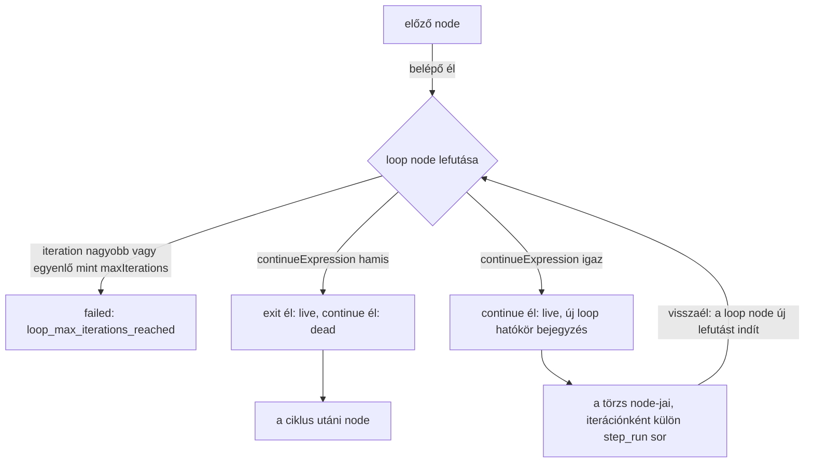
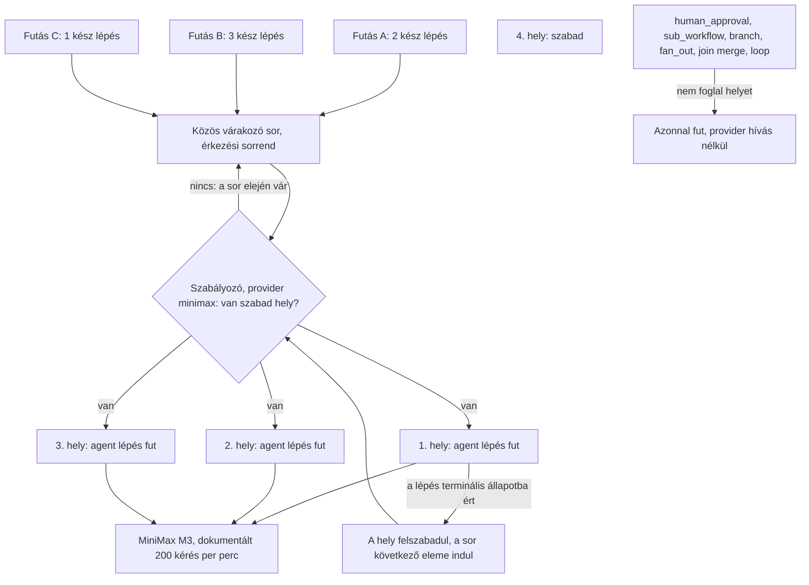

# SPEC-004: A workflow végrehajtó motor

|          |                                                                                                                                                                                                                                                                                                                                                                                                                                                                              |
| -------- | ---------------------------------------------------------------------------------------------------------------------------------------------------------------------------------------------------------------------------------------------------------------------------------------------------------------------------------------------------------------------------------------------------------------------------------------------------------------------------- |
| Státusz  | tervezet                                                                                                                                                                                                                                                                                                                                                                                                                                                                     |
| Dátum    | 2026-08-28                                                                                                                                                                                                                                                                                                                                                                                                                                                                   |
| Előzmény | [`SPEC-003-domain-perzisztencia.md`](SPEC-003-domain-perzisztencia.md) (entitások, állapotgépek, node típusok, repository réteg), [`SPEC-002-csomag-architektura.md`](SPEC-002-csomag-architektura.md) 4. és 6. szekció (rétegzés, mappa konvenció)                                                                                                                                                                                                                          |
| Bemenet  | [`../research/2026-08-26-agent-sdk-minimax.md`](../research/2026-08-26-agent-sdk-minimax.md), [`../research/2026-08-26-spec000-kiertekeles.md`](../research/2026-08-26-spec000-kiertekeles.md), [`../research/2026-08-28-parhuzamossagi-korlat.md`](../research/2026-08-28-parhuzamossagi-korlat.md), [`../research/2026-08-28-sdk-session-log.md`](../research/2026-08-28-sdk-session-log.md), [`../research/2026-08-26-toolchain.md`](../research/2026-08-26-toolchain.md) |
| Kimenet  | a `@easter-workflow-builder/engine` csomag 18 téma mappája, a `@easter-workflow-builder/agent` csomag futtató port szerződése, két új mező a képességleíróban                                                                                                                                                                                                                                                                                                                |
| Terv     | [`../plan/PLAN-005-vegrehajto-motor.md`](../plan/PLAN-005-vegrehajto-motor.md)                                                                                                                                                                                                                                                                                                                                                                                               |

---

## 1. Cél és hatókör

### Amit eldönt

- A motor felelősségét és határait a `db`, az `agent` és az `apps/server` csomaghoz képest, valamint a motorba befecskendezett portok teljes listáját.
- A DAG ütemezőt: mikor futtatható egy node, hogyan terjed a vezérlés az éleken, hogyan zárul össze egy fan-out, hogyan viselkedik a `loop` node visszaéle, és mit utasít el a futás indítási validáció.
- Mind a tíz node típus végrehajtóját: mit kap, mit tesz, mit ír a `step_run` és a `run_event` táblába, milyen hibaágai vannak.
- A session modell megvalósítását: mikor `resume`, mikor `forkSession`, és hogyan dől el ez determinisztikusan a pillanatképből.
- A providerenkénti, közös, érkezési sorrendű párhuzamossági szabályozót, és azt, mi foglal helyet és mi nem.
- A hibakezelést: az `error_handler` node-ot, a lépésenként állítható "álljon meg az egész vagy csak az ág" kapcsolót, és a részben sikeres futás záró állapotát.
- A megszakítást az SDK `interrupt()` metódusával, és azt, mi történik a félbehagyott lépéssel.
- A szerver leállás és az indulási helyreállítás motor oldali menetét.
- A provider paraméterezhetőséget: tételesen mely viselkedések olvassák a `ProviderCapabilityDescriptor` mezőit, és mi kell egy új provider felvételéhez.
- A `packages/engine` belső mappaszerkezetét, és a tesztelés módját valós API hívás nélkül.

### Amit NEM dönt el

- **Nem tervezi meg a kifejezés nyelvet és a sablon nyelvet.** A `branch.expression`, a `fan_out.itemsExpression`, a `loop.continueExpression`, valamint a `promptTemplate`, a `bodyTemplate` és a `branchLabelTemplate` kiértékelése két befecskendezett porton át történik. A portok szerződése itt áll, a nyelv megválasztása külön döntés (O-1).
- Nem tervezi meg a HTTP és WebSocket felületet (`apps/server`, `@easter-workflow-builder/protocol`) és a gráf szerkesztő UI-t (`apps/web`, `@easter-workflow-builder/ui`). A motor kimenő eseményeit egy port fogadja, a port implementációja a szerver dolga.
- Nem tervezi meg a `@easter-workflow-builder/agent` csomag teljes tartalmát. Ebből a specből kizárólag az a felület származik, amit a motor ténylegesen hív: a futtató port típusa és a hozzá tartozó SDK adapter. A csomag többi tárgyköre (naplózás, diagnosztika) külön spec tárgya.
- Nem módosítja a `packages/db` sémáját, egyetlen kivétellel: a node config unió minden ága kap egy `onUnhandledError` mezőt (8.3). Ez nem oszlop, hanem a JSON config mezője, tehát nem igényel migrációt.
- Nem old fel egyetlen SPEC-000 mérési eredményt sem, és nem ír új drótszintű mérést.
- Nem vezet be naplózási réteget. A `@easter-workflow-builder/logger` csomag ma placeholder tartalommal áll; a motor diagnosztikája a `run_event` motor eseményekben él, ami perzisztált és megjeleníthető.

### A user öt döntése, amit ez a spec megvalósít

| #   | Döntés                                                                                                                           | Hol valósul meg                                                                              |
| --- | -------------------------------------------------------------------------------------------------------------------------------- | -------------------------------------------------------------------------------------------- |
| 1   | A hibakezelés lépésenként állítható: kezelő nélküli hibánál a lépés saját beállítása dönt, megáll az egész futás vagy csak az ág | 8.3 szekció, `onUnhandledError` mező a node configban, `fail_run` és `fail_branch` értékkel  |
| 2   | Emberi jóváhagyás: alapértelmezésben korlátlan várakozás, állítható időkorláttal, és a felület jelzi, mióta vár                  | 5.8 szekció, `timeoutMs` mező, `waitingSinceMs` a kimenő eseményben, szállított érték nélkül |
| 3   | Megszakítás azonnal, az SDK `interrupt()` metódusával, a lépés megszakítva zár, az események megmaradnak                         | 9. szekció                                                                                   |
| 4   | Párhuzamossági szabályozó providerenként, közös, érkezési sorrendben                                                             | 7. szekció, `docs/diagram/parhuzamossagi-szabalyozo.svg` és a 7.4 Mermaid rajz               |
| 5   | A motor paraméterezhető új providerek bevezetésére, MiniMax specifikus viselkedés nélkül                                         | 11. szekció, és a 11.4 "Mi kell egy új provider felvételéhez"                                |

## 2. Megerősített tények, forrással

Minden sor mögött hivatalos dokumentáció, a pinelt csomag saját típusdefiníciója, vagy saját, futtatott mérés áll. Amire nincs forrás, az a 15. szekcióban áll nyitott kérdésként.

| #    | Tény                                                                                                                                                                                                                                     | Forrás                                                                                        |
| ---- | ---------------------------------------------------------------------------------------------------------------------------------------------------------------------------------------------------------------------------------------- | --------------------------------------------------------------------------------------------- |
| F-1  | `query()` egy `Query` objektumot ad, ami `AsyncGenerator<SDKMessage, void>`, és metódusai közt szerepel az `interrupt`, a `setPermissionMode`, a `setModel`, az `initializationResult`, a `supportedModels` és a `close`                 | agent-sdk research 1. szekció                                                                 |
| F-2  | Az `Options` tartalmazza a `resume`, `forkSession`, `continue`, `sessionId`, `includePartialMessages`, `outputFormat`, `env`, `cwd`, `additionalDirectories`, `maxTurns`, `maxBudgetUsd`, `persistSession` mezőt                         | agent-sdk research 1. szekció                                                                 |
| F-3  | A `system` üzenet `subtype: 'init'` alakja hozza a `session_id` értéket; a `result` üzenet `subtype` értékkészlete `success`, `error_during_execution`, `error_max_turns`, `error_max_budget_usd`, `error_max_structured_output_retries` | agent-sdk research 1. szekció, a pinelt `sdk.d.ts` szó szerinti táblázata                     |
| F-4  | A `Stop` hook `decision: "block"` plusz `reason` kombinációval visszaküldi az agentet dolgozni, és a `stop_hook_active` input mező védi a végtelen ciklustól                                                                             | agent-sdk research 1. szekció                                                                 |
| F-5  | A `Stop` hook `reason` szövege `role: "user"` üzenetként megy ki, és az M-19 mind a tíz futásában pontosan egyszer aktiválódott a blokkoló ág, `num_turns: 3` mellett                                                                    | spec000 kiértékelés Q8, 5.2                                                                   |
| F-6  | A MiniMax a nem támogatott `tool_choice` értéket **csendben eldobja**, HTTP 200-zal, tehát nincs 400-as biztonsági háló; a lépés futtatónak kötelező a `result` `subtype` és a `structured_output` meglétét ellenőriznie                 | spec000 kiértékelés 5.2 (M-34 következménye), SPEC-003 7.2                                    |
| F-7  | Mindkét strukturált kimenet stratégia működik MiniMax ellen; a mért körszám `sdk_output_format` esetén 4 (M-03), `emit_output_tool` esetén 3 (M-19)                                                                                      | spec000 kiértékelés 5.2, `packages/provider-minimax/src/request-shaping/structured-output.ts` |
| F-8  | A `result.total_cost_usd` és a `modelUsage` first-party árazással számol, ezért a `minimax` providernél nem használható                                                                                                                  | spec000 kiértékelés 5.5                                                                       |
| F-9  | A Claude Code `WebSearch` toolja egy beágyazott alkérést indít `web_search_20250305` szerver oldali toollal, amit a MiniMax csendben eldob, és a modell forrás nélküli választ ad                                                        | spec000 kiértékelés 5.4                                                                       |
| F-10 | A workflow motor párhuzamos ágai külön `query()` hívások, tehát a kliens belső subagent korlátja (M-31) rájuk nem hat; a motornak saját, explicit párhuzamossági korlátja kell legyen                                                    | spec000 kiértékelés 5.6                                                                       |
| F-11 | 20 egyidejű, önállóan indított agent lépés HTTP 429 nélkül futott le a `MiniMax-M3` ellen; 24-nél a **mérőgép memóriája** lett a szűk keresztmetszet, nem a MiniMax, ezért a 20 **alsó korlát**, nem a talált határ                      | párhuzamossági mérés 2.2, 4. szekció                                                          |
| F-12 | Három független mérési körben, kb. 193 `POST /v1/messages` kérésen keresztül egyetlen 429 sem érkezett, és `Retry-After` jellegű header sem jelent meg; a motor tehát nem építhet ilyen headerre                                         | párhuzamossági mérés 2.2, 5. szekció, spec000 kiértékelés 6.11                                |
| F-13 | Egy folyamatosan futó agent lépés kb. 30 kérés/percet termel (M-37: 2 kérés / 4,057 s, M-38: 3 kérés / 5,684 s); a dokumentált 200 RPM korlátra vetített 6-7 egyidejű lépés **számítás, nem mérés**                                      | párhuzamossági mérés 3. szekció                                                               |
| F-14 | Az SDK session log formátuma verziónként változik, nem API felület, és a helyi `.jsonl` alapértelmezett megőrzési ideje 30 nap; a `sessionStore` opció `@alpha`, és nem helyettesíti a helyi írást, csak tükrözi                         | sdk session log research 1., 3., 5. szekció                                                   |
| F-15 | A `persistSession: false` kikapcsolja a `~/.claude/projects/` írást, és a session utólag nem resume-olható                                                                                                                               | sdk session log research 4. szekció                                                           |
| F-16 | Párhuzamos `query()` hívások nem ütköznek: a `sessionId` alapból hívásonként generált UUID, a fájlnév maga a sessionId                                                                                                                   | sdk session log research 6. szekció                                                           |
| F-17 | Az `SDKContextUsage` nem `SDKMessage` ág a 0.3.245 verzióban, tehát az `sdk_context_usage` `kind` értékre ebben az SDK verzióban nincs leképezés                                                                                         | agent-sdk research 1. szekció, 2. pontosítás                                                  |
| F-18 | A megszakított futás terminális, nincs folytatás onnan, ahol abbamaradt; az újraindítás új futás új pillanatképpel                                                                                                                       | SPEC-003 7.4                                                                                  |
| F-19 | A `script` node és a `join` `script` módja tárolható, de nem futtatható; a futás indításakor a validáció `unimplemented_node_type` hibával utasít el                                                                                     | SPEC-003 4.3                                                                                  |
| F-20 | Az al-workflow rekurzióvédelme a `workflow_ancestry` listán álló, determinisztikus ciklusfelismerés, nem mélységi küszöb, és a motor felelőssége                                                                                         | SPEC-003 4.8, 12.4                                                                            |
| F-21 | A `startRun` már **feloldott** provider azonosítót és kész pillanatkép dokumentumot kap; a háromszintű provider feloldás a motoré                                                                                                        | SPEC-003 5.1, `packages/db/src/workflow-run/workflow-run-repository.ts` `StartRunInput`       |
| F-22 | A `provider_concurrency_limit` tábla üresen indul, és szállított párhuzamossági alapérték sem a kódban, sem a migrációban nincs                                                                                                          | SPEC-003 11., 41. kritérium                                                                   |
| F-23 | A delta kapcsoló az élő WebSocket nézetre nincs hatással, mert az a motorból jön, nem az adatbázisból, és az `includePartialMessages` opciót nem állítja át                                                                              | SPEC-003 6.6                                                                                  |
| F-24 | Az `Outcome<T>` hibaága kizárólag szöveges üzenetet hordoz, és a projekt konvenciója szerint a hibaosztály neve zárójelben, szó szerint szerepel az üzenetben                                                                            | `packages/core/src/result/outcome/outcome.ts`, SPEC-003 10. szekció 1. pontja                 |

**Amit ezekből NEM következtetünk.** Az F-11 mérésből nem következik, hogy a MiniMax valós határa 20; a mérés a helyi gép határát érte el. Az F-13 hatos-hetes projekció számítás, nem mérés. Egyik számot sem szállítjuk alapértelmezésként (7.3).

## 3. A motor felelőssége és határai

### 3.1 Ki mit csinál

| Csomag                            | Réteg | Mit csinál                                                                                                                                                                                       | Mit **nem** csinál                                                                                          |
| --------------------------------- | ----- | ------------------------------------------------------------------------------------------------------------------------------------------------------------------------------------------------ | ----------------------------------------------------------------------------------------------------------- |
| `@easter-workflow-builder/db`     | L2    | perzisztencia, állapotgép compare and set, pillanatkép tárolás és visszaolvasás, esemény hozzáfűzés, indulási helyreállítás SQL oldala                                                           | nem old fel providert, nem validál gráfot, nem ütemez, nem hív SDK-t                                        |
| `@easter-workflow-builder/agent`  | L4    | az Agent SDK adapter: a futtató port **típusa** és a `query()` fölé húzott implementációja, ami az `Options` objektumot megkapja és az `SDKMessage` folyamot kiadja                              | nem tud workflow gráfról, futásról, lépésről, adatbázisról                                                  |
| `@easter-workflow-builder/engine` | L5    | gráf validáció, DAG ütemezés, node végrehajtók, provider feloldás és képesség politika, párhuzamossági szabályozó, hibakezelés, megszakítás, a futás életciklusa                                 | nem nyit adatbázist, nem nyit hálózati kapcsolatot, nem importálja az Agent SDK-t, nem ismer provider nevet |
| `apps/server`                     | L6    | az összeállítás helye: megnyitja az adatbázist, lefuttatja az indulási helyreállítást, létrehozza a portok implementációit, példányosítja a motort, és utána fogad HTTP és WebSocket kapcsolatot | nem tartalmaz ütemezési vagy provider döntést                                                               |

**A motor egyetlen belépési pontja a `createEngine(dependencies)` függvény**, ami egy `Engine` objektumot ad vissza. A `dependencies` objektum minden mezője kötelező, alapértelmezett érték nélkül: a motorban nincs olyan függőség, ami "magától előkerül".

```
Engine {
  startRun(request: StartRunRequest): Promise<Outcome<StartedRun>>
  interruptRun(runId: string): Promise<Outcome<InterruptSummary>>
  decideApproval(input: ApprovalDecisionInput): Promise<Outcome<void>>
  restartRun(runId: string): Promise<Outcome<StartedRun>>
  suggestedConcurrencyLimit(providerId: ProviderId): ConcurrencySuggestion
  testProviderConnection(providerId: ProviderId): Promise<Outcome<ConnectionTestResult>>
  shutdown(): Promise<Outcome<ShutdownSummary>>
}
```

### 3.2 A befecskendezett portok

A motor kilenc portot kap. Egyik sem opcionális, és egyiknek sincs a motorban szállított implementációja. Ez a paraméterezhetőség szerkezeti alapja: a motor tesztje ugyanezeken a portokon át kap hamis viselkedést, tehát **soha nem hív valós API-t** (14. szekció).

| Port                       | Szerződés                                                                                         | Ki adja éles futásban                       |
| -------------------------- | ------------------------------------------------------------------------------------------------- | ------------------------------------------- |
| `database`                 | a `DatabaseContext`, ahogy a `db` barrel exportálja                                               | `apps/server`, az `openDatabase` eredménye  |
| `agentQueryRunner`         | `run(request): AgentQuery`, ahol az `AgentQuery` egy `AsyncIterable<unknown>` plusz `interrupt()` | `@easter-workflow-builder/agent`            |
| `providerDescriptorLookup` | `(providerId) => ProviderCapabilityDescriptor<string, string>`                                    | `apps/server`, a `provider-registry` fölött |
| `expressionEvaluator`      | `evaluate(expression, context): Outcome<unknown>` és `compile(expression): Outcome<void>`         | külön döntés, O-1                           |
| `templateRenderer`         | `render(template, context): Outcome<string>` és `compile(template): Outcome<void>`                | külön döntés, O-1                           |
| `eventPublisher`           | `publish(event): void`, az élő WebSocket folyam kimenete                                          | `apps/server`                               |
| `clock`                    | `nowMs(): number` és `sleep(ms, signal): Promise<void>`                                           | `apps/server`                               |
| `idGenerator`              | `nextId(): string`                                                                                | `apps/server`                               |
| `processEnvironment`       | `read(name): string \| null`, kizárólag olvasás                                                   | `apps/server`                               |

**Miért port a `clock` és az `idGenerator`.** Az ütemező determinisztikus tesztelhetősége ezen áll: a backoff várakozás, a jóváhagyás időkorlátja és minden időbélyeg a `clock` porton megy át, tehát a teszt valós idő nélkül léptet. Az azonosítók a `step_run` sorokban jelennek meg, tehát a teszt elvárása csak akkor stabil, ha a generátor is befecskendezett.

**Miért nem függ a motor a `provider-registry` csomagtól.** A leíró keresés port, nem import. Ebből következik, hogy a motor kódjában egyetlen konkrét provider neve sem szerepelhet, és egy új provider felvétele nem érinti a motort (11. szekció). A `ProviderId` **típust** a motor a `provider-capability` csomagból (L1) importálja, ami szigorúan csökkenő él, tehát megengedett.

### 3.3 Az `agent` csomag futtató portja

A port **típusa** a `@easter-workflow-builder/agent` csomagban él, nem a motorban. Az ok szerkezeti: a `agent` (L4) nem importálhat a motorból (L5), mert az kört adna, viszont a motornak a típusra szüksége van, és az L5 felől az L4 él megengedett.

```
AgentQueryRequest {
  prompt: string
  options: Readonly<Record<string, unknown>>   // az Agent SDK Options objektuma
}

AgentQuery {
  messages: AsyncIterable<unknown>             // SDKMessage folyam, nyersen
  interrupt(): Promise<void>
}

AgentQueryRunner {
  run(request: AgentQueryRequest): Outcome<AgentQuery>
}
```

Az `options` szándékosan `Readonly<Record<string, unknown>>` a port határán: a motor állítja össze, az adapter adja tovább. A szűkítést a motor `step-options` témája végzi, típusosan; a port maga nem duplikálja az SDK `Options` típusát, mert az SDK verzióhoz kötött (agent-sdk research 3. szekció: "A body mezők listája nyílt és verziónként bővül").

A `messages` elemtípusa `unknown`, nem `SDKMessage`. Két oka van. Az egyik, hogy a `db` csomag `appendSdkEvent` bemenete is nyers üzenetet fogad és maga normalizál (SPEC-003 9.2), tehát a motor amúgy sem szűkíti. A másik, hogy így a motor egyetlen sora sem függ az SDK típusdefiníciójától, és a teszt tetszőleges alakú, rögzített üzenetsorozatot injektálhat. Amit a motornak ki kell olvasnia (a `system` `init` session azonosítója, a `result` `subtype` és a strukturált kimenet megléte), azt saját typeguardokkal teszi, az F-3 táblázat szerinti mezőnevekkel.

## 4. A végrehajtható gráf és a DAG ütemező

### 4.1 A bemenet: a pillanatkép, nem az élő gráf

Az ütemező kizárólag a `GraphSnapshotDocument` node és él listájáról dolgozik (SPEC-003 5.1), soha nem a `workflow_node` és `workflow_edge` táblákról. Ebből következik, hogy a futás közben a szerkesztőben végzett módosítás a futó futásra nincs hatással, és a fél évvel későbbi visszanézés ugyanazt a gráfot mutatja.

A futás indításakor a motor egy `ExecutableGraph` értéket épít a pillanatképből: node index azonosító szerint, kimenő és bejövő él lista node-onként, és az él `branchKey` szerinti csoportosítása. Ez tiszta függvény, adatbázis nélkül tesztelhető.

### 4.2 A fenntartott `branch_key` értékek

A `workflow_edge.branch_key` oszlop már létezik, és a SPEC-003 4.7 szerint azt mondja meg, "melyik `branch` kimenethez vagy melyik `step_run` állapothoz tartozik" az él. A motor ezt a meglévő oszlopot használja, új mező nélkül.

| Forrás node típus | Megengedett `branch_key`              | Jelentés                                                                     |
| ----------------- | ------------------------------------- | ---------------------------------------------------------------------------- |
| `branch`          | a `branches[].key` egyike, kötelezően | a kifejezés eredménye erre az ágra vezet                                     |
| `loop`            | `continue` vagy `exit`                | a ciklus törzse, illetve a kilépő ág                                         |
| `human_approval`  | `approved` vagy `rejected`            | a döntés iránya; a `rejected` él elhagyható                                  |
| `error_handler`   | `exhausted`                           | minden kísérlet elfogyott                                                    |
| bármely node      | `on_error`                            | hiba esetén ide megy a vezérlés; az él célja kötelezően `error_handler` node |
| minden más eset   | `null`                                | az egyetlen normál kimenet                                                   |

**Fenntartott kulcsok:** `continue`, `exit`, `approved`, `rejected`, `exhausted`, `on_error`. Egy `branch` node `branches[].key` értéke nem ütközhet ezekkel, különben a validáció `reserved_branch_key_misuse` hibával elutasít.

### 4.3 Ág kontextus: a hatókör verem

Ugyanaz a node sokszor futhat: fan-out ágban ágonként, ciklusban iterációnként, retrynél kísérletenként (SPEC-003 4.10). A példányokat az **ág kontextus** különbözteti meg, ami egy verem:

```
BranchScope =
  | { kind: 'fan_out', stepRunId: string, itemIndex: number }
  | { kind: 'loop',    stepRunId: string, iteration: number }

BranchContext = readonly BranchScope[]      // a gyökértől befelé
```

A gyökér kontextus az üres verem. A `fan_out` node minden elemhez egy `fan_out` bejegyzést tol a veremre, a `loop` node minden iterációhoz egy `loop` bejegyzést. A `join` node az innermost `fan_out` bejegyzést veszi le, a `loop` node a saját `loop` bejegyzését veszi le kilépéskor.

Egy **node példány** azonosítója a `(nodeId, branchContext)` pár. A `step_run` sorra ez így képződik le:

| Node példány adat                              | `step_run` oszlop                                                                            |
| ---------------------------------------------- | -------------------------------------------------------------------------------------------- |
| a példányt nyitó fan-out vagy loop lépés       | `parent_step_run_id` (a verem tetején álló bejegyzés `stepRunId` értéke, üres veremnél NULL) |
| a legfelső `loop` bejegyzés `iteration` értéke | `iteration` (üres veremnél és fan-out tetőnél 0)                                             |
| a retry kísérlet sorszáma                      | `attempt`                                                                                    |

### 4.4 Az ütemezés: élaktiválás és halott ág jelölés

A vezérlés jelölésekkel terjed az éleken. Két jelölés van: `live` és `dead`.

1. A futás indulásakor a `start` node egyetlen példánya `live` jelölést kap a gyökér kontextusban.
2. Egy node példány **futtatható**, ha a bejövő éleinek mindegyikéhez tartozik jelölés az adott ág kontextusban, **és** legalább egy jelölés `live`.
3. Ha minden bejövő jelölés `dead`, a node példány maga is halott: **nem keletkezik `step_run` sor**, és a példány minden kimenő élére `dead` jelölés kerül. Ez a halott ág továbbterjesztése, ami nélkül egy `join` örökre várna egy soha meg nem érkező ágra.
4. Egy lefutott node példány aktiválja a kimenő éleit: a választott ág éleire `live`, az összes többire `dead` jelölés kerül. Az, hogy mi a "választott ág", node típusonként dől el (5. szekció); a legtöbb típusnál minden kimenő él `live`.
5. Egy hibára futó node példány az `on_error` élére tesz `live` jelölést, a többire `dead` jelölést. Ha nincs `on_error` éle, a 8.3 szekció szerinti hibapolitika dönt.
6. A futás akkor terminális, ha nincs futtatható és nincs futó példány.

**Több bejövő él nem csak a `join` node-on lehet.** Bármely node, aminek egynél több bejövő éle van, minden bejövő élre vár. A `join` node ehhez képest annyival tesz többet, hogy a beérkező ágak kimeneteit **össze is fűzi** egyetlen kimenetté; a puszta várakozás minden node-nál egyforma. Ezt azért mondjuk ki, mert enélkül egy `branch` alá tett, majd visszatalálkozó két ág viselkedése nem lenne meghatározott.

### 4.5 Fan-out és join párosítás

A `fan_out` node config nem tartalmaz `joinNodeId` mezőt, és a jelen spec **nem vezet be ilyet**: a párosítás szerkezetből derül ki.

- A `fan_out` node lefutásakor N elemre bomlik. Minden `i` elemhez a kimenő élek `live` jelölést kapnak a `[...ctx, { kind:'fan_out', stepRunId, itemIndex: i }]` kontextusban. Motor esemény: `fan_out_expanded`, a payloadban az elemszámmal.
- A `join` node ugyanabban a kontextusban veszi le a verem tetején álló `fan_out` bejegyzést, tehát **bejövő élenként N jelölést vár**, és egyszer fut le a külső kontextusban.
- **N = 0 nem hiba.** Ilyenkor a `fan_out` egyetlen `live` jelölést sem ad ki; helyette a hozzá tartozó `join` a külső kontextusban azonnal futtatható lesz, üres bemeneti listával. Az üreslistás eset nem különleges ág a `join` végrehajtóban, hanem a bemeneti lista hossza nulla.

**Validáció, futás indításkor: hatókör kiegyensúlyozottság.** A motor minden node-ra kiszámolja a lehetséges hatókör veremeket a `start` node-tól kiindulva, az élek irányában bejárva.

- Ha egy node két különböző úton két különböző mély veremmel érhető el, a gráf kiegyensúlyozatlan: `unbalanced_fan_out_scope`.
- Ha egy `join` node olyan kontextusban érhető el, aminek a tetején nincs `fan_out` bejegyzés, ugyanez a hiba.
- Ha egy `fan_out` node által nyitott hatókör a futás bármely terminális node-jáig nyitva marad, ugyanez a hiba.

Ez determinisztikus, tiszta függvényben számolható a pillanatképből, tehát adatbázis nélkül, kimerítően tesztelhető.

### 4.6 A ciklus: a `loop` node visszaéle

**Ez a spec legkényesebb része, ezért tételesen áll.**

**Definíció.** Egy `e = (u -> v)` él **visszaél**, ha `v` típusa `loop`, és `u` elérhető `v`-ből az élek irányában.

**A gráf alakjának validációja, futás indításkor, ebben a sorrendben:**

1. Minden `loop` típusú node-ra elvégezzük az elérhetőségi bejárást, és megjelöljük a rá mutató visszaéleket.
2. A megjelölt visszaéleket **elhagyjuk**, és a maradék gráfon kört keresünk. Ha marad kör, a hiba `graph_cycle_detected`, és a hibaüzenet megnevezi a körben álló node azonosítókat. Ez az a pont, ahol egy `loop` node nélkül rajzolt kör elbukik: visszaélnek csak `loop` node-ra mutató él minősül, tehát bármilyen más kör érintetlenül megmarad, és megbukik.
3. Minden visszaél forrásának a `loop` node **törzsében** kell lennie, azaz elérhetőnek a `loop` node `continue` élein át. Ha nem, a hiba `loop_back_edge_outside_body`.
4. A `loop` node-nak legalább egy `continue` és legalább egy `exit` kimenő éle kell legyen, különben `loop_missing_branch_edge`.

**A végrehajtás menete.** A `loop` node példány akkor fut, ha jelölést kap: vagy kívülről (első belépés), vagy a visszaélen (következő iteráció). Minden lefutáskor:

1. Az `iteration` érték a példány addigi lefutásainak a száma, nullától indulva. Ez a `step_run.iteration` oszlop értéke (SPEC-003 4.10 szerint alapból 0).
2. Ha `iteration >= maxIterations`, a lépés `failed` állapotban zár, `loop_max_iterations_reached` hibaosztállyal, és a 8.3 hibapolitika következik. A `maxIterations` a config kötelező mezője, szállított alapérték nélkül (SPEC-003 4.3), tehát ezt a számot nem a motor találja ki.
3. Egyébként a `continueExpression` kiértékelése a kifejezés porton, a 6. szekció szerinti kontextussal. A kimenetet logikai értékre szűkítjük; ha nem logikai, a hiba `expression_evaluation_failed`.
4. Igaz eredmény: `live` jelölés a `continue` élekre, `dead` a `exit` élekre, és a törzs kontextusa `[...ctx, { kind:'loop', stepRunId, iteration }]`. Motor esemény: `loop_iteration_started`.
5. Hamis eredmény: `live` jelölés az `exit` élekre, `dead` a `continue` élekre, és a `loop` bejegyzés lekerül a veremről.

**A visszaél nem vár.** A visszaélen érkező jelölés a `loop` node bejövő él készletének **külön** eleme, tehát a 4.4 pont 2. szabálya nem érvényesül rá úgy, hogy a `loop` egyszerre várna a külső belépésre és a visszaélre. Ezért a `loop` node bejövő élei két csoportra bomlanak: **belépő élek** (nem visszaélek, ezekre a szokásos "mindre vár" szabály áll) és **visszaélek** (ezek külön-külön indítanak egy újabb lefutást). Ha ez a megkülönböztetés hiányozna, a `loop` az első belépés után örökre várna a visszaélre, és a workflow leállna.

**Iterációnként új példány a törzsben.** Mivel minden iteráció saját `loop` hatókör bejegyzést kap, a törzs node-jai iterációnként külön példányok, külön `step_run` sorral, és a `parent_step_run_id` a `loop` lépés futására mutat. Így a transcript minden iterációt megmutat, egyediségi megszorítás nélkül (SPEC-003 4.10).



**Amit a rajz kimond.** A visszaél nem vár a belépő éllel együtt: külön indít egy újabb lefutást. A `maxIterations` túllépése hiba, nem normál kilépés; a normál kilépés a `continueExpression` hamis eredménye.

### 4.7 Egyéb gráf validációk

| Ellenőrzés                                                              | Hibaosztály                      |
| ----------------------------------------------------------------------- | -------------------------------- |
| pontosan egy `start` típusú node van                                    | `invalid_start_node`             |
| minden él forrása és célja létező node a pillanatképben                 | `dangling_edge`                  |
| minden node elérhető a `start` node-ból                                 | `unreachable_node`               |
| `script` node vagy `join` `script` mód nincs a gráfban                  | `unimplemented_node_type` (F-19) |
| minden `branch` él `branch_key` értéke szerepel a `branches[]` listában | `branch_key_unknown`             |
| a `defaultBranchKey`, ha nem `null`, szerepel a `branches[]` listában   | `branch_key_unknown`             |
| minden `on_error` él célja `error_handler` típusú node                  | `invalid_error_handler_edge`     |
| minden node configja illeszkedik a saját típusára                       | `malformed_node_config`          |
| minden node configjában van `onUnhandledError` érték                    | `unhandled_error_policy_missing` |
| a `join` `merge` módjának `settings` rekordja üres                      | `unsupported_join_merge_setting` |

**Miért utasítjuk el az ismeretlen `merge` beállítást.** A SPEC-003 4.3 szerint a `merge` mód alobjektumának egyetlen mezője sincs megnevezve, és mezőt kitalálni tilos. Ha a motor csendben figyelmen kívül hagyna egy ott álló kulcsot, a felhasználó azt hinné, hogy hat. Ezért az első verzió `merge` módja pontosan egy dolgot tud (5.6), és minden más kulcs elutasításra kerül, névvel.

**A validáció eredménye típusszintű szűkítés.** A `validateRun` sikeres ága nem `NodeConfig` uniót ad vissza, hanem `ExecutableNodeConfig = Exclude<NodeConfig, ScriptNodeConfig | JoinScriptNodeConfig>` értéket. Ebből következik, hogy a végrehajtó diszpécser kimerítő `switch` szerkezetében **nincs** `script` ág, tehát nem keletkezik olyan kódág, ami logikailag sosem fut, és a 100 százalékos lefedettségi küszöb kizárás nélkül tartható (`.claude/CLAUDE.md` 5. szekció).

### 4.8 A futás indításának sorrendje

1. `readGraph(workflowId)`, majd a globális beállítás olvasása (`readSettings`).
2. **Provider feloldás** minden node-ra, háromszinten (10. szekció).
3. **Gráf validáció** (4.5, 4.6, 4.7) és **provider validáció** (11.2) a feloldott providerekkel.
4. A bemenet ellenőrzése a `start` node `inputFields` listája ellen: minden `required: true` mezőnek szerepelnie kell, különben `missing_required_input`.
5. A pillanatkép dokumentum összeállítása, a feloldott `effectiveProviderId` értékkel node-onként (SPEC-003 5.1).
6. `startRun(...)` a `db` felé, ami egy tranzakcióban oldja fel a pillanatképet, írja a futást, fagyasztja be a delta kapcsolót és írja a `run_started` eseményt.
7. `markRunRunning`, majd a `start` node példány ütemezése.

**Az 1 ... 5. lépés egyetlen adatot sem ír.** Ez szándékos: egy érvénytelen workflow soha nem hoz létre `workflow_run` sort, tehát a futás lista nem telik meg soha el sem indult futásokkal.

## 5. A tíz node végrehajtó

Közös szabályok minden végrehajtóra:

- A lépés indulásakor `createStepRun`, majd `markStepRunning`, és egy `step_started` motor esemény.
- A lépés zárásakor a megfelelő nevesített állapotváltó (`markStepSucceeded`, `markStepFailed`, `markStepRejected`, `markStepCancelled`), és egy `step_finished` motor esemény.
- Minden hibaüzenet az F-24 konvenciója szerint zárójelben tartalmazza a hibaosztály nevét, és ugyanaz a név kerül a `step_run.error_kind` oszlopba.
- Kivétel nem hagyja el a végrehajtót: minden ág `Outcome` értéket ad.

| #   | Típus            | Mit kap                                                             | Mit tesz                                                                                                                            | Provider hívás                 | Saját hibaágai                                                                                                                    |
| --- | ---------------- | ------------------------------------------------------------------- | ----------------------------------------------------------------------------------------------------------------------------------- | ------------------------------ | --------------------------------------------------------------------------------------------------------------------------------- |
| 1   | `start`          | a futás bemenete                                                    | a bemenetet a futás kontextusába teszi, azonnal `succeeded`; a kimenete maga a bemenet                                              | nincs                          | nincs, mert a bemenet ellenőrzése a 4.8 4. pontjában, a futás létrehozása előtt megtörtént                                        |
| 2   | `agent_step`     | `AgentStepConfig`, a feloldott provider és a kontextus              | a teljes agent lépés életciklus (5.2)                                                                                               | **van**                        | `agent_result_not_success`, `missing_structured_output`, `provider_call_failed`, `no_resumable_session`, `template_render_failed` |
| 3   | `branch`         | `expression`, `branches[]`, `defaultBranchKey`                      | kiértékel, a kapott kulcsot a kimenő élek `branch_key` értékéhez illeszti, `branch_taken` esemény                                   | nincs                          | `expression_evaluation_failed`, `branch_no_matching_edge`                                                                         |
| 4   | `fan_out`        | `itemsExpression`, `branchLabelTemplate`                            | kiértékel, listára szűkít, N ág kontextust nyit, `fan_out_expanded` esemény az elemszámmal                                          | nincs                          | `expression_evaluation_failed`, `fan_out_items_not_a_list`, `template_render_failed`                                              |
| 5   | `join`           | a mód szerinti alobjektum és a beérkezett ág kimenetek              | `merge`: a kimenetek listája elem sorrendben; `ai_synthesis`: teljes agent lépés a listával a kontextusban; `join_resolved` esemény | csak `ai_synthesis` módban     | a `merge` módnak nincs saját hibaága; az `ai_synthesis` mód az `agent_step` hibaágait örökli                                      |
| 6   | `loop`           | `maxIterations`, `continueExpression`                               | a 4.6 szerinti iteráció vezérlés, `loop_iteration_started` esemény iterációnként                                                    | nincs                          | `expression_evaluation_failed`, `loop_max_iterations_reached`                                                                     |
| 7   | `human_approval` | `title`, `bodyTemplate`, `timeoutMs`                                | `requestApproval`, `markStepWaitingApproval`, `approval_requested` esemény, majd várakozás (5.8)                                    | nincs                          | `template_render_failed`, `approval_timed_out`, `approval_rejected`                                                               |
| 8   | `error_handler`  | `maxAttempts`, `backoffMs[]`, `handledErrorKinds`, a hiba, amit kap | a 8.2 szerinti újrapróbálkozás vezérlés                                                                                             | nincs                          | `retry_attempts_exhausted`, `unhandled_error_kind`                                                                                |
| 9   | `sub_workflow`   | `targetWorkflowId`, `inputMapping`                                  | ancestry ellenőrzés, gyerek futás indítása és megvárása, kimenet átvétele (5.9)                                                     | közvetve, a gyerek lépésein át | `workflow_recursion_detected`, `sub_workflow_failed`, `unresolvable_step_reference`                                               |
| 10  | `script`         | nincs                                                               | **nem létezik végrehajtója**; a 4.7 validáció elutasítja a futást                                                                   | nincs                          | `unimplemented_node_type`, a validációban                                                                                         |

### 5.2 Az `agent_step` életciklusa

1. **Hely kérése a párhuzamossági szabályozótól** (7. szekció). A lépés addig `pending` állapotban áll, amíg helyet nem kap; a `markStepRunning` csak a hely megszerzése után fut le, tehát a `running` állapot azt jelenti, hogy a lépés ténylegesen dolgozik.
2. **A prompt renderelése** a sablon porton, a 6. szekció kontextusával.
3. **A session kötés feloldása** (6. szekció szerinti kontextus, 6.4 szerinti `resume` és `forkSession`).
4. **Az `Options` objektum összeállítása** a config és a **feloldott provider leírója** alapján (11.2). Ez a lépés az, ahol minden provider függő döntés megtörténik.
5. **`agentQueryRunner.run(...)`**, majd az üzenetfolyam kimerítése.
6. **Üzenetenként két dolog történik**, ebben a sorrendben: `appendSdkEvent` a `db` felé (ami a befagyasztott delta kapcsolót maga érvényesíti, SPEC-003 6.6), és `eventPublisher.publish(...)` az élő nézetnek. A sorrend azért kötött, mert újracsatlakozáskor a kliens az adatbázisból pótol, tehát nem kaphat olyan eseményt élőben, ami még nincs a naplóban.
7. **A `system` `init` üzenetből** a `session_id` kiolvasása és `attachSession(...)` (SPEC-003 9.2).
8. **A `result` üzenetből** a `subtype`, a `num_turns` és a négy `usage` mező kiolvasása.
9. **Zárás.** A lépés akkor és csak akkor `succeeded`, ha a `result` `subtype` értéke `success`, **és** ha a lépés strukturált kimenetet vár, a kimenet ténylegesen megérkezett és illeszkedik a sémára. Ez az F-6 közvetlen következménye: a HTTP siker önmagában nem jelent kitöltött kimenetet, és nincs 400-as biztonsági háló. Hiányzó kimenet: `missing_structured_output`. Nem `success` subtype: `agent_result_not_success`, az üzenetben a tényleges subtype nevével.
10. **A hely felszabadítása** minden ágon, a hibaágakon is.

**Költséget a motor nem számol.** A `result.total_cost_usd` értéke a nyers `payload` JSON-ban megmarad, de a motor nem olvassa ki és nem összegzi, mert first-party árazással készül (F-8). A négy token oszlop a `step_run` soron a `result` üzenet `usage` mezőjéből íródik, egyszer, a terminális átmenettel azonos tranzakcióban (SPEC-003 4.10).

### 5.6 A `join` `merge` módja

Az első verzió `merge` módja pontosan ennyit tesz: **a bejövő ágak kimeneteinek listája, a `fan_out` elem sorrendjében**. Nem fűz össze szöveget, nem old fel ütközést, nem szűr. A `settings` rekord kötelezően üres (4.7). Ha egy jövőbeli döntés összefűzési szabályt vezet be, az a `settings` rekord mezőit nevesíti, és a validáció akkor engedi át őket.

Az `ai_synthesis` mód alobjektuma teljes `AgentStepConfig` (SPEC-003 4.3), tehát a végrehajtása az 5.2 életciklus, azzal a különbséggel, hogy a kontextusban a `join` bemenetek listája is elérhető.

### 5.8 A `human_approval` várakozás

- **Alapértelmezésben korlátlan a várakozás.** A `timeoutMs` mező `null` értéke ezt jelenti, és **ez a szállított alak**: időkorlát értékre nincs sem mérésünk, sem dokumentált szabályunk, tehát számot nem adunk (user döntés 2).
- Ha a `timeoutMs` nem `null`, a motor a `clock` porton vár. Lejáratkor a lépés `failed` állapotban zár, `approval_timed_out` hibaosztállyal, és a 8.3 hibapolitika következik. A `human_approval` sor `decision` oszlopa **NULL marad**, mert a `ApprovalDecision` unió csak `approved` és `rejected` értéket ismer (SPEC-003 4.12), és a lejárat nem emberi döntés. Sémát emiatt nem módosítunk.
- **A felület jelzi, mióta vár.** A motor a `approval_requested` esemény payloadjában és a futás állapot vetületében kiadja a `requestedAtMs` és a `timeoutAtMs` értéket (utóbbi `null`, ha nincs korlát). A "mióta vár" az aktuális idő és a `requested_at_ms` különbsége, amit a felület számol; a motor nem küld periodikus, csak azért létező eseményt.
- **Az időkorlát nem éli túl a szerver leállását.** A várakozás a `clock` porton, memóriában él; egy leállás után a futás `interrupted` állapotba kerül (10. szekció), tehát nincs olyan állapot, amiben egy lejárt időkorlát csendben elveszne.
- A döntés a `decideApproval` motor műveleten át érkezik, ami a `db` `decideApproval` hívását és a lépés állapotváltását egy tranzakcióban végzi (SPEC-003 9.2), majd `approval_decided` eseményt ír.
- `approved`: a lépés `succeeded`, a `live` jelölés az `approved` élekre megy. `rejected`: a lépés `rejected` állapotban zár, és ha van `rejected` kimenő él, a vezérlés arra megy; ha nincs, a 8.3 hibapolitika következik `approval_rejected` osztállyal (SPEC-003 7.2).

### 5.9 A `sub_workflow` hívás

1. **Rekurzióvédelem.** Ha a `targetWorkflowId` szerepel a szülő futás `workflow_ancestry` listájában, a lépés `failed` állapotban zár `workflow_recursion_detected` osztállyal. Ez ancestry alapú ciklusfelismerés, nem mélységi küszöb (F-20), tehát nem igényel kitalált számot.
2. **A bemenet leképezése** az `inputMapping` szerint: a kulcs a gyerek `start` node bemeneti mezője, az érték egy hivatkozás a szülő kontextusába. Fel nem oldható hivatkozás: `unresolvable_step_reference`.
3. **A gyerek futás indítása** a 4.8 teljes menetével, `parent` kontextussal (`rootRunId`, `depth + 1`, bővített `workflowAncestry`). A `step_run.sub_workflow_run_id` a gyerek futás azonosítójára mutat. Motor esemény: `sub_workflow_started`.
4. **A gyerek workflow saját provider feloldása érvényes**, nem a szülőé: a gyerek workflow `provider_id` felülírása és a gyerek lépések felülírásai a gyerek pillanatképében fagynak be. A szülő provider választása nem szivárog át, mert az a szülő workflow tulajdonsága.
5. **A `sub_workflow` lépés nem tart párhuzamossági helyet**, amíg a gyerek fut (7.2). Ez nem kényelmi döntés, hanem holtpont elkerülés.
6. **Zárás.** A gyerek `succeeded`: a szülő lépés `succeeded`, a kimenete a gyerek futás terminális node-jainak kimenete. A gyerek `failed`, `cancelled` vagy `interrupted`: a szülő lépés `failed`, `sub_workflow_failed` osztállyal. Motor esemény: `sub_workflow_finished`.
7. **A szülő megszakítása a gyereket is elviszi**, mert azonos `root_run_id` alatt állnak (SPEC-003 4.8), és a motor a megszakítást a teljes fára alkalmazza (9. szekció).

## 6. A futás kontextus, a session modell és a hivatkozások

### 6.1 A kontextus alakja

A kifejezés és a sablon port ugyanazt a kontextus objektumot kapja:

```
RunContext {
  input: unknown                                  // a futás bemenete, a start node kimenete
  steps: Readonly<Record<string, unknown>>        // node azonosító -> a látható példány kimenete
  item: unknown | undefined                       // a legbelső fan_out hatókör eleme
  itemIndex: number | undefined
  iteration: number | undefined                   // a legbelső loop hatókör iterációja
  joinInputs: readonly unknown[] | undefined      // csak join node-nál
  error: { kind: string, message: string } | undefined  // csak error_handler node-nál
}
```

### 6.2 Mi látszik a `steps` rekordban

**Kizárólag a jelenlegi példány ősei.** Egy node akkor címezhető, ha van olyan lefutott példánya, aminek az ág kontextusa a jelenlegi példány kontextusának előtagja, és a node a jelenlegi node egyik gráfbeli őse. A feloldás a legbelső ilyen példányt adja.

Ha egy hivatkozott node nem ős, vagy nincs látható példánya, a hiba `unresolvable_step_reference`. Ez a szabály zárja ki azt, hogy egy fan-out ágból egy másik ág kimenetére lehessen hivatkozni, ahol nem lenne meghatározott, melyik ágé az érték.

### 6.3 A session modell

A `sessionMode` két értéke (SPEC-003 4.5):

| Érték       | Mit tesz a motor                                                                                                                                           |
| ----------- | ---------------------------------------------------------------------------------------------------------------------------------------------------------- |
| `isolated`  | friss session, `resume` nélkül. A `step_run.sdk_session_id` a `system` `init` üzenetből íródik, a `resumed_from_session_id` NULL, a `forked_session` hamis |
| `continued` | `resume: <a feloldott session azonosító>`, és a 6.4 szerint eldöntött `forkSession`                                                                        |

**A folytatandó session feloldása.** A jelenlegi példány ág kontextusában visszafelé haladva az első olyan ős node példány, aminek van nem NULL `sdk_session_id` értéke. Ha nincs ilyen, a hiba `no_resumable_session`; a motor nem indít helyette friss sessiont, mert az csendben más viselkedést adna, mint amit a felhasználó kért.

**`persistSession`.** A motor minden lépésnél explicit `persistSession: true` értéket ad, mert a `resume` a helyi transzkriptre épül, és a `persistSession: false` a sessiont utólag nem resume-olhatóvá teszi (F-15). Ennek ára van, és kimondjuk: a helyi `.jsonl` fájlok a felhasználó `~/.claude/projects/` könyvtárában keletkeznek, alapértelmezés szerint 30 napos megőrzéssel (F-14), ami nem a mi alkalmazásunk kezében van. A visszanézés emiatt nem ezekre épül, hanem a `run_event` táblára (sdk session log research, A verdikt).

**A `sessionStore` opciót nem használjuk**, mert `@alpha` jelölésű, és a doksi szerint nem helyettesíti a helyi írást, csak tükrözi (F-14).

### 6.4 Mikor `forkSession`

A döntés **determinisztikus és a pillanatképből számolható**, nem futásidejű versenyhelyzetből:

`forkSession: true` akkor és csak akkor, ha a folytatandó session azonosítót a gráf szerkezete szerint **egynél több lépés példány folytathatja**. Ez két esetben áll fenn:

1. A `continued` lépés a session forrásához képest `fan_out` hatókörön belül van, tehát elemenként egy-egy példány folytatná ugyanazt a sessiont.
2. A session forrásából egynél több olyan út vezet ki, ami `continued` lépést ér el anélkül, hogy közben egy másik session forráson átmenne.

Mindkét eset tiszta függvényben eldönthető: `resolveForkSession(graph, nodeId): boolean`. Az eredmény a `step_run.forked_session` oszlopba íródik, a `resumed_from_session_id` mellé (SPEC-003 4.10).

Az indok az F-16-ból jön: párhuzamos `query()` hívások nem ütköznek, mert hívásonként külön session azonosító keletkezik; a `resume` viszont **ugyanarra** a session azonosítóra mutat, tehát ott a `forkSession: true` az, ami az eredetit érintetlenül hagyja (agent-sdk research, "Session kezelés").

## 7. A párhuzamossági szabályozó

### 7.1 A modell

**Egy közös szabályozó providerenként**, ami minden futás minden ágára együtt érvényes. A rajz a [`../diagram/parhuzamossagi-szabalyozo.svg`](../diagram/parhuzamossagi-szabalyozo.svg) fájlban áll; ugyanezt írja le a 7.4 Mermaid rajz, ami a GitHub felületén is renderel.

- A szabályozó **a motorban él, memóriában**. Futásidejű foglalást az adatbázis nem tárol, mert egy folyamat birtokolja az adatbázis fájlt (SPEC-003 7.4, 11.).
- **Érkezési sorrend (FIFO).** Minden futtathatóvá vált lépés egy monoton növekvő sorszámot kap a beérkezéskor, és a sor szigorúan e szerint ürül. Nincs prioritás, nincs futásonkénti méltányossági szabály. Ez a determinizmus a tesztelhetőség feltétele: ugyanaz a beérkezési sorozat mindig ugyanazt a végrehajtási sorrendet adja.
- **Egy hely nem egy kérés, hanem egy teljes agent lépés életciklusa.** A hely a `query()` indításától a lépés terminális állapotáig foglalt, minden közbenső modellkörrel és eszközhívással együtt. Ez azért fontos, mert egy lépés mérés szerint 2 vagy 3 kimenő kérést generál (F-13), tehát a helyszám nem egyenlő a kimenő kérésszámmal.

### 7.2 Mi foglal helyet és mi nem

| Lépés fajta                          | Foglal helyet | Miért                                                                                      |
| ------------------------------------ | ------------- | ------------------------------------------------------------------------------------------ |
| `agent_step`                         | igen          | provider hívást indít                                                                      |
| `join` `ai_synthesis` módban         | igen          | teljes értékű agent lépés                                                                  |
| `start`, `branch`, `fan_out`, `loop` | nem           | nem hív providert                                                                          |
| `join` `merge` módban                | nem           | nem hív providert                                                                          |
| `error_handler`                      | nem           | csak vezérlés; a **retry** viszont a megismételt lépés fajtája szerint foglal              |
| `human_approval`                     | **nem**       | emberi várakozás alatt a hely szabad, különben egy döntésre váró futás blokkolna másokat   |
| `sub_workflow`                       | **nem**       | a gyerek futás lépései maguk kérnek helyet; ha a szülő tartana helyet, holtpont keletkezne |

### 7.3 A beállított érték és a mért javaslat

- **A motor kizárólag a `provider_concurrency_limit` táblából olvas korlátot.** Ha egy providerhez nincs sor, a motor **nem alkalmaz saját korlátot**, és a felület kiírja, hogy nincs beállított párhuzamossági korlát (SPEC-003 11.). Nem választunk csendben számot, és nem is blokkolunk.
- **A mért javaslat a provider leíróban áll, nem a motorban.** A `ConcurrencyCapability` egy új mezőt kap, `measuredMaxConcurrentSteps: Fact<number>` néven. A `minimax` providernél ez `known: 20`, bizonyítékként az M-39 mérési esettel és a párhuzamossági mérés dokumentumával. A `claude-subscription` providernél `unknown`, mert erre nem futott mérés.
- **A 20 alsó korlát, nem a talált határ.** A mérés a 20-as fokozatot tisztán vitte végig (mind HTTP 200, nulla 429), a 24-es fokozatnál viszont a **mérőgép memóriája** fogyott el, nem a MiniMax korlátja lépett életbe (F-11). A tényleges MiniMax oldali határ ismeretlen, és a mért tartományon túlra nem extrapolálunk. Ugyanezt a leíró mező dokumentációja is kimondja, hogy egy későbbi olvasó ne valós határnak olvassa.
- **Ez nem szállított alapérték.** A `provider_concurrency_limit` tábla a migráció után továbbra is üres marad, tehát a SPEC-003 41. kritériuma érvényben marad. A motor `suggestedConcurrencyLimit(providerId)` művelete a leíróból ad javaslatot a beállítás felületnek, a mérés korlátaival együtt; érvénybe csak akkor lép, ha a felhasználó ténylegesen elmenti.
- **429 kezelés headerre nem épülhet.** Három mérési körben, kb. 193 kérésen keresztül nulla 429 és nulla rate limit jellegű header (F-12). A motor ezért nem olvas `Retry-After` headert, és **nem szállít saját, automatikus visszalépési logikát**: minden újrapróbálkozás az `error_handler` node-ból jön, aminek a `backoffMs` listáját a felhasználó adja meg (SPEC-003 4.3). Így a motorban nincs egyetlen kitalált késleltetési szám sem.

### 7.4 A szabályozó Mermaid alakban



**Amit a rajz kimond.** Egy hely egy teljes agent lépés életciklusa, nem egy HTTP kérés; az emberi jóváhagyás és az al-workflow hívás nem foglal helyet; és a sor közös, tehát három futás hat kész lépése egyetlen sorba kerül, érkezési sorrendben.

## 8. Hibakezelés és újrapróbálkozás

### 8.1 A hiba útja

Egy node példány hibája után a motor ebben a sorrendben dönt:

1. Van-e a node-nak `on_error` kimenő éle? Ha igen, a hiba **kezelt**: a vezérlés az él célján álló `error_handler` node példányra megy, `live` jelöléssel, a többi kimenő élre `dead` jelöléssel.
2. Ha nincs, a hiba **kezeletlen**, és a node configjának `onUnhandledError` mezője dönt (8.3).

A hibára futó lépés `step_run` sora **`failed` állapotban marad**. A kezelés nem írja át visszamenőleg, mert az elrejtené a transcriptből, hogy a lépés elbukott.

### 8.2 Az `error_handler` node

Bemenet: a hibát adó lépés `error_kind` és `error_message` értéke, valamint az az `attempt` sorszám, amin a lépés elbukott.

1. **Szűrés a `handledErrorKinds` listával.** Ha a lista tartalmazza a hibaosztályt, a kezelő eljár. **Üres lista minden hibaosztályt jelent**, mert a mező szűrő, és egy mindent kizáró üres szűrő használhatatlanná tenné a node-ot. Ha a lista nem üres és nem tartalmazza az osztályt, a kezelő nem jár el: a lépés `failed` állapotban zár `unhandled_error_kind` osztállyal, és a 8.3 politika következik.
2. **Kísérletszám.** Ha `attempt >= maxAttempts`, minden kísérlet elfogyott: az `error_handler` lépése `failed` állapotban zár `retry_attempts_exhausted` osztállyal, és a vezérlés az `exhausted` élre megy, ha van ilyen; ha nincs, a 8.3 politika következik.
3. **Várakozás.** A motor `backoffMs[attempt - 1]` ideig vár a `clock` porton. A `backoffMs` lista hossza validáláskor legalább `maxAttempts - 1` kell legyen, különben a futás indítása `insufficient_backoff_list` hibával elutasít. **Ismétlési szabályt nem találunk ki**: nincs "az utolsó érték ismétlődik" viselkedés, mert arra nincs forrásunk, és a validáció úgyis kikényszeríti a teljes listát.
4. **Új kísérlet.** A hibát adó node **új `step_run` sort** kap `attempt + 1` értékkel, azonos `node_id`, `parent_step_run_id` és ág kontextus mellett (SPEC-003 4.10: "A retry új sor, nem állapot"). Az `error_handler` lépése `succeeded` állapotban zár, mert a feladatát elvégezte: ütemezett egy újabb kísérletet.
5. **Sikeres újrapróbálkozás után a vezérlés a megismételt node saját kimenő élein megy tovább**, nem az `error_handler` élein. Az `error_handler` kimenő élei kizárólag az `exhausted` ágat szolgálják.

A `maxAttempts` és a `backoffMs` kötelező, szállított alapérték nélküli mezők (SPEC-003 4.3), tehát a motor egyetlen újrapróbálkozási számot sem talál ki.

### 8.3 A lépésenként állítható hibapolitika

**A user 1. döntése.** A node config minden ága kap egy mezőt:

```
UnhandledErrorPolicy = 'fail_run' | 'fail_branch'

// minden NodeConfig ágon:
readonly onUnhandledError: UnhandledErrorPolicy | null
```

| Érték         | Mit tesz kezeletlen hiba esetén                                                                                                                |
| ------------- | ---------------------------------------------------------------------------------------------------------------------------------------------- |
| `fail_run`    | a teljes futás leáll: a motor megszakítja a többi futó lépést, minden nem terminális lépést lezár, és a futás `failed` állapotba megy          |
| `fail_branch` | csak az az ág hal el: a node minden kimenő élére `dead` jelölés kerül, a többi ág fut tovább, és a futás a végén `failed` állapotban zár (8.4) |
| `null`        | nincs beállítva: a futás indítási validáció `unhandled_error_policy_missing` hibával elutasít                                                  |

**Miért `null` a harmadik érték és miért nem szállítunk alapértelmezést.** Egy alapértelmezés itt termékdöntés lenne, nem mérésből következő érték, és mindkét irány védhető. A `null` érték engedi, hogy a mező típusa opcionális maradjon, tehát a `GRAPH_DOCUMENT_VERSION` **nem nő** és a meglévő pillanatkép olvasó változatlan (SPEC-003 5.2), miközben futás mégsem indulhat kimondott döntés nélkül. A szerkesztő kényszeríti ki a választást a mentéskor.

### 8.4 A részben sikeres futás

**Nincs külön futás állapot a részleges sikerre.** A `RunStatus` unió változatlanul hat értékű (SPEC-003 7.1), és a motor nem vezet be hetediket.

A szabály: **a futás `failed` állapotban zár, ha bármely ág kezeletlen hibával halt el**, akkor is, ha az `onUnhandledError` értéke `fail_branch` volt, és akkor is, ha a többi ág sikeresen befejeződött. A `workflow_run.error_kind` az **első** kezeletlen hiba osztálya, az `error_message` pedig megnevezi, hány ág halt el.

Az alternatíva, amit megnevezünk és elvetünk: egy új `partially_succeeded` állapot. Két okból nem vezetjük be. Egyrészt a `RunStatus` unió és az átmeneti tábla a SPEC-003 hatóköre, tehát a bővítés ott igényelne user döntést. Másrészt egy `succeeded` jellegű állapot elrejtené, hogy a futásban kezeletlen hiba volt; a részeredmény nem vész el, mert minden sikeres lépés kimenete a `step_run` soraiban áll.

**A `fail_branch` tehát nem a futás állapotát változtatja meg, hanem azt, hogy mikor áll le a futás.** `fail_run` mellett azonnal, `fail_branch` mellett a többi ág befejezése után.

## 9. Megszakítás

**A user 3. döntése: azonnali, az SDK `interrupt()` metódusával** (F-1).

A kattintástól a hívásig vezető út:

1. A felhasználó a felületen megszakítja a futást; a szerver a `engine.interruptRun(runId)` műveletet hívja.
2. A motor a futás memóriabeli állapotán **azonnal beállít egy megszakítási jelzést**, tehát a szabályozó ebből a futásból többé nem enged induló lépést, és a sorban álló lépései kiesnek.
3. Minden élő agent lépéshez tartozó `AgentQuery` objektumon `interrupt()` hívás fut, a futás fáján, tehát az al-workflow futásainak lépésein is (azonos `root_run_id`).
4. A motor a megszakított lépések üzenetfolyamát **a generátor kimerüléséig olvassa**, és minden addig érkezett üzenetet változatlanul beír (`appendSdkEvent`) és kiad (`publish`). Ez teljesíti a "az addig érkezett események megmaradnak" követelményt, és a megszakítás után beérkező üzenetek sem vesznek el: a `run_event` tábla ezeket is felveszi, mert a lépés terminális állapota nem korlátozza az esemény hozzáfűzést.
5. A `db` oldal egy tranzakcióban zár: a futás `cancelled`, minden nem terminális lépés futása `cancelled`, és egy `run_finished` motor esemény (SPEC-003 7.4).
6. Minden foglalt hely felszabadul, és a szabályozó a sor következő elemét indítja.

**A `Query.close()` metódust nem hívjuk.** A metódus létezik (F-1), de a szemantikáját nem mértük, és a projekt szabálya szerint nem építünk nem ellenőrzött viselkedésre. A folyam lezárását a generátor kimerítése végzi. Ez nyitott kérdés (O-2), a "mi zárná le" mezővel.

**Megszakítás indulás előtt.** Ha a futás még `pending` állapotban van, a `pending -> cancelled` átmenet érvényes (SPEC-003 7.1), és nincs mit megszakítani az SDK oldalán.

**A megszakított futás terminális.** Nincs folytatás; az újraindítás új futás, új pillanatképpel (F-18). A motor `restartRun` művelete ezt teszi: a workflow **aktuális** állapotáról készít pillanatképet, a `restarted_from_run_id` mezőben rögzíti a származást, és felajánlja az eredeti futás bemenetének átvételét.

## 10. Szerver leállás és indulási helyreállítás

### 10.1 Indulás

A sorrend kötött, és a motor ezt nem kerülheti meg:

1. `openDatabase(...)`, ami a migrációkat is lefuttatja.
2. `recovery.recoverInterruptedRuns()`, **még mielőtt bármilyen hálózati kapcsolatot fogadnánk** (SPEC-003 7.4). Minden `pending` vagy `running` futás és a hozzájuk tartozó nem terminális lépés futás `interrupted` állapotba kerül, futásonként egy `run_interrupted` eseménnyel, egy tranzakcióban.
3. `createEngine(...)`, majd a szerver hálózati figyelése.

**Az árva futás felismerése nem szívverésen áll, hanem a birtoklási feltevésen.** Egy adatbázis fájlt pontosan egy szerver folyamat birtokol, a rendszer egy felhasználós, nincs fürtözés (SPEC-003 7.4). Ebből következik, hogy indulás után egy `running` futás definíció szerint árva: nem lehet más folyamat, ami futtatja. A motor emiatt nem tárol futásidejű foglalást vagy szívverést az adatbázisban.

A motor `startRun` művelete **nem indul el, amíg a helyreállítás nem futott le**. Ezt a `createEngine` szerződése kényszeríti ki: a motor egy már helyreállított `DatabaseContext` értéket kap, és a `apps/server` felelőssége a sorrend. Ezt regressziós teszt őrzi a szerver oldalon; a motor oldalon az a garancia, hogy a motor maga soha nem nyit adatbázist.

### 10.2 Szabályos leállás

`SIGINT` vagy `SIGTERM` esetén a szerver a `engine.shutdown()` műveletet hívja:

1. A szabályozó nem enged több lépést indulni.
2. Minden élő agent lépésen `interrupt()`, majd a folyam kimerítése, ugyanúgy, mint a 9. szekcióban.
3. Minden érintett futás `interrupted` állapotba megy (`markRunInterrupted`), a nem terminális lépéseivel együtt, és futásonként egy `run_interrupted` esemény íródik.

**A szabályos és a durva leállás ugyanoda érkezik.** Ha a folyamatot megölik, a 10.1 helyreállítás ugyanezeket a sorokat írja a következő induláskor. A két út eredménye az adatbázisban megkülönböztethetetlen, tehát a helyreállítás idempotens, és nem kell külön ágat karbantartani. Ez szándékos.

**Miért `interrupted` és nem `cancelled`.** A `cancelled` a felhasználó döntése (9. szekció), az `interrupted` a rendszeré. A megkülönböztetés a `workflow_run.status` oszlopban marad, tehát a felület meg tudja mondani, miért állt le a futás.

## 11. Provider paraméterezhetőség

**Ez a user 5. döntése, és a spec egyik fő tervezési kényszere: a motorban semmilyen MiniMax specifikus viselkedés nem lehet bedrótozva.** Minden provider függő döntés a `ProviderCapabilityDescriptor` mezőiből olvasva történik.

### 11.1 A három szintű provider feloldás

A feloldás **a motor felelőssége**, nem a `db` csomagé (F-21):

1. **Globális alapértelmezés**: `app_setting.default_provider_id`. Ha NULL, a futás indítása `no_default_provider` hibával áll meg (SPEC-003 4.13).
2. **Workflow felülírás**: `workflow.provider_id`, ha nem NULL.
3. **Lépés felülírás**: az agent lépés configjának `providerId` mezője, ha nem NULL.

Az eredmény node-onként egy `effectiveProviderId`, ami a pillanatkép dokumentumba **befagy** (SPEC-003 5.1), tehát a globális beállítás későbbi átállítása egy fél éve lefutott futáson nem változtat.

A feloldás tiszta függvény: `resolveEffectiveProvider(globalDefault, workflowOverride, stepOverride): Outcome<ProviderId>`. Mindhárom ága közvetlenül tesztelhető, adatbázis nélkül.

### 11.2 A `Fact` három állapotának egységes kezelése

Minden képességmező `Fact<T>` burkolóban áll: vagy `known` nem üres bizonyítéklistával, vagy `unknown` indoklással (SPEC-003 9., `.claude/CLAUDE.md` 9.). A motor mindhárom állapotra kimondott szabályt követ, és **soha nem tippel egy `unknown` mező helyére értéket**:

- `known` igaz jellegű érték: a képesség használható, a motor használja.
- `known` hamis jellegű érték: a motor vagy elhagyja a mezőt a kimenő kérésből, vagy nevesített hibával elutasít, a 11.3 táblázat szerint.
- `unknown`: a motor a **konzervatív visszaesést** választja, ami mezőnként kimondott, és soha nem "valószínűleg jó lesz" döntés.

### 11.3 A leírótól függő viselkedések, tételesen

Tizenhat viselkedés függ a leírótól. Ez a lista teljes: a motorban ezen kívül nincs provider függő döntés.

| #   | Viselkedés                                                           | Leíró mező                                                           | `known` igaz                                                                                                                   | `known` hamis                                                                               | `unknown`                                                                                                                    |
| --- | -------------------------------------------------------------------- | -------------------------------------------------------------------- | ------------------------------------------------------------------------------------------------------------------------------ | ------------------------------------------------------------------------------------------- | ---------------------------------------------------------------------------------------------------------------------------- |
| 1   | Használható-e a lépés által választott strukturált kimenet stratégia | `structuredOutput.strategies[].usable`                               | a stratégia használható                                                                                                        | `structured_output_strategy_unsupported`, validációban                                      | használható, de a `step_started` payload `strategyUnproven: true` jelölést kap                                               |
| 2   | Kell-e a `Stop` hook az `emit_output_tool` stratégiához              | a stratégia azonosítója, plusz `enabledEngineHooks`                  | a motor összeállítja a `Stop` hookot (F-4, F-5)                                                                                | nem alkalmazható                                                                            | nem alkalmazható                                                                                                             |
| 3   | A `maxTurns` alsó korlátja a választott stratégiához                 | `structuredOutput.strategies[].observedRoundTrips`                   | a minimum a lista maximuma; alatta `insufficient_max_turns`                                                                    | nem alkalmazható                                                                            | nem kényszerít minimumot, mert a túl kicsi érték `error_max_turns` subtype-ot ad, ami amúgy is `failed` lépés                |
| 4   | Kényszerített `tool_choice` kockázata                                | `toolChoice.accepted`, `rejectionBehaviour`, `sdkSendsForcedChoice`  | ha az SDK küld kényszerítést, amit a provider nem fogad és csendben eldob: `forced_tool_choice_silently_dropped`, validációban | nincs kockázat                                                                              | a motor nem épít kényszerítésre, és a strukturált kimenet utóellenőrzése így is kötelező (F-6)                               |
| 5   | A kimenő `Options.model` érték                                       | `models[].id`, `models[].clientModelIdentifier`                      | a wire azonosítóból a kliens azonosítóra képez                                                                                 | nem alkalmazható                                                                            | a motor a wire azonosítót adja át, és ezt a `step_started` payload jelöli                                                    |
| 6   | Kötelező-e a lépésnek modellt választania                            | a `models` lista hossza                                              | egyetlen modell: az a lépés modellje modellválasztás nélkül is                                                                 | több modell és nincs választás: `model_not_selected`                                        | nem alkalmazható, a lista nem `Fact`                                                                                         |
| 7   | Ismeretlen modellazonosító elutasítása                               | `models[].id`                                                        | a lépés `modelId` értéke szerepel a listában                                                                                   | `unknown_model_id`, validációban                                                            | nem alkalmazható                                                                                                             |
| 8   | Megengedett `thinking` mód a modell családjához                      | `thinking.byModelFamily`                                             | a lépés módja szerepel a listán                                                                                                | `thinking_mode_unsupported`, validációban                                                   | a motor **elhagyja** a `thinking` mezőt                                                                                      |
| 9   | Az `effort` mező kiküldése                                           | `effort.accepted`                                                    | továbbadja a lépés értékét                                                                                                     | `effort_unsupported`, ha a lépés beállít effortot; egyébként elhagyja                       | elhagyja                                                                                                                     |
| 10  | A kötelező env blokk összeállítása                                   | `requiredEnv[]` (`source`, `literalValue`, `secret`)                 | `literal` forrásnál a literál értéket, `process_env_passthrough` forrásnál a process env értékét teszi az `Options.env` mezőbe | nem alkalmazható                                                                            | nem alkalmazható, a lista nem `Fact`                                                                                         |
| 11  | A tiltott env változók levétele                                      | `disallowedEnv[]`                                                    | a motor **kihagyja** ezeket a lépés `env` blokkjából                                                                           | nem alkalmazható                                                                            | nem alkalmazható                                                                                                             |
| 12  | Nem működő szerver oldali tool letiltása                             | `serverTools[].available` plusz az új `serverTools[].clientToolName` | elérhető: nem tiltunk                                                                                                          | nem elérhető és ismert a kliens tool neve: a név felkerül a `disallowedTools` listára (F-9) | nem tiltunk, és a `step_started` payload jelöli                                                                              |
| 13  | Részleges üzenetek kérése az élő nézethez                            | `streaming.sse`                                                      | `includePartialMessages: true`                                                                                                 | `includePartialMessages: false`                                                             | `includePartialMessages: false`                                                                                              |
| 14  | Párhuzamossági javaslat a beállítás felületnek                       | az új `concurrency.measuredMaxConcurrentSteps`                       | a mért érték javaslatként, a korlátaival együtt                                                                                | nem alkalmazható                                                                            | nincs javaslat, a felület ezt kiírja                                                                                         |
| 15  | 429 kezelés                                                          | `rateLimits.retryAfterHeader`, `rateLimits.rateLimitHeaders`         | a motor a megnevezett headert olvassa                                                                                          | nem alkalmazható                                                                            | a motor **nem olvas headert**, és nincs saját visszalépési logikája: az újrapróbálkozás az `error_handler` node dolga (F-12) |
| 16  | A kapcsolat teszt alakja                                             | `modelsEndpoint.calledBySdk`, `modelsEndpoint.directHttpReachable`   | ha az SDK hívja a modell végpontot, a teszt onnan ad listát                                                                    | ha nem hívja, a teszt egy minimális `query()` hívás                                         | minimális `query()` hívás                                                                                                    |
| 17  | A leíró és a telepített SDK verzió egyezése                          | `sdkVersionPin`                                                      | egyezik: a futás indulhat                                                                                                      | eltér: `provider_descriptor_sdk_mismatch`, validációban                                     | nem alkalmazható, a mező nem `Fact`                                                                                          |

A táblázat 17 sorból áll, mert a 2. sor a stratégia választás következménye, nem önálló leíró mező; **a leírótól ténylegesen függő viselkedések száma 16**.

**Amit a motor a leíróból szándékosan NEM olvas**, és miért:

| Mező                                                                                                                | Miért nem motor döntés                                                                       |
| ------------------------------------------------------------------------------------------------------------------- | -------------------------------------------------------------------------------------------- |
| `promptCaching.*`                                                                                                   | a cache jelölést az SDK teszi, a motor nem épít drótszintű kérést                            |
| `anthropicBetaHeaders`                                                                                              | a headert az SDK küldi; a mező a frissítési regresszió bemenete                              |
| `models[].contextWindow`, `maxOutputTokens*`, `imageInput`, `videoInput`, `listedByModelsEndpoint`                  | UI vezérlő tiltás és megjelenítés, nem futásidejű döntés (spec000 kiértékelés 5.3)           |
| `streaming.toolInputDelta`, `sdkReassemblesToolInput`, `fineGrainedToolStreaming`, `streamDisableable`              | mérési tények az SDK viselkedéséről, nem a motor bemenete                                    |
| `thinking.wireShape`, `sendsBudgetTokens`, `interleavedSignatureRequired`, `streamEventTypes`                       | drótszintű megfigyelés, a regressziós mérés bemenete                                         |
| `concurrency.subagentCapEnvVar`, `measuredSubagentCap`, `observedMaxConcurrentRequests`                             | a **lépésen belüli** párhuzamosság, ami a motor lépések közötti korlátjától független (F-10) |
| `rateLimits.buckets`, `modelsEndpoint.listedModelCount`, `measuredAt`, `displayName`, `id`, `recommendedAgentTools` | megjelenítés és diagnosztika; a `recommendedAgentTools` a szerkesztő előválasztását vezérli  |

### 11.4 Mi kell egy új provider felvételéhez

Lépésről lépésre, és **egyik lépés sem érinti a `packages/engine` csomagot**:

1. Új mérési kör a `tools/wire-probe` eszközzel az új provider ellen, a SPEC-000 mérési keretében, és az eredmény a `docs/research/` alá vezetve.
2. A `ProviderId` unió bővítése egy értékkel a `packages/provider-capability/src/provider-id/provider-id.ts` fájlban. Ez fordítási hibát ad a `ProviderRegistry` interfészen, amíg a 4. lépés meg nem történik, tehát a felvétel nem felejthető el.
3. Új csomag: `packages/provider-<név>`, a `provider-minimax` hat téma mappájával azonos szerkezetben (`descriptor`, `model-catalog`, `environment`, `tool-support`, `limits`, `request-shaping`), és minden mező vagy `known` bizonyítékkal, vagy `unknown` indoklással és blokkoló mérési esettel.
4. A `provider-registry` bővítése az új leíróval.
5. A csomag felvétele a `tooling/scripts/src/dependency-graph/package-layer.ts` réteg térképbe L2 rétegre, különben a `bun run check:graph` hiányzó réteg-hozzárendelés hibát ad.
6. Ha az új provider más párhuzamossági korlátot bír, a felhasználó beállítja a `provider_concurrency_limit` táblában; szállított alapérték továbbra sincs.

**Az elfogadási kritérium ezt gépi ellenőrzéssé teszi:** a `packages/engine/src` alatt, a `.spec.ts` fájlokon kívül, egyetlen konkrét provider azonosító sem szerepelhet szövegként (56. kritérium), és a motor `package.json` fájljában nem lehet sem a `provider-registry` csomag, sem az Agent SDK (57. és 58. kritérium).

## 12. A `packages/engine` csomag szerkezete

A csomag **egy tárgykörű**, ezért a SPEC-002 6.1 pont 8. szabálya szerint a téma mappák közvetlenül a `src/` alatt állnak, egy szint mélyen. Tárgykör mappa nincs, tehát a repo kétszintű csomagjainak száma marad három (`core`, `provider-capability`, `db`).

```
packages/engine/
  package.json
  tsconfig.json
  CLAUDE.md                    a csomag gyokereben, es SEHOL MASHOL
  src/
    index.ts                   barrel, csak nevesitett ujraexport
    engine-port/
    engine-error/
    engine-event/
    run-graph/
    branch-scope/
    run-validation/
    provider-resolution/
    capability-policy/
    provider-environment/
    run-context/
    scheduling/
    concurrency-gate/
    node-executor/
    agent-step/
    error-policy/
    run-supervisor/
    run-interrupt/
    startup-recovery/
```

| Téma                   | Mi kerül bele                                                                                                                      |
| ---------------------- | ---------------------------------------------------------------------------------------------------------------------------------- |
| `engine-port`          | a kilenc befecskendezett port típusa és a `EngineDependencies` objektum (típus-only, nincs `.spec.ts`)                             |
| `engine-error`         | az `EngineErrorKind` unió, a hibaüzenet formázó (a hibaosztály nevét zárójelben teszi az üzenetbe, F-24) és a guardja              |
| `engine-event`         | a 13 `engine` eredetű `run_event` `kind` érték payload alakjai, és a motor esemény író                                             |
| `run-graph`            | az `ExecutableGraph` felépítése a pillanatképből, a visszaél keresés, a kör keresés, az elérhetőség                                |
| `branch-scope`         | a hatókör verem típusa, a fan-out és join párosítás levezetése, a hatókör kiegyensúlyozottság ellenőrzése                          |
| `run-validation`       | a 4.7 és a 11.2 ellenőrzések, a `ValidatedRun` és az `ExecutableNodeConfig` típusszintű szűkítés                                   |
| `provider-resolution`  | a háromszintű provider feloldás és a leíró keresés porton át                                                                       |
| `capability-policy`    | a `Fact` három állapotának egységes kezelése, és a 11.3 táblázat minden döntése egy-egy tiszta függvényben                         |
| `provider-environment` | a kötelező és a tiltott env változók feldolgozása, kizárólag a process env olvasásával, érték naplózása nélkül                     |
| `run-context`          | a `RunContext` összeállítása és a `steps` hivatkozás feloldás (6.2)                                                                |
| `scheduling`           | a `live` és `dead` jelölések nyilvántartása, a futtathatóság eldöntése, az érkezési sorszám                                        |
| `concurrency-gate`     | a providerenkénti FIFO szabályozó, a hely kérés és felszabadítás                                                                   |
| `node-executor`        | a diszpécser és a kilenc végrehajtható node típus végrehajtója                                                                     |
| `agent-step`           | az `Options` összeállítás, a session kötés, az üzenetfolyam feldolgozása, a strukturált kimenet utóellenőrzése, a token összesítés |
| `error-policy`         | az `on_error` útvonal, az `error_handler` kísérlet vezérlés, a `fail_run` és `fail_branch` politika, a futás záró állapota         |
| `run-supervisor`       | a futás életciklusa: indítás, léptetés, terminális állapot megállapítása                                                           |
| `run-interrupt`        | a megszakítás és a szabályos leállás közös menete                                                                                  |
| `startup-recovery`     | az indulási helyreállítás motor oldali burkolása és az összegzés                                                                   |

**Miért nincs tárgykör mappa a `node-executor` és az `agent-step` alatt.** A bontási kritérium (PLAN-004 3. szekció) második feltétele nem teljesül: a fájlnevek már megnevezik a csoportot (`execute-branch.ts`, `execute-loop.ts`, `build-step-options.ts`, `verify-structured-output.ts`), tehát egy alkönyvtár nulla információt tenne hozzá. **A darabszám nem bontási ok**, arra nincs forrásunk.

**Fájlnév konvenció.** Egy fájl egy exportált egység. A node végrehajtók `execute-<típus>.ts` alakúak, a typeguardok `is-` előtagot viselnek, a tiszta döntő függvények igét viselnek (`resolve-`, `build-`, `find-`, `validate-`). A teszt a megvalósítás mellett áll, `.spec.ts` végződéssel.

**Függőségi irány.** Az `engine` L5 réteg. A `dependencies` mezője a jelen spec után: `@easter-workflow-builder/core` (az `Outcome` miatt), `@easter-workflow-builder/db`, `@easter-workflow-builder/agent` (a futtató port **típusa** miatt), `@easter-workflow-builder/provider-capability` (a leíró típusok miatt, L1, szigorúan csökkenő él) és `@easter-workflow-builder/logger` (a SPEC-002 szerinti, ma placeholder tartalommal). **Nem** függ a `provider-registry` csomagtól és **nem** függ az Agent SDK csomagtól.

**A `packages/agent` csomag ebből a specből** két téma mappát kap: `query-runner` (a port típusa és az SDK adapter) és `sdk-message-shape` (a motor által olvasott mezők typeguardjai: a `system` `init` session azonosítója, a `result` `subtype`, a strukturált kimenet megléte). Az `IS_AGENT_PLACEHOLDER` export törlendő.

## 13. A motor eseményei

A 13 `engine` eredetű `kind` érték már létezik (SPEC-003 6.4). A jelen spec a payload alakját rögzíti, mert az a kimenő WebSocket szerződés bemenete.

| `kind`                   | Mikor                                         | Payload lényegi mezői                                                        |
| ------------------------ | --------------------------------------------- | ---------------------------------------------------------------------------- |
| `run_started`            | a `startRun` tranzakciójában (SPEC-003 9.2)   | `workflowId`, `providerId`, `graphSnapshotHash`, `persistedStreamDeltas`     |
| `run_finished`           | terminális futás állapot                      | `status`, `errorKind`, `errorMessage`, `failedBranchCount`                   |
| `run_interrupted`        | indulási helyreállítás vagy szabályos leállás | `reason: 'startup_recovery' \| 'graceful_shutdown'`                          |
| `step_started`           | a lépés `running` állapotba lép               | `nodeId`, `nodeType`, `providerId`, `attempt`, `iteration`, a 11.3 jelölései |
| `step_finished`          | a lépés terminális állapotba lép              | `status`, `errorKind`, `durationMs`, a négy token érték                      |
| `branch_taken`           | `branch` node lefutott                        | `branchKey`, `usedDefault`                                                   |
| `fan_out_expanded`       | `fan_out` node lefutott                       | `itemCount`                                                                  |
| `join_resolved`          | `join` node lefutott                          | `mode`, `inputCount`                                                         |
| `loop_iteration_started` | `loop` node iterációt indított                | `iteration`, `maxIterations`                                                 |
| `approval_requested`     | jóváhagyás kérve                              | `approvalId`, `requestedAtMs`, `timeoutAtMs`                                 |
| `approval_decided`       | döntés érkezett vagy lejárt                   | `decision`, `decidedAtMs`, `waitedMs`                                        |
| `sub_workflow_started`   | gyerek futás indult                           | `subWorkflowRunId`, `targetWorkflowId`, `depth`                              |
| `sub_workflow_finished`  | gyerek futás terminális                       | `subWorkflowRunId`, `status`                                                 |

**Az `sdk_context_usage` `kind` értékre ebben az SDK verzióban nincs leképezés** (F-17), tehát a motor sosem ír ilyen sort. Ez a `RunEventKind` unió meglévő, ma használatlan értéke; nem töröljük, mert nem a jelen spec változtatása hozta létre, csak jelezzük.

## 14. Tesztelés

### 14.1 A motor soha nem hív valós API-t

**Ez kikényszerített, nem ígéret.** Három, egymástól független mechanizmus:

1. A motor az Agent SDK-t **nem is importálja**: a `packages/engine/package.json` nem listázza, és a `packages/engine/src` alatt egyetlen `@anthropic-ai` szöveg sem szerepel. Ezt greppel ellenőrizhető kritérium őrzi.
2. Az egyetlen provider hívási út a befecskendezett `agentQueryRunner` port, aminek a teszt egy előre írt üzenetsorozatot adó implementációt ad.
3. A teszt üzenetei commitolt fixture fájlokból jönnek, amiknek az alakját az F-3 táblázat (`type` és `subtype` értékek, szó szerint a pinelt `sdk.d.ts` alapján) határozza meg. A fixture nem tartalmaz sem kulcsot, sem valós válaszszöveget.

### 14.2 Determinizmus

| Nem determinizmus forrása              | Hogyan zárjuk ki                                                                                                             |
| -------------------------------------- | ---------------------------------------------------------------------------------------------------------------------------- |
| valós idő                              | a `clock` port; a motorban nincs `Date.now()` és nincs `setTimeout`                                                          |
| azonosító generálás                    | a `idGenerator` port; a motorban nincs `randomUUID()` hívás                                                                  |
| a futtathatóvá válás sorrendje         | az érkezési sorszám monoton számláló, és a szabályozó szigorúan FIFO; ugyanaz a beérkezési sorozat ugyanazt a sorrendet adja |
| a párhuzamos ágak befejezési sorrendje | a teszt futtató portja szabja meg, melyik ág mikor ad üzenetet; a szabályozó sorrendje ettől független                       |
| a process környezet                    | a `processEnvironment` port; a motorban nincs `process.env` olvasás                                                          |

### 14.3 Mit tesztelünk

| Terület                     | Mit igazol a teszt                                                                                                                                           |
| --------------------------- | ------------------------------------------------------------------------------------------------------------------------------------------------------------ |
| gráf validáció              | mind a 4.7 táblázat hibaosztálya előidézhető, és érvényes gráfon egyik sem lép fel                                                                           |
| visszaél és kör             | `loop` node nélküli kör `graph_cycle_detected`; `loop` node visszaéle érvényes; a törzsön kívülről érkező visszaél `loop_back_edge_outside_body`             |
| hatókör kiegyensúlyozottság | páratlan `fan_out`, `join` nyitott hatókör nélkül, és két különböző mélységű út mind `unbalanced_fan_out_scope`                                              |
| halott ág                   | a nem választott `branch` ág minden node-ja `step_run` sor nélkül marad, és a lentebbi `join` mégis lefut                                                    |
| fan-out és join             | N elemre N példány, a `join` egyszer fut a külső kontextusban, N = 0 esetén üres bemeneti listával                                                           |
| ciklus                      | a törzs iterációnként új `step_run` sort kap, `iteration` növekvő; `maxIterations` elérésekor `loop_max_iterations_reached`                                  |
| session                     | `isolated` nem küld `resume`; `continued` a legközelebbi ős session azonosítóját küldi; fan-out ágban `forkSession: true`; ős nélkül `no_resumable_session`  |
| strukturált kimenet         | `success` subtype hiányzó kimenettel `missing_structured_output`; nem `success` subtype `agent_result_not_success` (F-6)                                     |
| párhuzamossági szabályozó   | korlát nélkül minden lépés azonnal indul; korlát mellett a sor FIFO; `human_approval` és `sub_workflow` nem foglal helyet; hiba esetén is felszabadul a hely |
| holtpont mentesség          | egy egy helyes szabályozó mellett egy al-workflow-t hívó futás végigfut                                                                                      |
| hibapolitika                | `fail_run` azonnal leállítja a testvér ágakat; `fail_branch` mellett a testvér ág befejeződik, és a futás mégis `failed` állapotban zár                      |
| újrapróbálkozás             | `attempt` növekvő új sorokban; `backoffMs` a `clock` porton fogy; `maxAttempts` elérésekor `retry_attempts_exhausted` és az `exhausted` ág                   |
| megszakítás                 | az `interrupt()` minden élő lépésre lefut; a már beérkezett események megmaradnak; a futás és a nem terminális lépések `cancelled` állapotban zárnak         |
| helyreállítás               | a motor helyreállított adatbázissal indul, és a `running` futás a helyreállítás után `interrupted`                                                           |
| provider paraméterezhetőség | ugyanaz a workflow két, szintetikus leíróval eltérő `Options` objektumot ad, és a 11.3 minden sora külön teszteset                                           |
| `Fact` `unknown` ág         | minden 11.3 sor `unknown` visszaesése külön teszteset, és egyik sem tippel értéket                                                                           |
| titok tilalom               | a `provider-environment` téma sem üzenetben, sem eseményben, sem kimenetben nem ad vissza env **értéket**, csak nevet                                        |

### 14.4 Adatbázis a tesztben

A motor tesztjei **valós `better-sqlite3` adatbázis ellen futnak**, `:memory:` példányon, a commitolt migrációkkal felépítve, az `openDatabase` rendes útján (SPEC-003 12.1, 12.2). Mockolt adatbázis nincs, mert a motor jelentős része állapotátmenet, aminek a helyességét a compare and set és az idegen kulcsok adják.

### 14.5 Lefedettség

100 százalék mind a négy metrikán, kizárás nélkül; a `vitest.config.ts` `coverage.exclude` listája egyetlen sorral sem bővül (`.claude/CLAUDE.md` 8.). Ebből következik a tervezés két megkötése, amit a 4.7 és a 11.2 már kimondott: nincs olyan ág, ami típusilag vagy logikailag garantáltan sosem fut (ezért nincs `script` ág a diszpécserben), és minden `Fact` `unknown` visszaesés valós úton előidézhető, mert szintetikus leíróval megadható.

## 15. Nyitott kérdések, amikre nincs forrás

Egyik sem zárható le tippeléssel. Mindegyiknél áll, mi a viselkedés addig, és mi zárná le.

| #   | Kérdés                                                                    | Addig                                                                                                                                                                                                        | Mi zárná le                                                                                                                    |
| --- | ------------------------------------------------------------------------- | ------------------------------------------------------------------------------------------------------------------------------------------------------------------------------------------------------------ | ------------------------------------------------------------------------------------------------------------------------------ |
| O-1 | A kifejezés nyelv és a sablon nyelv megválasztása                         | a motor a két befecskendezett porton át hív, saját nyelvet nem szállít; port nélkül a `branch`, `fan_out` és `loop` node-ot tartalmazó workflow indítása `expression_evaluator_unavailable` hibával elutasít | külön termékdöntés a nyelvről, plusz egy spec a szállított implementációról                                                    |
| O-2 | A `Query.close()` szemantikája és szükségessége                           | nem hívjuk; a folyam lezárását a generátor kimerítése végzi                                                                                                                                                  | mérés, ami megnézi, marad-e élő gyerekfolyamat vagy nyitott leíró `interrupt()` plusz kimerítés után                           |
| O-3 | A `minimax` provider tényleges párhuzamossági határa                      | a leíró `known: 20` **alsó korlátot** hordoz, a motor korlátot csak beállított értékre alkalmaz, a tábla üres marad                                                                                          | a párhuzamossági mérés 4. szekciójának három hiányzó eleme: nagyobb memóriájú gép, könnyebb terhelésgenerátor, sustained teszt |
| O-4 | A `claude-subscription` provider párhuzamossági és rate limit viselkedése | a leíró minden ide tartozó mezője `unknown`, tehát a motor nem korlátoz és nem olvas headert                                                                                                                 | ugyanaz a mérési sorozat az adott provider ellen                                                                               |
| O-5 | Az `error_handler` `handledErrorKinds` értékkészlete                      | szabad szöveg lista, amit a motor a saját `EngineErrorKind` értékeivel hasonlít össze; ismeretlen érték soha nem illeszkedik                                                                                 | a hibaosztály lista rögzítése termékdöntéssel, és a szerkesztő legördülő listája ebből                                         |
| O-6 | A `join` `merge` mód összefűzési szabálya                                 | a bemenetek listája elem sorrendben, és minden `settings` kulcs elutasítva (4.7, 5.6)                                                                                                                        | termékdöntés arról, milyen összefűzési módok kellenek, és a `settings` mezőinek nevesítése                                     |
| O-7 | Megszakítás után beérkező SDK üzenetek maximális száma és késése          | minden ilyen üzenet beíródik és kiadódik, mert a lépés terminális állapota nem korlátozza az esemény hozzáfűzést                                                                                             | mérés arról, hány üzenet és mennyi idő telik el az `interrupt()` és a generátor kimerülése között                              |
| O-8 | A futtatható lépés sor hossza, amitől érdemes háttértárba lapozni         | a sor memóriában van, hosszkorlát nélkül, mert egy folyamat egy adatbázist birtokol                                                                                                                          | valós telepítésen mért egyidejű futás és ág darabszám                                                                          |

## 16. Kockázatok

| Kockázat                                                                          | Hatás                                                                | Védelem                                                                                                                                                    |
| --------------------------------------------------------------------------------- | -------------------------------------------------------------------- | ---------------------------------------------------------------------------------------------------------------------------------------------------------- |
| Egy `join` örökre vár egy soha meg nem érkező ágra                                | a futás beragad `running` állapotban                                 | a halott ág jelölés terjesztése (4.4 3. pont) és a hatókör kiegyensúlyozottság validációja (4.5); mindkettőre saját teszt                                  |
| Egy `loop` visszaéle miatt a gráf végtelenül fut                                  | a futás soha nem áll meg                                             | a `maxIterations` kötelező, alapérték nélküli mező, és a túllépés nevesített hibaosztály (4.6 2. pont)                                                     |
| Egy `sub_workflow` hívás holtpontot okoz a szabályozóban                          | minden futás megáll                                                  | a `sub_workflow` és a `human_approval` lépés nem foglal helyet (7.2), és van rá holtpont mentességi teszt (14.3)                                           |
| A MiniMax csendben eldobja a kényszerítést, és a lépés üres kimenettel sikerül    | hamis siker, hibás adat a következő lépésnek                         | a strukturált kimenet utóellenőrzése kötelező, függetlenül a HTTP állapottól (F-6, 5.2 9. pont), és a 4. leíró viselkedés validációja                      |
| A motorba MiniMax specifikus viselkedés szivárog                                  | egy új provider felvétele motor módosítást igényelne                 | greppel ellenőrizhető kritérium a provider azonosítókra és a csomag függőségekre (56 ... 58. kritérium)                                                    |
| Egy `Fact` `unknown` mező helyére a motor értéket tippel                          | forrás nélküli viselkedés, a projekt alapszabályának sérülése        | a 11.3 táblázat minden sorára kimondott `unknown` visszaesés, soronként saját teszteset (14.3)                                                             |
| A párhuzamossági korlát 20-as mért értéke valós határnak látszik                  | a felhasználó túl alacsonyra vagy hamis biztonságérzettel állítja be | a leíró mező dokumentációja és a felület szövege is kimondja, hogy alsó korlát, mert a mérőgép memóriája fogyott el (F-11, 7.3)                            |
| A helyi session transzkript 30 nap után eltűnik                                   | egy régi `continued` lánc nem resume-olható                          | a visszanézés a `run_event` táblára épül, nem a session logra (F-14, sdk session log research A verdikt); a `resume` amúgy is csak futás közben kell       |
| A megszakítás után a gyerekfolyamat életben marad                                 | erőforrás szivárgás                                                  | O-2 nyitott kérdés, a lezáró méréssel megnevezve; addig a generátor kimerítése a lezárási út                                                               |
| A kifejezés port nélkül a workflow-k fele indíthatatlan                           | a termék nem használható végponttól végpontig                        | O-1 nyitott kérdés, nevesített hibaosztállyal (`expression_evaluator_unavailable`), tehát a hiány látszik, nem csendes                                     |
| A `provider_descriptor_sdk_mismatch` minden futást blokkol egy SDK frissítés után | a termék leáll, amíg a mérések újra nem futnak                       | ez szándékos: a leíró minden `Fact` értéke SDK verzióhoz kötött mérés (spec000 kiértékelés 5.7); a hibaüzenet megnevezi az újrafuttatandó mérési sorozatot |
| A `steps` hivatkozás feloldása ág között szivárogna                               | nem determinisztikus érték egy párhuzamos ágból                      | a feloldás kizárólag ős példányokat lát (6.2), és a szabály sértése `unresolvable_step_reference` hibát ad                                                 |

## 17. Elfogadási kritériumok

### A csomag és a határok

1. A `packages/engine/src` alatt pontosan 18 téma mappa áll közvetlenül, a 12. szekció listája szerint, plusz az `index.ts` barrel; egyetlen fájl sem áll közvetlenül a `src/` alatt a barrelen kívül, és egyetlen téma mappában sincs alkönyvtár.
2. A `packages/engine/CLAUDE.md` a csomag gyökerében áll, sehol máshol, és a `## Fájlok` táblázata mind a 18 témát felsorolja felelősség leírással. A `bun run docs:check` nulla kilépési kóddal fut.
3. A `packages/engine/src/index.ts` csak nevesített újraexportot tartalmaz, `export *` nélkül, és az `IS_ENGINE_PLACEHOLDER` konstans megszűnt. Ugyanez igaz a `packages/agent` csomagra és az `IS_AGENT_PLACEHOLDER` konstansra.
4. A `packages/engine` `dependencies` mezője pontosan: `core`, `db`, `agent`, `provider-capability`, `logger`. A `bun run check:graph` nulla kilépési kóddal fut, és minden él szigorúan csökkenő rétegszám felé mutat.
5. A motor egyetlen belépési pontja a `createEngine(dependencies)`, aminek mind a kilenc port mezője kötelező, alapértelmezett érték nélkül. A barrel nem exportál olyan függvényt, ami port nélkül példányosítható motort adna.
6. A `packages/engine/src` alatt nincs `Date.now()`, `setTimeout`, `randomUUID`, `process.env` és `Math.random` hívás. Ezt greppel ellenőrizhető teszt igazolja.
7. A motor nem nyit adatbázist: a `packages/engine/src` alatt nincs `openDatabase` hívás, és nem nyit hálózati kapcsolatot sem.

### A gráf és az ütemező

8. A futás indítási validáció a 4.7 táblázat mind a tíz ellenőrzését elvégzi, és mindegyikhez tartozik olyan teszteset, ami ténylegesen előidézi a hibát.
9. `loop` node nélküli kör a gráfban `graph_cycle_detected` hibát ad, és a hibaüzenet megnevezi a körben álló node azonosítókat.
10. A `loop` node-ra mutató visszaél érvényes: a visszaélek elhagyása után az akiklikusság ellenőrzés zöld, és a futás lefut. A `loop` törzsén kívülről érkező visszaél `loop_back_edge_outside_body` hibát ad.
11. A `loop` node minden iterációja új hatókör bejegyzést nyit, a törzs node-jai iterációnként külön `step_run` sort kapnak növekvő `iteration` értékkel, és `loop_iteration_started` esemény íródik iterációnként.
12. A `maxIterations` elérésekor a lépés `failed` állapotban zár `loop_max_iterations_reached` osztállyal. A motorban nincs szállított iterációszám.
13. A nem választott `branch` ág node-jai **nem** kapnak `step_run` sort, és a lentebbi, több bejövő élű node mégis lefut, mert megkapta a `dead` jelölést. Futtatott teszt igazolja.
14. N elemű `fan_out` N példányt hoz létre a leszármazott node-okból, a `join` egyszer fut le a külső kontextusban, N bemenettel. N = 0 esetén a `join` üres bemeneti listával fut le, hiba nélkül.
15. Kiegyensúlyozatlan hatókör mind a három formája (`join` nyitott hatókör nélkül, két különböző mélységű út ugyanahhoz a node-hoz, terminális node nyitott hatókörrel) `unbalanced_fan_out_scope` hibát ad.
16. A `branch_key` fenntartott értékei (`continue`, `exit`, `approved`, `rejected`, `exhausted`, `on_error`) nem használhatók `branch` node kimeneti kulcsként; a kísérlet `reserved_branch_key_misuse` hibát ad.
17. Az 1 ... 5. lépés a 4.8 sorrendből egyetlen adatbázis sort sem ír: érvénytelen workflow nem hoz létre `workflow_run` sort. Futtatott teszt igazolja.

### A node végrehajtók

18. Mind a kilenc végrehajtható node típusnak van végrehajtója, és a diszpécser kimerítő `switch` szerkezete `ExecutableNodeConfig` uniót kap, amiben **nincs** `ScriptNodeConfig` és `JoinScriptNodeConfig` ág.
19. `script` típusú node vagy `script` módú `join` a gráfban `unimplemented_node_type` hibával elutasítja a futás indítását, és soha nem jut végrehajtóig.
20. Minden hibaüzenet zárójelben, szó szerint tartalmazza a hibaosztály nevét, és ugyanaz a név kerül a `step_run.error_kind` vagy a `workflow_run.error_kind` oszlopba. Ezt minden hibaosztályra teszteset igazolja.
21. Az `agent_step` lépés akkor és csak akkor `succeeded`, ha a `result` `subtype` értéke `success`, és strukturált kimenetet váró lépésnél a kimenet ténylegesen megérkezett és illeszkedik a sémára; különben `missing_structured_output` vagy `agent_result_not_success`.
22. A motor nem olvassa és nem összegzi a `total_cost_usd` értéket. A `packages/engine/src` alatt ez a mezőnév nem szerepel.
23. A `join` `merge` módja a bemenetek listáját adja elem sorrendben, és minden nem üres `settings` rekord `unsupported_join_merge_setting` hibát ad.
24. A `human_approval` lépés `timeoutMs` mezője `null` alapállapotban korlátlan várakozást jelent, és a motorban nincs szállított időkorlát érték. Lejáratkor a lépés `failed` állapotban zár `approval_timed_out` osztállyal, és a `human_approval.decision` oszlop NULL marad.
25. Az `approval_requested` esemény payloadja tartalmazza a `requestedAtMs` és a `timeoutAtMs` értéket, tehát a felület meg tudja mutatni, mióta vár a jóváhagyás.
26. Elutasított jóváhagyás esetén, ha van `rejected` kimenő él, a vezérlés arra megy és a futás folytatódik; ha nincs, a 8.3 hibapolitika következik `approval_rejected` osztállyal.
27. A `sub_workflow` hívás a `workflow_ancestry` listán végzett ellenőrzéssel utasítja el a rekurziót, `workflow_recursion_detected` osztállyal, és mélységi küszöböt nem használ. Futtatott teszt igazolja két és három szintű ciklusra is.
28. A gyerek futás a **saját** workflow provider feloldását használja, nem a szülőét, és ezt futtatott teszt igazolja eltérő workflow szintű felülírással.

### Session

29. `isolated` módban a kimenő `Options` objektumban nincs `resume` és nincs `forkSession`. `continued` módban a `resume` értéke a legközelebbi ős lépés `sdk_session_id` értéke.
30. `forkSession: true` akkor és csak akkor, ha a `resolveForkSession` tiszta függvény igazat ad; a függvény mindkét feltétele (fan-out hatókör, több folytató út) külön tesztesettel fedett.
31. Ha nincs folytatható ős session, a lépés `no_resumable_session` hibaágat ad, és **nem** indít helyette friss sessiont.
32. A motor minden lépésnél explicit `persistSession: true` értéket ad, és a `sessionStore` opciót nem használja.

### Párhuzamossági szabályozó

33. A szabályozó providerenként külön, de minden futásra közösen korlátoz, és a sor szigorúan érkezési sorrendben (FIFO) ürül. Futtatott teszt igazolja három futás lépéseinek összefésülésével.
34. Egy hely a teljes agent lépés életciklusára foglalt, a `query()` indításától a lépés terminális állapotáig, nem kérésenként.
35. A `human_approval` és a `sub_workflow` lépés **nem** foglal helyet. Egy egy helyes szabályozó mellett egy al-workflow-t hívó futás végigfut, tehát nincs holtpont. Futtatott teszt igazolja.
36. A hely minden ágon felszabadul, a hibaágakon és a megszakításon is. Futtatott teszt igazolja hibára futó lépéssel.
37. Ha egy providerhez nincs sor a `provider_concurrency_limit` táblában, a motor nem alkalmaz korlátot, és nem választ magától számot. A `packages/engine/src` alatt nincs szállított párhuzamossági szám.
38. A `ConcurrencyCapability` új `measuredMaxConcurrentSteps` mezője a `minimax` leíróban `known: 20`, az M-39 mérésre és a párhuzamossági mérés dokumentumára hivatkozó bizonyítékkal, és a mező dokumentációja kimondja, hogy ez **alsó korlát**, mert a mérőgép memóriája lett a szűk keresztmetszet. A `claude-subscription` leíróban a mező `unknown`, indoklással és blokkolóval.
39. A `provider_concurrency_limit` tábla a migráció után **továbbra is üres**, tehát a SPEC-003 41. kritériuma érvényben marad.
40. A motor nem olvas `Retry-After` vagy más rate limit jellegű headert, és nincs saját, automatikus visszalépési logikája. A `packages/engine/src` alatt nincs `retry-after` szöveg.

### Hibakezelés

41. Minden node config ága hordozza az `onUnhandledError` mezőt, `'fail_run' | 'fail_branch' | null` típussal, és a `null` érték a futás indítását `unhandled_error_policy_missing` hibával elutasítja.
42. A `GRAPH_DOCUMENT_VERSION` **nem nő** a mező felvétele miatt, és a meglévő pillanatkép fixture és regressziós teszt változatlanul zöld.
43. `fail_run` mellett a kezeletlen hiba azonnal leállítja a testvér ágakat; `fail_branch` mellett a testvér ágak befejeződnek. Mindkét irány futtatott teszttel igazolt.
44. Kezeletlen hibát tartalmazó futás **mindig `failed` állapotban zár**, akkor is, ha a politika `fail_branch` volt és minden más ág sikerült. A `workflow_run.error_kind` az első kezeletlen hiba osztálya. Új futás állapot nem került be a `RunStatus` unióba.
45. Az `error_handler` node minden újrapróbálkozáshoz **új `step_run` sort** hoz létre `attempt + 1` értékkel, azonos `node_id` és ág kontextus mellett; az eredeti sor `failed` marad.
46. A `backoffMs` lista hossza legalább `maxAttempts - 1`, különben `insufficient_backoff_list`. A motorban nincs szállított késleltetési szám és nincs "az utolsó érték ismétlődik" szabály.
47. Üres `handledErrorKinds` lista minden hibaosztályt kezel; nem üres lista esetén a nem szereplő osztály `unhandled_error_kind` hibát ad. Mindkét ág tesztelt.
48. Minden kísérlet elfogyása után a vezérlés az `exhausted` élre megy, ha van ilyen; ha nincs, a 8.3 politika következik `retry_attempts_exhausted` osztállyal.

### Megszakítás és leállás

49. A megszakítás minden élő agent lépésen meghívja az `interrupt()` metódust, a futás fáján, tehát az al-workflow futásainak lépésein is.
50. A megszakításig beérkezett `run_event` sorok megmaradnak, és a megszakítás után beérkező üzenetek is beíródnak. Futtatott teszt igazolja az esemény darabszámmal.
51. A megszakított futás és minden nem terminális lépése `cancelled` állapotban zár, egy tranzakcióban, `run_finished` eseménnyel.
52. A `packages/engine/src` alatt nincs `close()` hívás az `AgentQuery` objektumon, összhangban az O-2 nyitott kérdéssel.
53. A motor csak helyreállított adatbázissal példányosítható értelemben: a `startupRecovery` téma a `RunRecovery` műveletét burkolja, és a `apps/server` erre épülő sorrendjét regressziós teszt őrzi. A motor maga soha nem nyit adatbázist.
54. A szabályos leállás és a durva leállás utáni indulási helyreállítás **azonos** adatbázis állapotot hagy: minden érintett futás és nem terminális lépés `interrupted`, futásonként egy `run_interrupted` eseménnyel. Futtatott teszt igazolja mindkét úton.
55. A `restartRun` új `workflow_run` sort hoz létre a workflow **aktuális** állapotáról készített pillanatképpel, és a `restarted_from_run_id` mezőben rögzíti a származást (SPEC-003 27. kritérium).

### Provider paraméterezhetőség

56. A `packages/engine/src` alatt, a `.spec.ts` fájlokon kívül, egyetlen konkrét provider azonosító sem szerepel szövegként. Ezt greppel ellenőrizhető teszt igazolja.
57. A `packages/engine/package.json` **nem** listázza a `@easter-workflow-builder/provider-registry` csomagot; a leíró keresés befecskendezett port.
58. A `packages/engine/package.json` **nem** listázza az Agent SDK csomagot, és a `packages/engine/src` alatt nincs `@anthropic-ai` szöveg. Ebből következik, hogy a motor tesztje soha nem hívhat valós API-t.
59. A 11.3 táblázat mind a 16 leírótól függő viselkedéséhez tartozik legalább három teszteset: `known` igaz, `known` hamis és `unknown` ág, szintetikus leíróval, valós provider leíró használata nélkül.
60. Ugyanaz a workflow két, csak a leíróban különböző providerrel eltérő `Options` objektumot ad, és az eltérés pontosan a 11.3 táblázat sorai szerinti. Futtatott teszt igazolja.
61. A `ServerToolDescriptor` új `clientToolName` mezője a `minimax` leíróban `known: 'WebSearch'`, az M-17 és M-25 mérésre hivatkozó bizonyítékkal, és a motor generikus szabálya ebből teszi a `WebSearch` toolt a `disallowedTools` listára. A motorban a `WebSearch` szó nem szerepel.
62. A `maxTurns` alsó korlátja a leíró `observedRoundTrips` mezőjéből jön, nem a motorban álló számból. A `packages/engine/src` alatt nincs `2` vagy `3` literál `maxTurns` küszöbként. Ez a SPEC-003 4.6 két beégetett számát váltja ki, és a SPEC-003 4.6 szövege erre a szekcióra hivatkozik.
63. A leíró `sdkVersionPin` és a telepített Agent SDK verzió eltérése `provider_descriptor_sdk_mismatch` hibával elutasítja a futás indítását, és a hibaüzenet megnevezi mindkét verziót.
64. A `requiredEnv` és a `disallowedEnv` feldolgozása sem hibaüzenetben, sem eseményben, sem kimenetben nem ad vissza env **értéket**, csak nevet. Futtatott teszt igazolja titkot tartalmazó env változóval.

### Tesztelés és kapuk

65. A `bun run test` nulla kilépési kóddal fut, és a lefedettség mind a négy metrikán 100 százalék. A `vitest.config.ts` `coverage.exclude` listája egyetlen sorral sem bővült.
66. Minden `.spec.ts`, ami adatbázist érint, valós `better-sqlite3` `:memory:` példány ellen fut, a commitolt migrációkkal felépítve. Mockolt adatbázis nincs.
67. A teszt SDK üzenetei commitolt fixture fájlokból jönnek, amiknek a `type` és `subtype` értékei az F-3 táblázat szerintiek, és amikben nincs sem kulcs, sem valós szolgáltatói válasz.
68. A 15. szekció mind a nyolc nyitott kérdése nyitottként áll, a "mi a viselkedés addig" és a "mi zárná le" mezővel kitöltve, vagy lezárt futtatott méréssel, a `docs/research/` alá vezetve. Tippeléssel lezárt pont nincs.
69. A `bun run format:check`, `typecheck`, `lint`, `test`, `build`, `docs:check`, `check:casing`, `check:graph` és `check:db-drift`, mind a kilenc parancs nulla kilépési kóddal fut a teljes workspace-en. A kapuk mérvadó listája a `.claude/CLAUDE.md` 8. szekciója.

## 18. Kapcsolódó dokumentumok

- [`../plan/PLAN-005-vegrehajto-motor.md`](../plan/PLAN-005-vegrehajto-motor.md): a végrehajtási terv
- [`SPEC-003-domain-perzisztencia.md`](SPEC-003-domain-perzisztencia.md): az entitások, az állapotgépek, a node típusok és a repository réteg
- [`SPEC-002-csomag-architektura.md`](SPEC-002-csomag-architektura.md): a csomagtérkép, a rétegzés és a mappa konvenció
- [`SPEC-001-monorepo-toolchain.md`](SPEC-001-monorepo-toolchain.md): a minőségi kapuk, a lint szabályok és a coverage küszöb
- [`SPEC-000-provider-wire-measurement.md`](SPEC-000-provider-wire-measurement.md): a provider drótszintű mérés keretrendszere
- [`../research/2026-08-26-agent-sdk-minimax.md`](../research/2026-08-26-agent-sdk-minimax.md): az SDK felület, a session kezelés, a hookok
- [`../research/2026-08-26-spec000-kiertekeles.md`](../research/2026-08-26-spec000-kiertekeles.md): a mért provider korlátok és a tervezési következmények
- [`../research/2026-08-28-parhuzamossagi-korlat.md`](../research/2026-08-28-parhuzamossagi-korlat.md): a párhuzamossági mérés, az M-37 ... M-39 esetek
- [`../research/2026-08-28-sdk-session-log.md`](../research/2026-08-28-sdk-session-log.md): az SDK session log és a `run_event` viszonya
- [`../diagram/parhuzamossagi-szabalyozo.svg`](../diagram/parhuzamossagi-szabalyozo.svg): a párhuzamossági szabályozó rajza
