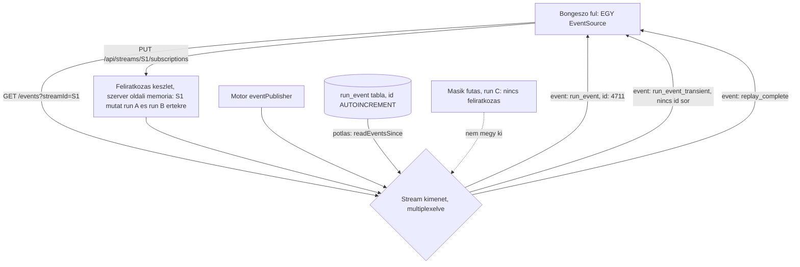
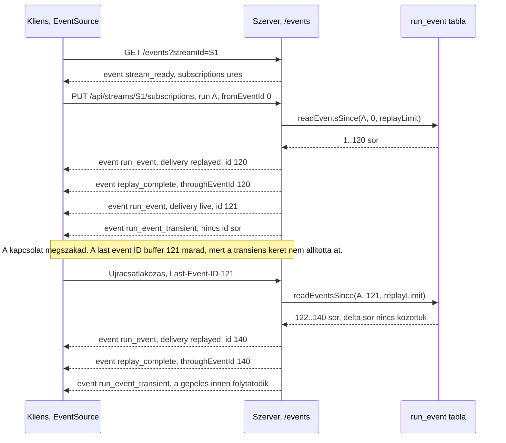

# SPEC-005: Az API és a real time protokoll

|          |                                                                                                                                                                                                                                                                                                                                                   |
| -------- | ------------------------------------------------------------------------------------------------------------------------------------------------------------------------------------------------------------------------------------------------------------------------------------------------------------------------------------------------- |
| Státusz  | tervezet                                                                                                                                                                                                                                                                                                                                          |
| Dátum    | 2026-08-29                                                                                                                                                                                                                                                                                                                                        |
| Előzmény | [`SPEC-003-domain-perzisztencia.md`](SPEC-003-domain-perzisztencia.md) (entitások, a `run_event` kurzor, állapotgépek), [`SPEC-004-vegrehajto-motor.md`](SPEC-004-vegrehajto-motor.md) (a motor felülete, az esemény típusok, a megszakítás, a jóváhagyás), [`SPEC-002-csomag-architektura.md`](SPEC-002-csomag-architektura.md) 4. és 6. szekció |
| Kimenet  | a `@easter-workflow-builder/protocol` csomag kilenc téma mappája: 26 REST végpont, egy SSE stream, öt stream esemény típus, Zod alapú séma réteg                                                                                                                                                                                                  |
| Terv     | [`../plan/PLAN-006-api-protokoll.md`](../plan/PLAN-006-api-protokoll.md)                                                                                                                                                                                                                                                                          |

---

## 1. Cél és hatókör

### Amit eldönt

- A `@easter-workflow-builder/protocol` csomag felelősségét és határait: mi az, ami egyetlen forrásból megy a szervernek és a felületnek, és mi az, ami nem tartozik ide.
- A teljes REST kontraktust: 26 végpont útvonala, metódusa, kérés és válasz alakja, hibaágai.
- Az SSE protokollt: az esemény keret alakja, az `id:` mező és a `run_event.id` viszonya, a multiplexelés, és az újracsatlakozás pontos menete a `Last-Event-ID` fejléccel.
- A delta kérdést: mi történik újracsatlakozáskor, és honnan tudja a kliens, hogy egy üzenet pótolt vagy élő.
- A Zod séma réteget: hogyan ad egy forrás típust és futásidejű validátort, hol fut a validáció, mi történik érvénytelen üzenetnél, és hogyan viszonyul ez a `@easter-workflow-builder/typeguards` csomaghoz.
- Az egységes hiba alakot REST-en és SSE-n, és azt, hogyan képződik le rá a motor és a `db` réteg hibaosztálya.
- A csomag belső mappaszerkezetét a SPEC-002 6. szekció téma konvenciója és a PLAN-004 3. szekció bontási kritériuma szerint.
- A tesztelés módját: hogyan tesztelhető egy SSE keretsorozat determinisztikusan, valós hálózat és valós API nélkül.

### Amit NEM dönt el

- **Nem implementálja a szervert.** Az `apps/server` HTTP kiszolgálója, a routolás, a lemezre írás, a folyamat életciklusa és a port kezelése külön spec tárgya. A jelen spec a szerződést adja, amit annak a specnek teljesítenie kell, plusz egyetlen fájlt az `apps/server` csomagban: a sodródás védelmi regressziós tesztet (7.4), aminek nincs futásidejű megvalósítása.
- **Nem implementálja a felületet.** Az `apps/web` és a `packages/ui` a jelen specből a típusokat és a validátorokat veszi, a megjelenítés külön spec.
- **Nem módosítja a `packages/db` sémát és a `packages/engine` felületét.** A protokoll a meglévő repository és motor műveletekre képez le, egyetlen új adatbázis oszlop és egyetlen új motor metódus nélkül.
- **Nem dönt portról, időkorlátról, lapméretről és újracsatlakozási várakozásról.** Egyikre sincs dokumentált forrásunk, ezért egyikre sem adunk számot; mindegyik a 11. szekcióban áll nyitott kérdésként, kimondott addigi viselkedéssel.
- **Nem vezet be hitelesítést.** A user 2. döntése szerint nincs bejelentkezés, nincs token, nincs munkamenet; a védelem kizárólag az, hogy a szerver a `127.0.0.1` címre köt (3.5).

### A user négy döntése, amit ez a spec megvalósít

| #   | Döntés                                                                                                        | Hol valósul meg                                                                                    |
| --- | ------------------------------------------------------------------------------------------------------------- | -------------------------------------------------------------------------------------------------- |
| 1   | REST a CRUD-ra, SSE a real time eseményekre; az eredeti WebSocket kérés az érvek alapján SSE-re változott     | 4. szekció (REST), 5. szekció (SSE), és a 2. szekció F-1 ... F-8 tényei, amik az érveket hordozzák |
| 2   | A szerver csak a localhostra hallgat, nincs jelszó, nincs token, nincs munkamenet                             | 3.5 szekció, és a 13. szekció 7 ... 10. kritériuma                                                 |
| 3   | Zod sémák: egy forrásból a TypeScript típus és a futásidejű validátor                                         | 7. szekció, kimondva, hogy ez eltér a projekt eddigi kézi typeguard mintájától (7.2)               |
| 4   | Újracsatlakozáskor a hiányzó kész üzenetek jönnek, a gépelés onnan folytatódik; a szerver nem pufferel deltát | 6. szekció, és az 5.6 újracsatlakozási menet                                                       |

## 2. Megerősített tények, forrással

Minden sor mögött hivatalos szabvány, hivatalos dokumentáció, élő registry lekérdezés vagy a telepített csomag saját fájlja áll. Amire nincs forrás, az a 11. szekcióban áll nyitott kérdésként.

| #    | Tény                                                                                                                                                                                                                                               | Forrás                                                                                                                                                                                                                                                              |
| ---- | -------------------------------------------------------------------------------------------------------------------------------------------------------------------------------------------------------------------------------------------------- | ------------------------------------------------------------------------------------------------------------------------------------------------------------------------------------------------------------------------------------------------------------------- |
| F-1  | Kapcsolatvesztéskor a felhasználói ügynök magától újracsatlakozik, és ha a last event ID string nem üres, beteszi a `Last-Event-ID` fejlécet: _"Set (`Last-Event-ID`, lastEventIDValue) in request's header list"_                                 | [WHATWG HTML, server-sent events](https://html.spec.whatwg.org/multipage/server-sent-events.html)                                                                                                                                                                   |
| F-2  | Az `id` mező feldolgozása: _"set the last event ID buffer to the field value"_, és a mező értéke nem tartalmazhat U+0000 NULL karaktert, különben a mezőt figyelmen kívül hagyják                                                                  | ugyanott                                                                                                                                                                                                                                                            |
| F-3  | Az esemény kiküldése után a data buffer és az event type buffer ürül, a **last event ID buffer nem**: _"The buffer does not get reset, so the last event ID string ... remains set to this value until the next time it is set"_                   | ugyanott, "dispatch the event" algoritmus                                                                                                                                                                                                                           |
| F-4  | Ezért egy `id:` mező nélküli esemény nem változtatja meg a last event ID értéket: _"If an event doesn't have an 'id' field, but an earlier event did set the event source's last event ID string"_, az marad érvényben                             | ugyanott                                                                                                                                                                                                                                                            |
| F-5  | Az újracsatlakozási várakozás a `retry:` mezővel állítható, és az alapérték **implementáció függő**: _"This must initially be an implementation-defined value, probably in the region of a few seconds."_ Konkrét szám nincs.                      | ugyanott                                                                                                                                                                                                                                                            |
| F-6  | Az esemény folyam mindig UTF-8: _"Event streams are always decoded as UTF-8. There is no way to specify another character encoding."_ A MIME típus `text/event-stream`.                                                                            | ugyanott                                                                                                                                                                                                                                                            |
| F-7  | Nem 200-as státusz vagy nem `text/event-stream` típus esetén: _"fail the connection"_, és _"Once the user agent has failed the connection, it does not attempt to reconnect."_                                                                     | ugyanott                                                                                                                                                                                                                                                            |
| F-8  | HTTP/1.1 alatt a böngészők originenként hat egyidejű kapcsolatot engednek, és az MDN ezt SSE kontextusban külön kimondja: _"the limit is per browser and is set to a very low number (6)"_, "Won't fix" státusszal                                 | [MDN, Using server-sent events](https://developer.mozilla.org/en-US/docs/Web/API/Server-sent_events/Using_server-sent_events), [MDN, Connection management in HTTP/1.x](https://developer.mozilla.org/en-US/docs/Web/HTTP/Guides/Connection_management_in_HTTP_1.x) |
| F-9  | Az `EventSource` konstruktora egyetlen opciót ismer, a `withCredentials` mezőt; egyedi HTTP fejléc megadására **nincs** dokumentált mechanizmus                                                                                                    | [MDN, EventSource()](https://developer.mozilla.org/en-US/docs/Web/API/EventSource/EventSource), WHATWG `EventSourceInit` IDL                                                                                                                                        |
| F-10 | A Vite dev proxy nem továbbítja rendesen az SSE kapcsolat lezárását; a #13522 a #12157 duplikátuma, mindkettő `bug: upstream` címkével zárva, a maintainer válasza szerint `timeout: 0` beállítás kell a proxy configba                            | [vitejs/vite#13522](https://github.com/vitejs/vite/issues/13522), [vitejs/vite#12157](https://github.com/vitejs/vite/issues/12157)                                                                                                                                  |
| F-11 | A tömörítés dokumentáltan nem működik együtt az SSE-vel: _"this module does not work out of the box with server-sent events"_, a megoldás explicit `res.flush()` hívás minden kiírás után                                                          | [expressjs/compression README](https://github.com/expressjs/compression), "Server-Sent Events" szekció                                                                                                                                                              |
| F-12 | A Zodot az Agent SDK peer függőségként hozza: `"zod": "^4.0.0"`, és a fában négy workspace csomag deklarálja ugyanezt a range-t; a Bun egyetlen verzióra, `4.4.3`-ra oldja fel                                                                     | `@anthropic-ai/claude-agent-sdk@0.3.245` `package.json`, `bun.lock`, saját mérés                                                                                                                                                                                    |
| F-13 | A Zod 4 dokumentált API-ja: `z.infer<>` a típushoz, `.safeParse()` a nem dobó validációhoz (_"a plain result object"_, diszkriminált unió), `z.discriminatedUnion()`, `z.strictObject()` az ismeretlen kulcs elutasításához                        | [zod.dev/basics](https://zod.dev/basics), [zod.dev/api](https://zod.dev/api)                                                                                                                                                                                        |
| F-14 | A Zod `.readonly()` a következtetett típust `Readonly<...>` alakúvá teszi, és futásidőben `Object.freeze()` hívással fagyaszt                                                                                                                      | [zod.dev/api](https://zod.dev/api)                                                                                                                                                                                                                                  |
| F-15 | A `z.input<>` és a `z.output<>` akkor tér el, ha a séma átalakít; a `z.infer<>` a `z.output<>` szinonimája                                                                                                                                         | [zod.dev/basics](https://zod.dev/basics)                                                                                                                                                                                                                            |
| F-16 | A Node HTTP fejléc alapértelmezett maximális mérete 16 KiB: _"Specify the maximum size, in bytes, of HTTP headers. Defaults to 16 KiB."_                                                                                                           | [Node.js CLI, `--max-http-header-size`](https://nodejs.org/api/cli.html)                                                                                                                                                                                            |
| F-17 | A `net.Server.listen` dokumentált viselkedése: _"If host is omitted, the server will accept connections on the unspecified IPv6 address (::) ... or the unspecified IPv4 address (0.0.0.0)"_. Dokumentált alapértelmezett port nincs.              | [Node.js net](https://nodejs.org/api/net.html), [Node.js http](https://nodejs.org/api/http.html)                                                                                                                                                                    |
| F-18 | A `run_event.id` `INTEGER PRIMARY KEY AUTOINCREMENT`, ez az **egyetlen** sorszám, és a replay szerződés szó szerint: _"a kliens elküldi a legutóbb látott azonosítót, a szerver a `WHERE run_id = ? AND id > ? ORDER BY id` sorokat küldi vissza"_ | SPEC-003 6.3                                                                                                                                                                                                                                                        |
| F-19 | A `readEventsSince(runId, afterEventId, limit)` `limit` paramétere **kötelező, szállított alapérték nélkül**                                                                                                                                       | SPEC-003 9.2, SPEC-003 O-2 nyitott kérdés                                                                                                                                                                                                                           |
| F-20 | A delta kapcsoló pontosan egy `kind` értékre hat, az `sdk_stream_event` értékre, futás indításakor befagy, és kikapcsolt állapotban `appendSdkEvent` `skipped` eredményt ad, nem hibát                                                             | SPEC-003 6.6                                                                                                                                                                                                                                                        |
| F-21 | Az élő nézet a motorból jön, nem az adatbázisból: a delta kapcsoló az élő folyamra nincs hatással                                                                                                                                                  | SPEC-003 6.6, SPEC-004 F-23                                                                                                                                                                                                                                         |
| F-22 | Az `Outcome<T>` hibaága kizárólag `message: string` mezőt hordoz, és a hibaosztály neve zárójelben, szó szerint szerepel az üzenetben                                                                                                              | `packages/core/src/result/outcome/outcome.ts`, SPEC-004 F-24                                                                                                                                                                                                        |
| F-23 | A `protocol` csomag L1, mert **csak a `core` csomagtól függhet**; a `db` és a `ui` L2, a `web` L5, a `server` L6                                                                                                                                   | SPEC-002 4. szekció, `tooling/scripts/src/dependency-graph/package-layer.ts`                                                                                                                                                                                        |
| F-24 | A `JSON.stringify` a U+0000 ... U+001F tartomány minden kódegységét escape-eli, tehát a kimenete soha nem tartalmaz nyers U+000A vagy U+000D karaktert                                                                                             | ECMA-262, `QuoteJSONString` absztrakt művelet; plusz saját, futtatott mérés a projekt Node verzióján                                                                                                                                                                |

**Amit ezekből NEM következtetünk.** Az F-5-ből nem következik semmilyen `retry:` érték: a szabvány kifejezetten implementáció függőnek mondja, ezért mi nem küldünk `retry:` mezőt (5.7). Az F-16-ból nem következik, hogy a kurzor fejléc soha nem nőhet túl a 16 KiB-on: abból csak az következik, hogy a kurzor **egyetlen egész szám**, nem lista (5.3). Az F-17-ből nem következik szó szerinti dokumentációs mondat arra, hogy a `127.0.0.1` cím megadása kizárja a többi interfészt; abból az következik, hogy a `host` argumentum elhagyása a minden interfészre hallgatást jelenti, ezért nálunk a `host` argumentum **kötelező** (3.5).

## 3. A `packages/protocol` csomag felelőssége és határai

### 3.1 Egyetlen forrás, két fogyasztó

A csomag a REST és az SSE kontraktus egyetlen forrása. Az `apps/server` (L6) és az `apps/web` (L5, a `packages/ui` L2 rétegen át) ugyanabból a csomagból veszi a típust és a validátort, tehát a két oldal nem tud szétcsúszni egy elgépelt mezőnéven.

| Csomag                              | Réteg | Mit csinál                                                                                                                 | Mit **nem** csinál                                                                                       |
| ----------------------------------- | ----- | -------------------------------------------------------------------------------------------------------------------------- | -------------------------------------------------------------------------------------------------------- |
| `@easter-workflow-builder/protocol` | L1    | a drótszintű alakok Zod sémái és a belőlük következtetett típusok, az útvonal tábla, a hiba boríték, az SSE keret kódolás  | nem nyit hálózatot, nem hív HTTP-t, nem ismer adatbázist, nem ismer motort, nem tartalmaz üzleti logikát |
| `apps/server`                       | L6    | a HTTP kiszolgáló, a routolás, a `db` és az `engine` hívása, a `db` és a motor rekordjainak leképezése a drótszintű alakra | nem definiál drótszintű alakot; minden bejövő és kimenő alak a `protocol` sémájából jön                  |
| `apps/web`                          | L5    | a kliens: REST hívások, az `EventSource` kezelése, a bejövő adat validálása ugyanazokkal a sémákkal                        | nem definiál drótszintű alakot, és nem épít saját, kézi validátort a válaszra                            |

### 3.2 Mit tartalmaz a csomag

1. **Zod sémákat** minden drótszintű alakra: kérés törzs, útvonal paraméter, query string, válasz törzs, SSE keret.
2. **A sémákból következtetett TypeScript típusokat**, `z.infer` segítségével. Külön kézzel írt típusdefiníció egyetlen drótszintű alakhoz sem tartozik, mert az lenne a második forrás, ami elcsúszhat.
3. **Az útvonal táblát**: az `API_BASE_PATH` és a `STREAM_PATH` konstanst, a végpontok útvonal sablonjait, és a paraméter behelyettesítő tiszta függvényt.
4. **A hiba borítékot**: a `ProtocolErrorCode` zárt szótárát, a boríték sémáját, és a kódhoz tartozó HTTP státuszt adó tiszta függvényt.
5. **Az SSE keret kódolóját és dekódolóját**: a keret objektumból a drótszintű szöveget, és a beérkezett nyers adatból a validált keretet.

### 3.3 Mit nem tartalmaz, és miért

| Amit nem tartalmaz                                    | Miért                                                                                                                                                                                                                                                                                        |
| ----------------------------------------------------- | -------------------------------------------------------------------------------------------------------------------------------------------------------------------------------------------------------------------------------------------------------------------------------------------- |
| HTTP kiszolgáló, útvonalválasztó, kliens `fetch`      | ezek szállítás, nem szerződés; a csomag L1, és egy L1 csomagnak nincs dolga hálózattal                                                                                                                                                                                                       |
| a `db` rekord típusai és a motor típusai              | a `protocol` L1, tehát a `db` (L2) és az `engine` (L5) csomagot nem importálhatja (F-23). A drótszintű alak amúgy sem azonos a tárolási alakkal: a `run_event` sor 19 oszlopa közül a drótra a felület által ténylegesen használt mezők mennek ki, és minden időbélyeg `...Ms` utótagú egész |
| a `db` és a motor hibaosztályainak leképező táblája   | egy L1 csomagba tett, szöveges literálokból álló másolat egy második forrás lenne, amit ma egyetlen kapu sem tud teljességre ellenőrizni, mert sem a `db`, sem az `engine` nem exportál futásidejű listát a hibaosztályairól. A leképezés a szerveré, a szerződés a 8.3 táblázatban áll      |
| bármilyen port, időkorlát, lapméret vagy `retry` szám | nincs rá dokumentált forrás (11. szekció), és a projekt szabálya szerint forrás nélkül nem adunk számot                                                                                                                                                                                      |
| naplózás                                              | a `logger` csomag L0, a `protocol` L1, tehát az él megengedett lenne, de a csomagban nincs mit naplózni: minden függvénye tiszta, és a hívó dönt arról, mit ír ki                                                                                                                            |

### 3.4 Függőségi irány

A `protocol` `dependencies` mezője a jelen spec után: `@easter-workflow-builder/core` (az `Outcome` miatt) és `zod`. A `zod` külső npm csomag, tehát a `check:graph` réteg szabályát nem érinti; a workspace élek száma nem nő, a csomag L1 marad.

**Verziószámot nem vezetünk be.** A `zod` deklarált range-e szó szerint ugyanaz, amit a fában már négy csomag és az Agent SDK peer mezője használ: `^4.0.0` (F-12). Ebből következik, hogy a Bun ugyanarra az egyetlen verzióra oldja fel, mint eddig, és nem keletkezik új verzió döntés, amit két független forrással kellene igazolni. A registry `latest` értéke a jelen spec írásakor magasabb, mint amire a fa feloldódik; ez ismert, és **nem** ok a frissítésre a jelen spec keretében.

### 3.5 Localhost, hitelesítés nélkül

**A user 2. döntése.** A szerver kizárólag a `127.0.0.1` címre köt. Ennek a specnek négy következménye van, mind kimondva:

1. **A `host` argumentum kötelező.** A Node dokumentált viselkedése szerint a `host` elhagyása a nem specifikált címre hallgatást jelenti (F-17), tehát az elhagyás pontosan az a hiba, amit el akarunk kerülni. A szerver spec ezt kötelező, nem opcionális paraméterként veszi át.
2. **Nincs hova tenni hitelesítést, és ez szándékos.** A protokollban nincs `Authorization` fejléc, nincs süti, nincs token mező, és nincs bejelentkezési végpont. Ha valaha távoli elérés kell, az új spec, hitelesítéssel; a jelen protokoll nem hordoz olyan mezőt, amit fél megoldásként fel lehetne használni.
3. **Az `EventSource` amúgy sem tudna fejlécet küldeni** (F-9). A korlát és a döntés egy irányba mutat: a stream feliratkozás állapotát nem fejléc, hanem külön REST hívás vezérli (5.2).
4. **A `withCredentials` értéke hamis.** Nincs hitelesítő adat, tehát nincs mit átvinni, és a fejlesztéskori, más originről érkező stream kapcsolat (5.8) sem visz adatot.

## 4. A REST kontraktus

### 4.1 Közös szabályok

- **Az útvonal előtag `API_BASE_PATH = '/api'`**, egyetlen kivétellel: az SSE stream a `STREAM_PATH = '/events'` útvonalon áll, ami **nem** az `/api` előtag alatt van. Az ok a Vite dev proxy pufferelése (F-10): így egy `/api` mintára írt fejlesztői proxy szabály soha nem éri el a streamet, akkor sem, ha valaki később felveszi (5.8).
- **A kérés törzse mindig `application/json`, a válasz törzse mindig `application/json`**, kivéve a stream végpontot, aminek a válasza `text/event-stream` (F-6).
- **Minden bejövő alak `z.strictObject`**, tehát ismeretlen kulcs elutasítás, nem csendes átengedés (7.3).
- **Nincs szállított lapméret és nincs szállított alapértelmezés.** Ahol lapozás van, a `limit` a kérés **kötelező** mezője (F-19). A séma nem használ `.default()` értéket, tehát a protokollban nem tud elrejtőzni forrás nélküli szám (7.3).
- **Minden időbélyeg egész milliszekundum**, a mezőnév `...Ms` utótaggal, ahogy a `db` réteg oszlopai (SPEC-003 4.).
- **Minden azonosító szöveg**, kivéve a `run_event.id` értékét, ami egész (F-18).
- **Hibánál a válasz törzse egyetlen alak**, a 8. szekció `ProtocolErrorBody` sémája, a státusz kód pedig a 8.2 táblázat szerinti.

### 4.2 A 26 REST végpont

A "Motor vagy repository" oszlop mondja meg, mire képződik le a végpont. Ahol a cél a motor, ott a hívás **nem** kerülheti meg a motort, mert a validáció, a provider feloldás és a pillanatkép a motor felelőssége (SPEC-004 4.8).

**A. Workflow (8 végpont)**

| #   | Metódus és útvonal                                 | Kérés                                                             | Válasz                                     | Motor vagy repository         | Saját hibaágai                             |
| --- | -------------------------------------------------- | ----------------------------------------------------------------- | ------------------------------------------ | ----------------------------- | ------------------------------------------ |
| 1   | `GET /api/workflows`                               | query: `limit` (kötelező)                                         | `WorkflowSummary` lista                    | `workflows.listWorkflows`     | `invalid_request`                          |
| 2   | `POST /api/workflows`                              | `CreateWorkflowRequest`: `name`, `description`, `providerId`      | `WorkflowDetail`                           | `workflows.createWorkflow`    | `invalid_request`                          |
| 3   | `GET /api/workflows/{workflowId}`                  | nincs                                                             | `WorkflowDetail`                           | `workflows.getWorkflow`       | `not_found`                                |
| 4   | `PATCH /api/workflows/{workflowId}`                | `UpdateWorkflowRequest`, minden mező elhagyható                   | `WorkflowDetail`                           | `workflows.updateWorkflow`    | `not_found`, `invalid_request`             |
| 5   | `DELETE /api/workflows/{workflowId}`               | `DeleteWorkflowRequest`: `acknowledgeIrreversible` literál `true` | `DeletionSummary`, a ténylegesen töröltről | `workflows.deleteWorkflow`    | `not_found`, `invalid_request`             |
| 6   | `GET /api/workflows/{workflowId}/deletion-summary` | nincs                                                             | `DeletionSummary`, előzetes                | `workflows.summarizeDeletion` | `not_found`                                |
| 7   | `GET /api/workflows/{workflowId}/graph`            | nincs                                                             | `WorkflowGraphDocument`                    | `workflows.readGraph`         | `not_found`                                |
| 8   | `PUT /api/workflows/{workflowId}/graph`            | `ReplaceGraphRequest`: teljes node és él lista                    | `WorkflowGraphDocument`                    | `workflows.replaceGraph`      | `not_found`, `invalid_request`, `conflict` |

**A törlés visszavonhatatlan, és a protokoll ezt kényszeríti ki.** A `DELETE` végpont **törzset vár**, és a törzs `acknowledgeIrreversible` mezőjének értéke Zod szinten a `true` literál, nem `boolean`. Ebből három dolog következik. Egy: `false` érték küldése séma hiba, nem "nem csinálunk semmit", tehát a felhasználó nem kap csendes sikert. Kettő: a törzs nélküli `DELETE` kérés `invalid_request` hibát ad, tehát egy véletlen kattintás sem visz el semmit. Három: a mező pontosan azt a literált hordozza, amit a `db` réteg `deleteWorkflow` bemenete megkövetel (SPEC-003 9.2), tehát a szerver a saját alakját nem találja ki. A 6. végpont ehhez adja a megerősítő párbeszéd szövegét: megnevezi, hány futás, hány lépés futás, hány esemény és hány jóváhagyás vész el, az al-workflow futásokkal együtt (SPEC-003 4.15).

**B. Futás (8 végpont)**

| #   | Metódus és útvonal                      | Kérés                                                                         | Válasz                                  | Motor vagy repository                             | Saját hibaágai                                  |
| --- | --------------------------------------- | ----------------------------------------------------------------------------- | --------------------------------------- | ------------------------------------------------- | ----------------------------------------------- |
| 9   | `POST /api/workflows/{workflowId}/runs` | `StartRunRequest`: `input`                                                    | `StartedRunResponse`: `runId`, `status` | `engine.startRun`                                 | `not_found`, `invalid_request`, `unprocessable` |
| 10  | `GET /api/runs`                         | query: `limit` (kötelező), `workflowId` (elhagyható)                          | `RunSummary` lista                      | `runs.listRuns` vagy `listRunsForWorkflow`        | `invalid_request`                               |
| 11  | `GET /api/runs/{runId}`                 | nincs                                                                         | `RunDetail`                             | `runs.getRun`                                     | `not_found`                                     |
| 12  | `GET /api/runs/{runId}/snapshot`        | nincs                                                                         | `RunSnapshotResponse`                   | `runs.readSnapshot`                               | `not_found`                                     |
| 13  | `GET /api/runs/{runId}/steps`           | nincs                                                                         | `StepRunRecord` lista                   | `stepRuns.listStepRuns`                           | `not_found`                                     |
| 14  | `GET /api/runs/{runId}/events`          | query: `limit` (kötelező), plusz **vagy** `afterEventId` **vagy** `stepRunId` | `TranscriptPage`                        | `events.readEventsSince` vagy `readEventsForStep` | `not_found`, `invalid_request`                  |
| 15  | `POST /api/runs/{runId}/interrupt`      | üres törzs                                                                    | `InterruptSummaryResponse`              | `engine.interruptRun`                             | `not_found`, `conflict`                         |
| 16  | `POST /api/runs/{runId}/restart`        | `RestartRunRequest`: `input` (elhagyható, alapból az eredeti bemenet)         | `StartedRunResponse`                    | `engine.restartRun`                               | `not_found`, `unprocessable`                    |

**A 14. végpont két alakja egy sémaunió, nem feltételes mező.** A query string vagy `{ limit, afterEventId }`, vagy `{ limit, stepRunId }`; a két `z.strictObject` kizárja egymást, mert mindegyik elutasítja a másik kulcsát. Így nem keletkezik olyan kombináció, aminek a jelentése nem meghatározott, és a szerver oldalon nincs elágazás azon, hogy "melyik mező van kitöltve", csak azon, hogy a unió melyik ága illeszkedett. A `readEventsForStep` bemenete nem tartalmaz kurzort (SPEC-003 9.2), ezért a `stepRunId` ágon `afterEventId` sem küldhető: a séma ezt kizárja, nem a szerver.

**C. Jóváhagyás (2 végpont)**

| #   | Metódus és útvonal                          | Kérés                                                             | Válasz                         | Motor vagy repository            | Saját hibaágai                             |
| --- | ------------------------------------------- | ----------------------------------------------------------------- | ------------------------------ | -------------------------------- | ------------------------------------------ |
| 17  | `GET /api/approvals`                        | nincs                                                             | `PendingApproval` lista        | `approvals.listPendingApprovals` | nincs                                      |
| 18  | `POST /api/approvals/{approvalId}/decision` | `ApprovalDecisionRequest`: `decision`, `approved` vagy `rejected` | `PendingApproval`, a döntéssel | `engine.decideApproval`          | `not_found`, `conflict`, `invalid_request` |

A 17. végpont válasza a `requestedAtMs` mezőt is hordozza, tehát a felület a SPEC-004 5.8 pontja szerint meg tudja mutatni, mióta vár a jóváhagyás; a "mióta" különbséget a felület számolja, a szerver nem küld periodikus, csak azért létező eseményt. A döntés a **motoron** megy át, nem közvetlenül a repositoryn, mert a döntés és a lépés állapotváltása egy tranzakció, és utána a futás léptetése is a motor dolga (SPEC-004 5.8).

**D. Provider (2 végpont)**

| #   | Metódus és útvonal                                 | Kérés | Válasz                   | Motor vagy repository            | Saját hibaágai               |
| --- | -------------------------------------------------- | ----- | ------------------------ | -------------------------------- | ---------------------------- |
| 19  | `GET /api/providers`                               | nincs | `ProviderSummary` lista  | a provider registry a szerverben | nincs                        |
| 20  | `POST /api/providers/{providerId}/connection-test` | üres  | `ConnectionTestResponse` | `engine.testProviderConnection`  | `not_found`, `unprocessable` |

**A providerekhez nincs CRUD**, csak választani lehet közülük (`.claude/CLAUDE.md` 9.): a 19. végpont olvasás, és nincs `POST`, `PATCH` vagy `DELETE` párja. A `ProviderSummary` a megjelenítéshez szükséges mezőket viszi (azonosító, megjelenítendő név, a modellek listája, és a kötelező env változók **neve**), és **soha nem visz env változó értéket** (SPEC-004 11.3 10. sor, `.claude/CLAUDE.md` 9. "Titok kezelés"). A képességleíró `Fact` mezőinek bizonyíték listáját sem visszük ki: az mérési narratíva, aminek a helye a `docs/research/` alatt van, nem a dróton.

**E. Beállítás (5 végpont)**

| #   | Metódus és útvonal                                     | Kérés                                                               | Válasz                       | Motor vagy repository                                                      | Saját hibaágai                 |
| --- | ------------------------------------------------------ | ------------------------------------------------------------------- | ---------------------------- | -------------------------------------------------------------------------- | ------------------------------ |
| 21  | `GET /api/settings`                                    | nincs                                                               | `SettingsRecord`             | `settings.readSettings`                                                    | nincs                          |
| 22  | `PUT /api/settings`                                    | `UpdateSettingsRequest`: `defaultProviderId`, `persistStreamDeltas` | `SettingsRecord`             | `settings.setDefaultProvider` és `setPersistStreamDeltas`                  | `invalid_request`              |
| 23  | `GET /api/settings/concurrency-limits`                 | nincs                                                               | `ConcurrencyLimitView` lista | `concurrencyLimits.readAllLimits` plusz `engine.suggestedConcurrencyLimit` | nincs                          |
| 24  | `PUT /api/settings/concurrency-limits/{providerId}`    | `SetConcurrencyLimitRequest`: `maxConcurrentSteps`                  | `ConcurrencyLimitView`       | `concurrencyLimits.setLimit`                                               | `not_found`, `invalid_request` |
| 25  | `DELETE /api/settings/concurrency-limits/{providerId}` | nincs                                                               | üres törzs, 204              | `concurrencyLimits.clearLimit`                                             | `not_found`                    |

**A delta kapcsoló a 22. végponton áll, alapból kikapcsolva** (F-20). A `SettingsRecord` mindkét mezője kötelező a válaszban, tehát a felület mindig tudja, mi az érvényes állapot; a `PUT` bemenetén viszont mindkettő elhagyható, és a hiányzó mező érintetlenül hagyja a beállítást. Ez nem alapértelmezés, hanem részleges frissítés, és a séma ezt `optional` mezővel fejezi ki, nem `.default()` értékkel.

A 23. végpont válasza két, egyértelműen elkülönített mezőt hordoz providerenként: a **beállított** korlátot (`configuredMaxConcurrentSteps`, `null`, ha nincs sor a táblában), és a leíróból jövő **javaslatot** (`suggestion`, ami vagy egy mért érték a korlátaival együtt, vagy "nincs javaslat"). A kettő soha nem keveredik: a mért javaslat nem lép érvénybe, amíg a felhasználó el nem menti (SPEC-004 7.3), és a válasz alakja ezt szerkezetileg is kimondja.

**F. Stream vezérlés (1 REST végpont, plusz maga a stream)**

| #   | Metódus és útvonal                          | Kérés                                                                                 | Válasz              | Saját hibaágai                 |
| --- | ------------------------------------------- | ------------------------------------------------------------------------------------- | ------------------- | ------------------------------ |
| 26  | `PUT /api/streams/{streamId}/subscriptions` | `SubscriptionRequest`: `runs` lista, elemenként `runId`, `fromEventId`, `replayLimit` | `SubscriptionState` | `not_found`, `invalid_request` |
|     | `GET /events`                               | query: `streamId`; fejléc: `Last-Event-ID`, ha a böngésző küldi                       | `text/event-stream` | 5.5                            |

A 26. végpont **teljes cserét** végez, nem hozzáadást és nem törlést: a kérés a feliratkozás teljes, kívánt állapotát írja le. Ennek az oka ugyanaz, amiért a `replaceGraph` is teljes cserét végez (SPEC-003 9.2): egy hozzáadó és egy elvevő művelet két állapotot enged, amiből a kliens és a szerver külön nyilvántartást vezetne, és a kettő elcsúszhatna. Egy `PUT`, egy állapot, egy válasz.

## 5. Az SSE protokoll

### 5.1 Miért SSE, és miért egyetlen stream

A user 1. döntése SSE, nem WebSocket. Ami ezt a jelen tervben ténylegesen hordozza: az újracsatlakozás és a kurzor a szabvány része, nem a mi kódunk (F-1, F-2, F-3), tehát a helyreállítás menetét nem nekünk kell kitalálni. A forgalom iránya kizárólag szerverről kliens felé megy: a vezérlés (indítás, megszakítás, jóváhagyás, feliratkozás) mind REST, tehát kétirányú csatornára nincs szükség.

**Futásonként külön kapcsolatot nyitni tilos.** HTTP/1.1 alatt originenként hat egyidejű kapcsolat engedélyezett, és az MDN ezt SSE kontextusban külön kimondja, "Won't fix" státusszal (F-8). HTTP/2 alatt a korlát feloldódik, de localhoston, TLS nélkül a böngésző gyakorlatilag nem használ HTTP/2-t, tehát erre nem építhetünk. Ebből következik a kötelező elem: **egy fülön pontosan egy stream kapcsolat van, és az multiplexelve visz minden nézett futást.** A stream tartósan foglal egyet a hatból, tehát a REST hívásoknak öt marad; ez a legfőbb ok, amiért a REST oldal sem nyit hosszú életű kapcsolatot.

A protokoll ezt szerkezetileg is nehézzé teszi elrontani: **a csomag nem exportál olyan függvényt, ami futás azonosítóból stream URL-t épít.** Az egyetlen URL építő a `streamId` értéket veszi, a futások listája pedig a feliratkozás kérés **listája**, nem az URL része.



**Amit a rajz kimond.** Egy fülhöz egy kapcsolat tartozik; a feliratkozás nem az URL-ben van, hanem külön REST hívásból származó, szerver oldali állapot; a pótlás az adatbázisból jön, az élő adat a motorból; és amire nincs feliratkozás, az nem megy ki, tehát a stream nem szórja szét minden futás forgalmát minden fülre.

### 5.2 A feliratkozás és a `streamId`

1. A kliens **maga generál** egy `streamId` értéket, és megnyitja a `GET /events?streamId=<érték>` kapcsolatot. Azért a kliens generálja, mert az `EventSource` nem tud fejlécet küldeni (F-9), és mert az újracsatlakozáskor a böngésző ugyanazt az URL-t hívja újra, tehát az azonosítónak az URL-ben kell lennie ahhoz, hogy a szerver megtalálja a feliratkozást.
2. A szerver az első keretként egy `stream_ready` eseményt küld, ami megmondja, milyen feliratkozást talált ehhez a `streamId` értékhez, és megnevezi a `serverInstanceId` értéket.
3. A kliens a `PUT /api/streams/{streamId}/subscriptions` hívással állítja be a kívánt futás listát.
4. A szerver minden újonnan felvett futásra pótol, majd `replay_complete` keretet küld, és onnantól élőben ad.

**A `serverInstanceId` nem kényelmi mező.** A szerver újraindulásakor a feliratkozás halmaz elveszik, mert memóriában él, és az indulási helyreállítás minden addig futó futást `interrupted` állapotba visz (SPEC-004 10.1). Ha a kliens `stream_ready` keretben más `serverInstanceId` értéket lát, mint korábban, akkor tudja, hogy a futás állapotokra vonatkozó nézete elavult, és újra kell kérdeznie, nem elég a feliratkozást pótolni.

**Ha REST-en új futás indul**, a kliens egyszerűen újra kiadja a `PUT` hívást, a bővített listával. Nem nyit új kapcsolatot, és nem zárja le a meglévőt.

### 5.3 Az `id:` mező és a `run_event.id`

**Az SSE `id:` mező értéke pontosan a `run_event.id` decimális alakja.** Az `id` mező értéke a szabvány szerint tetszőleges szöveg, egyetlen megkötéssel, hogy nem tartalmazhat U+0000 NULL karaktert (F-2); egy decimális egész ezt teljesíti.

**Miért elég egyetlen egész szám több futás multiplexelt folyamához.** A `run_event.id` **`AUTOINCREMENT`, a teljes táblára**, nem futásonként (F-18). Ezért egyetlen érték globálisan, minden futáson át rendez, és a pótlás minden feliratkozott futásra ugyanazzal a kurzorral indítható. Ha a kurzor futásonkénti lista lenne, azt a `Last-Event-ID` fejlécbe kellene kódolni, ami a fejléc méretével együtt nőne; így viszont a fejléc egy szám marad, és a Node dokumentált, 16 KiB-os fejléc korlátjához (F-16) soha nem közelít.

**A feliratkozás padlója.** Egy futásra a kliens általában nem a legelső eseménytől kér adatot, és egy később felvett futásnak vannak a kurzornál kisebb azonosítójú eseményei, amiket a kliens sosem látott. Ezért a szerver futásonként megjegyzi azt a `fromEventId` padlót, amivel a feliratkozás indult, és a pótlás mindig `id > max(padló, kurzor)` feltétellel megy. Ez determinisztikus, két számból számolható szabály, tehát kimerítően tesztelhető.

### 5.4 Az öt esemény típus

Minden keret egyetlen `data:` sort visz, aminek a tartalma a keret törzsének JSON alakja. Egyetlen sor mindig elég, mert a `JSON.stringify` a U+0000 ... U+001F tartomány minden kódegységét escape-eli, tehát a kimenetben nincs nyers sortörés (F-24), és a szabvány szerinti sorhatárolók (LF, CR, CRLF) így nem fordulhatnak elő a törzsben.

| `event:` érték        | `id:` sor | Mikor                                                     | A törzs lényegi mezői                                              |
| --------------------- | --------- | --------------------------------------------------------- | ------------------------------------------------------------------ |
| `stream_ready`        | **nincs** | a kapcsolat felépülésekor, első keretként                 | `streamId`, `serverInstanceId`, `subscriptions` a padlókkal        |
| `run_event`           | **van**   | perzisztált `run_event` sor, pótolva vagy élőben          | `delivery`: `replayed` vagy `live`, plusz a `runEvent` rekord      |
| `run_event_transient` | **nincs** | élő üzenet, aminek nincs perzisztált sora (6. szekció)    | `runId`, `stepRunId`, `kind`, `occurredAtMs`, `payload`            |
| `replay_complete`     | **nincs** | egy futás pótlása véget ért, innen élő adat jön           | `runId`, `throughEventId` (`null`, ha nem volt mit pótolni)        |
| `protocol_error`      | **nincs** | a stream szintjén hiba történt, de a kapcsolat élve marad | a 8. szekció `ProtocolErrorBody` alakja, plusz az érintett `runId` |

**Az `id:` sor megléte nem stílus kérdés, hanem a protokoll lelke.** A `run_event` keret azért kap `id:` sort, mert van mögötte perzisztált sor, amire vissza lehet lapozni. A másik négy keret azért **nem** kap, mert nincs mögöttük sor: ha kapnának, a böngésző last event ID értéke olyan pontra állna, amit a `readEventsSince` nem tud értelmezni. A szabvány pontosan ezt a viselkedést garantálja: az `id:` mező nélküli esemény után a last event ID változatlan marad (F-3, F-4).

**Egy `protocol_error` keret nem zárja le a streamet.** A `fail the connection` út (F-7) végleges, újracsatlakozás nélküli; egy futásra vonatkozó hibáért az egész fül transcriptjét elveszíteni aránytalan. Ezért a hibát keretként küldjük, a kapcsolat pedig áll.

### 5.5 A kapcsolat felépülésének HTTP feltételei

A szabvány szerint nem 200-as státusz vagy nem `text/event-stream` típus esetén a felhasználói ügynök `fail the connection` utat választ, és **nem** próbál újracsatlakozni (F-7). Ebből következik három kötelező elem a szerver oldalon:

1. **A stream válasz státusza mindig 200**, akkor is, ha a `streamId` ismeretlen; az ismeretlen `streamId` üres feliratkozású `stream_ready` keretet ad, nem 404-et. Ha 404-et adnánk, a böngésző véglegesen feladná, és a felhasználó számára a transcript minden ok nélkül eltűnne.
2. **A `Content-Type` mindig `text/event-stream`**, karakterkódolás megadása nélkül, mert a folyam definíció szerint UTF-8 (F-6).
3. **Tömörítés a stream végponton tilos.** A dokumentált viselkedés szerint a tömörítő réteg pufferel, és csak explicit `res.flush()` hívással működik együtt SSE-vel (F-11). Egy explicit flush hívásokra épülő megoldás azt jelentené, hogy a helyes működés minden jövőbeli írási ponton kézi fegyelmen múlik; ehelyett a tömörítést egyszerűen nem kapcsoljuk rá erre az útvonalra.

### 5.6 Az újracsatlakozás pontos menete



A menet lépésről lépésre, a rajzon túli részletekkel:

1. **A böngésző magától újracsatlakozik**, és ha a last event ID string nem üres, beteszi a `Last-Event-ID` fejlécet (F-1). Ha üres (a kapcsolat még egyetlen `id:` mezőt sem látott), a fejléc nem érkezik, és a szerver a feliratkozás padlójától pótol.
2. **A szerver a fejléc értékét egészre szűkíti.** Nem egész értéknél nem hibázik el a kapcsolat, hanem úgy tekinti, mintha a fejléc nem érkezett volna, és `protocol_error` keretet küld. Az ok: a fejléc értékét bármi beírhatja, a böngésző pedig azt küldi vissza, amit tőlünk kapott; egy elrontott érték nem indokolja a transcript elvesztését.
3. **A pótlás futásonként megy**, mindegyikre `readEventsSince(runId, max(padló, kurzor), replayLimit)` hívással, addig ismételve, amíg a lap tele jön vissza. A `replayLimit` a feliratkozás kérés **kötelező** mezője (F-19), tehát a lapméretet a kliens nevezi meg, és a szerverben nincs kitalált szám.
4. **A pótolt keretek `delivery: 'replayed'` jelölést kapnak**, az utolsó után futásonként egy `replay_complete` keret jön. Ha nem volt mit pótolni, a `replay_complete` akkor is megy, `throughEventId: null` értékkel; enélkül a kliens sosem tudná meg, hogy a pótlás véget ért.
5. **Onnantól élő adat jön**, `delivery: 'live'` jelöléssel.

**A pótlás sorrendje futáson belül szigorúan `id` szerint növekvő** (F-18). Futások **között** a szerver nem ígér összefésült sorrendet: minden futás a saját pótlását egyben kapja meg. Ezt kimondjuk, mert a kliens nem építhet globális sorrendre a pótlási szakaszban; az élő szakaszban viszont a keretek abban a sorrendben mennek ki, ahogy a motor kiadja őket.

### 5.7 A `retry:` mező

**Nem küldünk `retry:` mezőt.** A szabvány szerint az alapérték implementáció függő, és a szabvány szám helyett egy közelítő megjegyzést ad (F-5). Nincs olyan mérésünk vagy dokumentált szabályunk, amiből egy konkrét milliszekundum érték következne, tehát a projekt alapszabálya szerint nem adunk számot. Ez nyitott kérdés (O-3), a "mi zárná le" mezővel.

### 5.8 A fejlesztői proxy és az origin

A Vite dev proxy nem továbbítja rendesen az SSE kapcsolat lezárását, és a jelenség mindkét bejelentése upstream hibaként zárult, a maintainer által megnevezett `timeout: 0` workarounddal (F-10). Ebből a jelen spec két dolgot vezet le:

1. **Fejlesztéskor az SSE végpont közvetlenül a backend originre megy, nem a proxyn át.** Az útvonal ezért nem az `/api` előtag alatt áll (4.1), tehát egy `/api` mintára írt proxy szabály soha nem kapja el, akkor sem, ha valaki később felveszi.
2. **Ennek ára van, és kimondjuk: fejlesztéskor a stream kapcsolat más originről jön**, mert a Vite dev szerver és a backend külön porton áll. A stream végpontnak ezért fejlesztéskor CORS engedélyt kell adnia a dev originre; a `withCredentials` értéke hamis marad (3.5), tehát hitelesítő adat nem megy át. Éles használatban a szerver szolgálja ki a felépített felületet, tehát azonos origin, és nincs CORS. A dev origin konkrét értéke konfiguráció, nem a protokoll része, és számot nem adunk rá (11. szekció O-1).

**Pontosítás, 2026-09-05 (PLAN-009 T-009-5, SPEC-008 O-2).** A fenti indoklás alapjául szolgáló hiba (`vitejs/vite` #12157, #13522) a `#13578` PR-ben javítva lett, és egy saját, valós `EventSource` méréssel a telepített `vite@8.2.2` dev proxyján át **sem a lezárás, sem a `Last-Event-ID` fejléc nem hibás** (`docs/research/2026-09-05-plan009-f0-blokkolo-meresek.md` 4. szekció). **A fenti 1-2. pont döntése ettől függetlenül változatlan marad**: a stream továbbra is közvetlenül a backend originre megy, mert ez már a beépített, szigorúbb út, és a váltás nem hozna hasznot (SPEC-008 3.1).

## 6. A delta kérdés

**Ez a user 4. döntése.** A delták nem perzisztálódnak alapból, de élőben mennek; a szerver nem pufferel deltát.

### 6.1 A két út, tételesen

| Helyzet                                                    | Perzisztálódik        | Élőben kimegy | Újracsatlakozáskor pótlódik                       |
| ---------------------------------------------------------- | --------------------- | ------------- | ------------------------------------------------- |
| kész üzenet (`sdk_assistant`, `sdk_result`, motor esemény) | igen                  | igen          | igen, `run_event` keretként, `delivery: replayed` |
| `sdk_stream_event` delta, a kapcsoló **kikapcsolva**       | nem (`skipped`, F-20) | igen          | **nem**, mert nincs mit pótolni                   |
| `sdk_stream_event` delta, a kapcsoló **bekapcsolva**       | igen                  | igen          | igen, ugyanúgy, mint bármely más sor              |

**A szerver egyetlen keretet sem tárol memóriában a pótlás kedvéért.** Ami perzisztált, azt az adatbázisból pótoljuk; ami nem perzisztált, az a szakadással elveszett. Ez nem hiányosság, hanem a döntés: egy delta pufferelése futásonként korlátlanul növő memóriát jelentene, aminek a méretére nincs forrásunk.

### 6.2 Mit lát a felhasználó a szakadás után

A szakadás alatt írt szöveg **megjelenik, csak nem gépelődik ki**. A menet: a szakadás alatt lezajlott gépelés deltái elvesznek, de a modell kész üzenete perzisztált sorként megérkezik a pótlásban, tehát a teljes szöveg egyben, animáció nélkül kerül a képernyőre. A gépelés a következő élő deltától folytatódik.

**Bekapcsolt delta kapcsolónál a szerver nem szűr.** A pótlás pontosan azt adja vissza, ami a táblában van, tehát a delta sorok is jönnek. A szerver nem talál ki szabályt arra, hogy melyik deltát "érdemes" pótolni; a `delivery: 'replayed'` jelölés alapján a kliens dönti el, hogy animálja vagy egyben rakja ki őket.

### 6.3 Honnan tudja a kliens, hogy pótolt vagy élő

Két, egymástól független jelzés, mindkettő explicit:

1. **Keretenként**: a `run_event` keret `delivery` mezője `replayed` vagy `live`. Ez állapot nélkül eldönthető, tehát egy keret önmagában is értelmezhető.
2. **Szakaszhatárként**: a `replay_complete` keret futásonként megmondja, hol ér véget a pótlás. Erre azért van szükség, mert nulla pótolt keret esetén a `delivery` mező sosem jelenne meg, és a kliens nem tudná meg, hogy elkezdhet élőben rajzolni.

Emellett a keret **típusa** mondja meg, hogy perzisztált vagy sem: a `run_event_transient` definíció szerint sosem pótlódik, mert nincs mögötte sor. Egy transiens keret tehát mindig élő, és ezt nem kell külön mezővel jelölni.

## 7. A Zod sémák

### 7.1 Egy forrás, két termék

Minden drótszintű alak egyetlen Zod sémából származik, és abból két dolog jön:

- a **futásidejű validátor**, a `.safeParse()` metóduson át, ami nem dob, hanem diszkriminált unió eredményt ad (F-13);
- a **TypeScript típus**, a `z.infer<typeof Schema>` segítségével (F-13).

Kézzel írt típusdefiníció egyetlen drótszintű alakhoz sem tartozik. Ha tartozna, az lenne a második forrás, és pontosan azt a szétcsúszást engedné meg, ami miatt a user ezt a döntést hozta.

### 7.2 Miért tér el ez a projekt eddigi kézi typeguard mintájától

**Kimondjuk: ez eltérés.** A projekt eddigi szabálya szerint minden futásidejű alakellenőrzés kézzel írt, `value is T` alakú, `unknown` bemenetet fogadó typeguard, a `@easter-workflow-builder/typeguards` csomagban vagy a saját csomagjában (`.claude/CLAUDE.md` 5.). A `protocol` csomag ettől eltér, és az eltérés hatóköre pontosan egy csomag.

| Szempont                          | Kézi typeguard                                                                                | Zod séma                                                                                                        |
| --------------------------------- | --------------------------------------------------------------------------------------------- | --------------------------------------------------------------------------------------------------------------- |
| a típus és az ellenőrzés viszonya | két külön artefaktum, amik között csak a code review a kapocs                                 | egyetlen artefaktum, a típus a sémából következik                                                               |
| hol a helye                       | belső alakok, ahol a típus és a guard egy commitban változik, és mindkettő a mi kezünkben van | drótszintű alakok, ahol a két oldal külön folyamatban fut, és a szétcsúszás csak futásidőben derülne ki         |
| mit ad hiba esetén                | logikai hamis, indoklás nélkül                                                                | mezőútvonalat és okot, az `error.issues` listán (F-13), tehát a hibaüzenet meg tudja mondani, melyik mező rossz |

**A `typeguards` csomag nem szűnik meg, nem is csökken a szerepe.** Amit ez a spec nem tesz: nem írja át a meglévő guardokat Zod sémára, nem vezeti be a Zodot egyetlen másik csomagba sem, és nem tiltja meg a kézi guard írását. A `protocol` csomag maga is használhat `typeguards` guardot ott, ahol a kérdés nem drótszintű alak, hanem egy egyszerű primitív ellenőrzés.

**Ahol a két minta találkozik, a Zod a bemenet és a guard a kimenet felé áll.** A szerver a bejövő adatot a Zod sémával validálja, majd a validált értéket adja tovább a `db` és a motor felé, ahol a meglévő kézi guardok dolgoznak tovább (például az `isNodeConfig`, ami a node config uniót őrzi). A két réteg nem versenyzik: a Zod a dróton érkező `unknown` alakját dönti el, a kézi guard a domain invariánsát.

### 7.3 A séma írás négy szabálya

1. **Minden bejövő objektum `z.strictObject`**, tehát az ismeretlen kulcs elutasítás (F-13). Az ok ugyanaz, amiért a motor a `join` `merge` mód ismeretlen `settings` kulcsát is elutasítja (SPEC-004 4.7): ha a kliens olyan mezőt küld, amit a szerver nem ismer, azt hinné, hogy hat.
2. **Nincs `.default()` és nincs `.transform()` a protokoll sémáiban.** A `.default()` szállított alapérték lenne, amire a projekt szabálya szerint forrás kell; a `.transform()` pedig szétválasztaná a `z.input` és a `z.output` típust (F-15), tehát a kliens és a szerver nem ugyanazt a típust látná. A kettő tiltásából együtt következik, hogy `z.infer` mindenhol elég, és hogy a protokollban nem tud elrejtőzni forrás nélküli szám.
3. **Minden kimenő alak `.readonly()`**, tehát a következtetett típus `Readonly<...>`, és a validált érték futásidőben is fagyasztott (F-14). Ez illeszkedik a projekt readonly konvenciójához, és megakadályozza, hogy egy kliens komponens megmutasson egy módosított rekordot úgy, mintha az a szervertől jött volna.
4. **Az uniók `z.discriminatedUnion`** (F-13), diszkriminátorral: az SSE keret union kulcsa az `event` mező, a hiba boríték kulcsa a `code` mező. Ez nemcsak gyorsabb, hanem a hibaüzenet is a helyes ágra mutat, nem az összes ág együttes hibáját sorolja fel.

### 7.4 Hol fut a validáció, és hol nem

**A szabály egy mondat: validálunk minden határon, ahol az érték `unknown` alakban érkezik, és soha nem validálunk olyan értéket, amit a helyi típusrendszer állított elő.**

| Hely                     | Validálunk | Miért                                                                                                                                                                                                                                     |
| ------------------------ | ---------- | ----------------------------------------------------------------------------------------------------------------------------------------------------------------------------------------------------------------------------------------- |
| szerver, bejövő kérés    | **igen**   | a törzs, az útvonal paraméter és a query string mind a hálózatról jön, tehát `unknown`                                                                                                                                                    |
| szerver, kimenő válasz   | nem        | a válasz a séma típusából épül, tehát a fordító már igazolta. Egy futásidejű újraellenőrzés olyan hibaágat hozna létre, ami logikailag sosem fut, amit a kizárás nélküli 100 százalékos lefedettségi küszöb tilt (`.claude/CLAUDE.md` 5.) |
| kliens, bejövő válasz    | **igen**   | a `fetch` eredménye `unknown`, és a szerver egy másik folyamat                                                                                                                                                                            |
| kliens, bejövő SSE keret | **igen**   | a keret szöveges folyamból dekódolt `unknown`; a típusrendszer a dróton nem ér át                                                                                                                                                         |
| kliens, kimenő kérés     | nem        | ugyanaz az indok, mint a szerver kimenő oldalán                                                                                                                                                                                           |

**A `.safeParse()` az egyetlen belépési pont, a `.parse()` tiltott.** A dobó változat kivételt repítene ki a rétegből, ami ellentmond a projekt `Outcome` konvenciójának (F-22). A protokoll csomag ezért minden validáló függvényt `Outcome<T>` alakban ad vissza, és a Zod hibáját a `ProtocolErrorBody` alakra fordítja.

### 7.5 Mi történik érvénytelen üzenetnél

| Hol                                               | Mi történik                                                                                                                                                                                                          |
| ------------------------------------------------- | -------------------------------------------------------------------------------------------------------------------------------------------------------------------------------------------------------------------- |
| szerver, bejövő kérés                             | `400`, `invalid_request` kóddal, és az üzenet megnevezi a hibás mező útvonalát az `error.issues[].path` alapján (F-13). **A kapott értéket nem visszhangozzuk**, tehát egy titok soha nem jön vissza a hibaüzenetben |
| szerver, ismeretlen `streamId` a stream végponton | nem hiba: 200-as válasz, üres feliratkozású `stream_ready` keret (5.5 1. pont)                                                                                                                                       |
| kliens, bejövő REST válasz                        | a hívás `Outcome` hibaágat ad, `invalid_request` kóddal, és a felület nem rajzol ki fél adatot                                                                                                                       |
| kliens, bejövő SSE keret                          | a kliens eldobja a keretet, helyi `protocol_error` állapotot vesz fel, és **nem zárja le a streamet**, mert egy hibás keret nem indokolja a teljes transcript elvesztését (5.4)                                      |

### 7.6 A drótszintű felsorolások és a sodródás védelem

A `protocol` L1, tehát a `db` (L2) enumjait nem importálhatja (F-23). Ezért a drótszintű felsorolásokat a csomag **maga deklarálja** `z.enum` alakban: a futás állapotát, a lépés futás állapotát, a node típust, az esemény `kind` és `origin` értékét, a jóváhagyás döntését, és a megszakítás okát.

**Ez kimondott duplikáció, és gépi védelem tartozik hozzá.** Az `apps/server` csomag az egyetlen hely, ahol a `protocol` és a `db` egyszerre látszik. Oda kerül egy megvalósítás nélküli regressziós teszt, saját téma mappában, aminek a neve az, amit őriz (`.claude/CLAUDE.md` 5.). A teszt két dolgot igazol:

1. **Típusszinten, kétirányú kölcsönös értékadhatóság**: a protokoll felsorolása és a `db` uniója pontosan ugyanaz a halmaz, egyik irányban sem több és nem kevesebb. Ezt a `bun run typecheck` kapu érvényesíti, tehát a védelem nem függ attól, hogy a teszt lefut-e.
2. **Futásidőben**, ahol a `db` exportál futásidejű guardot (`isRunEventKind`, `isApprovalDecision`): a protokoll minden felsorolt értékét a `db` guardja elfogadja.

A típusszintű ág az erősebb, mert az teljes: egy `db` oldali új érték, amit a protokoll nem ismer, ugyanúgy fordítási hibát ad, mint egy protokoll oldali kitalált érték.

### 7.7 A `WorkflowNodeInput.config` mező: a SPEC-008 felülírja a jelen spec döntését

**Kimondjuk: ez egy visszavont döntés, nem egy pontosítás.** A jelen spec eredeti döntése az volt, hogy a node beállítása a dróton `z.unknown()` marad, és a mély ellenőrzést a szerver végzi a `db` `isNodeConfig` guardjával (a `workflow-graph-document.ts` `NODE_CONFIG_SCHEMA` konstansának doc kommentje ezt az indoklást hordozza: a tíz ágú `NodeConfig` a `db` domain típusa, amit a `protocol` L1 rétegként nem importálhat (F-23), és egy kézzel másolt duplikátum egy második, elcsúszásra képes forrás lenne).

**A user döntése alapján a SPEC-008 5.3 szekciója ezt felülírja**: a `protocol` csomag kap egy `node-config` téma mappát, benne a tíz ág Zod sémájával, és a `WorkflowNodeInput.config` erre a sémára hivatkozik. A jelen szekció rögzíti, mi indokolja a változtatást, hogy a döntés ne csendben boruljon.

**Az indok, három pontban.**

1. **A fogyasztó oldalon nincs más út.** A gráf szerkesztő az `apps/web` csomagban él, ami a `db` csomagtól nem függhet (`apps/web/CLAUDE.md` függőségi irány). A `z.unknown()` alak mellett a szerkesztő űrlapjának nincs típusa, amire épülhetne, tehát a felület nyers JSON szerkesztőre szorulna: nincs típusbiztonság és nincs mezőnkénti hibajelzés. A user termékdöntése ezt elutasította.
2. **A "második, elcsúszásra képes forrás" ellenérv a 7.6 szekcióval már meg van válaszolva.** A `protocol` ma **hat** drótszintű felsorolást deklarál a `db` uniójának szándékos duplikátumaként, és mindegyikhez gépi sodródás védelem tartozik az `apps/server` csomagban. A `node-config` ugyanezt a mintát követi, nem egy újat: ugyanaz a hely (`apps/server`, az egyetlen csomag, ahol a két oldal egyszerre látszik), ugyanaz a két ág (típusszintű kétirányú kölcsönös értékadhatóság, plusz futásidejű ág). A duplikáció tehát **nem védtelen marad, hanem védetté válik**, ami az eredeti döntés valódi célja volt.
3. **A futásidejű ág itt erősebb, mint a hat felsorolásnál.** A `db` exportál futásidejű guardot a node configra (`isNodeConfig`), tehát a védelem nem szorul kizárólag a típusszintű ágra: a protokoll sémán átment érték mind a tíz ágra átmegy a `db` guardján is, és a guard által elutasított alakot a séma is elutasítja.

**Ami NEM változik.** A séma írás négy szabálya (7.3) az új témára is érvényes, tehát minden bejövő objektum `z.strictObject`, nincs `.default()` és nincs `.transform()`, a kimenő alakok `.readonly()`, az uniók `z.discriminatedUnion`, és `.parse()` sehol nem fut. A szerver továbbra is átadja a validált értéket a `db` felé, tehát az `isNodeConfig` guard hívása nem szűnik meg: a Zod a dróton érkező alakot dönti el, a guard a domain invariánsát (7.2 utolsó bekezdése változatlanul érvényes).

**Az `agents` mező kimondottan kivétel.** Az `AgentStepConfig.agents` a `db` oldalon `Readonly<Record<string, unknown>>`, dokumentált indokkal (a mezőlista SDK verzióhoz kötött). A protokoll sémája **ugyanezt az alakot veszi át**, nem szűkíti, mert egy szűkítés a sodródás védelmet azonnal megbuktatná. Az `agents` szerkesztő űrlapja ezért nem a protokoll sémájából, hanem az `apps/web` saját mezőtáblájából épül (SPEC-008 5.2).

**Ahol ez a spec érinti a szerkezetét.** A `packages/protocol/src` alatt a jelen spec zárásakor **kilenc** téma mappa állt (9. szekció); a SPEC-008 5.3 végrehajtása után **tíz**, a `node-config` téma felvételével. A csomag `CLAUDE.md` `## Fájlok` táblázata ugyanabban a commitban bővül, amiben a mappa létrejön.

## 8. Hibakezelés

### 8.1 Egyetlen hiba alak, REST-en és SSE-n

```
ProtocolErrorBody {
  code: ProtocolErrorCode
  message: string
}
```

Ugyanez az alak áll a REST hibaválasz törzsében és a `protocol_error` SSE keret törzsében (utóbbi egy `runId` mezővel kiegészítve). Nincs második hiba alak, nincs `details` szabad objektum, és nincs `stack` mező.

### 8.2 A `ProtocolErrorCode` zárt szótára

Öt érték, mindegyikhez pontosan egy HTTP státusz. A leképezés tiszta függvény a `protocol-error` témában, tehát a szerver nem talál ki státuszt.

| `code`            | HTTP  | Mikor                                                               |
| ----------------- | ----- | ------------------------------------------------------------------- |
| `invalid_request` | `400` | a bejövő alak nem illeszkedik a sémára                              |
| `not_found`       | `404` | a megnevezett erőforrás nem létezik                                 |
| `conflict`        | `409` | az erőforrás létezik, de az állapota nem engedi a műveletet         |
| `unprocessable`   | `422` | a kérés jól formált és az erőforrás létezik, de a domain elutasítja |
| `internal`        | `500` | minden más, beleértve az előre nem látott hibát                     |

### 8.3 A `db` és a motor hibaosztályai

Az `Outcome` hibaága kizárólag szöveget hordoz, és a hibaosztály neve zárójelben, szó szerint áll az üzenetben (F-22). A leképezés szerződése:

| Forrás hibaosztály                                                                        | `ProtocolErrorCode` | Miért                                                            |
| ----------------------------------------------------------------------------------------- | ------------------- | ---------------------------------------------------------------- |
| `not_found`                                                                               | `not_found`         | közvetlen megfelelés                                             |
| `illegal_status_transition`                                                               | `conflict`          | az erőforrás létezik, csak az állapota nem engedi a műveletet    |
| `no_default_provider`                                                                     | `unprocessable`     | a kérés jó, a rendszer beállítása hiányos                        |
| `foreign_key_violation`, `duplicate_event`, `graph_snapshot_hash_collision`               | `conflict`          | egyidejű vagy ütköző írás                                        |
| `malformed_graph_document`, `unknown_graph_document_version`, `non_canonicalizable_value` | `unprocessable`     | a tárolt vagy a küldött dokumentum nem dolgozható fel            |
| `database_closed`                                                                         | `internal`          | a folyamat állapota, nem a kérésé                                |
| minden motor eredetű validációs hibaosztály (a SPEC-004 4.7 és 11.2 ellenőrzései)         | `unprocessable`     | a gráf tárolható, de nem futtatható                              |
| minden más, névvel nem illeszkedő üzenet                                                  | `internal`          | a be nem sorolt eset nem kaphat kedvezőbb kódot, mint a besorolt |

**A táblázat implementációja a szerver dolga, nem a `protocol` csomagé** (3.3). A `protocol` csak a célszótárat és a státusz leképezést adja; a "melyik forrás melyik célra" döntés a hívás helyén dől el, ahol tudható, melyik művelet melyik hibaosztályt hozhatja.

### 8.4 Mi szivárog ki, és mi nem

**Kiszivárog, szándékosan**: a hibaosztály neve, ahogy az `Outcome` üzenetében áll. Ez nem belső részlet, hanem a rendszer szótára: a felhasználó ebből érti meg, hogy a futása azért nem indult el, mert a gráfban kör van, nem azért, mert a szerver elromlott.

**Soha nem szivárog ki**: verem nyomkövetés, SQL utasítás vagy annak töredéke, fájl útvonal, env változó **értéke**, API kulcs, és a kliens által küldött, elutasított érték. Az utolsó azért, mert egy elutasított kérés törzsében ott lehet olyan adat, amit a felhasználó nem akar visszakapni egy hibaüzenetben; a séma hiba ezért a mező **útvonalát** nevezi meg, nem az értékét (7.5).

## 9. A csomag szerkezete

A csomag **egy tárgykörű**, ezért a SPEC-002 6. szekció szerint a téma mappák közvetlenül a `src/` alatt állnak, egy szint mélyen. Tárgykör mappa nincs, tehát a repo kétszintű csomagjainak száma marad három (`core`, `provider-capability`, `db`).

```
packages/protocol/
  package.json
  tsconfig.json
  CLAUDE.md                    a csomag gyokereben, es SEHOL MASHOL
  src/
    index.ts                   barrel, csak nevesitett ujraexport
    http-route/
    protocol-error/
    workflow/
    run/
    transcript/
    approval/
    provider/
    settings/
    event-stream/
```

**A tizedik téma a SPEC-008 döntésével érkezik.** A fenti kilenc a jelen spec zárásakor érvényes állapot; a `node-config` téma mappa a SPEC-008 5.3 végrehajtásakor jön létre, a 7.7 szekció szerint. A bontási kritérium (PLAN-004 3. szekció) rá is teljesül: önálló domain neve van, egyetlen fájlja sem tartozik egyszerre a `workflow` témába, és az import irány egyirányú (`workflow` hivatkozik a `node-config` sémára, fordítva nem, mert az ágak a saját `z.literal` diszkriminátorukat hordozzák, nem a `NodeTypeSchema` értéket).

| Téma             | Mi kerül bele                                                                                                                                             |
| ---------------- | --------------------------------------------------------------------------------------------------------------------------------------------------------- |
| `http-route`     | az `API_BASE_PATH` és a `STREAM_PATH` konstans, a 26 végpont útvonal sablonja, és a paraméter behelyettesítő tiszta függvény                              |
| `protocol-error` | a `ProtocolErrorCode` szótár, a `ProtocolErrorBody` séma, a HTTP státusz leképezés, és a Zod hiba lista fordítása a boríték alakra                        |
| `workflow`       | a node típus felsorolás, a workflow rekord, a gráf dokumentum, a létrehozás, a módosítás, a teljes gráf csere és a törlés kérés és válasz alakja          |
| `run`            | a futás és a lépés futás állapot felsorolása, a futás rekord, az indítás, a listázás, a megszakítás, az újraindítás és a pillanatkép alakja               |
| `transcript`     | az esemény `origin` és `kind` felsorolás, a `run_event` drótszintű rekordja, a kurzoros lekérdezés kérése és a lapja                                      |
| `approval`       | a döntés felsorolás, a várakozó jóváhagyás rekordja, és a döntés kérés alakja                                                                             |
| `provider`       | a provider összefoglaló alakja és a kapcsolat teszt válasza                                                                                               |
| `settings`       | a beállítás rekord, a részleges frissítés kérése, a párhuzamossági korlát nézete a beállított értékkel és a mért javaslattal                              |
| `event-stream`   | a stream azonosító és URL építés, a feliratkozás kérés és állapot, az öt keret sémája diszkriminált unióban, a keret kódoló és dekódoló, a kurzor szabály |

**Miért ez a kilenc, és miért nincs több szint.** A bontási kritérium (PLAN-004 3. szekció) mindhárom feltétele teljesül a kilenc csoportra: külön, felismerhető domain nevük van; egyetlen fájl sem tartozik egyszerre kettőbe; és az import irány egyirányú, mert az `event-stream` a `transcript` rekordját használja, a `transcript` viszont nem tud a streamről. Mélyebb bontás viszont nem indokolt: a téma mappákon belül a fájlnevek már megnevezik a csoportot (`workflow-graph-document.ts`, `start-run-request.ts`), tehát a második feltétel egy szinttel lejjebb már nem teljesül, és egy alkönyvtár nulla információt tenne hozzá.

**Amit szándékosan nem csináltunk**: nincs `types/`, `schemas/`, `common/` vagy `shared/` mappa. Az első kettő technikai réteg, a másik kettő a SPEC-002 tiltott név listáján áll. A felsorolások nem kaptak közös mappát: mindegyik abba a témába került, aminek a fogalmához tartozik.

**A barrel.** A `src/index.ts` kizárólag nevesített újraexport, `export *` nélkül, és az `IS_PROTOCOL_PLACEHOLDER` konstans megszűnik. A barrel a séma objektumot **és** a belőle következtetett típust is exportálja, mert a szerver a validátort, a felület pedig gyakran csak a típust használja.

## 10. Tesztelés

### 10.1 A teszt soha nem hív valós API-t és nem nyit hálózatot

**Ez kikényszerített, nem ígéret.** A `packages/protocol` csomagban egyetlen olyan sor sincs, ami hálózatot érintene: a `package.json` nem listáz HTTP könyvtárat, és a `src` alatt nincs `node:http`, nincs `fetch`, nincs `EventSource` és nincs `WebSocket` szöveg. Ez greppel ellenőrizhető kritérium. A csomag minden exportált függvénye tiszta: bemenetből kimenetet ad, mellékhatás nélkül.

### 10.2 Hogyan tesztelhető egy SSE keretsorozat determinisztikusan

A csomag azt tudja, ami a szerződés: a keret **kódolását** és **dekódolását**. Ez tiszta függvény, tehát a teszt a pontos drótszintű szöveget hasonlítja össze, karakterre.

| Amit a teszt igazol                                            | Hogyan                                                                                              |
| -------------------------------------------------------------- | --------------------------------------------------------------------------------------------------- |
| a `run_event` keret `id:` sort kap, a másik négy nem           | mind az öt keret típusra egy kódolási teszteset, a kimenet sorainak összehasonlításával             |
| a törzs pontosan egy `data:` sorban fér el                     | többsoros szöveget tartalmazó payloaddal is, mert a `JSON.stringify` escape-eli a sortörést (F-24)  |
| a keret dekódolása érvénytelen bemenetre `Outcome` hibaágat ad | hiányzó mező, rossz típusú mező, ismeretlen `event` érték és ismeretlen kulcs, négy külön teszteset |
| a kurzor szabály                                               | `max(padló, kurzor)` mindkét irányban, plusz a "nincs kurzor" eset                                  |

**A stream időbeli viselkedése a szerver spec dolga, de a tesztelhetőség feltételeit itt kötjük ki**, mert a szerződés része:

1. **Az idő port.** A szerver oldali stream kód nem hívhat `Date.now()` és `setInterval` függvényt közvetlenül; az idő ugyanúgy befecskendezett port, mint a motorban (SPEC-004 3.2 `clock`). Ebből következik, hogy az életben tartó jelzés időzítése a tesztben léptethető, valós várakozás nélkül.
2. **A kimenet is port.** A stream nem `ServerResponse` objektumra ír, hanem egy `write(chunk)` és `close()` metódusú nyelőre. A teszt memóriabeli nyelőt ad, és a kapott bájtsorozatot hasonlítja össze.
3. **Az újracsatlakozás nem socketet szakít.** A teszt a kezelőt kétszer hívja meg, másodszorra `Last-Event-ID` értékkel; így a szakadás forgatókönyve teljesen determinisztikus, hálózat nélkül.

### 10.3 Lefedettség

100 százalék mind a négy metrikán, kizárás nélkül; a `vitest.config.ts` `coverage.exclude` listája egyetlen sorral sem bővül (`.claude/CLAUDE.md` 8.). Ebből két tervezési megkötés következik, amit a spec már kimondott:

- **Kimenő oldalon nem validálunk** (7.4), mert az olyan hibaágat hozna létre, ami logikailag sosem fut.
- **Minden `ProtocolErrorCode` érték valós úton előidézhető**: a hiba szótár nem tartalmaz olyan kódot, amihez nem tartozik legalább egy előidéző teszteset.

Az `apps/server` csomagba kerülő sodródás védelmi teszt (7.6) **megvalósítás nélküli regressziós teszt**: egy `.spec.ts` fájl, ami mögött nincs futásidejű forrás, tehát a lefedettségi mérleget nem érinti. Ez a repóban már bevált minta (`.claude/CLAUDE.md` 5.).

## 11. Nyitott kérdések, amikre nincs forrás

Egyik sem zárható le tippeléssel. Mindegyiknél áll, mi a viselkedés addig, és mi zárná le.

| #   | Kérdés                                                            | Addig                                                                                                                                                                                           | Mi zárná le                                                                                                   |
| --- | ----------------------------------------------------------------- | ----------------------------------------------------------------------------------------------------------------------------------------------------------------------------------------------- | ------------------------------------------------------------------------------------------------------------- |
| O-1 | A szerver portja és a fejlesztői origin                           | a `protocol` csomagban nincs port és nincs origin; a szerver kötelező paraméterként kapja mindkettőt, alapérték nélkül. Dokumentált alapértelmezett port nincs (F-17)                           | termékdöntés a portról, vagy a szerver spec, ami kimondja, honnan olvassa                                     |
| O-2 | A pótlás lapmérete                                                | a `replayLimit` és a REST `limit` a kérés **kötelező** mezője, tehát a számot a kliens nevezi meg; a szerverben és a protokollban nincs szállított érték. Ez a SPEC-003 O-2 továbbvitele (F-19) | valós használaton mért esemény darabszám futásonként, plusz a felület rajzolási költsége                      |
| O-3 | Az újracsatlakozási várakozás (`retry:`)                          | nem küldünk `retry:` mezőt; a felhasználói ügynök implementáció függő alapértéke érvényesül (F-5)                                                                                               | mérés arról, mennyi ideig marad el a folyam a mi terhelésünk mellett, vagy egy dokumentált ajánlás            |
| O-4 | Az életben tartó jelzés gyakorisága                               | a szabvány a `:` kezdetű megjegyzés sort ismeri, de gyakoriságra nincs forrás; a protokoll csomag nem tartalmaz időzítést, és a szerver spec dolga, hogy portra tegye (10.2)                    | mérés arról, mennyi tétlenség után bont a köztes réteg localhoston, plusz a szerver spec döntése              |
| O-5 | Lapozás a workflow és a futás listán a `limit` értéken túl        | nincs kurzor, mert a SPEC-003 repository felülete sem ad hozzá; a `limit` kötelező, és a válasz nem ígér folytatást                                                                             | a `db` réteg listázó metódusainak kurzorral bővítése, ami külön spec                                          |
| O-6 | A feliratkozás halmaz felső korlátja egy streamen                 | nincs korlát; a halmaz memóriában él, ahogy a motor futtatható lépés sora is (SPEC-004 O-8)                                                                                                     | valós telepítésen mért egyidejűleg nézett futás darabszám                                                     |
| O-7 | Mit tegyen a kliens, ha ugyanaz a `streamId` két fülön nyílik meg | a szerver a `streamId` értéket kulcsként kezeli, tehát a két fül ugyanazt a feliratkozást osztaná; a kliens ezért fülönként új azonosítót generál                                               | termékdöntés arról, kell-e a szervernek felismernie és elutasítania a második, azonos azonosítójú kapcsolatot |

## 12. Kockázatok

| Kockázat                                                                       | Hatás                                                                 | Védelem                                                                                                                                    |
| ------------------------------------------------------------------------------ | --------------------------------------------------------------------- | ------------------------------------------------------------------------------------------------------------------------------------------ |
| Valaki futásonként nyit streamet, és a hatodik fül után a felület megáll (F-8) | a felhasználó számára a rendszer indoklás nélkül lefagy               | a csomag nem exportál futás alapú stream URL építőt; a feliratkozás lista alakú; kritérium és teszt őrzi (13. szekció 20. és 21. pont)     |
| Egy transiens keret `id:` sort kap, és a kurzor egy nem létező sorra áll       | újracsatlakozáskor a pótlás rossz pontról indul, események vesznek el | a keret típus dönt az `id:` sorról, nem a hívó; kódolási teszteset mind az öt típusra (10.2)                                               |
| A fejlesztői proxy elnyeli a stream lezárását (F-10)                           | fejlesztéskor a stream látszólag él, valójában halott                 | a stream útvonala nem az `/api` előtag alatt van, tehát egy `/api` proxy szabály nem éri el; kritérium őrzi (13. szekció 18. pont)         |
| Valaki tömörítést kapcsol a stream útvonalra (F-11)                            | a keretek pufferelődnek, a felület késve vagy sosem frissül           | a spec kimondja a tilalmat, és az indok dokumentált; a szerver spec elfogadási kritériuma lesz                                             |
| A protokoll felsorolás elcsúszik a `db` uniójától                              | a felület olyan állapotot kap, amit nem ismer, vagy fordítva          | kétirányú, típusszintű kölcsönös értékadhatósági regressziós teszt az `apps/server` csomagban, amit a `typecheck` kapu érvényesít (7.6)    |
| Egy `.default()` érték csendben szállított alapértéket hoz be a sémába         | forrás nélküli szám kerül a termékbe, a projekt alapszabálya sérül    | a `.default()` és a `.transform()` tiltott a protokollban (7.3 2. szabály), és greppel ellenőrizhető kritérium őrzi (13. szekció 14. pont) |
| Egy elutasított kérés hibaüzenete visszhangozza a küldött értéket              | egy titok visszakerül a naplóba vagy a képernyőre                     | a séma hiba a mező **útvonalát** nevezi meg, az értékét soha; erre titkot tartalmazó törzzsel van teszt (13. szekció 16. pont)             |
| A Zod típusai megbuktatják a kilenc lint szabályt (`no-unsafe-*`)              | a csomag nem fordul le, vagy `eslint-disable` kerül bele              | a terv első lépése egy minimális Zod sémával futtatja végig mind a kilenc kaput, még mielőtt bármi tartalom íródna (PLAN-006 T-006-2)      |
| A `zod` verzió frissül, és a séma API változik                                 | a protokoll csomag némán mást validál                                 | a deklarált range szó szerint az, amit a fa már használ (3.4), tehát nem keletkezik új verzió döntés; a frissítés külön, forrásolt lépés   |
| Egy hibás keret lezárja a streamet, és a felhasználó elveszti a transcriptet   | aránytalan adatvesztés egyetlen hibáért                               | a hibás keret eldobódik, `protocol_error` állapot keletkezik, és a kapcsolat áll (5.4, 7.5)                                                |
| A szerver újraindul, és a kliens elavult futás állapotot mutat                 | a felület "fut" állapotot rajzol egy `interrupted` futásra            | a `stream_ready` keret `serverInstanceId` mezője, aminek a változása a klienst újrakérdezésre kényszeríti (5.2)                            |

## 13. Elfogadási kritériumok

### A csomag és a határok

1. A `packages/protocol/src` alatt pontosan kilenc téma mappa áll közvetlenül, a 9. szekció listája szerint, plusz az `index.ts` barrel; egyetlen fájl sem áll közvetlenül a `src/` alatt a barrelen kívül, és egyetlen téma mappában sincs alkönyvtár. **A SPEC-008 5.3 végrehajtása után a várt szám tíz**, a `node-config` téma felvételével (7.7).
2. A `packages/protocol/CLAUDE.md` a csomag gyökerében áll, sehol máshol, és a `## Fájlok` táblázata mind a kilenc témát felsorolja felelősség leírással, a `node-config` téma megérkezése után mind a tizet. A `bun run docs:check` nulla kilépési kóddal fut.
3. A `packages/protocol/src/index.ts` csak nevesített újraexportot tartalmaz, `export *` nélkül, és az `IS_PROTOCOL_PLACEHOLDER` konstans megszűnt.
4. A `packages/protocol/package.json` `dependencies` mezője pontosan `@easter-workflow-builder/core` és `zod`; a `zod` range-e szó szerint az, amit a fában már meglévő négy csomag és az Agent SDK peer mezője használ, tehát új verziószám nem került a repóba. A `bun run check:graph` nulla kilépési kóddal fut, és a `protocol` L1 marad.
5. A `packages/protocol/package.json` nem listáz HTTP könyvtárat, és a `packages/protocol/src` alatt nincs `node:http`, `fetch`, `EventSource` és `WebSocket` szöveg. Greppel ellenőrizhető teszt igazolja.
6. A `packages/protocol/src` alatt nincs `@easter-workflow-builder/db` és nincs `@easter-workflow-builder/engine` import.

### Localhost és titok

7. A protokollban nincs `Authorization` fejléc, nincs süti mező, nincs token mező és nincs bejelentkezési végpont. Greppel ellenőrizhető teszt igazolja.
8. A `packages/protocol/src` alatt nincs port szám, nincs időkorlát szám, nincs lapméret szám és nincs `retry` érték. Greppel ellenőrizhető teszt igazolja.
9. A `ProviderSummary` séma env változó **nevet** hordoz, és nincs olyan mezője, ami env változó értéket vagy API kulcsot vihetne. Futtatott teszt igazolja.
10. Egyetlen séma sem tartalmaz olyan mezőt, amiben a szerver a kliens által küldött, elutasított értéket visszaadná.

### A REST kontraktus

11. A 4.2 táblázat mind a 26 végpontjához tartozik útvonal sablon a `http-route` témában, és minden sablonhoz a kérés és a válasz sémája. A táblázat és a kódban álló útvonal tábla darabszáma egyezik; futtatott teszt igazolja.
12. Az `API_BASE_PATH` értéke `/api`, a `STREAM_PATH` értéke nem kezdődik az `API_BASE_PATH` értékével. Futtatott teszt igazolja.
13. A `DeleteWorkflowRequest` séma `acknowledgeIrreversible` mezője a `true` **literált** követeli meg, tehát a `false` érték és a hiányzó törzs is `invalid_request` hibát ad. Mindhárom eset külön teszteset.
14. A protokoll egyetlen sémájában sincs `.default()` és `.transform()` hívás, tehát a `z.input` és a `z.output` típus minden sémára megegyezik. Greppel ellenőrizhető teszt igazolja.
15. Minden bejövő objektum séma `z.strictObject`, tehát ismeretlen kulcsra `invalid_request` hibát ad. Legalább egy teszteset minden bejövő sémára.
16. A séma hiba üzenete a hibás mező útvonalát nevezi meg, és **soha nem tartalmazza a kapott értéket**. Erre titkot tartalmazó kérés törzzsel van teszt.
17. A 14. végpont query sémája unió: a `stepRunId` és az `afterEventId` együttes küldése `invalid_request` hibát ad, mindkét ág külön tesztesettel.

### Az SSE protokoll

18. A stream a `STREAM_PATH` útvonalon áll, ami nem az `/api` előtag alatt van, és ennek indoka a specben a két Vite issue hivatkozásával áll (F-10).
19. Öt SSE esemény típus van, az 5.4 táblázat szerint, és a keret unió `z.discriminatedUnion` az `event` mezőn.
20. A csomag **nem** exportál olyan függvényt, ami futás azonosítóból stream URL-t épít; az egyetlen URL építő a `streamId` értéket veszi. Greppel ellenőrizhető teszt igazolja.
21. A `SubscriptionRequest` séma a futásokat **listaként** veszi, és a `PUT` teljes cserét jelent, nem hozzáadást. Futtatott teszt igazolja üres listával és több elemű listával is.
22. Kizárólag a `run_event` keret kap `id:` sort, és annak értéke a `run_event.id` decimális alakja. A másik négy keret kódolt alakjában nincs `id:` sor. Mind az öt típusra külön kódolási teszteset.
23. A keret törzse mindig pontosan egy `data:` sorban áll, akkor is, ha a payload sortörést tartalmaz. Futtatott teszt igazolja.
24. A `replayLimit` a `SubscriptionRequest` **kötelező** mezője, alapérték nélkül, összhangban a SPEC-003 O-2 nyitott kérdésével.
25. A kurzor szabály `max(padló, kurzor)` alakú tiszta függvény, aminek mind a három esete (nincs kurzor, a kurzor nagyobb, a padló nagyobb) külön teszteset.
26. Nem egész `Last-Event-ID` érték nem hibázza el a kapcsolatot: a szabály szerinti viselkedés `protocol_error` keret, a kapcsolat fenntartásával. A szabály a specben áll, és a keret sémája létezik.

### A delta kérdés

27. A `run_event` keret `delivery` mezője kötelező, `replayed` vagy `live` értékkel, tehát egy keret önmagában, állapot nélkül is értelmezhető.
28. A `replay_complete` keret futásonként megy ki, és nulla pótolt esemény esetén is, `throughEventId: null` értékkel. Futtatott teszt igazolja.
29. A `run_event_transient` keret sémájának nincs `delivery` mezője, mert definíció szerint mindig élő; és nincs `id` mezője sem, mert nincs mögötte perzisztált sor.
30. A spec 6.1 táblázata mind a három esetre (kész üzenet, delta kikapcsolt kapcsolóval, delta bekapcsolt kapcsolóval) kimondja, hogy perzisztálódik-e, kimegy-e élőben, és pótlódik-e.

### A Zod réteg

31. Minden drótszintű alak Zod sémából származik, és a hozzá tartozó TypeScript típus `z.infer` eredménye. Kézzel írt típusdefiníció egyetlen drótszintű alakhoz sem tartozik. Greppel ellenőrizhető teszt igazolja, hogy a téma mappákban nincs `interface` vagy önálló `type` deklaráció drótszintű alakra.
32. A csomagban nincs `.parse(` hívás, csak `.safeParse(`, és minden validáló függvény `Outcome<T>` értéket ad. Greppel ellenőrizhető teszt igazolja.
33. Minden kimenő alak séma `.readonly()`, tehát a következtetett típus `Readonly<...>`. Típusszintű teszt igazolja.
34. A 7.6 szerinti hat drótszintű felsorolás mindegyikéhez tartozik kétirányú, típusszintű kölcsönös értékadhatósági regressziós teszt az `apps/server` csomagban, ami a `db` uniójával hasonlít össze. A `bun run typecheck` nulla kilépési kóddal fut, és egy szándékosan elrontott érték behelyezése fordítási hibát ad. Futtatott próba igazolja.
35. Ahol a `db` futásidejű guardot exportál (`isRunEventKind`, `isApprovalDecision`), az `apps/server` regressziós tesztje a protokoll minden felsorolt értékét átengedi rajta.
36. A spec 7.2 szekciója kimondja, hogy ez eltérés a projekt kézi typeguard mintájától, megnevezi az eltérés hatókörét (egyetlen csomag), és kimondja, hogy a `typeguards` csomag szerepe nem csökken.

### Hibakezelés

37. A `ProtocolErrorCode` öt értékű zárt szótár, és mindegyikhez pontosan egy HTTP státusz tartozik, tiszta függvényben. Mind az öt érték külön teszteset, és mindegyikhez tartozik előidéző eset.
38. Ugyanaz a `ProtocolErrorBody` alak áll a REST hibaválaszban és a `protocol_error` SSE keretben; két külön hiba alak nincs.
39. A 8.3 leképezési táblázat a `packages/db` mind a tíz hibaosztályát megnevezi, és kimondja a szabályt minden be nem sorolt üzenetre.
40. A hiba boríték sémájának nincs `stack`, `sql`, `path` vagy szabad `details` mezője.

### Tesztelés és kapuk

41. A `bun run test` nulla kilépési kóddal fut, és a lefedettség mind a négy metrikán 100 százalék. A `vitest.config.ts` `coverage.exclude` listája egyetlen sorral sem bővült.
42. A `packages/protocol` egyetlen tesztje sem nyit hálózati kapcsolatot és nem hív valós API-t; a csomagban nincs olyan függőség, amivel ez egyáltalán lehetséges lenne (5. kritérium).
43. Az `apps/server` csomagba kerülő sodródás védelmi teszt megvalósítás nélküli regressziós teszt: a téma mappájában nincs futásidejű forrásfájl, tehát a lefedettségi mérleget nem érinti.
44. A jelen spec két Mermaid rajza a valódi `mermaid` csomag `parse()` hívásával validált, és a rajz bármely módosítása után a próbát meg kell ismételni.
45. A 11. szekció mind a hét nyitott kérdése nyitottként áll, a "mi a viselkedés addig" és a "mi zárná le" mezővel kitöltve. Tippeléssel lezárt pont nincs.
46. A jelen dokumentumban nincs gondolatjel: a hosszú kötőjel karakterre futtatott keresés nulla találatot ad.
47. A `bun run format:check`, `typecheck`, `lint`, `test`, `build`, `docs:check`, `check:casing`, `check:graph` és `check:db-drift`, mind a kilenc parancs nulla kilépési kóddal fut a teljes workspace-en. A kapuk mérvadó listája a `.claude/CLAUDE.md` 8. szekciója.

## 14. Kapcsolódó dokumentumok

- [`../plan/PLAN-006-api-protokoll.md`](../plan/PLAN-006-api-protokoll.md): a végrehajtási terv
- [`SPEC-004-vegrehajto-motor.md`](SPEC-004-vegrehajto-motor.md): a motor felülete, az esemény típusok, a megszakítás, a jóváhagyás
- [`SPEC-003-domain-perzisztencia.md`](SPEC-003-domain-perzisztencia.md): az entitások, a `run_event` kurzor, az állapotgépek, a delta kapcsoló
- [`SPEC-002-csomag-architektura.md`](SPEC-002-csomag-architektura.md): a csomagtérkép, a rétegzés és a mappa konvenció
- [`SPEC-001-monorepo-toolchain.md`](SPEC-001-monorepo-toolchain.md): a minőségi kapuk, a lint szabályok és a coverage küszöb
- [`../plan/PLAN-004-csomag-belso-szerkezet.md`](../plan/PLAN-004-csomag-belso-szerkezet.md), 3. szekció: a bontási kritérium
- [`../research/2026-08-26-toolchain.md`](../research/2026-08-26-toolchain.md): a rögzített verziók
