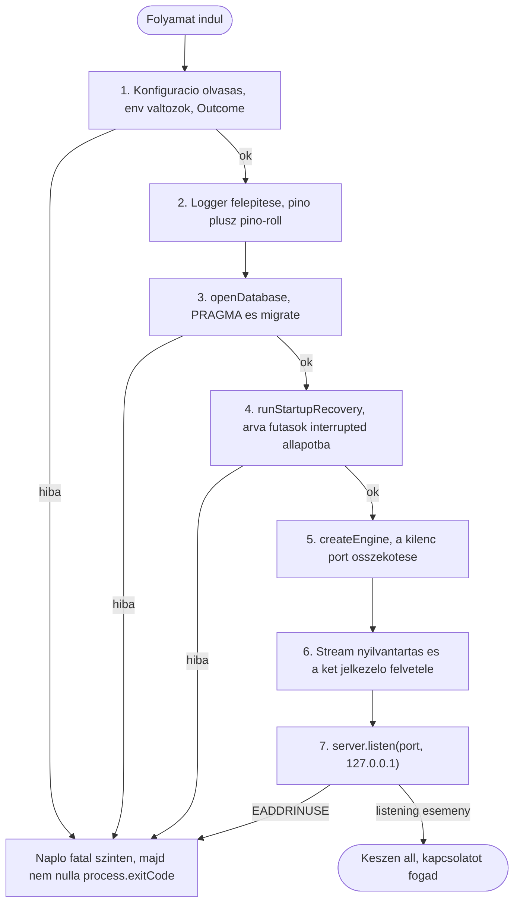
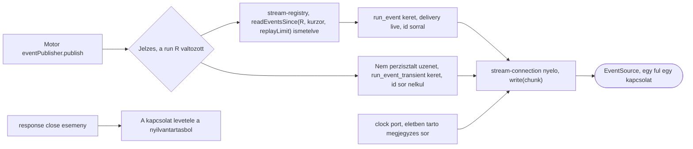
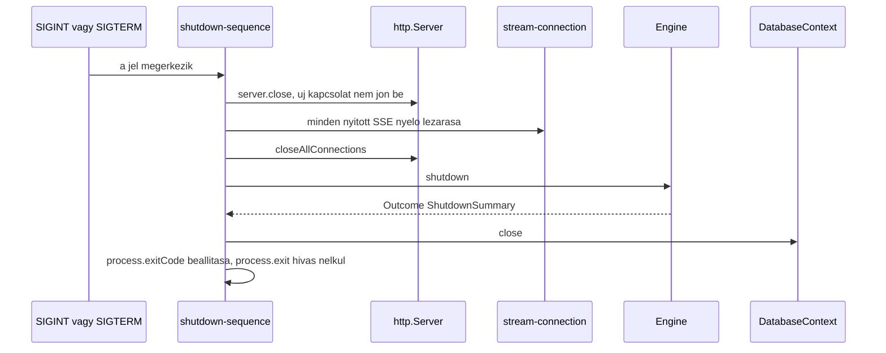

# SPEC-006: A szerver alkalmazás

|          |                                                                                                                                                                                                                                                                                                                                                                                                  |
| -------- | ------------------------------------------------------------------------------------------------------------------------------------------------------------------------------------------------------------------------------------------------------------------------------------------------------------------------------------------------------------------------------------------------ |
| Státusz  | tervezet                                                                                                                                                                                                                                                                                                                                                                                         |
| Dátum    | 2026-08-29                                                                                                                                                                                                                                                                                                                                                                                       |
| Előzmény | [`SPEC-005-api-protokoll.md`](SPEC-005-api-protokoll.md) (a REST és SSE kontraktus), [`SPEC-004-vegrehajto-motor.md`](SPEC-004-vegrehajto-motor.md) (a motor felülete, a kilenc port, az indulási helyreállítás), [`SPEC-003-domain-perzisztencia.md`](SPEC-003-domain-perzisztencia.md) (a kapcsolat nyitás, a migrációk), [`SPEC-002-csomag-architektura.md`](SPEC-002-csomag-architektura.md) |
| Kimenet  | az `apps/server` alkalmazás tizenöt új téma mappája, és a `packages/logger` csomag három téma mappája                                                                                                                                                                                                                                                                                            |
| Terv     | [`../plan/PLAN-007-szerver-alkalmazas.md`](../plan/PLAN-007-szerver-alkalmazas.md)                                                                                                                                                                                                                                                                                                               |

---

## 1. Cél és hatókör

### Amit eldönt

- Az `apps/server` alkalmazás felelősségét és határait: mi az, ami az összeállítás dolga, és mi az, ami a már kész rétegeké.
- Az indulás pontos, kötött sorrendjét, és lépésenként azt, mi történik hibánál: mit naplóz és milyen kilépési kóddal áll le.
- A HTTP réteget: hogyan képződik le a `protocol` csomag `ROUTE_TABLE` táblája tényleges kezelőkre, és hogy kell-e hozzá keretrendszer.
- Az SSE végpont szerver oldali állapotát: a feliratkozás kezelést, a `Last-Event-ID` feldolgozást, a pótlást az adatbázisból, az élő szórást, az életben tartást és a kliens eltűnésének kezelését.
- A leállás menetét `SIGINT` és `SIGTERM` esetén, a futó munkák, a nyitott streamek és az adatbázis kapcsolat sorrendjével.
- A naplózást: mit, milyen szinten, hova, milyen rotációval, és hogyan biztosítjuk, hogy titok soha ne kerüljön naplóba.
- A `packages/logger` csomag sorsát: a jelen spec építi meg, három téma mappával (7.1).
- A konfigurációt: mi jön env változóból, mi az adatbázisból, mi a kódból.
- A két csomag belső szerkezetét a SPEC-002 6. szekció téma konvenciója és a PLAN-004 3. szekció bontási kritériuma szerint.
- A tesztelés módját: hogyan tesztelhető egy HTTP szerver és egy SSE stream determinisztikusan, valós hálózat és valós API nélkül.
- A futtatás módját: hogy a Node natív type strippinggel közvetlenül a TypeScript forrást futtatja, és hogy ezt ma pontosan mi blokkolja (2. szekció M-2, 3.6).

### Amit NEM dönt el

- **Nem módosítja a `protocol`, az `engine`, a `db` és az `agent` csomag felületét.** A szerver ezekre a meglévő felületekre képez le, egyetlen új séma, egyetlen új motor metódus és egyetlen új repository metódus nélkül. Ahol ez a leképezés ma nem teljes, az a 12. szekcióban áll nyitott kérdésként, nem a felület csendes bővítéseként.
- **Nem implementálja a felületet.** Az `apps/web` és a `packages/ui` külön spec.
- **Nem dönt portról, fejlesztői originről, életben tartó gyakoriságról, rotációs méretről és retencióról.** Egyikre sincs dokumentált forrásunk, ezért egyikre sem adunk számot; mindegyik a 12. szekcióban áll, kimondott addigi viselkedéssel.
- **Nem vezet be hitelesítést.** A user 2. döntése szerint nincs bejelentkezés, nincs token, nincs munkamenet; a védelem kizárólag az, hogy a szerver a `127.0.0.1` címre köt (3.5).
- **Nem old meg olyan hiányzó rétegképességet, ami külön termékdöntést igényel.** A kifejezés kiértékelő és a sablon renderelő portnak ma nincs megvalósítása a repóban (M-9), a `providers` CRUD nem létezik, és az `expression_evaluator_unavailable` hibaág a SPEC-004 O-1 nyitott kérdése. A szerver ezeket nem találja ki, hanem a 6.6 szekció szerinti, kimondottan elutasító port implementációt adja.

### A user döntései, amiket ez a spec megvalósít

| #   | Döntés                                                                              | Hol valósul meg                                                          |
| --- | ----------------------------------------------------------------------------------- | ------------------------------------------------------------------------ |
| 1   | A szerver kizárólag a `127.0.0.1` címre köt, nincs bejelentkezés, token, munkamenet | 3.5, 5.2, és a 13. szekció 6 ... 9. kritériuma                           |
| 2   | A naplózás `pino` és `pino-roll`, fájl rotációval                                   | 7. szekció, és a 13. szekció 30 ... 36. kritériuma                       |
| 3   | Tilos `bun:` prefixű modul, tehát a HTTP szerver `node:http`                        | 5.1, és a 13. szekció 11. kritériuma                                     |
| 4   | Titok soha nem kerül naplóba, adatbázisba és gitbe                                  | 7.4, és a 13. szekció 33 ... 35. kritériuma                              |
| 5   | REST a CRUD-ra, SSE a real time eseményekre, egy fülön egy stream kapcsolat         | 5. és 6. szekció, a SPEC-005 kontraktusának szerver oldali megvalósítása |

## 2. Megerősített tények, forrással

Minden sor mögött hivatalos dokumentáció, élő registry lekérdezés vagy saját, a jelen munkamenetben futtatott mérés áll. Amire nincs forrás, az a 12. szekcióban áll nyitott kérdésként. A `docs/research/2026-08-26-toolchain.md` fájlban már rögzített verziószámokat itt nem ismételjük meg.

**Az M-31, M-32 és M-33 tény nem itt, hanem a 6.5 szekcióban áll**, mert csak ott, az élő szórás tárgyalása mellett érthető, hogy miért döntőek. A számozás folytonos, tehát a spec bizonyítékai `M-1` ... `M-33` azonosítón hivatkozhatók.

### 2.1 A futtató környezet

| #   | Tény                                                                                                                                                                                                                                                                                                                                                           | Forrás                                                                                                                                                                                                                               |
| --- | -------------------------------------------------------------------------------------------------------------------------------------------------------------------------------------------------------------------------------------------------------------------------------------------------------------------------------------------------------------- | ------------------------------------------------------------------------------------------------------------------------------------------------------------------------------------------------------------------------------------ |
| M-1 | A Node natív type strippingje **stabil**: _"Stability: 2 - Stable"_, és a History tábla szerint v25.2.0 és v24.12.0 óta az. A `--experimental-transform-types` kapcsolót a v26.0.0 **eltávolította**, a kikapcsoló kapcsoló neve ma `--no-strip-types`                                                                                                         | [Node.js, Modules: TypeScript](https://nodejs.org/api/typescript.html), [Node.js v26.0.0 kiadási jegyzék](https://nodejs.org/en/blog/release/v26.0.0)                                                                                |
| M-2 | A Node **megtagadja** a `node_modules` útvonal alatti TypeScript fájlok kezelését: _"To discourage package authors from publishing packages written in TypeScript, Node.js refuses to handle TypeScript files inside folders under a `node_modules` path."_ A hibakód `ERR_UNSUPPORTED_NODE_MODULES_TYPE_STRIPPING`, és nincs feloldó kapcsoló                 | [Node.js, Type stripping in dependencies](https://nodejs.org/api/typescript.html#type-stripping-in-dependencies), plusz a [nodejs/node#57215](https://github.com/nodejs/node/issues/57215) issue, "Closed as not planned" státusszal |
| M-3 | A `--preserve-symlinks` nélküli, alapértelmezett feloldás a szimlink célját, a valós lemez útvonalat használja azonosítóként: _"Node.js will dereference the link and use the actual on-disk 'real path' of the module as both an identifier and as a root path"_                                                                                              | [Node.js CLI, `--preserve-symlinks`](https://nodejs.org/api/cli.html#--preserve-symlinks)                                                                                                                                            |
| M-4 | **Saját mérés, Node v26.7.0, 2026-08-29.** Egy `node_modules` alatti szimlink, aminek a célja `node_modules`-on kívül esik, **nem** esik az M-2 tiltás alá: a type stripping lefut rajta. Ugyanaz az import `--preserve-symlinks` mellett `ERR_UNSUPPORTED_NODE_MODULES_TYPE_STRIPPING` hibát ad                                                               | saját mérés, `/tmp` alatti eldobható próbával; a viselkedés az M-3 általános szabályából következik, de **a type stripping és a szimlink viszonyát a Node doksi külön mondatban nem mondja ki**                                      |
| M-5 | **Saját mérés, Node v26.7.0, 2026-08-29, a repón.** Az `apps/server` munkakönyvtárból a `@easter-workflow-builder/protocol` és a `@easter-workflow-builder/provider-registry` csomag közvetlenül, build lépés nélkül betölthető. A `db`, az `engine` és az `agent` **nem**: `ERR_MODULE_NOT_FOUND`, `url: .../packages/typeguards/src/is-function/is-function` | saját mérés, `node --input-type=module -e "import ..."`, a repó módosítása nélkül                                                                                                                                                    |
| M-6 | **Saját mérés, ugyanaz a munkamenet.** Az M-5 oka pontosan tizenkét, kiterjesztés nélküli relatív import hat futásidejű forrásfájlban, kizárólag a `packages/typeguards/src` alatt; a workspace többi csomagjában nulla ilyen sor van                                                                                                                          | saját mérés, `grep -rEn "^(import\|export)[^;]*from '(\.\.?/[^']*)'"`, a `node_modules` könyvtárak kizárásával                                                                                                                       |
| M-7 | A Node ESM-ben a kiterjesztés kötelező: _"As in JavaScript files, file extensions are mandatory in `import` statements and `import()` expressions: `import './file.ts'`, not `import './file'`."_                                                                                                                                                              | [Node.js, Modules: TypeScript](https://nodejs.org/api/typescript.html)                                                                                                                                                               |
| M-8 | A teljes TypeScript támogatáshoz a Node egyetlen utat nevez meg: _"you can use a third-party package. These instructions use `tsx` as an example"_. Az `esbuild` és a `tsdown` a hivatalos Node oldalakon nem szerepel                                                                                                                                         | [Node.js, Full TypeScript support](https://nodejs.org/api/typescript.html#full-typescript-support)                                                                                                                                   |

### 2.2 A HTTP réteg

| #    | Tény                                                                                                                                                                                                                                                                   | Forrás                                                                                                                                                                                                                                      |
| ---- | ---------------------------------------------------------------------------------------------------------------------------------------------------------------------------------------------------------------------------------------------------------------------- | ------------------------------------------------------------------------------------------------------------------------------------------------------------------------------------------------------------------------------------------- |
| M-9  | A `node:http` modul dokumentációjában **nincs útvonalválasztó**: a teljes `http.md` forrásfájlban nulla találat a `router` és a `routing` szóra. A modul a `'request'` eseményt és a nyers `req.url`, `req.method` mezőt adja                                          | [Node.js HTTP](https://nodejs.org/api/http.html), a `doc/api/http.md` teljes szövegére futtatott keresés                                                                                                                                    |
| M-10 | A `URLPattern` globálisan v24.0.0 óta elérhető, de a stabilitása mindkét helyen _"Stability: 1 - Experimental"_. A `:param` szintaxis dokumentált: _"Named groups (`/books/:id`) which extract a part of the matched URL."_                                            | [Node.js, `URLPattern`](https://nodejs.org/api/url.html#class-urlpattern), [Node.js globals](https://nodejs.org/api/globals.html#class-urlpattern), [MDN URL Pattern API](https://developer.mozilla.org/en-US/docs/Web/API/URL_Pattern_API) |
| M-11 | A `host` elhagyása minden interfészre hallgatást jelent: _"If host is omitted, the server will accept connections on the unspecified IPv6 address (`::`) ... or the unspecified IPv4 address (`0.0.0.0`)"_. **Dokumentált alapértelmezett port nincs.**                | [Node.js net](https://nodejs.org/api/net.html#serverlistenport-host-backlog-callback)                                                                                                                                                       |
| M-12 | A `port` elhagyása vagy `0` értéke esetén az operációs rendszer oszt ki szabad portot: _"the operating system will assign an arbitrary unused port, which can be retrieved by using `server.address().port` after the `'listening'` event has been emitted"_           | ugyanott                                                                                                                                                                                                                                    |
| M-13 | A `server.requestTimeout` alapértéke `300000`, és kizárólag a **kérés** fogadását méri: _"Sets the timeout value in milliseconds for receiving the entire request from the client."_ A `server.headersTimeout` szintén csak a fejlécek fogadását                       | [Node.js HTTP](https://nodejs.org/api/http.html)                                                                                                                                                                                            |
| M-14 | A `server.keepAliveTimeout` alapértéke `5000`, és a számlálás **az utolsó válasz kiírása után** indul: _"after it has finished writing the last response"_. A `server.timeout` alapértéke `0`: _"Default: 0 (no timeout)"_                                             | ugyanott                                                                                                                                                                                                                                    |
| M-15 | A Node normálisan puffereli a fejléceket: _"For efficiency reasons, Node.js normally buffers the request headers until ... the first chunk of ... data is written."_ A `flushHeaders()` ezt megkerüli                                                                  | ugyanott, `response.flushHeaders()` és `request.flushHeaders()`                                                                                                                                                                             |
| M-16 | `Content-Length` nélkül a Node magától chunked kódolásra vált: _"If no `Content-Length` is set, data will automatically be encoded in HTTP Chunked transfer encoding ... The `Transfer-Encoding: chunked` header is added."_                                           | ugyanott                                                                                                                                                                                                                                    |
| M-17 | A `server.close()` csak az új kapcsolatokat tiltja és az idle kapcsolatokat zárja; a `server.closeAllConnections()` (v18.2.0) az aktívakat is: _"including active connections ... This is a forceful way of closing all connections and should be used with caution."_ | ugyanott                                                                                                                                                                                                                                    |
| M-18 | A kliens eltűnése két dokumentált úton derül ki: a `'close'` esemény (_"or its underlying connection was terminated prematurely"_), és a v26.1.0-ban bevezetett `message.signal` `AbortSignal`                                                                         | ugyanott, `response.on('close')` és `IncomingMessage.signal`                                                                                                                                                                                |
| M-19 | A foglalt port dokumentált jelzése a szerver `'error'` eseménye, `EADDRINUSE` kóddal: _"One of the most common errors raised when listening is `EADDRINUSE`."_                                                                                                         | [Node.js net](https://nodejs.org/api/net.html)                                                                                                                                                                                              |

### 2.3 Folyamat életciklus és naplózás

| #    | Tény                                                                                                                                                                                                                                                                                                        | Forrás                                                                                                                                                                                     |
| ---- | ----------------------------------------------------------------------------------------------------------------------------------------------------------------------------------------------------------------------------------------------------------------------------------------------------------- | ------------------------------------------------------------------------------------------------------------------------------------------------------------------------------------------ |
| M-20 | `SIGINT` és `SIGTERM` alapértelmezett kezelője nem Windowson `128 + jelszám` kóddal lép ki, és _"If one of these signals has a listener installed, its default behavior will be removed (Node.js will no longer exit)"_                                                                                     | [Node.js process, Signal events](https://nodejs.org/api/process.html)                                                                                                                      |
| M-21 | A Node saját ajánlása: _"Rather than calling `process.exit()` directly, the code *should* set the `process.exitCode` and allow the process to exit naturally."_ A `process.exit()` _"will force the process to exit as quickly as possible even if there are still asynchronous operations pending"_        | ugyanott                                                                                                                                                                                   |
| M-22 | A Node dokumentált kilépési kód táblájában az `1` jelentése _"Uncaught Fatal Exception"_. A `>128` a jel eredetű kilépés tartománya                                                                                                                                                                         | [Node.js, Exit codes](https://nodejs.org/api/process.html#exit-codes)                                                                                                                      |
| M-23 | A `pino.transport()` worker szálban fut, szemben a `pino.destination()` fő szálas működésével: _"`pino.destination` runs in the main thread, whereas `pino/file` sets up `pino.destination` in a worker thread"_                                                                                            | [pino, Transports](https://github.com/pinojs/pino/blob/main/docs/transports.md)                                                                                                            |
| M-24 | A worker szálas transport és a `process.exit()` ütközik: _"The new transports boot asynchronously and calling `process.exit()` before the transport starts will cause logs to not be delivered."_ A `transport()` `beforeExit` és `exit` listenert tesz fel, hogy a szabályos kilépéskor a puffer kiürüljön | ugyanott, plusz [pino API](https://github.com/pinojs/pino/blob/main/docs/api.md), `pino.transport()`                                                                                       |
| M-25 | A pino `redact` opció `censor` alapértéke `'[Redacted]'`, a `remove` alapértéke `false`, és az útvonal szintaxis támogatja a csillagot: _"paths may contain the asterisk `*` to denote a wildcard"_. A doksi figyelmeztet: _"WARNING: Never allow user input to define redacted paths."_                    | [pino, Redaction](https://github.com/pinojs/pino/blob/main/docs/redaction.md), [pino API](https://github.com/pinojs/pino/blob/main/docs/api.md)                                            |
| M-26 | A pino szintek numerikus értéke `trace` 10, `debug` 20, `info` 30, `warn` 40, `error` 50, `fatal` 60, `silent` `Infinity`, és a `level` alapértéke `'info'`                                                                                                                                                 | [pino API](https://github.com/pinojs/pino/blob/main/docs/api.md)                                                                                                                           |
| M-27 | A `logger.child(bindings)` dokumentált célja pontosan a kontextus rögzítése: _"key-value pairs can be pinned to a logger causing them to be output on every log line"_                                                                                                                                      | ugyanott                                                                                                                                                                                   |
| M-28 | **A `pino-roll` opciói közül csak az `extension` (`.log`) és a `symlink` (`false`) mezőnek van dokumentált alapértéke.** A `size`, a `frequency`, a `limit.count` és a `dateFormat` mellett a README nem ad "Default:" sort, tehát **nincs dokumentált rotációs méret és nincs dokumentált retenció**       | [pino-roll README](https://github.com/mcollina/pino-roll)                                                                                                                                  |
| M-29 | A `pino-roll` a `pino.transport({ target: 'pino-roll', options: { ... } })` alakot dokumentálja, és a `mkdir: true` opció kell, ha a napló könyvtár még nem létezik: _"the logger will throw an error unless you set `mkdir` to `true`"_                                                                    | ugyanott                                                                                                                                                                                   |
| M-30 | **Élő registry lekérdezés, 2026-08-29.** A `pino` `dist-tags.latest` értéke `10.3.1`, a `pino-roll` értéke `4.0.0`; a GitHub tag lista mindkettőre ugyanezt adja. Egyik csomag `package.json` fájljában sincs `engines` mező, és a `pino-roll` nem deklarál `peerDependencies` bejegyzést                   | `https://registry.npmjs.org/pino`, `https://registry.npmjs.org/pino-roll`, plusz `https://api.github.com/repos/pinojs/pino/tags` és `https://api.github.com/repos/mcollina/pino-roll/tags` |

### 2.4 Amit ezekből NEM következtetünk

- **Az M-4 nem verzióstabil garancia.** Egyetlen Node verzión mért viselkedés, amit a hivatalos doksi külön mondatban nem mond ki. Ezért lesz belőle gépi regressziós ellenőrzés (10.4) és nem csendes feltevés, és ezért tiltjuk meg a `--preserve-symlinks` kapcsolót (3.6).
- **Az M-13 és az M-14 együtt nem jelenti azt, hogy a Node soha nem szakít meg egy SSE választ.** Csak azt jelenti, hogy a négy dokumentált időkorlát közül egyik sem **erre** való: kettő a kérés fogadását méri, egy az utolsó válasz kiírása utáni tétlenséget, egy pedig alapból kikapcsolt. Hogy egy köztes réteg vagy a böngésző mennyi tétlenség után bont localhoston, arra nincs forrásunk, ezért az életben tartás gyakorisága nyitott kérdés marad (O-3, a SPEC-005 O-4 továbbvitele).
- **Az M-22-ből nem következik kilépési kód szótár.** Abból csak az következik, hogy az `1` érték dokumentált jelentése "fatális hiba". Fázisonként eltérő kilépési kódot ezért **nem** adunk: az kitalált szám lenne (4.4).
- **Az M-28-ból nem következik, hogy a `pino-roll` alapból nem rotál vagy nem töröl.** Abból csak az következik, hogy nincs dokumentált érték, amire hivatkozhatnánk, tehát mi sem adunk szállított értéket: mindkét mező a konfiguráció kötelező része (7.3, O-4).
- **Az M-10-ből nem következik, hogy a `URLPattern` alkalmatlan.** Abból az következik, hogy kísérleti stabilitási szinten áll, és a projekt szabálya szerint egy stabil, saját, kimerítően tesztelhető illesztő olcsóbb, mint egy kísérleti API-ra épülő függés (5.3).

## 3. Az alkalmazás felelőssége és határai

### 3.1 Az összeállítás helye, és semmi más

Az `apps/server` az L6 réteg, a függőségi gráf csúcsa: az egyetlen csomag, ahonnan minden alsóbb réteg látszik. Ebből egyetlen felelősség következik: **összeköti a kész rétegeket, és kiszolgálja a `protocol` csomag szerződését.** Üzleti logika nincs benne, mert nincs mit hozzátennie.

| Kérdés                                                   | Ki dönti el       | Miért nem a szerver                                                                                                                    |
| -------------------------------------------------------- | ----------------- | -------------------------------------------------------------------------------------------------------------------------------------- |
| melyik provider fut egy lépésen                          | `engine`          | a háromszintű feloldás a motor felelőssége, és a `startRun` már feloldott azonosítóval dolgozik (SPEC-004 11.1)                        |
| futtatható-e egy gráf                                    | `engine`          | a SPEC-004 4.7 tíz ellenőrzése a motorban áll, a szerver nem duplikálja                                                                |
| melyik lépés indul most                                  | `engine`          | az ütemező és a párhuzamossági szabályozó a motoré (SPEC-004 7.)                                                                       |
| mi az érvényes állapotváltás                             | `db`              | nevesített állapotváltók, compare and set feltétellel (SPEC-003 7.3)                                                                   |
| mi a drótszintű alak                                     | `protocol`        | egyetlen forrás, Zod sémából (SPEC-005 3.1)                                                                                            |
| melyik HTTP státusz tartozik egy hibakódhoz              | `protocol`        | a `httpStatusForErrorCode` tiszta függvény (SPEC-005 8.2)                                                                              |
| **melyik hibaosztály melyik hibakódra képződik**         | **`apps/server`** | ez a leképezés szándékosan a hívás helyén dől el, ahol tudható, melyik művelet melyik hibaosztályt hozhatja (SPEC-005 8.3 zárómondata) |
| **mi a port, a napló útvonal, a fejlesztői origin**      | **`apps/server`** | telepítési konfiguráció, ami nem a szerződés része                                                                                     |
| **mikor megy ki egy keret egy adott stream kapcsolatra** | **`apps/server`** | a feliratkozás készlet szerver oldali, memóriában élő állapot (SPEC-005 5.2)                                                           |

### 3.2 Mit tartalmaz a csomag

1. **A konfiguráció olvasását és validálását** env változóból, `Outcome` alakban, szállított alapérték nélkül.
2. **Az indulás és a leállás menetét**, kötött sorrendben, lépésenként kimondott hibaviselkedéssel.
3. **A motor kilenc portjának valós megvalósítását**, beleértve az órát, az azonosító generátort, a környezet olvasót és az esemény kiadót.
4. **A HTTP kiszolgálót** `node:http` felett, a `ROUTE_TABLE` alapján működő saját illesztővel.
5. **A 26 REST végpont kezelőjét**, mindegyiket a `protocol` sémájával validálva és a `db` vagy az `engine` felé továbbítva.
6. **Az SSE végpontot**, a feliratkozás nyilvántartással, a pótlással és az élő szórással.
7. **A hibaosztály leképezést** (SPEC-005 8.3 táblázat).

### 3.3 Mit nem tartalmaz, és miért

| Amit nem tartalmaz                                           | Miért                                                                                                                                                                                                                     |
| ------------------------------------------------------------ | ------------------------------------------------------------------------------------------------------------------------------------------------------------------------------------------------------------------------- |
| drótszintű típus vagy séma                                   | minden alak a `protocol` csomagból jön; egy szerver oldali másolat lenne a második forrás                                                                                                                                 |
| SQL, Drizzle tábla objektum, `better-sqlite3` szimbólum      | a `db` barrel ezeket nem is exportálja, és a `package.json` `exports` mezője csak a barrelre mutat, tehát mély import sincs (SPEC-003 9.1)                                                                                |
| ütemezés, provider választás, gráf validáció                 | a motoré (3.1). A szerver nem tud "gyorsabb utat" nyitni a motor megkerülésével, mert a `startRun`, az `interruptRun`, a `restartRun` és a `decideApproval` az egyetlen belépési pont ezekre a műveletekre (SPEC-005 4.2) |
| tömörítés a stream útvonalon                                 | dokumentáltan nem működik együtt az SSE-vel (SPEC-005 F-11), és egy explicit flush hívásokra épülő megoldás minden jövőbeli írási ponton kézi fegyelmen múlna (5.6)                                                       |
| hitelesítés, süti, munkamenet                                | a user 2. döntése; a védelem a `127.0.0.1` bind (3.5)                                                                                                                                                                     |
| statikus fájl kiszolgálás                                    | az `apps/web` felépített felületének kiszolgálása külön termékdöntés, ma nincs rá spec; a fejlesztői mód a Vite dev szerverét használja (5.7)                                                                             |
| bármilyen port, időkorlát, rotációs méret vagy retenció szám | nincs rá dokumentált forrás (12. szekció), és a projekt szabálya szerint forrás nélkül nem adunk számot                                                                                                                   |

### 3.4 Függőségi irány

A `package.json` `dependencies` mezője **nem változik**: `core`, `protocol`, `db`, `engine`, `agent`, `provider-registry`, `logger`, mind `workspace:*` alakban. A `devDependencies` a `@types/node`, a `typescript` és a `vitest` katalógus hivatkozásokkal áll, és a jelen spec keretében **nem bővül**. A `server` L6 marad, a `logger` L0.

**Új külső npm függőség kizárólag a `packages/logger` csomagba kerül:** a `pino` és a `pino-roll`, a `docs/research/2026-08-26-toolchain.md` fájlban már rögzített verziókkal (M-30). A `logger` L0, tehát workspace csomagtól nem függhet, és nem is fog.

### 3.5 Localhost, hitelesítés nélkül

**A user 2. döntése, és a szerver oldali következményei.**

1. **A `host` argumentum kötelező, és az értéke a kódban álló `'127.0.0.1'` literál.** A `host` elhagyása minden interfészre hallgatást jelent (M-11), tehát az elhagyás pontosan az a hiba, amit el akarunk kerülni.
2. **A cím nem konfigurálható.** Ha env változóból jönne, egy elgépelt vagy szándékosan átírt érték kinyitná a szervert a hálózatra, és a védelem egy környezeti változón múlna. A `127.0.0.1` a kódban áll, greppel ellenőrizhető kritériummal (13. szekció 6. pont), és `0.0.0.0`, `::` vagy hasonló érték a forrásban nem fordulhat elő.
3. **Nincs hova tenni hitelesítést, és ez szándékos.** A szerver nem olvas `Authorization` fejlécet, nem állít sütit, és nem ismer tokent. Ha valaha távoli elérés kell, az új spec, hitelesítéssel.
4. **A hibaüzenet nem visszhangozza a kapott értéket** (SPEC-005 8.4), és a napló sem (7.4).

### 3.6 Hogyan fut a szerver

**A szerver a TypeScript forrást futtatja, build lépés nélkül**, a Node natív, stabil type strippingjével (M-1). Ez nem új döntés: a `packages/*` csomagok `exports` mezője már ma a `./src/index.ts` fájlra mutat, és a `tooling/tsconfig/base.json` `noEmit` plusz `allowImportingTsExtensions` beállítása ezt írja elő (SPEC-001 V-1).

**A workspace szimlink nem esik az M-2 tiltás alá**, mert a Bun a `node_modules/@easter-workflow-builder/<név>` bejegyzést a `packages/<név>` könyvtárra mutató szimlinkként rakja le, és az alapértelmezett feloldás a szimlink célját használja (M-3, M-4).

**Ebből három kötött szabály következik:**

1. **A `--preserve-symlinks` kapcsoló tiltott**, mert mérés szerint pontosan ezt a működést töri el (M-4). Az `apps/server` egyetlen npm scriptje sem használhatja.
2. **Minden relatív import kiterjesztéssel áll** (M-7). A repó ezt ma egyetlen csomag kivételével betartja.
3. **A `packages/typeguards` tizenkét, kiterjesztés nélküli relatív importja blokkoló hiba** (M-5, M-6), amit a jelen spec hatókörében kell javítani, mielőtt bármilyen szerver kód íródna. Ez az egyetlen olyan pont, ahol a spec a saját csomagján kívül nyúl a repóhoz, és az indoka mérésből származik, nem ízlésből.

**Amit nem csinálunk:** nem vezetünk be `tsx` vagy más futtató réteget (M-8), és nem vezetünk be build lépést a könyvtárcsomagokba. Mindkettő megoldana egy problémát, ami a fenti három szabály mellett nem áll fenn, cserébe új függőséget vagy új artefaktumot hozna. Ha az M-4 viselkedés egy jövőbeli Node verzióban megváltozik, a 10.4 regressziós ellenőrzés elkapja, és akkor ez a döntés újranyílik.

## 4. Az indulás

### 4.1 A sorrend



**A sorrend kötött, és három ponton szerződés, nem ízlés:**

- **A konfiguráció olvasás az első**, mert a logger fájl útvonala is onnan jön. Amíg a konfiguráció nem áll, a szerver csak a szabványos hibakimenetre tud írni.
- **A helyreállítás a motor példányosítása ELŐTT fut**, és mindkettő a hálózati figyelés előtt. Ez a SPEC-004 10.1 kimondott szerződése: a `createEngine` már helyreállított `DatabaseContext` értéket vár, és a `startRun` nem indulhat a helyreállítás előtt. A `runStartupRecovery` a `db` réteg `recoverInterruptedRuns('startup_recovery')` hívását burkolja, szinkron, `Outcome` alakban.
- **A `listen` az utolsó.** Amíg a motor nincs kész, a szerver egyetlen kérést sem fogadhat, mert egy korán érkező `POST /api/workflows/{id}/runs` olyan futást indítana, aminek nincs mit átadni.

### 4.2 Lépésenként, mi fut és mi jön vissza

| #   | Lépés                | Mit hív                                                                    | Mit ad vissza                                    |
| --- | -------------------- | -------------------------------------------------------------------------- | ------------------------------------------------ |
| 1   | konfiguráció         | a `server-config` téma tiszta függvénye, bemenete a `process.env` másolata | `Outcome<ServerConfig>`                          |
| 2   | logger               | a `logger` csomag `createServerLogger`                                     | logger példány, mellékhatásként a napló könyvtár |
| 3   | adatbázis            | `openDatabase(filePath)`                                                   | `Outcome<DatabaseContext>`                       |
| 4   | helyreállítás        | `runStartupRecovery(database)`                                             | `Outcome<RecoverInterruptedRunsResult>`          |
| 5   | motor                | `createEngine(dependencies)`                                               | `Engine`, **nem** `Outcome` alakban              |
| 6   | stream és jelkezelők | a `stream-registry` létrehozása, `process.on('SIGINT'\|'SIGTERM')`         | nincs visszatérési érték                         |
| 7   | figyelés             | `server.listen(port, '127.0.0.1')`                                         | a `'listening'` vagy az `'error'` esemény        |

**Az adatbázis fájl útvonalát nem a szerver találja ki**: a `db` csomag `resolveDatabaseFilePath` függvénye adja, ami az `EASTER_DB_FILE` env változót olvassa, és annak hiányában a dokumentált fejlesztői alapértéket adja (SPEC-003). A szerver ezt a függvényt hívja, nem másolja le a szabályt.

**A `createEngine` nem `Outcome` alakú**, tehát ez a lépés nem tud "hibázni" a többi értelmében. Ez a motor szerződése, és a szerver nem burkolja be mesterségesen egy olyan hibaágba, ami logikailag sosem fut: a kizárás nélküli 100 százalékos lefedettségi küszöb ezt tiltja.

### 4.3 Mi történik, ha egy lépés hibázik

**Egyetlen szabály:** az indulás bármely lépésének hibája **végleges**. Nincs újrapróbálkozás, nincs részleges indulás, és nincs olyan állapot, amiben a szerver hallgat, de a motor nem áll.

| Lépés            | Naplózás                                                                | Erőforrás visszaadás                                        |
| ---------------- | ----------------------------------------------------------------------- | ----------------------------------------------------------- |
| 1. konfiguráció  | `fatal`, a **hiányzó vagy hibás env változó nevével**, az értéke nélkül | nincs mit visszaadni                                        |
| 2. logger        | szabványos hibakimenetre, mert még nincs logger                         | nincs mit visszaadni                                        |
| 3. adatbázis     | `fatal`, az `Outcome` üzenetével, ami tartalmazza a hibaosztály nevét   | az `openDatabase` maga zár, ha a migráció bukott (SPEC-003) |
| 4. helyreállítás | `fatal`, az `Outcome` üzenetével                                        | `database.close()`                                          |
| 5. motor         | nincs hibaág                                                            | nincs                                                       |
| 6. jelkezelők    | nincs hibaág                                                            | nincs                                                       |
| 7. figyelés      | `fatal`, a hiba kódjával (`EADDRINUSE` esetén a **portszámmal**, M-19)  | `database.close()`, és a stream nyilvántartás ürítése       |

### 4.4 A kilépési kód

**Egyetlen, nem nulla kilépési kód van: az `1`.** Ennek dokumentált jelentése a Node saját tábláján "Uncaught Fatal Exception" (M-22), ami pontosan az az eset, amiben vagyunk: a folyamat nem tudja teljesíteni a feladatát.

**Fázisonként eltérő kilépési kódot szándékosan nem adunk.** Egy "2 = adatbázis hiba, 3 = port foglalt" szótár kitalált szám lenne, amire nincs forrásunk, és amit a projekt szabálya tilt. Amit a hívó tudni akar, azt a napló utolsó `fatal` sora mondja meg, nem egy szám.

**A kilépés `process.exitCode` beállításával történik, soha nem `process.exit()` hívással.** Két, egymástól független forrás mondja ugyanezt: a Node saját ajánlása (M-21), és a pino figyelmeztetése, hogy a `process.exit()` a worker szálas transport indulása előtt naplóvesztést okoz (M-24). Ha a `process.exit()` megengedett lenne, pontosan az a `fatal` sor veszne el, ami miatt kilépünk.

## 5. A HTTP réteg

### 5.1 Nincs keretrendszer, és ez indokolt döntés

**A HTTP szerver a Node beépített `node:http` modulja.** A `bun:` prefixű modul a projektben tiltott, tehát a `Bun.serve` eleve kizárt.

**Keretrendszert nem veszünk fel.** Négy, egymástól független érv, mindegyik forrással:

1. **Az útvonal tábla már létezik, és egy forrásból jön.** A `packages/protocol` `ROUTE_TABLE` konstansa mind a 26 végpont metódusát és `:paramNév` alakú sablonját tartalmazza, `as const satisfies` alakban, és a `RouteId` unió a kulcsaiból következik. Egy keretrendszer routere a végpontokat **másodszor** deklarálná, a saját `app.get('/api/workflows/:workflowId', ...)` hívásaiban, és a két lista elcsúszhatna. Pontosan ezt a szétcsúszást tiltja a SPEC-005 3.1.
2. **Amit a keretrendszer adna, arra nincs szükségünk.** Middleware lánc, tömörítés, sablon motor, sütikezelés, statikus fájl kiszolgálás, hitelesítés: a tömörítés a stream útvonalon **tiltott** (SPEC-005 F-11), hitelesítés nincs (3.5), sablon és süti nincs, statikus kiszolgálás nincs (3.3).
3. **A `node:http` valóban nem ad routert** (M-9), tehát az illesztést meg kell írni. A tényleges munka viszont pontosan annyi, amennyit a 5.3 leír: egy tiszta függvény, ami metódus és útvonal szegmens lista alapján illeszt a `ROUTE_TABLE` bejegyzéseire. Ez kimerítően tesztelhető, és nincs benne kitalálható viselkedés.
4. **A `URLPattern` alternatíva sem kell.** Globálisan elérhető és `:param` szintaxist tud (M-10), de kísérleti stabilitási szinten áll, tehát egy jövőbeli verzióban változhat. Egy huszonhat soros saját illesztő ennél olcsóbb.

**Ebből következik, hogy a `package.json` `dependencies` mezője nem bővül**, és nem kell élő npm lekérdezés és két független forrás egy új csomag verziójához: nincs új csomag. Ha ez a döntés valaha megfordul, a keretrendszer felvétele **külön, forrásolt lépés** lesz, a `docs/research/2026-08-26-toolchain.md` átvezetésével.

### 5.2 A kérés útja, végponttól végpontig

1. **Kapcsolat fogadás.** A `node:http` szerver a `127.0.0.1` címen hallgat (3.5).
2. **Útvonal illesztés.** A `route-dispatch` téma a metódusból és az útvonalból `RouteId` értéket és paraméter rekordot ad, vagy megmondja, hogy nincs találat.
3. **Kérés törzs olvasás.** JSON törzset váró végpontnál a szerver összeolvassa a törzset, majd `JSON.parse` helyett egy `Outcome` alakú, nem dobó dekódolóval alakítja értékké.
4. **Validáció.** Az útvonal paraméter, a query string és a törzs a `protocol` megfelelő sémáján megy át, `.safeParse()` hívással (SPEC-005 7.4).
5. **Kiszolgálás.** A kezelő a `db` repository vagy az `engine` metódusát hívja, és `Outcome` értéket kap.
6. **Válasz.** Siker esetén a séma típusából épített objektum megy ki JSON alakban, **futásidejű újravalidálás nélkül** (SPEC-005 7.4). Hiba esetén a 5.5 leképezés adja a kódot, és a `httpStatusForErrorCode` a státuszt.

**A kimenő oldalon nem validálunk.** Ez nem kényelmi döntés: egy kimenő séma ellenőrzés olyan hibaágat hozna létre, ami logikailag sosem fut, és a kizárás nélküli lefedettségi küszöb ezt tiltja.

### 5.3 Az útvonal illesztés

**A `ROUTE_TABLE` az egyetlen forrás.** Az illesztő tiszta függvény, ami a bejövő `method` és `pathname` értéket a tábla bejegyzéseivel veti össze, szegmensenként:

- a sablon és az útvonal szegmens száma egyezik-e;
- minden nem `:` kezdetű szegmens szó szerint egyezik-e;
- minden `:paramNév` szegmens értéke bekerül-e a paraméter rekordba.

**Három kimenet van, és mindhárom kimondott:**

| Eset                                                      | Válasz                                                                        |
| --------------------------------------------------------- | ----------------------------------------------------------------------------- |
| pontosan egy bejegyzés illeszkedik metódusra és útvonalra | a `RouteId` és a paraméter rekord, a kezelő fut                               |
| az útvonal illeszkedik, de a metódus nem                  | `405`, `Allow` fejléccel, ami az adott útvonalon engedett metódusokat sorolja |
| az útvonal nem illeszkedik egyetlen bejegyzésre sem       | `404`, `not_found` kóddal, a `ProtocolErrorBody` alakban                      |

**A `405` státusz nem a `ProtocolErrorCode` szótárból jön**, mert az öt értékű, zárt szótárban nincs "method not allowed" (SPEC-005 8.2). Ez nem hiányosság: a `405` nem a domain hibája, hanem a HTTP protokoll szintje, ugyanúgy, ahogy a `404` az ismeretlen útvonalra. A törzs mindkét esetben `ProtocolErrorBody` alakú, a `not_found` kóddal, hogy a kliensnek ne kelljen két hiba alakot ismernie (SPEC-005 8.1).

**A `STREAM_PATH` nincs a `ROUTE_TABLE` táblában** (a `protocol` csomag ezt szándékosan így deklarálja), tehát az illesztő előtt egy külön ág vezeti a stream végpontot. Ez a rend nem véletlen: a stream nem REST végpont, más a válasz típusa, más az életciklusa, és a tömörítés tilalma is csak rá vonatkozik (5.6).

### 5.4 A kérés törzs olvasása

- **Csak `application/json` törzset fogadunk el**, a stream végpontot kivéve, aminek nincs törzse.
- **A törzs beolvasása darabokból megy**, és a `JSON.parse` hívás soha nem áll csupaszon: a dekódoló `Outcome` alakot ad, mert egy hibás JSON a hálózatról érkezik, tehát várható eset, nem programhiba.
- **Hibás JSON esetén `400`, `invalid_request` kóddal**, és a hibaüzenet **nem tartalmazza a kapott törzset** (SPEC-005 8.4).
- **A törzs méretére nincs szállított korlát.** Nincs rá forrásunk, tehát számot nem adunk; ez nyitott kérdés (O-5), a "mi a viselkedés addig" mezővel.

### 5.5 A hibaosztály leképezés

A SPEC-005 8.3 táblázatának megvalósítása a szerver dolga. A leképezés tiszta függvény: bemenete az `Outcome` hibaága által hordozott üzenet, kimenete `ProtocolErrorCode`.

**Hogyan ismerjük fel a hibaosztályt.** Az `Outcome` hibaága kizárólag szöveget hordoz, és a hibaosztály neve **zárójelben, szó szerint** áll az üzenetben (SPEC-005 F-22). A leképezés ezért a zárójelben álló nevet keresi, nem az üzenet más részét, és nem részstringet illeszt az egész üzenetre. Ez szándékosan szigorú: egy laza illesztés egy magyar hibaüzenet szövegére véletlenül is találhatna.

**A be nem sorolt eset `internal` kódot kap** (SPEC-005 8.3 utolsó sora). Ez a szabály nem enged kivételt: egy ismeretlen nevű hibaosztály nem kaphat kedvezőbb kódot, mint egy besorolt.

**Amit a szerver soha nem tesz:** nem továbbít verem nyomkövetést, SQL utasítást, fájl útvonalat, env változó értéket vagy a kliens által küldött, elutasított értéket (SPEC-005 8.4). Erre a naplózás oldalán ugyanaz a szabály áll (7.4).

### 5.6 A fejlécek, és ami tilos

| Fejléc vagy réteg    | REST végpontokon                | A stream végponton                                                                   |
| -------------------- | ------------------------------- | ------------------------------------------------------------------------------------ |
| `Content-Type`       | `application/json`              | `text/event-stream`, karakterkódolás megadása nélkül (SPEC-005 F-6)                  |
| `Content-Length`     | ismert, tehát megadható         | **nincs**, tehát a Node chunked kódolásra vált (M-16)                                |
| tömörítés            | ma nincs, mert nincs rá döntés  | **tiltott**, greppel ellenőrizhető kritériummal (SPEC-005 F-11, 13. szekció 21.)     |
| `Cache-Control`      | nincs döntés, ezért nem küldünk | `no-cache`, mert egy köztes gyorsítótár a folyamot értelmetlenné tenné               |
| a fejlécek kiürítése | a válasszal együtt megy         | **`flushHeaders()` kötelező**, mert a Node normálisan pufferel az első adatig (M-15) |

**A státusz a stream végponton mindig `200`**, akkor is, ha a `streamId` ismeretlen (SPEC-005 5.5 1. pont). Ha `404`-et adnánk, a böngésző véglegesen feladná az újracsatlakozást (SPEC-005 F-7), és a felhasználó számára a transcript ok nélkül tűnne el.

### 5.7 CORS és a fejlesztői origin

**Éles használatban nincs CORS**, mert a felület és az API azonos originről jön.

**Fejlesztéskor a stream kapcsolat más originről érkezik**, mert a Vite dev szerver és a backend külön porton áll, és a stream szándékosan nem megy a proxyn át (SPEC-005 5.8). Ezért:

1. **A CORS engedély kizárólag a `STREAM_PATH` útvonalra vonatkozik**, és kizárólag akkor, ha a konfiguráció megnevez egy fejlesztői origint. Ha nem nevez meg, a szerver egyetlen CORS fejlécet sem küld.
2. **Az engedélyezett origin pontosan egy, konfigurált érték**, nem minta és nem csillag. A csillag azért kizárt, mert az bármely weboldalnak megnyitná a felhasználó helyi futásainak transcriptjét.
3. **A `withCredentials` hamis marad** (SPEC-005 3.5 4. pont), tehát `Access-Control-Allow-Credentials` fejléc nincs.
4. **A fejlesztői origin konkrét értékére nincs forrásunk**, ezért számot és sztringet nem adunk: kötelező env változó, alapérték nélkül (O-1).

## 6. Az SSE végpont

### 6.1 A szerver oldali állapot



**Két, egymástól elválasztott téma.**

| Téma                | Mit tart nyilván                                                                                                                               | Mit nem tud                                           |
| ------------------- | ---------------------------------------------------------------------------------------------------------------------------------------------- | ----------------------------------------------------- |
| `stream-registry`   | `streamId` -> feliratkozás lista (futásonként padló és lapméret), futásonként az utoljára kiküldött esemény azonosító, és a `serverInstanceId` | nem ismer `ServerResponse` objektumot, nem ír bájtot  |
| `stream-connection` | egy nyitott kapcsolat: a nyelő, a keret kiírás, a `Last-Event-ID` feldolgozás, az életben tartás időzítése                                     | nem tud a többi kapcsolatról, és nem olvas adatbázist |

**A nyilvántartás memóriában él, és a folyamattal együtt vész el.** Ez szándékos: a `serverInstanceId` pont ezt a tényt teszi láthatóvá a kliensnek (SPEC-005 5.2). Az azonosítót a szerver induláskor egyszer generálja, az `idGenerator` porton át, tehát a teszt determinisztikus.

### 6.2 A feliratkozás kezelés

1. **A kliens generálja a `streamId` értéket**, és a `GET /events?streamId=...` kapcsolat felépítésekor a szerver a nyilvántartásban megkeresi. **Ismeretlen azonosító nem hiba**: üres feliratkozású bejegyzés jön létre (SPEC-005 5.5 1. pont).
2. **Az első keret mindig `stream_ready`**, a `streamId`, a `serverInstanceId` és a megtalált feliratkozás lista mezőkkel.
3. **A `PUT /api/streams/{streamId}/subscriptions` teljes cserét végez** (SPEC-005 4.2 F táblázat). A kérés a kívánt teljes állapotot írja le, tehát a szerver a különbséget maga számolja: az újonnan felvett futásokra pótol, az elhagyottak keretei onnantól nem mennek ki.
4. **A padló futásonként rögzül**, a kérés `fromEventId` mezőjéből, és a pótlás mindig `id > max(padló, kurzor)` feltétellel indul. A számítás a `protocol` csomag `resolveReplayCursor` tiszta függvénye, tehát a szerver nem írja meg másodszor.
5. **A lapméret a kérés `replayLimit` mezője**, kötelezően (SPEC-005 F-19). A szerverben nincs szállított lapméret.

**Ha a `PUT` olyan `streamId` értékre érkezik, amihez nincs nyitott kapcsolat**, a feliratkozás akkor is rögzül: a kliens a kapcsolat felépítése előtt is beállíthatja, és a `stream_ready` keret ezt fogja visszatükrözni. Ez a sorrend független kezelés az oka annak, hogy a feliratkozás nem az URL-ben van.

### 6.3 A `Last-Event-ID` feldolgozás

1. **A böngésző magától küldi**, ha a last event ID string nem üres (SPEC-005 F-1). A szerver nem kéri, és nem tárolja el a kliens helyett.
2. **A szerver az értéket egészre szűkíti.** Nem egész érték esetén **nem hibázik el a kapcsolat**: a szerver úgy tekinti, mintha a fejléc nem érkezett volna, tehát a feliratkozás padlójától pótol, és **egy `protocol_error` keretet küld** a kapcsolat fenntartásával (SPEC-005 5.6 2. pont, 26. kritérium). Az ok: a transcript elvesztése aránytalan büntetés egy elrontott fejlécért.
3. **A `protocol_error` keret `runId` mezője ebben az esetben `null`**, mert a hiba kapcsolat szintű, nem egyetlen futáshoz köthető; a `protocol` séma ezt a mezőt szándékosan nullable alakban deklarálja.

### 6.4 A pótlás

**A pótlás futásonként megy, nem globálisan.** Minden újonnan felvett futásra:

1. `readEventsSince(runId, max(padló, kurzor), replayLimit)` hívás, **ismételve, amíg a lap tele jön vissza** (SPEC-005 5.6 3. pont).
2. Minden sor egy `run_event` keret, `delivery: 'replayed'` jelöléssel és `id:` sorral.
3. A futás pótlásának végén egy `replay_complete` keret, `throughEventId` mezővel; **nulla pótolt esemény esetén is**, `null` értékkel (SPEC-005 28. kritérium).

**A futások közötti sorrendet a szerver nem ígéri**, csak a futáson belülit (SPEC-005 5.6 zárómondata). Ezt kimondjuk, mert a kliens nem építhet globális sorrendre a pótlási szakaszban.

**A pótlás alatt érkező élő eseményt a szerver nem dobja el.** Mivel a pótlás az adatbázisból megy, egy közben beírt sor vagy még benne van az utolsó lapban, vagy a kurzoron túl marad, és a következő szórásnál megy ki. Duplikátum nem keletkezik, mert a kurzor szigorúan monoton nő.

### 6.5 Az élő szórás

**A motor kétféle üzenetet ad az `eventPublisher` porton, és a port bemenete `unknown`.** Ez mérésből ismert (M-31, alább):

- **motor eredetű `EngineEvent`**, amit az `emitEngineEvent` publikál, közvetlenül az `appendEngineEvent` sikeres írása után;
- **`AgentStreamMessage`**, azaz nyers SDK üzenet, amit a `run-agent-step` publikál, az `appendSdkEvent` hívása után, **függetlenül attól, hogy az `written` vagy `skipped` eredményt adott**.

| #    | Tény                                                                                                                                                                                                                           | Forrás                                                                                                                                  |
| ---- | ------------------------------------------------------------------------------------------------------------------------------------------------------------------------------------------------------------------------------ | --------------------------------------------------------------------------------------------------------------------------------------- |
| M-31 | Az `EventPublisherPort` alakja `publish(event: unknown): void`, és a kiadott érték vagy `EngineEvent` (`kind`, `runId`, `stepRunId`, `payload` mezőkkel), vagy `AgentStreamMessage` (`runId`, `stepRunId`, `message` mezőkkel) | `packages/engine/src/engine-port/event-publisher-port.ts`, `.../node-executor/emit-engine-event.ts`, `.../agent-step/run-agent-step.ts` |
| M-32 | **A kiadott érték egyik alakja sem hordozza a `run_event.id` értéket.** Az `appendEngineEvent` visszaadja az `eventId` mezőt, de az `emitEngineEvent` eldobja, és a `publish` hívásba nem kerül bele                           | `packages/engine/src/engine-event/write-engine-event.ts`, `.../node-executor/emit-engine-event.ts`                                      |
| M-33 | Az `AppendSdkEventResult` alakja `{ status: 'written'; eventId: number } \| { status: 'skipped' }`, tehát az azonosító a `db` oldalon létezik, de nem jut el a publikálásig                                                    | `packages/db/src/run-event/event-record/run-event-repository.ts`                                                                        |

**Az M-32 következménye a jelen spec legfontosabb tervezési kényszere.** A SPEC-005 5.6 rajza egy `delivery: 'live'` jelölésű `run_event` keretet mutat `id: 121` sorral, de a publikált érték nem tartalmazza az azonosítót. Ebből következik a **jelzés és lecsapolás** minta:

1. A publikált érték a szerver számára **jelzés**: "a `runId` futáshoz új adat kerülhetett az adatbázisba".
2. A `stream-registry` erre lecsapolja az adatbázist ugyanazzal a hívással, amivel a pótlás megy: `readEventsSince(runId, utolsóKiküldött, replayLimit)`, ismételve, amíg a lap tele jön.
3. Minden így kapott sor `run_event` keretként megy ki, `delivery: 'live'` jelöléssel és `id:` sorral. A kurzor ugyanaz, mint a pótlásé, tehát a szerver nem vezet két nyilvántartást.
4. **Ez nem lassít és nem kér új adatbázis képességet:** a `readEventsSince` a `run_event` tábla elsődleges kulcsán megy, és a motor a `publish` hívást szigorúan az írás **után** teszi, tehát a lecsapolás mindig megtalálja a sort.

**Amit ez a minta nem old meg, és amit ezért nyitva jelölünk (O-6).** A perzisztálatlan delta (`sdk_stream_event`, kikapcsolt kapcsoló) nem hagy sort, tehát a lecsapolás nem találja meg, és `run_event_transient` keretként kellene kimennie. A publikált `AgentStreamMessage` viszont nem mondja meg, hogy az `appendSdkEvent` `written` vagy `skipped` eredményt adott (M-33). A kettő megkülönböztetése ma csak a lecsapolás eredményéből következtethető, ami párhuzamosan futó lépéseknél nem pontos.

### 6.6 Az életben tartás és a kliens eltűnése

**Az életben tartás egy megjegyzés sor**, tehát olyan keret, aminek nincs `event:` és nincs `id:` mezője, és így a kliens last event ID értékét nem mozdítja el (SPEC-005 F-3, F-4).

**Az időzítés a `clock` porton megy, soha nem közvetlen `setInterval` hívással** (SPEC-005 10.2 1. pont). Ebből következik, hogy a teszt léptethető, valós várakozás nélkül.

**A gyakoriságra nincs forrásunk** (2.4, M-13, M-14), ezért számot nem adunk: kötelező konfiguráció, alapérték nélkül (O-3).

**A kliens eltűnése.** A dokumentált út a válasz `'close'` eseménye (M-18). A szerver erre:

1. leveszi a kapcsolatot a nyilvántartásból;
2. leállítja az életben tartó időzítést;
3. **a feliratkozást NEM törli**, mert a böngésző magától újracsatlakozik ugyanarra a `streamId` értékre, és a feliratkozás elvesztése azt jelentené, hogy a kliensnek minden szakadás után újra kellene küldenie a `PUT` hívást.

**Amit szándékosan nem használunk:** az `IncomingMessage.signal` (M-18) csak v26.1.0 óta létezik, és ugyanazt a tényt adja, mint a `'close'` esemény, ami v0.6.7 óta stabil. A régebbi, szélesebb körben dokumentált utat választjuk.

## 7. A naplózás és a `logger` csomag

### 7.1 A `logger` csomagot a jelen spec építi meg

**Döntés: nem kap külön specifikációt.** Három érv:

1. **Egyetlen fogyasztója van.** A `logger` L0, és ma egyedül az `apps/server` deklarálja függőségként. Egy csomag, aminek a szerződését az egyetlen fogyasztója szabja meg, nem tud önállóan eldönteni semmit.
2. **Amit a csomagnak tudnia kell, azt a jelen spec dönti el.** Mit naplózunk, milyen szinten, milyen kontextussal, mit maszkolunk: mind a 7.2 ... 7.4 szekcióban áll. Egy külön spec ezeket a döntéseket vagy megismételné, vagy visszahivatkozna ide.
3. **A csomag mérete nem indokol külön specet.** Három téma mappa, a 9.2 szerint.

**Amit ez a döntés nem jelent:** nem azt, hogy a `logger` a szerver almappája lenne. Külön csomag marad, L0 rétegen, saját `CLAUDE.md` fájllal, mert a napló formátumára és a maszkolásra vonatkozó szabályok a szervertől függetlenül is érvényesek, és egy jövőbeli második fogyasztó (például egy karbantartó parancssori eszköz) ugyanazt a maszkolást fogja igényelni.

### 7.2 Mit naplózunk, és milyen szinten

A szintek a pino dokumentált értékei (M-26). A `level` alapértéket **nem állítjuk be a kódban**: ha a konfiguráció nem nevez meg szintet, a pino saját, dokumentált `'info'` alapértéke érvényesül. Ez az egyetlen hely a specben, ahol alapértéket használunk, és azért megengedett, mert az érték **dokumentált**, nem általunk kitalált.

| Szint   | Mit naplózunk ide                                                                                                                                      |
| ------- | ------------------------------------------------------------------------------------------------------------------------------------------------------ |
| `fatal` | az indulás bármely lépésének hibája (4.3), ami után a folyamat kilép                                                                                   |
| `error` | minden `internal` kódra képződő hiba (5.5), tehát a be nem sorolt hibaosztályok; és a stream nyelő írási hibája                                        |
| `warn`  | a `conflict` és az `unprocessable` kódra képződő hiba, tehát az érvényes kérés, amit a domain elutasított; és a nem egész `Last-Event-ID`              |
| `info`  | az indulás lépéseinek sikere, a figyelt cím és port, a helyreállított futások száma, a szabályos leállás lépései, a stream kapcsolat nyitása és zárása |
| `debug` | végpontonként a kérés metódusa, a `RouteId`, a válasz státusza és az eltelt idő; a keret kiírás darabszáma futásonként                                 |
| `trace` | nem használjuk, mert nincs olyan esemény, ami ennél részletesebb lenne, és a kimenet mérete nőne indok nélkül                                          |

**Kontextus.** Minden kéréshez tartozik egy gyermek logger (M-27), aminek a rögzített mezői: a `serverInstanceId`, a kérés azonosítója (az `idGenerator` porton generálva), a `RouteId` és, ahol értelmezett, a `runId`. **A kérés azonosítója nem a klienstől jön**, mert egy klienstől kapott azonosító tetszőleges tartalmat vinne a naplóba.

**Amit nem naplózunk semmilyen szinten:** a kérés törzsét, a válasz törzsét, az SSE keretek tartalmát, és a `run_event` payload mezőt. Egyik sem hozna olyan információt, amit a transcript ne mutatna meg, cserébe mindegyik hordozhat modell kimenetet, tehát felhasználói adatot.

### 7.3 Hova és milyen rotációval

**A cél fájl rotációval**, a `pino.transport({ target: 'pino-roll', options: { ... } })` dokumentált alakban (M-29), és a `mkdir: true` opcióval, mert a napló könyvtár nem feltétlenül létezik.

**Nincs szállított rotációs méret és nincs szállított retenció.** A `pino-roll` sem ad dokumentált alapértéket a `size` és a `limit.count` mezőre (M-28), tehát nem tudunk hivatkozni értékre, és nem is találunk ki egyet. Mindkettő **kötelező konfiguráció**, alapérték nélkül (O-4). A `frequency` mezőre ugyanez áll.

**A napló könyvtár útvonala kötelező env változó**, alapérték nélkül (O-2). Az adatbázis fájllal ellentétben itt nincs olyan dokumentált fejlesztői alapérték, amire hivatkozhatnánk.

**A worker szálas transport ára kimondva.** A `pino.transport()` worker szálban fut (M-23), és a `process.exit()` hívás naplóvesztést okoz (M-24). Ez a második, független érv amellett, hogy a szerver soha nem hívja a `process.exit()` függvényt (4.4), és hogy a leállás menetében a napló ürítése az utolsó lépés (8.2).

### 7.4 Titok soha nem kerül naplóba

A projekt szabálya (`.claude/CLAUDE.md` 9.). Ezt **négy, egymástól független réteg** biztosítja, mert egyetlen réteg megkerülhető.

1. **A `redact` opció**, dokumentált útvonal szintaxissal és csillag támogatással (M-25). A maszkolt útvonalak: az `authorization` és az `x-api-key` fejléc, bármilyen betűzéssel, plusz minden olyan mező, aminek a neve tokent, kulcsot vagy titkot nevez meg. A helyettesítő érték a pino dokumentált alapértéke, `'[Redacted]'`, tehát mi nem adunk saját sztringet.
2. **Egy érték szintű törlő**, ami a napló sorba kerülő minden sztringben lecseréli a konfigurációból ismert, titkot hordozó env változók **értékét**. Ez a védelem azért kell, mert a `redact` mezőnév alapján dolgozik, egy hibaüzenet viszont az üzenet **szövegében** hordozhat kulcsot. Ez ugyanaz a minta, mint a `tools/wire-probe` csomag maszkolása (`.claude/CLAUDE.md` 9.), és ugyanúgy a lemezre írás **előtt**, memóriában fut.
3. **A napló nem lát olyan adatot, amiben titok lehet.** A 7.2 utolsó bekezdése kizárja a kérés és a válasz törzsét, tehát a leggyakoribb szivárgási út eleve zárva van.
4. **A konfiguráció maga sem naplózódik értékkel.** Az induláskor kiírt `info` sor az env változók **nevét** és a "be van állítva" tényt közli, sosem az értéket. Kivétel a napló könyvtár és a port, mert ezek nem titkok, és a hibakeresés nélkülük vak.

**Kritérium, nem ígéret:** a `packages/logger` csomagban van olyan teszt, ami egy titkot tartalmazó objektumot és egy titkot a **szövegében** hordozó hibaüzenetet ad a loggernek, és a nyelőre írt bájtsorozatban a titok egyetlen előfordulását sem találja meg.

## 8. A leállás

### 8.1 A menet



### 8.2 Lépésenként, és miért ebben a sorrendben

| #   | Lépés                          | Miért itt                                                                                                                                                                                                                                  |
| --- | ------------------------------ | ------------------------------------------------------------------------------------------------------------------------------------------------------------------------------------------------------------------------------------------ |
| 1   | jelkezelő fut le               | Ha van listener, a Node alapértelmezett viselkedése megszűnik, tehát a folyamat **nem** lép ki magától (M-20). A kilépés a mi dolgunk lesz.                                                                                                |
| 2   | `server.close()`               | Új kapcsolat nem jön be, és az idle kapcsolatok lezárulnak (M-17). Az aktív SSE kapcsolatokat ez **nem** zárja, ezért kell a 3. és a 4. lépés.                                                                                             |
| 3   | minden SSE nyelő lezárása      | A stream kapcsolatok soha nem járnak le maguktól, tehát a `server.close()` visszahívása nélkülük soha nem futna le. A nyilvántartás ürül.                                                                                                  |
| 4   | `server.closeAllConnections()` | A dokumentáció szerint erőszakos, és óvatosságot kér (M-17). Itt indokolt: a 3. lépés után csak olyan kapcsolat maradhat, ami félbeszakadt kérést hordoz, és arra várni a leállást akadályozná.                                            |
| 5   | `engine.shutdown()`            | **A motor a HTTP réteg után áll le**, mert amíg fogadhatunk kérést, addig új futás indulhatna a leálló motorba. A `shutdown` minden aktív futást leállít, majd `recoverInterruptedRuns('graceful_shutdown')` hívással zár (SPEC-004 10.2). |
| 6   | `database.close()`             | A motor után, mert a `shutdown` még ír az adatbázisba. Zárás után minden `DatabaseContext` művelet `database_closed` hibát ad (SPEC-003).                                                                                                  |
| 7   | `process.exitCode` beállítása  | Nulla, ha minden lépés sikerült; `1`, ha az `engine.shutdown()` hibaágat adott. **`process.exit()` hívás nincs** (4.4, M-21, M-24).                                                                                                        |

**A szabályos és a durva leállás ugyanazt az adatbázis végállapotot hagyja.** Ez a motor kimondott, szándékos tulajdonsága (SPEC-004 10.2): ha a folyamatot kilövik, a következő induláskori helyreállítás ugyanoda visz. A szerver ezért nem épít külön mentőhálót erre az esetre.

**A második jel nem gyorsítja fel a leállást.** Ha `SIGINT` után újabb `SIGINT` érkezik, a szerver a már futó leállást nem indítja újra, és nem lő ki semmit: a `shutdown` idempotens, és a felhasználónak a folyamat kilövése (`SIGKILL`) marad, aminek a következményét a helyreállítás rendezi. **Nincs leállási időkorlát**, mert arra nincs forrásunk (O-7).

## 9. A csomagok belső szerkezete

### 9.1 `apps/server`

A csomag **egy tárgykörű**, tehát a téma mappák közvetlenül a `src/` alatt állnak, egy szint mélyen (SPEC-002 6.). Tárgykör mappa nincs, a repo kétszintű csomagjainak száma marad három.

```
apps/server/
  package.json
  tsconfig.json
  CLAUDE.md                    a csomag gyokereben, es SEHOL MASHOL
  src/
    index.ts                   barrel, csak nevesitett ujraexport
    main.ts                    a belepesi pont, lasd lent
    server-config/
    engine-assembly/
    startup-sequence/
    shutdown-sequence/
    http-server/
    route-dispatch/
    route-registry/
    error-mapping/
    workflow-endpoint/
    run-endpoint/
    approval-endpoint/
    provider-endpoint/
    settings-endpoint/
    stream-registry/
    stream-connection/
    enum-drift-protection/     mar letezik, nem valtozik
```

| Téma                    | Mi kerül bele                                                                                                                                                        |
| ----------------------- | -------------------------------------------------------------------------------------------------------------------------------------------------------------------- |
| `server-config`         | az env változó nevek, a `ServerConfig` alak, és a `process.env` másolatából `Outcome` alakot adó tiszta olvasó                                                       |
| `engine-assembly`       | a motor kilenc portjának megvalósítása (óra, azonosító, környezet olvasó, esemény kiadó, leíró kereső, elutasító kifejezés és sablon port) és a `createEngine` hívás |
| `startup-sequence`      | a 4.1 hét lépése, lépésenkénti hibakezeléssel és a kilépési kód beállításával                                                                                        |
| `shutdown-sequence`     | a 8.1 hét lépése, és a két jelkezelő felvétele                                                                                                                       |
| `http-server`           | a `node:http` szerver létrehozása, a `127.0.0.1` bind, a kérés törzs olvasás, a JSON válasz kiírás, és a CORS fejlécek                                               |
| `route-dispatch`        | a `ROUTE_TABLE` alapú illesztő, a paraméter kinyerés, a `404` és a `405` ág, és a `RouteId` alapú kezelő kiválasztás                                                 |
| `route-registry`        | a `Record<RouteId, RouteHandler>` kimerítő összeállítása, mind a 26 azonosító valódi kezelőre kötve                                                                  |
| `error-mapping`         | a SPEC-005 8.3 táblázat: az `Outcome` üzenetéből a hibaosztály név kiolvasása és `ProtocolErrorCode` értékre képzése                                                 |
| `workflow-endpoint`     | a SPEC-005 4.2 A táblázat nyolc végpontjának kezelője                                                                                                                |
| `run-endpoint`          | a B táblázat nyolc végpontjának kezelője                                                                                                                             |
| `approval-endpoint`     | a C táblázat két végpontjának kezelője                                                                                                                               |
| `provider-endpoint`     | a D táblázat két végpontjának kezelője, a `provider-registry` fölött                                                                                                 |
| `settings-endpoint`     | az E táblázat öt végpontjának kezelője                                                                                                                               |
| `stream-registry`       | a `streamId` szerinti feliratkozás nyilvántartás, a padló és a kurzor, a pótlás és a lecsapolás vezérlése, a `serverInstanceId`                                      |
| `stream-connection`     | egy nyitott kapcsolat: a nyelő, a keret kiírás, a `Last-Event-ID` szűkítés, az életben tartás időzítése, a lezárás kezelése                                          |
| `enum-drift-protection` | változatlan: a SPEC-005 7.6 megvalósítás nélküli regressziós tesztje                                                                                                 |

**A `main.ts` a `src/` alatt áll, az `index.ts` barrelen kívül.** Ez a SPEC-002 6. szekció "az `index.ts` barrelen kívül egyetlen fájl sem állhat közvetlenül a `src/` alatt" szabályának kivétele, és **ugyanaz a kivétel, amit a spec már nevesít az `apps/web/src/main.ts` fájlra** (SPEC-002 6.8). A `main.ts` tartalma egyetlen hívás: a `startup-sequence` belépési függvényének indítása. **A lefedettségi kizárás listája nem bővül vele:** a `main.ts` egyetlen elágazást sem tartalmaz, tehát a lefedettsége teszt nélkül is teljes lehet, feltéve, hogy egyetlen sora sem hoz be feltételt.

**Miért ez a tizenöt téma, és miért nincs második szint.** A PLAN-004 3. szekció mindhárom feltétele teljesül: mindegyiknek felismerhető domain neve van; egyetlen fájl sem tartozik egyszerre kettőbe; és az import irány egyirányú (a végpont témák az `error-mapping` témára hivatkoznak, fordítva nem; a `stream-connection` a `stream-registry` témára, fordítva nem; a `startup-sequence` mindenre, rá semmi). A végpont témák szándékosan a SPEC-005 4.2 táblázatának betűs csoportjait követik, tehát a kettő egymás mellett olvasható. Mélyebb bontás viszont nem indokolt: a téma mappákon belül a fájlnevek már megnevezik a végpontot, tehát a második feltétel egy szinttel lejjebb nem teljesül.

**Amit szándékosan nem csináltunk:** nincs `routes/`, `handlers/`, `middleware/`, `types/`, `utils/`, `config/` vagy `common/` mappa. Az utóbbi négy a SPEC-002 tiltott név listáján áll; az első három technikai réteg, nem domain fogalom.

### 9.2 `packages/logger`

```
packages/logger/
  package.json
  tsconfig.json
  CLAUDE.md
  src/
    index.ts
    pino-logger/
    secret-redaction/
    log-rotation/
```

| Téma               | Mi kerül bele                                                                                                                       |
| ------------------ | ----------------------------------------------------------------------------------------------------------------------------------- |
| `pino-logger`      | a `ServerLogger` felület, a `createServerLogger` factory a **befecskendezett nyelővel**, és a gyermek logger felvétele kontextussal |
| `secret-redaction` | a `redact` útvonal lista, és az érték szintű törlő, ami a napló sorba kerülő szövegekben cseréli a titkot                           |
| `log-rotation`     | a `pino-roll` transport opció objektumát felépítő **tiszta függvény**, ami a konfigurációt fogadja és validált opciót ad            |

**A `log-rotation` téma nem indít worker szálat.** A `pino.transport()` hívás az `apps/server` `startup-sequence` témájában áll, a `log-rotation` csak az opció objektumot építi. Ennek két oka van: így a rotációs beállítás tiszta függvényként, worker szál nélkül tesztelhető, és így a `logger` csomag egyetlen tesztje sem hoz létre fájlt a lemezen.

## 10. Tesztelés

### 10.1 A teszt soha nem hív valós API-t és nem nyit külső hálózatot

**Ez kikényszerített, nem ígéret.**

- Az `agentQueryRunner` **befecskendezett port** (SPEC-004 3.2), tehát a teszt a saját, memóriabeli futtatóját adja. Valós Agent SDK hívás sosem történik.
- A `MINIMAX_API_KEY` és bármely más titkot hordozó env változó neve az `apps/server/src` alatt kizárólag a maszkolási listában fordulhat elő, értékként soha. Greppel ellenőrizhető kritérium.
- **Hálózat mégis van, és ez szándékos:** a HTTP szerver tesztje valódi `node:http` szervert indít a `127.0.0.1` címen, `port: 0` értékkel, tehát az operációs rendszer oszt ki szabad portot (M-12). Ez nem külső hálózat: nincs DNS, nincs kimenő kapcsolat, és a párhuzamos tesztfuttatás sem ütközik, mert nincs rögzített portszám.

### 10.2 Determinisztikus HTTP teszt

| Amit a teszt igazol                   | Hogyan                                                                                                                                         |
| ------------------------------------- | ---------------------------------------------------------------------------------------------------------------------------------------------- |
| az illesztő mind a 26 végpontra talál | a `ROUTE_TABLE` bejárása, végpontonként egy behelyettesített útvonallal; a darabszám a táblából jön, nem kézzel írt listából                   |
| a `405` és a `404` ág                 | ismert útvonal rossz metódussal, és ismeretlen útvonal; az `Allow` fejléc tartalmának összehasonlítása                                         |
| a séma validáció hibaága              | ismeretlen kulcs, hiányzó kötelező mező, rossz típus; a válasz `400`, és a törzs nem tartalmazza a küldött értéket                             |
| a hibaosztály leképezés               | a SPEC-005 8.3 táblázat minden sorára egy `Outcome` hibaág, a hibaosztály nevével zárójelben; és egy be nem sorolt üzenet, ami `internal` lesz |
| a `127.0.0.1` bind                    | a szerver `address()` értéke a `'listening'` esemény után; a cím összehasonlítása                                                              |
| a bind hiba ága                       | két szerver ugyanarra a portra, `EADDRINUSE` (M-19)                                                                                            |

**A kérést a teszt a Node saját kliensével küldi**, ugyanabban a folyamatban, tehát nincs külső eszköz és nincs várakozás hálózati késleltetésre.

### 10.3 Determinisztikus SSE teszt

A SPEC-005 10.2 három feltétele a szerződés része, és a jelen spec ezeket köti ki:

1. **Az idő port.** A `stream-connection` az életben tartás időzítését a `clock` porton kéri, tehát a teszt lépteti az időt, valós várakozás nélkül.
2. **A kimenet port.** A stream nem `ServerResponse` objektumra ír, hanem egy `write(chunk)` és `close()` metódusú nyelőre. A teszt memóriabeli nyelőt ad, és a kapott bájtsorozatot **karakterre** hasonlítja össze. A `ServerResponse` becsomagolása a nyelő alakjába a `http-server` téma egyetlen, önállóan tesztelt függvénye.
3. **Az újracsatlakozás nem socketet szakít.** A teszt a kezelőt kétszer hívja meg, másodszorra `Last-Event-ID` értékkel.

Ezen felül:

| Amit a teszt igazol                                                  | Hogyan                                                                                                                       |
| -------------------------------------------------------------------- | ---------------------------------------------------------------------------------------------------------------------------- |
| az első keret mindig `stream_ready`, ismeretlen `streamId` esetén is | egy üres nyilvántartás, egy kapcsolat, a kimenet első keretének összehasonlítása                                             |
| a pótlás lapozása                                                    | valós, `:memory:` adatbázis, a `replayLimit` értéknél több eseménnyel, tehát a `readEventsSince` ismételt hívása bizonyított |
| a `replay_complete` nulla eseményre is kimegy                        | üres futás, `throughEventId: null`                                                                                           |
| a nem egész `Last-Event-ID` nem zárja le a kapcsolatot               | a fejléc szemét értékkel; a kimenetben `protocol_error` keret, és a nyelő nyitva                                             |
| a kliens eltűnése                                                    | a nyelő `close` jelzése; a nyilvántartásban a kapcsolat nincs, a feliratkozás igen                                           |
| a leállás lezárja a nyitott streameket                               | két nyitott kapcsolat, majd a `shutdown-sequence` futtatása; mindkét nyelő zárt                                              |

**Az adatbázis a stream tesztekben valódi.** A `packages/db` szabálya szerint minden teszt valós `better-sqlite3` példány ellen fut, `:memory:` adatbázison, a **commitolt** migrációkkal (SPEC-003 12.1). A szerver tesztje ezt átveszi: mockolt adatbázis nincs.

### 10.4 A futtathatóság regressziós ellenőrzése

**A 3.6 döntése mérésen áll, nem dokumentált garancián** (M-4), ezért gépi őrzést kap. Két, egymást kiegészítő ellenőrzés:

1. **Konfigurációs invariáns teszt**: az `apps/server/src` alatt és a csomag npm scriptjeiben nem fordul elő a `--preserve-symlinks` kapcsoló.
2. **Kiterjesztés invariáns teszt**: a `packages/*/src` és az `apps/*/src` alatt egyetlen relatív import sem áll kiterjesztés nélkül (M-7). Ez az a teszt, ami a jövőben elkapja azt a hibát, ami ma a `packages/typeguards` csomagban áll (M-6), és **ez a repóban ma nem létezik**.

Mindkettő megvalósítás nélküli regressziós teszt, saját téma mappában, a mappa nevén azzal, amit őriz (`.claude/CLAUDE.md` 5.), tehát a lefedettségi mérleget nem érinti.

### 10.5 Lefedettség

100 százalék mind a négy metrikán, kizárás nélkül; a `vitest.config.ts` `coverage.exclude` listája **egyetlen sorral sem bővül**. Ebből három tervezési megkötés következik, amit a spec már kimondott:

- **Kimenő oldalon nem validálunk** (5.2), mert az olyan hibaágat hozna létre, ami logikailag sosem fut.
- **A `createEngine` nem kap mesterséges hibaágat** (4.2), mert nem `Outcome` alakú.
- **A `main.ts` egyetlen elágazást sem tartalmaz** (9.1), tehát nem kerül a kizárási listára.

## 11. Kockázatok

| Kockázat                                                                                         | Hatás                                                                     | Védelem                                                                                                                                        |
| ------------------------------------------------------------------------------------------------ | ------------------------------------------------------------------------- | ---------------------------------------------------------------------------------------------------------------------------------------------- |
| A `host` argumentum lemarad vagy konfigurálhatóvá válik, és a szerver minden interfészre hallgat | a felhasználó helyi futásai a hálózatról elérhetők, hitelesítés nélkül    | a `127.0.0.1` a kódban áll, nem env változóban; greppel ellenőrizhető kritérium a `0.0.0.0` és a `::` értékre is (13. szekció 6.)              |
| Valaki tömörítést kapcsol a stream útvonalra                                                     | a keretek pufferelődnek, a felület késve vagy sosem frissül               | a spec kimondja a tilalmat, az indok dokumentált (SPEC-005 F-11), és greppes kritérium őrzi (13. szekció 21.)                                  |
| Egy transiens keret `id:` sort kapna                                                             | a kurzor nem létező sorra állna, és a pótlás rossz pontról indulna        | a keret típusa dönt az `id:` sorról, a `protocol` csomag `encodeStreamFrame` függvényében; a szerver nem ír kézzel keretet (13. szekció 22.)   |
| A `process.exit()` bekerül a kódba                                                               | a `fatal` napló sor elveszik, pont az, ami miatt kilépünk                 | két független forrás tiltja (M-21, M-24), és greppes kritérium őrzi (13. szekció 32.)                                                          |
| Az M-4 viselkedés egy jövőbeli Node verzióban megváltozik                                        | a szerver nem indul el, `ERR_UNSUPPORTED_NODE_MODULES_TYPE_STRIPPING`     | a 10.4 két invariáns tesztje, plusz a `--preserve-symlinks` tilalma; a hiba a CI-ben azonnal látszik, nem a felhasználónál                     |
| Egy titok bekerül egy hibaüzenet **szövegébe**, és a `redact` mezőnév alapján nem fogja meg      | API kulcs a naplófájlban                                                  | a 7.4 második rétege, az érték szintű törlő, ami a lemezre írás előtt fut; és teszt, ami szövegbe ágyazott titokkal próbálja                   |
| A napló könyvtár nem létezik, és a `pino-roll` dob                                               | a szerver elindul, de nem naplóz, vagy el sem indul                       | a `mkdir: true` opció, ami dokumentáltan pontosan ezt oldja meg (M-29)                                                                         |
| A `stream-registry` a `readEventsSince` első lapja után megáll                                   | egy hosszú futás pótlása félbemarad, és a kliens hiányos transcriptet lát | a lapozás addig ismétel, amíg a lap tele jön vissza (6.4), és a teszt a `replayLimit` értéknél több eseménnyel próbálja (10.3)                 |
| Egy végpont megkerüli a motort, és közvetlenül a `db` réteget hívja                              | a provider feloldás, a validáció és a pillanatkép kimarad                 | a SPEC-005 4.2 táblázat "Motor vagy repository" oszlopa a szerződés, és minden motoros végponthoz tartozik teszt, ami a motor hívását igazolja |
| Egy keretrendszer felvétele második útvonal listát hoz be                                        | a `ROUTE_TABLE` és a router elcsúszhat                                    | a `dependencies` mező nem bővül, és a 26 végpont darabszámát a táblából olvasó teszt igazolja (13. szekció 12.)                                |
| A szerver a hiba üzenetét visszhangozza a kliensnek, benne a küldött értékkel                    | egy titok visszakerül a képernyőre                                        | a SPEC-005 8.4 szabálya, plusz teszt titkot tartalmazó kérés törzzsel (13. szekció 20.)                                                        |
| Az M-32 miatt az élő `run_event` keret `id:` sor nélkül menne ki                                 | a kurzor nem mozdulna, és minden újracsatlakozás a padlótól pótolna       | a 6.5 jelzés és lecsapolás mintája, ami az azonosítót az adatbázisból veszi; a maradék rés az O-6 nyitott kérdés                               |

## 12. Nyitott kérdések, amikre nincs forrás

Egyik sem zárható le tippeléssel. Mindegyiknél áll, mi a viselkedés addig, és mi zárná le.

| #   | Kérdés                                                                                 | Addig                                                                                                                                                                                                                                                                                                                                                                                                                                                                                                          | Mi zárná le                                                                                                                                                                                                                                          |
| --- | -------------------------------------------------------------------------------------- | -------------------------------------------------------------------------------------------------------------------------------------------------------------------------------------------------------------------------------------------------------------------------------------------------------------------------------------------------------------------------------------------------------------------------------------------------------------------------------------------------------------- | ---------------------------------------------------------------------------------------------------------------------------------------------------------------------------------------------------------------------------------------------------- |
| O-1 | A szerver portja és a fejlesztői origin                                                | mindkettő **kötelező env változó**, alapérték nélkül; ha hiányzik, a szerver a 4.3 szerint `fatal` naplóval és `1` kóddal kilép. Dokumentált alapértelmezett port nincs (M-11). Ez a SPEC-005 O-1 továbbvitele                                                                                                                                                                                                                                                                                                 | termékdöntés a portról és a dev szerver portjáról                                                                                                                                                                                                    |
| O-2 | A napló könyvtár útvonala                                                              | kötelező env változó, alapérték nélkül. Az adatbázis fájllal ellentétben nincs dokumentált fejlesztői alapértékünk, amire hivatkozhatnánk                                                                                                                                                                                                                                                                                                                                                                      | termékdöntés, vagy egy a `db` csomag `defaultDatabaseFilePath` mintájára hozott, kimondott konvenció                                                                                                                                                 |
| O-3 | Az életben tartó jelzés gyakorisága                                                    | kötelező konfiguráció, alapérték nélkül; a Node négy dokumentált időkorlátja közül egyik sem szakít meg egy nyitva tartott SSE választ (M-13, M-14). Ez a SPEC-005 O-4 továbbvitele                                                                                                                                                                                                                                                                                                                            | mérés arról, mennyi tétlenség után bont egy köztes réteg vagy a böngésző localhoston                                                                                                                                                                 |
| O-4 | A rotációs méret, a gyakoriság és a retenció                                           | mindhárom kötelező konfiguráció, alapérték nélkül, mert a `pino-roll` sem ad dokumentált alapértéket a `size`, a `frequency` és a `limit.count` mezőre (M-28)                                                                                                                                                                                                                                                                                                                                                  | mérés arról, mekkora naplót termel egy tipikus futás, plusz termékdöntés a megőrzési időről                                                                                                                                                          |
| O-5 | A kérés törzs maximális mérete                                                         | nincs szállított korlát; a Node dokumentált 16 KiB-os fejléc korlátja (SPEC-005 F-16) a törzsre nem vonatkozik                                                                                                                                                                                                                                                                                                                                                                                                 | mérés a legnagyobb valós gráf dokumentum méretéről, plusz döntés arról, mi a helyes viselkedés túllépéskor                                                                                                                                           |
| O-6 | **Hogyan különböztetjük meg a perzisztált és a skipped SDK üzenetet az élő szóráskor** | a szerver a 6.5 jelzés és lecsapolás mintáját használja: minden lecsapolt sor `run_event` keret, `delivery: 'live'`. Az `AgentStreamMessage` értékből, amihez a lecsapolás **nem** talált új sort, `run_event_transient` keret lesz. **Ez párhuzamosan futó lépéseknél nem pontos**: egy másik lépés közben beírt sora eltakarhat egy skipped deltát, ami így nem megy ki élőben. A hatás korlátozott: a kikapcsolt delta kapcsoló mellett a gépelés animációja hiányos lehet, a kész üzenet mindig megérkezik | user döntés a két út közül: vagy az `EventPublisherPort` kiadott értéke kiegészül az `appendSdkEvent` eredményével és az `eventId` mezővel (SPEC-004 módosítás), vagy a szerver elfogadja a fenti pontatlanságot. **A jelen spec ezt nem dönti el.** |
| O-7 | A leállás időkorlátja                                                                  | nincs; a `shutdown-sequence` megvárja az `engine.shutdown()` befejezését. Ha az sosem tér vissza, a felhasználónak a folyamat kilövése marad, aminek a következményét a következő induláskori helyreállítás rendezi (8.2)                                                                                                                                                                                                                                                                                      | mérés a leghosszabb valós lépés leállítási idejéről, plusz termékdöntés arról, mi a helyes viselkedés az időkorlát elérésekor                                                                                                                        |
| O-8 | A statikus felület kiszolgálása                                                        | nincs; fejlesztéskor a Vite dev szerver szolgálja ki a felületet, és a szerver csak API-t ad (3.3)                                                                                                                                                                                                                                                                                                                                                                                                             | az `apps/web` specje, ami eldönti, ki szolgálja ki a felépített felületet éles használatban                                                                                                                                                          |

## 13. Elfogadási kritériumok

### A csomagok és a határok

1. Az `apps/server/src` alatt pontosan a 9.1 listája szerinti tizenhat téma mappa áll közvetlenül, egy szint mélyen, plusz az `index.ts` barrel és a `main.ts` belépési pont; egyetlen téma mappában sincs alkönyvtár.
2. Az `apps/server/CLAUDE.md` a csomag gyökerében áll, sehol máshol, és a `## Fájlok` táblázata minden témát felsorol felelősség leírással. A `packages/logger/CLAUDE.md` ugyanígy, a három témájával. A `bun run docs:check` nulla kilépési kóddal fut.
3. Az `apps/server/src/index.ts` és a `packages/logger/src/index.ts` csak nevesített újraexportot tartalmaz, `export *` nélkül, és az `IS_SERVER_PLACEHOLDER` és az `IS_LOGGER_PLACEHOLDER` konstans megszűnt.
4. Az `apps/server/package.json` `dependencies` mezője kilenc workspace csomagot tartalmaz, mindegyik ténylegesen importálva az `apps/server/src` alatt: `agent` (a valós Agent SDK `query()` függvényt bekötő `createAgentQueryRunner`), `core` (az `Outcome` alaptípus és az `EnvironmentReader` port), `db` (`openDatabase`, `DatabaseContext`, a repository típusok), `engine` (`createEngine`, `runStartupRecovery`, az `Engine` és `IdGeneratorPort` típusok), `logger` (`createServerLogger`, `buildLogRotationOptions`), `protocol` (a `ROUTE_TABLE`, a séma típusok és a `zodErrorToProtocolErrorBody`/`encodeStreamFrame` függvények), `provider-capability` (`ProviderCapabilityDescriptor`, `isProviderId`), `provider-registry` (a `providerRegistry` példány) és `typeguards` (`isRecord`, `isString` a publikált esemény alakjának szűkítésére); a `devDependencies` sem bővült. A `packages/logger/package.json` `dependencies` mezője pontosan `pino` és `pino-roll`, a `docs/research/2026-08-26-toolchain.md` fájlban rögzített verziókkal, és a `logger` továbbra sem függ workspace csomagtól.
5. A `bun run check:graph` nulla kilépési kóddal fut, a `server` L6 és a `logger` L0 besorolásával.

### Localhost és titok

6. Az `apps/server/src` alatt a `'127.0.0.1'` literál szerepel a `listen` hívásban, és nem fordul elő `0.0.0.0`, `::`, sem olyan env változó, amiből a bind cím jönne. Greppel ellenőrizhető teszt igazolja.
7. Az `apps/server/src` alatt nincs `Authorization` fejléc olvasás, nincs süti írás vagy olvasás, nincs token mező és nincs bejelentkezési kezelő. Greppel ellenőrizhető teszt igazolja.
8. A CORS engedély kizárólag a `STREAM_PATH` útvonalra vonatkozik, pontosan egy konfigurált origin értékre, és `*` értékre soha. Futtatott teszt igazolja mindhárom esetet: nincs konfigurált origin, van, és eltérő origin érkezik.
9. Az `Access-Control-Allow-Credentials` fejléc egyetlen válaszban sem szerepel.
10. Az `apps/server/src` és a `packages/logger/src` alatt nincs port szám, nincs időkorlát szám, nincs lapméret szám, nincs rotációs méret és nincs retenció szám. Greppel ellenőrizhető teszt igazolja.

### A HTTP réteg

11. A `apps/server/src` alatt nincs `bun:` prefixű import és nincs `Bun.` hivatkozás; a HTTP szerver a `node:http` modulból jön. Greppel ellenőrizhető teszt igazolja.
12. A `ROUTE_TABLE` mind a 26 bejegyzéséhez tartozik kezelő, és a **darabszám a táblából jön**, nem kézzel írt listából: egy új végpont felvétele a `protocol` csomagban kezelő nélkül fordítási vagy teszt hibát ad. Futtatott teszt igazolja.
13. Az illesztő ismert útvonalon rossz metódusra `405` státuszt ad `Allow` fejléccel, ismeretlen útvonalra `404` státuszt `not_found` kóddal; mindkét törzs `ProtocolErrorBody` alakú. Két külön teszteset.
14. Minden bejövő kérés törzse, útvonal paramétere és query stringje a `protocol` sémáján megy át `.safeParse()` hívással; a szerver egyetlen `.parse(` hívást sem tartalmaz. Greppel ellenőrizhető teszt igazolja.
15. A kimenő válasz **nem** megy át futásidejű séma ellenőrzésen. A `apps/server/src` alatt nincs olyan hívás, ami egy kimenő alakot validálna.
16. Hibás JSON törzsre a válasz `400`, `invalid_request` kóddal, és a törzs nem tartalmazza a kapott adatot. Futtatott teszt igazolja.
17. A SPEC-005 8.3 táblázat minden sorára tartozik teszteset, plusz egy be nem sorolt hibaüzenetre, ami `internal` kódot kap.
18. A HTTP státuszt kizárólag a `protocol` csomag `httpStatusForErrorCode` függvénye adja; a szerver nem tartalmaz saját kód és státusz párosítást a `404` és a `405` HTTP szintű ágon kívül.
19. A szerver a `127.0.0.1` címre köt, és ezt a `'listening'` esemény utáni `address()` értékkel futtatott teszt igazolja; a teszt a `port: 0` értéket használja (M-12).
20. Egyetlen hibaválasz sem tartalmaz verem nyomkövetést, SQL utasítást, fájl útvonalat, env változó értéket vagy a kliens által küldött, elutasított értéket. Titkot tartalmazó kérés törzzsel futtatott teszt igazolja.

### Az SSE végpont

21. Az `apps/server/src` alatt nincs tömörítés a stream útvonalon: sem `zlib`, sem `compression`, sem `Content-Encoding` fejléc a `STREAM_PATH` ágon. Greppel ellenőrizhető teszt igazolja.
22. A szerver egyetlen SSE keretet sem állít elő kézzel: minden kimenő keret a `protocol` csomag `encodeStreamFrame` függvényén megy át. Greppel ellenőrizhető teszt igazolja, hogy az `apps/server/src` alatt nincs `data:` vagy `event:` prefixű sztring literál.
23. A stream válasz státusza mindig `200`, a `Content-Type` mindig `text/event-stream` karakterkódolás nélkül, és a `flushHeaders()` hívás megtörténik az első keret előtt. Ismeretlen `streamId` értékkel is futtatott teszt igazolja.
24. Az első keret mindig `stream_ready`, és hordozza a `serverInstanceId` értéket, amit az `idGenerator` port ad, tehát a teszt determinisztikus.
25. A pótlás futásonként megy, `max(padló, kurzor)` kezdettel, a `protocol` csomag `resolveReplayCursor` függvényével számolva; a szerver nem írja meg másodszor a szabályt. A lapozás addig ismétel, amíg a lap tele jön: a `replayLimit` értéknél több eseménnyel futtatott teszt igazolja.
26. A `replay_complete` keret futásonként megy ki, nulla pótolt esemény esetén is, `throughEventId: null` értékkel.
27. Nem egész `Last-Event-ID` érték nem zárja le a kapcsolatot: a szerver `protocol_error` keretet küld `runId: null` értékkel, és a padlótól pótol. Futtatott teszt igazolja, hogy a nyelő a keret után nyitva van.
28. Az életben tartás időzítése a `clock` porton megy; az `apps/server/src` alatt nincs közvetlen `setInterval`, `setTimeout` és `Date.now()` hívás a stream témákban. Greppel ellenőrizhető teszt igazolja.
29. A kliens eltűnésekor (a nyelő `close` jelzése) a kapcsolat lekerül a nyilvántartásból, az időzítés leáll, és **a feliratkozás megmarad**. Futtatott teszt igazolja mindhárom állítást.

### Naplózás

30. A `packages/logger/src` alatt pontosan három téma mappa áll: `pino-logger`, `secret-redaction`, `log-rotation`.
31. A `createServerLogger` **befecskendezett nyelőt** fogad, tehát a csomag egyetlen tesztje sem hoz létre fájlt a lemezen és nem indít worker szálat.
32. Sem az `apps/server/src`, sem a `packages/logger/src` alatt nincs `process.exit(` hívás; a kilépés kizárólag `process.exitCode` beállításával történik. Greppel ellenőrizhető teszt igazolja.
33. A `redact` útvonal lista tartalmazza az `authorization` és az `x-api-key` fejlécet, és a helyettesítő érték a pino dokumentált alapértéke, tehát a kódban nincs saját maszkoló sztring.
34. Van teszt, ami egy titkot **mezőben** és egy titkot a hibaüzenet **szövegében** ad a loggernek, és a nyelőre írt bájtsorozatban a titok egyetlen előfordulását sem találja meg.
35. A napló egyetlen szinten sem tartalmazza a kérés törzsét, a válasz törzsét, az SSE keretek tartalmát és a `run_event` payload mezőt. Futtatott teszt igazolja legalább egy kérés és egy keret esetén.
36. Az induláskor kiírt konfigurációs napló sor az env változók **nevét** közli, az értéküket nem, a napló könyvtár és a port kivételével.

### Az indulás és a leállás

37. Az indulás sorrendje kötött, és a `runStartupRecovery` a `createEngine` **előtt**, mindkettő a `listen` **előtt** fut. Futtatott regressziós teszt igazolja a hívások sorrendjét (SPEC-004 53. kritérium szerver oldali párja).
38. Az indulás mind a négy hibázó lépése (konfiguráció, logger, adatbázis, helyreállítás) plusz a `listen` hibaága `fatal` naplót ír és `1` kilépési kódot állít; a 4.3 táblázat erőforrás visszaadási oszlopa minden sorra teljesül. Öt külön teszteset.
39. Fázisonként eltérő kilépési kód nincs: az `apps/server/src` alatt a `process.exitCode` értéke kizárólag `0` vagy `1` lehet. Greppel ellenőrizhető teszt igazolja.
40. `SIGINT` és `SIGTERM` esetén a 8.1 hét lépése ebben a sorrendben fut, és mindkét jelre ugyanaz. Két külön teszteset.
41. A leállás lezárja minden nyitott SSE kapcsolat nyelőjét, mielőtt az `engine.shutdown()` hívás megtörténne. Futtatott teszt igazolja két nyitott kapcsolattal.
42. A `database.close()` az `engine.shutdown()` **után** fut. Futtatott teszt igazolja a hívások sorrendjét.
43. Egy második jel a már futó leállást nem indítja újra. Futtatott teszt igazolja.

### A futtathatóság

44. A `packages/typeguards/src` alatt egyetlen relatív import sem áll kiterjesztés nélkül, tehát az M-5 mérésben látott `ERR_MODULE_NOT_FOUND` megszűnt. **Futtatott mérés igazolja**: az `apps/server` munkakönyvtárból a `@easter-workflow-builder/db`, az `@easter-workflow-builder/engine` és az `@easter-workflow-builder/agent` csomag Node alatt betölthető.
45. A 10.4 két invariáns tesztje létezik és zöld: nincs `--preserve-symlinks` az `apps/server` forrásában és scriptjeiben, és nincs kiterjesztés nélküli relatív import a `packages/*/src` és az `apps/*/src` alatt.
46. A szerver ténylegesen elindul és kiszolgál egy kérést: futtatott, végponttól végpontig menő próba, valós `:memory:` adatbázissal, befecskendezett `agentQueryRunner` porttal, `port: 0` értékkel.

### Tesztelés és kapuk

47. Az `apps/server` és a `packages/logger` egyetlen tesztje sem hív valós Agent SDK-t és nem nyit külső hálózati kapcsolatot; a `MINIMAX_API_KEY` és minden más titkot hordozó env változó neve kizárólag a maszkolási listában fordulhat elő.
48. A stream tesztek befecskendezett nyelőre írnak, és a kapott bájtsorozatot karakterre hasonlítják össze; az idő a `clock` porton léptethető, valós várakozás nélkül.
49. Az adatbázis minden tesztben valódi `better-sqlite3` példány, `:memory:` adatbázison, a commitolt migrációkkal; mockolt adatbázis nincs.
50. A `bun run test` nulla kilépési kóddal fut, és a lefedettség mind a négy metrikán 100 százalék. A `vitest.config.ts` `coverage.exclude` listája **egyetlen sorral sem bővült**, és az `apps/server/src/main.ts` **nem** került rá.
51. Az `enum-drift-protection` téma változatlan: a jelen spec nem írja újra és nem módosítja.
52. A jelen spec három Mermaid rajza a valódi `mermaid` csomag `parse()` hívásával validált, és a rajz bármely módosítása után a próbát meg kell ismételni.
53. A 12. szekció mind a nyolc nyitott kérdése nyitottként áll, a "mi a viselkedés addig" és a "mi zárná le" mezővel kitöltve. Tippeléssel lezárt pont nincs.
54. A jelen dokumentumban nincs gondolatjel: a hosszú kötőjel karakterre futtatott keresés nulla találatot ad.
55. A `bun run format:check`, `typecheck`, `lint`, `test`, `build`, `docs:check`, `check:casing`, `check:graph` és `check:db-drift`, mind a kilenc parancs nulla kilépési kóddal fut a teljes workspace-en. A kapuk mérvadó listája a `.claude/CLAUDE.md` 8. szekciója.

## 14. Kapcsolódó dokumentumok

- [`../plan/PLAN-007-szerver-alkalmazas.md`](../plan/PLAN-007-szerver-alkalmazas.md): a végrehajtási terv
- [`SPEC-005-api-protokoll.md`](SPEC-005-api-protokoll.md): a REST és SSE kontraktus, amit ez a spec megvalósít
- [`SPEC-004-vegrehajto-motor.md`](SPEC-004-vegrehajto-motor.md): a motor felülete, a kilenc port, az indulási helyreállítás, a szabályos leállás
- [`SPEC-003-domain-perzisztencia.md`](SPEC-003-domain-perzisztencia.md): az `openDatabase`, a migrációk, a repository felület, a delta kapcsoló
- [`SPEC-002-csomag-architektura.md`](SPEC-002-csomag-architektura.md): a rétegzés és a mappa konvenció
- [`SPEC-001-monorepo-toolchain.md`](SPEC-001-monorepo-toolchain.md): a minőségi kapuk, a lint szabályok és a coverage küszöb
- [`../plan/PLAN-004-csomag-belso-szerkezet.md`](../plan/PLAN-004-csomag-belso-szerkezet.md), 3. szekció: a bontási kritérium
- [`../research/2026-08-26-toolchain.md`](../research/2026-08-26-toolchain.md): a rögzített verziók, köztük a `pino` és a `pino-roll`
