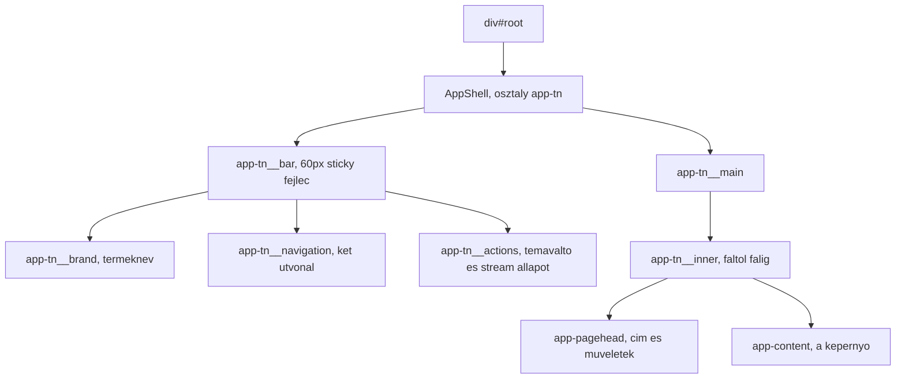
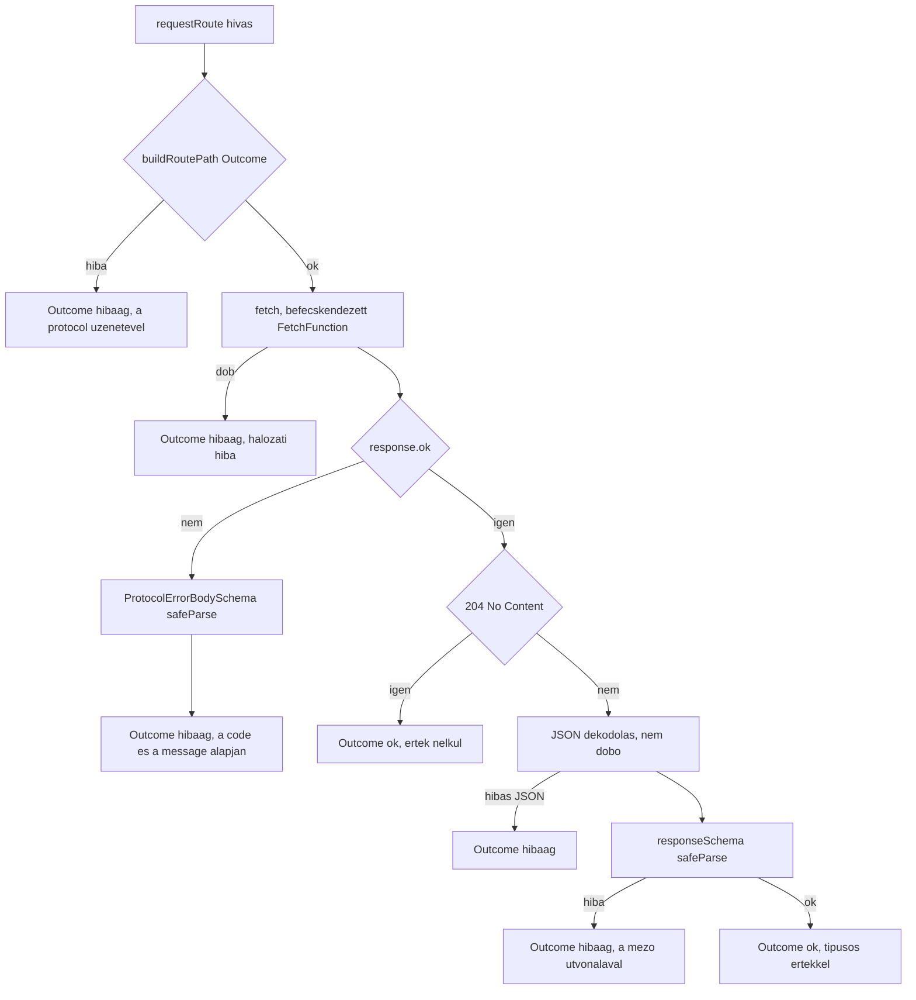

# SPEC-007: A frontend alkalmazás váza

|          |                                                                                                                                                                                                                                                                                        |
| -------- | -------------------------------------------------------------------------------------------------------------------------------------------------------------------------------------------------------------------------------------------------------------------------------------- |
| Státusz  | tervezet                                                                                                                                                                                                                                                                               |
| Dátum    | 2026-08-30                                                                                                                                                                                                                                                                             |
| Előzmény | [`SPEC-006-szerver-alkalmazas.md`](SPEC-006-szerver-alkalmazas.md) (a szerver, amivel a felület beszél), [`SPEC-005-api-protokoll.md`](SPEC-005-api-protokoll.md) (a REST és SSE kontraktus), [`SPEC-002-csomag-architektura.md`](SPEC-002-csomag-architektura.md) (a mappa konvenció) |
| Kimenet  | a `packages/ui` csomag huszonkét téma mappája, és az `apps/web` alkalmazás tizennégy téma mappája (12.1, 12.2)                                                                                                                                                                         |
| Terv     | [`../plan/PLAN-008-frontend-alkalmazas.md`](../plan/PLAN-008-frontend-alkalmazas.md)                                                                                                                                                                                                   |

---

## 1. Cél és hatókör

### Amit eldönt

- A frontend alkalmazás vázát: hol a belépési pont, mi tölti be a React fát, és hogyan épül fel a topnav shell.
- A kliens oldali útvonalválasztást: saját, minimális megoldás vagy könyvtár, és miért.
- A `packages/ui` komponens csomag tartalmát: mely `eggproject-design` komponensek kerülnek át, milyen alakban, milyen mappaszerkezetben.
- A design system fizikai átemelését: hova kerülnek a tokenek, a fontok és a komponens CSS fájlok, hogyan importálódnak, és mi a származás megjelölése.
- A "faltól falig" elrendezést: hogyan írjuk felül a topnav shell `max-width` korlátját a design system saját sentinel tokenjével.
- A reszponzív viselkedést, kizárólag a design system tényleges töréspont tokenjeire építve.
- A sötét téma váltót: három mód (világos, sötét, rendszerkövető), a `data-theme` mechanizmusra építve.
- A REST kliens réteget: típusbiztos hívás a `ROUTE_TABLE` fölött, Zod validáció, `Outcome` alakú válasz, `ProtocolError` kezelés.
- Az SSE kliens réteget: az `EventSource` befecskendezett gyáron át, az öt keret típus feldolgozása, a `Last-Event-ID` alapú újracsatlakozás, a pótolt és élő keretek megkülönböztetése.
- A két felületet: a workflow listát és a futás előzményeket.
- A várakozás jelzését a felület minden async pontján.
- A tesztelés módját: mi unit teszt (Vitest, happy-dom), mi e2e (Playwright), és hogyan érjük el a 100 százalékos lefedettséget.
- Az e2e mockolás hibrid útját az SSE csatornán, a most készült mérés alapján.
- Az `apps/web/src/main.ts` coverage kizárás megszüntetését, ami ma a repó egyetlen élő kizárása.

### Amit NEM dönt el

- **Nem építi meg a vizuális gráf szerkesztőt.** Az `@xyflow/react` alapú szerkesztő, az élő futás nézet és a transcript panel a **SPEC-008** hatóköre. A jelen spec az útvonal táblába **nem** vesz fel hozzájuk útvonalat, és a `packages/ui` csomagba nem portol hozzájuk komponenst.
- **Nem építi meg a beállítás felületet.** A beállítások képernyő, a skill feltöltés és az MCP konfiguráció a **SPEC-009** hatóköre. A `GET /api/settings`, a `PUT /api/settings`, a párhuzamossági korlát végpontok és a provider kapcsolat teszt kezelője a jelen specben **nem** kap felületet.
- **Nem módosítja a `protocol`, a `core` és a `server` csomag felületét.** A felület a meglévő barrelre képez le, egyetlen új séma és egyetlen új exportált függvény nélkül a `protocol` csomagban.
- **Nem portolja az `eggproject-design` mind az 52 komponensét.** A user 1. döntése szerint csak az kerül át, amit a felület ténylegesen használ; a többi később pótolható.
- **Nem dönt portról, origin értékről, lapméretről, időkorlátról és a stream `retry` értékéről.** Egyikre sincs dokumentált forrásunk, ezért egyikre sem adunk számot; mindegyik a 15. szekcióban áll, kimondott addigi viselkedéssel.
- **Nem vezet be hitelesítést.** A szerver a `127.0.0.1` címre köt, nincs bejelentkezés (SPEC-006 3.5); a felület nem kezel tokent, nem állít sütit és nem küld `Authorization` fejlécet.
- **Nem építi meg a fejlesztői Vite proxyt, és nem dönt a dev CORS elrendezésről.** A SPEC-006 5.7 és a SPEC-005 5.8 a **szerver** oldalán rendezi el a kérdést: a CORS engedély kizárólag a `STREAM_PATH` útvonalra vonatkozik, pontosan egy konfigurált dev originre, és a stream szándékosan nem megy proxyn át. A frontend oldali párja, egy `vite.config.ts` `server.proxy` szabály, **nem építhető meg forrás nélkül**: a proxy `target` mezője konkrét portot követel, arra pedig sem a SPEC-006 O-1, sem a jelen spec O-4 nem ad számot, és tippelni tilos (`.claude/CLAUDE.md` 4.). A jelen spec ezért a kliens oldalon egyetlen utat ismer: minden hívás, REST és SSE egyaránt, a kötelező `VITE_API_ORIGIN` konfigurációra megy, proxy nélkül. A következményt az O-4 mondja ki.

### A user három döntése, amiket ez a spec megvalósít

| #   | Döntés                                                                                                                      | Hol valósul meg                                          |
| --- | --------------------------------------------------------------------------------------------------------------------------- | -------------------------------------------------------- |
| 1   | Komponens stratégia: csak az kerül át, amit a felület használ, TypeScript plusz TSX alakban, tesztelve, a CSS változatlanul | 4. és 6. szekció, és a 16. szekció 12 ... 24. kritériuma |
| 2   | Három specre bontás: váz, `packages/ui`, kliens rétegek, workflow lista, futás előzmények                                   | 1. szekció hatókör, és a 16. szekció 1 ... 3. kritériuma |
| 3   | Sötét téma váltóval: világos, sötét és rendszerkövető mód, a `data-theme` mechanizmusra építve                              | 5.4, és a 16. szekció 30 ... 34. kritériuma              |

## 2. Megerősített tények, forrással

Minden sor mögött hivatalos dokumentáció, élő registry lekérdezés vagy saját, a jelen munkamenetben futtatott mérés áll. Amire nincs forrás, az a 15. szekcióban áll nyitott kérdésként. A `docs/research/2026-08-26-toolchain.md` fájlban már rögzített verziószámokat itt csak akkor ismételjük, ha a tény maga a verzió.

### 2.1 A React és a build lánc

| #    | Tény                                                                                                                                                                                                                                                                                  | Forrás                                                                                                                                                |
| ---- | ------------------------------------------------------------------------------------------------------------------------------------------------------------------------------------------------------------------------------------------------------------------------------------- | ----------------------------------------------------------------------------------------------------------------------------------------------------- |
| M-1  | A Vite a `.jsx` és `.tsx` fájlokat **plugin nélkül** fordítja: _"`.jsx` and `.tsx` files are also supported out of the box. JSX transpilation is also handled via Oxc Transformer."_                                                                                                  | [Vite, Features](https://vite.dev/guide/features)                                                                                                     |
| M-2  | Az Oxc JSX transzformer alapértelmezése az **automatic** runtime, tehát a `React` importja felesleges: _"By default, the 'automatic' runtime transform is used."_ Az `importSource` alapértéke `react`. A Vite 7 -> 8 migráció ugyanezt képezi le: `esbuild.jsx` helyett `oxc.jsx`    | [Oxc, JSX transform](https://oxc.rs/docs/guide/usage/transformer/jsx.html), [Vite, Migration](https://vite.dev/guide/migration)                       |
| M-3  | A Vite figyelembe veszi a `tsconfig.json` `jsx`, `jsxFactory`, `jsxFragmentFactory` és `jsxImportSource` mezőjét: _"Vite respects some of the options in `tsconfig.json` and sets the corresponding Oxc Transformer options"_, és ütközés esetén a Vite config az erősebb             | [Vite, Features, TypeScript Compiler Options](https://vite.dev/guide/features)                                                                        |
| M-4  | **Élő registry lekérdezés, 2026-08-30.** A `@vitejs/plugin-react` `dist-tags.latest` értéke `6.1.1`, a `peerDependencies` kötelező eleme egyedül a `vite: ^8.0.0`, a másik három peer a `peerDependenciesMeta` szerint `optional`. Az `engines.node` mezője `^20.19.0 \|\| >=22.12.0` | `https://registry.npmjs.org/@vitejs%2fplugin-react`, plusz `https://api.github.com/repos/vitejs/vite-plugin-react/tags` a `plugin-react@6.1.1` taggel |
| M-5  | **Élő registry lekérdezés, 2026-08-30.** A `react-dom` `dist-tags.latest` értéke `19.2.8`, a `peerDependencies` mezője `react: ^19.2.8`. A böngésző belépési pont dokumentált alakja a `createRoot` a `react-dom/client` modulból                                                     | `https://registry.npmjs.org/react-dom`, plusz [React, `createRoot`](https://react.dev/reference/react-dom/client/createRoot)                          |
| M-6  | **Élő registry lekérdezés, 2026-08-30.** A `@types/react` `dist-tags.latest` értéke `19.2.18`, a `@types/react-dom` értéke `19.2.5`, utóbbi peer igénye `@types/react: ^19.2.0`. A DefinitelyTyped forrásfa a React 19 major típusait szállítja                                       | `https://registry.npmjs.org/@types%2freact`, `https://registry.npmjs.org/@types%2freact-dom`, plusz a DefinitelyTyped `types/react/package.json`      |
| M-7  | A React 19 az `act` segédfüggvényt a `react-dom/test-utils` helyett a **`react`** csomagból exportálja: _"We've moved `act` from `react-dom/test-utils` to the `react` package"_, és a `test-utils` többi exportja hibát dob                                                          | [React 19 upgrade guide](https://react.dev/blog/2024/04/25/react-19-upgrade-guide), [React, `act`](https://react.dev/reference/react/act)             |
| M-8  | A Vite belépési pontja az `index.html`, és a benne álló modul script útvonala szabadon választható: _"It resolves `<script type=\"module\" src=\"...\">` that references your JavaScript source code."_                                                                               | [Vite, Getting Started](https://vite.dev/guide/)                                                                                                      |
| M-9  | A CSS `url()` hivatkozásokat a build ugyanúgy kezeli, mint a JS importot: hash-elt fájlnevet kapnak. A `build.assetsInlineLimit` dokumentált alapértéke `4096` bájt; ez alatt base64 data URL lesz belőlük                                                                            | [Vite, Static Asset Handling](https://vite.dev/guide/assets), [Vite, build options](https://vite.dev/config/build-options)                            |
| M-10 | A `vite-plugin-istanbul` az `include` és `exclude` opciót változtatás nélkül adja tovább a `test-exclude` csomagnak, ami minimatch szemantikát használ. Egyszeres `*` nem lép át könyvtárhatáron. A plugin `extension` alapértéke tartalmazza a `.tsx` értéket                        | a plugin `src/index.ts` forrása, plusz [`test-exclude` npm oldal](https://www.npmjs.com/package/test-exclude) és a minimatch glob szemantika          |
| M-11 | A Vite a `VITE_` előtagú env változókat teszi elérhetővé a kliens kódnak az `import.meta.env` objektumon: _"Variables prefixed with `VITE_` will be exposed in client-side source code after Vite bundling."_ A típusokat a `vite/client.d.ts` adja, a bővítés helye egy `.d.ts` fájl | [Vite, Env Variables and Modes](https://vite.dev/guide/env-and-mode)                                                                                  |

### 2.2 A böngésző API-k

| #    | Tény                                                                                                                                                                                                                                            | Forrás                                                                                                                                                                                                                     |
| ---- | ----------------------------------------------------------------------------------------------------------------------------------------------------------------------------------------------------------------------------------------------- | -------------------------------------------------------------------------------------------------------------------------------------------------------------------------------------------------------------------------- |
| M-12 | A `history.pushState()` **nem** vált ki `popstate` eseményt: _"Note that just calling `history.pushState()` or `history.replaceState()` won't trigger a `popstate` event."_                                                                     | [MDN, `popstate` event](https://developer.mozilla.org/en-US/docs/Web/API/Window/popstate_event)                                                                                                                            |
| M-13 | A `popstate` a böngésző navigációs műveletére tüzel: _"a click on the back or forward button (or calling `history.back()` or `history.forward()` in JavaScript)"_                                                                               | ugyanott                                                                                                                                                                                                                   |
| M-14 | A `history.pushState()` Baseline státusza **Widely available**, 2015 júliusa óta minden böngészőben                                                                                                                                             | [MDN, `History.pushState`](https://developer.mozilla.org/en-US/docs/Web/API/History/pushState)                                                                                                                             |
| M-15 | A `Navigation API` Baseline státusza **Newly available**, 2026 januárja óta: _"This feature might not work in older devices or browsers."_                                                                                                      | [MDN, Navigation API](https://developer.mozilla.org/en-US/docs/Web/API/Navigation_API)                                                                                                                                     |
| M-16 | Az `EventSource` Baseline státusza **Widely available**, 2020 januárja óta. A `readyState` értékei `CONNECTING` (0), `OPEN` (1), `CLOSED` (2). A `withCredentials` csak olvasható, alapértéke hamis                                             | [MDN, `EventSource`](https://developer.mozilla.org/en-US/docs/Web/API/EventSource)                                                                                                                                         |
| M-17 | Az `EventSource` alapból magától újracsatlakozik, és a `close()` ennek vet véget: _"By default, if the connection between the client and server closes, the connection is restarted. The connection is terminated with the `.close()` method."_ | [MDN, Using server-sent events](https://developer.mozilla.org/en-US/docs/Web/API/Server-sent_events/Using_server-sent_events)                                                                                              |
| M-18 | Az újracsatlakozáskor a böngésző a `Last-Event-ID` HTTP fejlécet küldi; a szabvány ennek önálló szekciót szentel                                                                                                                                | [WHATWG HTML, Server-sent events](https://html.spec.whatwg.org/multipage/server-sent-events.html), a `Last-Event-ID` header szekció                                                                                        |
| M-19 | Az `AbortSignal.timeout()` létezik és `TimeoutError` `DOMException` hibával szakít meg. Baseline **Newly available**, 2024 áprilisa óta                                                                                                         | [MDN, `AbortSignal.timeout()`](https://developer.mozilla.org/en-US/docs/Web/API/AbortSignal/timeout_static)                                                                                                                |
| M-20 | A `prefers-color-scheme` media feature Baseline **Widely available**, 2020 januárja óta; a `MediaQueryList` `change` eseménye szintén, 2020 szeptembere óta                                                                                     | [MDN, `prefers-color-scheme`](https://developer.mozilla.org/en-US/docs/Web/CSS/@media/prefers-color-scheme), [MDN, `MediaQueryList: change`](https://developer.mozilla.org/en-US/docs/Web/API/MediaQueryList/change_event) |
| M-21 | CSS custom property **nem használható** media query feltételében: _"You cannot use `var()` for property names, selectors, or anything aside from property values, which means you can't use it in a media query"_                               | [MDN, Using CSS custom properties](https://developer.mozilla.org/en-US/docs/Web/CSS/CSS_cascading_variables/Using_CSS_custom_properties)                                                                                   |

### 2.3 A tesztkörnyezet

| #    | Tény                                                                                                                                                                                                                                                                                                                                          | Forrás                                                                                                              |
| ---- | --------------------------------------------------------------------------------------------------------------------------------------------------------------------------------------------------------------------------------------------------------------------------------------------------------------------------------------------- | ------------------------------------------------------------------------------------------------------------------- |
| M-22 | A Vitest `test.css` opciója konfigurálatlanul üres sztringre cseréli a CSS fájlokat: _"When excluded, CSS files will be replaced with empty strings to bypass the subsequent processing."_ Tehát egy `import './button.css'` sor önmagában nem töri el a tesztet                                                                              | [Vitest, `css`](https://vitest.dev/config/css), plusz a `vitest-dev/vitest` #10788 issue címe, ami ugyanezt írja le |
| M-23 | **Saját mérés a telepített `happy-dom@20.11.6` csomagon, 2026-08-30.** Valódi implementáció: `matchMedia` és `MediaQueryList` (`src/match-media/`), `history.pushState`/`replaceState` és `popstate` (`src/history/`, `BrowserFrameNavigator`), `localStorage` (`src/storage/Storage.ts`), `AbortSignal.timeout` (`src/fetch/AbortSignal.ts`) | saját mérés, `grep` a telepített forrásfán                                                                          |
| M-24 | **Ugyanaz a mérés.** Az `EventSource` a `lib/` és a `src/` alatt **nulla találatot** ad, tehát a pinelt happy-dom nem implementálja. A `ResizeObserver` és az `IntersectionObserver` üres törzsű stub, `TODO` kommenttel                                                                                                                      | saját mérés                                                                                                         |
| M-25 | A Vitest hivatalos ajánlása komponens teszthez a Browser Mode: _"Browser Mode is the recommended approach for component testing"_. Ez feszültségben áll a projekt pinelt happy-dom választásával, ezért kimondjuk (13.2)                                                                                                                      | [Vitest, Component testing](https://vitest.dev/guide/browser/component-testing)                                     |

### 2.4 Az `eggproject-design` skill család

Minden sor **saját mérés** a telepített skill fájlokon, 2026-08-30, a `~/.claude/skills/eggproject-design*` könyvtárakon.

| #    | Tény                                                                                                                                                                                                                                                                                                                                                                                     |
| ---- | ---------------------------------------------------------------------------------------------------------------------------------------------------------------------------------------------------------------------------------------------------------------------------------------------------------------------------------------------------------------------------------------- |
| M-26 | A `tokens/breakpoints.css` hét viewport tokent definiál: `--ep-screen-sm: 640px`, `md: 768px`, `lg: 1024px`, `xl: 1280px`, `2xl: 1536px`, `3xl: 1920px`, `4xl: 2560px`. A token kommentek megnevezik a jelentésüket: `sm` nagy telefon és kis tablet, `md` tablet, `lg` kis laptop, `xl` asztali. **A fájl egyetlen tényleges `@media` szabályt sem tartalmaz**, csak custom propertyket |
| M-27 | Ugyanez a fájl definiálja a `--ep-layout-max-full: none` sentinelt. A `--ep-layout-max-app: 1240px` a `tokens/spacing.css` fájlban áll, és a `_shell.css` `.app-tn__inner` szabálya `max-width: var(--ep-layout-max-app, 1240px)` alakban használja. A `--ep-layout-max-full` sentinelre a `_shell.css` **egyetlen hivatkozást sem** tartalmaz                                           |
| M-28 | A `_shell.css` három `@media` szabályt tartalmaz (két darab `max-width: 1100px`, egy `max-width: 860px`), és **egyik sem érinti a `.app-tn` bart vagy a contentet**. A topnav shell ebben a fájlban nem reszponzív. A `.app-tn__bar` magassága `60px`, `position: sticky`, `top: 0`                                                                                                      |
| M-29 | A `_shell.js` teljes egészében a sidebar shell összecsukását kezeli, `localStorage` kulcsa `ep-sidebar-collapsed`. **Topnavhoz nincs benne semmilyen logika**                                                                                                                                                                                                                            |
| M-30 | A `preview/_theme.js` a `localStorage` `eggTheme` kulcsát használja, a `data-theme` attribútumot a `<html>` elemre teszi, és **kizárólag a `light` és `dark` értéket ismeri**. `matchMedia` hívás nincs benne, tehát rendszerkövető módot nem kezel. Publikál egy `window.epTheme` API-t és `storage` eseményre szinkronizál                                                             |
| M-31 | A fontok az `assets/fonts/` alatt állnak: **20 darab `.woff2` fájl**, összesen 342 944 bájt, a legkisebb 7336 bájt. A `fonts.css` 20 `@font-face` blokkot tartalmaz, `font-display: swap` értékkel, Roboto és JetBrains Mono családban, latin és latin-ext subsettel. **A magyar ékezetes karaktereket a latin-ext subset hordozza**                                                     |
| M-32 | A komponens könyvtár **52 komponenst** tartalmaz. Mindegyik `.jsx` fájl `/* global React */` fejléccel, `import` sor nélkül íródott, és a hoszt HTML-ből betöltött React 18.3.1 UMD globálisra épül, Babel Standalone futásidejű fordítással                                                                                                                                             |
| M-33 | A `DataTable.jsx` a táblamotort a `window.ReactTable` globálisról olvassa, lustán, a komponensen belül. A vendorolt `react-table.production.min.js` a `components/README.md` szerint **TanStack Table 8.21.3**                                                                                                                                                                           |
| M-34 | **Egyetlen `eggproject-design*` skill könyvtárban sincs LICENSE fájl és nincs explicit licenc megjelölés.** A vendorolt React fájlok fejlécében van MIT copyright komment, de önálló licencfájl ott sincs                                                                                                                                                                                |

### 2.5 A TanStack tábla

| #    | Tény                                                                                                                                                                                                                                                       | Forrás                                                                                                             |
| ---- | ---------------------------------------------------------------------------------------------------------------------------------------------------------------------------------------------------------------------------------------------------------- | ------------------------------------------------------------------------------------------------------------------ |
| M-35 | **Élő registry lekérdezés, 2026-08-30.** A `@tanstack/react-table` `dist-tags` mezője `{ alpha: 9.0.0-alpha.54, beta: 9.0.0-beta.80, latest: 9.2.4 }`. A `9.2.4` release `prerelease: false`, tehát stabil kiadás                                          | `https://registry.npmjs.org/@tanstack%2freact-table`, plusz `https://api.github.com/repos/TanStack/table/releases` |
| M-36 | A `8.21.3` verzió peer igénye `react: >=16.8` és `react-dom: >=16.8`; a `9.2.4` verzió peer igénye kizárólag `react: >=18`, `react-dom` nélkül                                                                                                             | ugyanott                                                                                                           |
| M-37 | **Explicit React 19 támogatási állítás a hivatalos dokumentációban NINCS**, csak ennyi: _"The `@tanstack/react-table` package works with React 18 or newer."_ Ez a peer range szintjén lefedi a 19-et, de nevesített állítás nincs, tehát NEM MEGERŐSÍTETT | [TanStack Table, Installation](https://tanstack.com/table/latest/docs/installation)                                |

### 2.6 Az SSE mockolás mérése

A teljes mérési jegyzőkönyv: [`../research/2026-08-30-sse-mockolas-meres.md`](../research/2026-08-30-sse-mockolas-meres.md). Ez a mérés zárja le a `.claude/CLAUDE.md` 11. szekciójának nyitott kérdését. A mérés a pinelt `@playwright/test@1.62.1` és chromium ellen futott.

| #    | Tény                                                                                                                                                                                                                                                              |
| ---- | ----------------------------------------------------------------------------------------------------------------------------------------------------------------------------------------------------------------------------------------------------------------- |
| M-38 | A `page.route()` **elfogja** az `EventSource` kérését, az `onopen` tüzel a mockolt válaszra, több `data:` keret sorrendben megérkezik, az `id:` mező eljut a kliens `lastEventId` mezőjéig egy kapcsolaton belül, és az `event:` mezős nevesített esemény működik |
| M-39 | A `Content-Type: text/event-stream` a mockolt válaszon **nem** `null`: az oldalon belüli `fetch` pontosan ezt az értéket olvassa vissza, és az `EventSource` sikeresen megnyílik, ami a szabvány szerint hibás típusnál lehetetlen lenne                          |
| M-40 | Újracsatlakozáskor a második `page.route()` hívás megtörténik, de a kérés fejléclistája **nem tartalmazza** a `last-event-id` kulcsot, sem a `Route` API három metódusán, sem a `page.on('request')` csatornán                                                    |
| M-41 | **Kontroll mérés valódi `node:http` szerver ellen**, ugyanazzal a kliens kóddal: a második kérés fejléceiben a `last-event-id: 1` érték **jelen van**. A böngésző tehát helyesen küldi, csak a `page.route()` réteg nem teszi láthatóvá                           |
| M-42 | A `route.fulfill()` **egyszeri**: a második hívás `"Route is already handled!"` hibát dob, és a `playwright-core@1.62.1` típusdefiníciója szerint a `body` mező típusa `string \| Buffer`, tehát nincs streamelési API                                            |
| M-43 | A könnyű `node:http` teszt szerver plusz web-first assertion út **működik**: a demonstrációs teszt egyetlen `expect(locator).toHaveText()` állítással, `waitForTimeout` nélkül zöld, és a `Last-Event-ID` alapú újracsatlakozás forgatókönyvét hitelesen fedi     |

### 2.7 A repó jelenlegi állapota

Saját mérés a repón, 2026-08-30.

| #    | Tény                                                                                                                                                                                                                                                                                   |
| ---- | -------------------------------------------------------------------------------------------------------------------------------------------------------------------------------------------------------------------------------------------------------------------------------------- |
| M-44 | A gyökér `vitest.config.ts` `coverage.exclude` listáján ott áll az `apps/web/src/main.ts` bejegyzés, saját kommenttel, ami kimondja: _"SZIGORITANI KELL: amint a valodi UI belepesi pont felvaltja ezt a fajlt, ez a sor torlendo."_ Ez a repó egyetlen élő, termékkód szintű kizárása |
| M-45 | Ugyanennek a listának van `**/*.spec.ts` bejegyzése, de **nincs `**/*.spec.tsx`** bejegyzése, miközben a `coverage.include` mintája `packages/*/src/**/*.{ts,tsx}` és `apps/*/src/**/*.{ts,tsx}`                                                                                       |
| M-46 | Az `apps/web/vite.config.ts` istanbul `include` mintája `'src/*'`, ami az M-10 minimatch szemantika szerint **nem fedi** a `src/<téma>/<fájl>.tsx` mélységet                                                                                                                           |
| M-47 | A gyökér `package.json` `catalog` mezőjében szerepel a `react: 19.2.8`, de a `react` csomag **nincs telepítve**, mert egyetlen csomag `dependencies` mezője sem hivatkozik rá. `react-dom`, `@types/react` és `@types/react-dom` bejegyzés a katalógusban nincs                        |
| M-48 | A `tooling/eslint-config` React rétege az `apps/web/**` és a `packages/ui/**` fájlokra kebab-case **és** PascalCase fájlnevet is enged, tehát a React komponens fájlok PascalCase nevet kaphatnak                                                                                      |
| M-49 | A `.prettierignore` egyetlen CSS útvonalat sem zár ki, és a `format.sh` a `prettier --check .` parancsot futtatja a teljes repóra, tehát egy átemelt CSS fájlt a Prettier átformázna                                                                                                   |

### 2.8 Amit ezekből NEM következtetünk

- **Az M-1 ... M-3 együtt nem jelenti azt, hogy a `@vitejs/plugin-react` felesleges.** Csak azt jelenti, hogy a **fordításhoz** nem kell. A Fast Refresh a plugin dolga, és annak elmaradása fejlesztői kényelmi kérdés, nem helyességi. Ez a különbség dönti el a 7.1 döntést és az O-3 nyitott kérdést.
- **Az M-37-ből nem következik, hogy a TanStack tábla alkalmatlan React 19 alatt.** Abból csak az következik, hogy nevesített állítás nincs, tehát a projekt szabálya szerint mérni kell, mielőtt bármit állítanánk (O-2).
- **Az M-40-ből nem következik, hogy a `page.route()` mockolás használhatatlan.** Az M-38 és az M-39 szerint az esetek nagy részére működik; pontosan két, mérten körülhatárolt esetre nem (13.4).
- **Az M-24-ből nem következik, hogy az SSE kliens nem tesztelhető.** Abból az következik, hogy az `EventSource` létrehozása **befecskendezett gyáron** kell menjen, ugyanúgy, ahogy a szerver oldalon az idő és a nyelő port (9.1).
- **Az M-26-ból nem következik, hogy a design system reszponzív.** Abból az következik, hogy a **tokenek** megvannak, a media queryket viszont nekünk kell megírni, és kizárólag a token értékeivel (5.3).

## 3. A két csomag felelőssége és határai

### 3.1 A határvonal

| Kérdés                                           | Ki dönti el   | Miért nem a másik                                                    |
| ------------------------------------------------ | ------------- | -------------------------------------------------------------------- |
| hogyan néz ki egy gomb, egy kártya, egy modális  | `packages/ui` | a design system átemelése, domain fogalom nélkül                     |
| mi a drótszintű alak                             | `protocol`    | egyetlen forrás, Zod sémából (SPEC-005 3.1)                          |
| melyik hibakódhoz milyen HTTP státusz tartozik   | `protocol`    | a `httpStatusForErrorCode` tiszta függvény                           |
| melyik útvonal melyik képernyőt jelenti          | `apps/web`    | kliens oldali fogalom, a szerver nem ismeri                          |
| mikor és mit hívunk a szerveren                  | `apps/web`    | a képernyő tudja, mire van szüksége                                  |
| milyen szöveget lát a felhasználó egy hibakódnál | `apps/web`    | a `protocol` szótár gépi, a magyar mondat felületi döntés            |
| mi a téma (világos, sötét, rendszerkövető)       | `packages/ui` | a `data-theme` mechanizmus a design system része, nem az alkalmazásé |

**A `packages/ui` domain mentes.** Egyetlen komponense sem ismer workflow-t, futást, eseményt vagy providert. Ebből következik, hogy a `protocol` csomagtól **nem** függ; a jelen spec a `packages/ui` `dependencies` mezőjéből a `core` és a `protocol` bejegyzést eltávolítja, mert a csomag egyetlen fájlja sem importálja őket.

**Az `apps/web` a `protocol` barreljéből importálja a típusokat és a Zod sémákat, saját duplikált típus nélkül.** Ez kimondott szabály, nem ajánlás: az `apps/web/src` alatt nem állhat olyan típus vagy séma, ami egy drótszintű alakot ír le. Greppel ellenőrizhető kritérium (16. szekció 37. pont).

### 3.2 Függőségi irány

A réteg besorolás **nem változik**: `ui` L2, `web` L5, és a `tooling/scripts/src/dependency-graph/package-layer.ts` térképet nem kell bővíteni, mert új workspace csomag nem keletkezik.

| Csomag        | `dependencies` a spec után                                                    | Változás                                                      |
| ------------- | ----------------------------------------------------------------------------- | ------------------------------------------------------------- |
| `packages/ui` | `react`, `react-dom`, plusz a táblamotor az O-2 lezárása szerint              | a `core` és a `protocol` workspace bejegyzés törlődik         |
| `apps/web`    | `@easter-workflow-builder/core`, `protocol`, `ui`, plusz `react`, `react-dom` | a három workspace bejegyzés marad, két külső csomag jön hozzá |

**A `devDependencies` mindkét csomagban `@types/react` és `@types/react-dom` bejegyzéssel bővül**, katalógus hivatkozással. Új verziószám a `docs/research/2026-08-26-toolchain.md` fájlba kerül (M-4, M-5, M-6, M-35).

### 3.3 Mit nem tartalmaz egyik csomag sem, és miért

| Amit nem tartalmaz                                   | Miért                                                                                                   |
| ---------------------------------------------------- | ------------------------------------------------------------------------------------------------------- |
| állapotkezelő könyvtár                               | a két képernyő állapota lokális; egy globális tár spekulatív absztrakció lenne (`.claude/CLAUDE.md` 5.) |
| útvonalválasztó könyvtár                             | a 7.2 négy érve, mérésre és dokumentált Baseline státuszra alapozva                                     |
| CSS-in-JS vagy utility CSS keretrendszer             | a design system kész CSS-t ad, a user 1. döntése szerint változatlanul átemelve                         |
| ikonkönyvtár                                         | a jelen spec két képernyője nem igényel ikont; ha SPEC-008 igényel, az külön, forrásolt lépés           |
| saját drótszintű típus vagy séma                     | minden alak a `protocol` csomagból jön (3.1)                                                            |
| hitelesítés, token, süti                             | a szerver a `127.0.0.1` címre köt, nincs bejelentkezés (SPEC-006 3.5)                                   |
| bármilyen port, origin, lapméret vagy időkorlát szám | nincs rá dokumentált forrás (15. szekció)                                                               |

## 4. A design system átemelése

### 4.1 A kiindulási helyzet, és mit jelent az átemelés

Az `eggproject-design` komponensek `/* global React */` fejléccel, `window.Button` alakú globálisokkal, `import` sor nélkül íródtak, React 18.3.1 UMD ellen, Babel Standalone futásidejű fordítással (M-32). Ez a modulszerkezet a projektben nem használható: itt ESM import van, React 19, és fordítási idejű TypeScript.

**Az átemelés ezért három, egymástól elkülönített részre bomlik:**

| Rész                      | Mi történik vele                                                                                                                        |
| ------------------------- | --------------------------------------------------------------------------------------------------------------------------------------- |
| **CSS**                   | **változatlanul, bájtra azonosan** kerül át, a user 1. döntése szerint                                                                  |
| **markup, azaz a JSX fa** | átkerül, de `.tsx` alakban, ESM importtal, `React` globális nélkül, típusos propokkal                                                   |
| **JS logika**             | újraíródik: a `window.epTheme` és a `_shell.js` mintája nem hordozható át (M-29, M-30), a `_theme.js` rendszerkövető módot nem is ismer |

### 4.2 Hova kerülnek a fájlok

Minden design system eredetű fájl a `packages/ui/src` alatt áll, téma mappában, a 12.1 szerkezet szerint. **Fizikai másolat készül, nem szimlink és nem build lépés:** a skill könyvtár a felhasználó gépén él, verziókövetés nélkül, tehát a repó nem hivatkozhat rá futásidőben.

| Forrás                                             | Cél                                                       |
| -------------------------------------------------- | --------------------------------------------------------- |
| `eggproject-design/colors_and_type.css`            | `packages/ui/src/design-token/colors-and-type.css`        |
| `eggproject-design/tokens/*.css` (11 fájl)         | `packages/ui/src/design-token/` ugyanazon a néven         |
| `eggproject-design/assets/fonts/fonts.css`         | `packages/ui/src/self-hosted-font/fonts.css`              |
| `eggproject-design/assets/fonts/*.woff2` (20 fájl) | `packages/ui/src/self-hosted-font/` ugyanazon a néven     |
| `eggproject-design-app-common/_shell.css`          | `packages/ui/src/topnav-shell/topnav-shell.css`, szűkítve |
| komponens CSS fájlok (12 darab)                    | a komponens saját téma mappájába, ugyanazon a néven       |

**Az `@import` útvonalak átírása a barrel fájlban kötelező és az egyetlen megengedett CSS módosítás.** A `colors-and-type.css` ma `url('assets/fonts/fonts.css')` és `url('./tokens/colors.css')` alakban importál; az új szerkezetben a font barrel egy testvér téma mappában áll, a tokenek pedig ugyanabban a mappában. **Minden más CSS sor változatlan marad**, és ezt bájtszintű összehasonlítás igazolja.

**A `_shell.css` szűkítése.** A fájl öt shellt tartalmaz (sidebar, topnav, marketing, docs, focus), amiből a projekt egyet használ. Az átemelés a `.app-tn`, az `.app-pagehead` és az `.app-content` szabályokat viszi át, **szabályonként bájtra azonosan**; a másik négy shell szabályai kimaradnak. Ez nem átírás, hanem kiválasztás: egyetlen szabály törzse sem módosul, és a kihagyott szabályok listája a téma mappa `CLAUDE.md` szintű dokumentációjában nem, hanem a fájl fejléc kommentjében áll.

### 4.3 A fontok, mint bináris fájlok

**A 20 `.woff2` fájl bináris blobként kerül a gitbe**, összesen 342 944 bájt (M-31). Ez a méret nem indokol Git LFS-t vagy más külön kezelést, és a projektnek nincs is ilyen infrastruktúrája. Négy következmény:

1. **A `check:casing` kapu ugyanúgy fedi őket**, mint bármely más git indexben álló fájlt; a fájlnevek kisbetűsek, kötőjelesek, ütközés nincs.
2. **A Prettier nem nyúl hozzájuk**, mert nem ismer `.woff2` parsert; a CSS fájlokat viszont igen, ezért kell a 4.5 szerinti kizárás.
3. **A Vite build hash-elt fájlnévvel emitálja mind a húszat**, mert a legkisebb fájl 7336 bájt, ami nagyobb az `assetsInlineLimit` dokumentált `4096` alapértékénél (M-9, M-31). **Egyetlen font sem inline-olódik base64 alakban**, ezt a build kimenet ellenőrzésével igazoljuk.
4. **A magyar ékezetes karakterekhez a latin-ext subset kell** (M-31), tehát a 20 fájlból egyiket sem hagyjuk el. A `unicode-range` mezők döntik el, melyiket tölti le a böngésző.

### 4.4 A licenc és a származás megjelölése

**Egyetlen `eggproject-design*` skill könyvtárban sincs LICENSE fájl** (M-34). Ebből nem következik, hogy a fájlok szabadon felhasználhatók, és nem következik az ellenkezője sem. A projekt szabálya szerint forrás nélkül nem állítunk semmit, ezért:

1. **Licencállítást nem teszünk.** A repó nem kap olyan fájlt, ami a design system licencét megnevezi.
2. **A származást minden átemelt fájl fejléc kommentje megnevezi**: a forrás skill nevét, a forrás fájl relatív útvonalát és az átemelés dátumát. A `.woff2` fájlok nem tudnak kommentet hordozni, ezért a `self-hosted-font` téma mappa `fonts.css` fejléce nevezi meg mind a húszat és a forrásukat.
3. **A `fonts.css` fejléce már ma megnevezi az eredetet** (a `@fontsource` csomagokból vendorolt fájlok), és ez a mondat átkerül változatlanul.
4. Ez **nyitott kérdés** (O-7): a licenc megnevezése a jelen spec hatókörén kívüli, felhasználói döntés.

### 4.5 A Prettier és a bájtazonosság

A `prettier --check .` a teljes repót fedi, és a `.prettierignore` ma egyetlen CSS útvonalat sem zár ki (M-49). Ha a Prettier átformázza az átemelt CSS-t, a "változatlanul átemelve" követelmény sérül, és a bájtszintű összehasonlítás sem lesz elvégezhető.

**Ezért a `.prettierignore` három sorral bővül**, pontosan a design system eredetű, vendorolt fájlokra:

```
packages/ui/src/design-token
packages/ui/src/self-hosted-font
packages/ui/src/topnav-shell/topnav-shell.css
```

A komponensek saját CSS fájljai **nem** kerülnek a kizárásra: azok a komponens téma mappájában állnak a `.tsx` fájl mellett, és a mappa kizárása a TypeScript fájlokat is kivenné a formázás alól. Ez ellentmondás a "változatlanul átemelve" követelménnyel, ezért a komponens CSS fájlok neve is felkerül a kizárásra, fájlonként. A kizárás indoklása egy kommentben áll a `.prettierignore` fájlban: vendorolt, idegen eredetű fájl, aminek a bájtazonossága a garancia.

## 5. Az elrendezés

### 5.1 A shell felépítése



A `.app-tn__bar` magassága `60px`, `position: sticky`, `top: 0` (M-28), és ezt nem írjuk felül. A `.app-tn__navigation` két bejegyzést tart: a workflow listát és a futás előzményeket; a SPEC-008 és a SPEC-009 ide vesz fel továbbiakat.

### 5.2 A "faltól falig" követelmény

**A probléma.** A `_shell.css` `.app-tn__inner` szabálya `max-width: var(--ep-layout-max-app, 1240px)` (M-27), tehát a tartalom egy 1240 pixeles oszlopba szorul. A felhasználó követelménye ezzel ütközik: a layout a teljes böngésző szélességet használja.

**A megoldás a design system saját sentinelje.** A `tokens/breakpoints.css` már definiálja a `--ep-layout-max-full: none` értéket, kimondottan erre a célra, de a `_shell.css` sehol nem hivatkozik rá (M-27). Az alkalmazás ezért a **token szintjén** írja felül a korlátot, nem a szabály szintjén:

```css
.app-tn {
  --ep-layout-max-app: var(--ep-layout-max-full);
}
```

**Miért ez a helyes megoldás, és nem a `max-width` felülírása:**

1. **A `_shell.css` egyetlen bájtja sem változik**, tehát a 4.2 bájtazonossági követelmény teljesül.
2. **A design system saját, erre szánt sentinelje használódik fel**, nem egy kitalált érték. A `none` a CSS `max-width` dokumentált értéke, nem trükk.
3. **Egyetlen helyen áll**, a shell gyökér szabályában, tehát egy jövőbeli visszavonás egy sor törlése.
4. **A `.focus__inner` és a többi shell nem sérül**, mert az override a `.app-tn` scope-jára szűkül.

**Amit a faltól falig NEM jelent.** A tartalom nem ér hozzá a képernyő széléhez: a `.app-tn__inner` megtartja a `--ep-layout-gutter` alapú vízszintes belső margóját, ahogy ma is. A "faltól falig" a `max-width` korlát megszüntetése, nem a margó megszüntetése.

### 5.3 A reszponzív terv

**A kiindulás.** A `_shell.css` három media queryje közül egyik sem érinti a topnavot (M-28), tehát a mobil és tablet viselkedést a projektnek kell megépítenie. A `breakpoints.css` viszont **egyetlen tényleges media queryt sem tartalmaz**, csak custom propertyket (M-26), és a CSS custom property media query feltételében nem használható (M-21).

**Ebből következik a kötött szabály:** a projekt media queryjeinek `min-width` és `max-width` literálja **kizárólag a `breakpoints.css` token értékei közül vehet fel értéket**, és ezt gépi ellenőrzés őrzi. A tokenből a literálhoz vezető út nem automatizálható, tehát a védelem egy regressziós teszt, ami a `design-token/breakpoints.css` fájlból kiolvassa a hét token értéket, és összeveti a `packages/ui/src` és az `apps/web/src` alatti minden CSS fájl minden media query literáljával. **Nem token értékű literál a tesztet megbuktatja.**

**A használt töréspontok, és miért pont azok.** A token kommentek nevezik meg a jelentésüket (M-26), tehát a választás a design system saját szótárából jön, nem találgatásból.

| Töréspont                   | Mi történik alatta                                                                                                                                                                                                                                                                                                                                                                        | Miért ez a token                                       |
| --------------------------- | ----------------------------------------------------------------------------------------------------------------------------------------------------------------------------------------------------------------------------------------------------------------------------------------------------------------------------------------------------------------------------------------- | ------------------------------------------------------ |
| `--ep-screen-md` (`768px`)  | a `.app-tn__navigation` kikerül a barból egy lenyíló menübe, amit a brand melletti gomb nyit; a márkanév zsugorodik és ellipszissel rövidül, míg az akciók sáv (stream státusz, téma váltó) nem zsugorodik; az oldal vízszintes belső margója `--ep-layout-gutter`-re szűkül; a data table harmadlagos oszlopai elrejtőznek, és a cella tartalma törhet, hogy a művelet gombok elférjenek | a token kommentje szerint ez a **tablet** határa       |
| `--ep-screen-sm` (`640px`)  | a márkanév **szövege** teljesen eltűnik (a logó marad), de kizárólag vizuálisan: a W3C WAI C7 `.visually-hidden` deklaráció listájával, nem `display: none`-nal, tehát a hozzáférhetőségi fában jelen marad                                                                                                                                                                               | a token kommentje szerint ez a **nagy telefon** határa |
| `--ep-screen-lg` (`1024px`) | a data table másodlagos oszlopai (leírás, létrehozás ideje) elrejtőznek, az azonosító és az állapot marad                                                                                                                                                                                                                                                                                 | a token kommentje szerint ez a **kis laptop** határa   |

**A mobil túllógás mért indoklása (2026-09-02).** A fenti `--ep-screen-md` sor második fele nem tervezésből, hanem mérésből jött: a `.app-tn__bar` nem törő flex sorában a brand (229px) és az akciók (142px) 468px viewport szélesség alatt nem fértek el, a bar tartalma kilógott, és a `.app-tn` blokk szintűsége miatt a túllógás a dokumentumra terjedt (320px-en `scrollWidth` 427 a 320-as `clientWidth` mellett), a téma váltó gomb pedig a képernyőn kívülre került. A tábla `flex: 1 1 0` cellái ezzel egyidejűleg a tartalmuk alá zsugorodtak, és a művelet gombok kifutottak a viewportból. Az abláció szerint a cella tördelése az egyetlen lépés, ami a gombokat ténylegesen a viewportba hozza; a harmadlagos oszlop rejtése önmagában 414px-ig nem elég, de a tördelt sorok magasságát 116px-ről 80px-re viszi le. A tényleges törés 468px körül kezdődik, arra a szélességre viszont **nincs token**, ezért a fölötte álló `--ep-screen-md` tokennél lépünk be; kitalált töréspontot nem vezetünk be.

**A márkanév csonkolásának mért indoklása (2026-09-05).** A fenti `--ep-screen-md` sor
ellipszises rövidítése egy szűk nézetben rosszabb állapotot hozott létre, mint a rejtés: 320px-en
a márkanév egyetlen "e" betűre csonkolt, a felhasználó tehát a logó mellett egy értelmetlen betűt
látott. Saját mérés (chromium, `apps/web` preview build, `<b>.scrollWidth > <b>.clientWidth`): a
szöveg 320, 360, 375, 390, 414 és 480px szélességen csonkolt, 540, 600, 640, 700 és 768px
szélességen viszont már nem, tehát a csonkolási határ 480 és 540px között van. Erre a szélességre
**nincs token**, a `breakpoints.css` legszűkebb tokenje a `--ep-screen-sm` (640px), és ez a
legkisebb olyan token, ami a teljes mért csonkolási tartományt lefedi - ezért ott lépünk be. A
logó (`.app-tn__brand img`) 2026-09-04 óta a márkanév előtt áll és önmagában hordozza az
identitást, ezért a szöveg eltűnhet; `display: none` viszont tilos, mert az MDN szerint az
"will remove it from the accessibility tree", a márkanév pedig a lap identitása. A használt
deklaráció lista a W3C WAI C7 technika szó szerinti szabálykészlete
(<https://www.w3.org/WAI/WCAG21/Techniques/css/C7>). A regressziót az `apps/web/e2e/responsive.spec.ts`
két tesztje őrzi: a szűk nézetben a `boundingBox()` szélessége legfeljebb 1px, a computed `display`
és `visibility` viszont nem `none`/`hidden`, a logó látszik, és a topnav nem lóg túl; a token
fölött egy pixellel a szöveg teljes szélességben látszik. A `toBeVisible()` erre **nem** alkalmas:
a Playwright dokumentált definíciója szerint egy nem üres befoglaló dobozú, `visibility: hidden`
nélküli elem "visible", tehát egy 1x1 pixeles, klippelt elem is átmenne rajta.

**A korábban mért kivétel 2026-09-04 óta NEM áll fenn.** A futás előzmények tábláján a
legkeskenyebb eszközön (`iPhone SE`, 320px) a "Megszakítás" feliratú szöveges gomb 91px-es
tartalmi szélessége korábban 13px-cel meghaladta a cellára jutó helyet, ezért a tábla **saját**
`overflow-x: auto` konténerén belül görgetve volt csak elérhető. A táblázat sor műveletek
2026-09-04 óta ikon gombbá váltak (felhasználói kérés: egy művelet esetén ikon gomb, lásd
5.3-nál a `menu` téma leírását a több műveletes esetre) - a "Megszakítás" ikon gomb `.btn--icon`
mérete (`sm` méretben 28px szélesség) jelentősen a korábbi 91px alatt van, tehát a kivétel
megszűnt. Az `apps/web/e2e/responsive.spec.ts` ezt a szigorú, görgetés nélküli
`toBeInViewport({ ratio: 1 })` állítással igazolja, a korábbi `scrollIntoViewIfNeeded` kerülőút
nélkül, minden mért szélességen (13.4 szekció). Az oldal törzse egyetlen mért szélességen sem
görget vízszintesen.

**Több töréspontot nem használunk.** A jelen spec két képernyője nem indokol többet, és egy nem használt media query spekulatív kód lenne. A `sm`, `xl`, `2xl`, `3xl` és `4xl` token átkerül a repóba (a fájl változatlanul), de a projekt CSS-e nem hivatkozik rájuk.

**A lenyíló menü állapota React állapot, nem CSS.** Az ok az M-29: a `_shell.js` nem ad topnav logikát, tehát nincs mit átemelni, és egy CSS-only megoldás (rejtett checkbox) nem tesztelhető a projekt konvenciói szerint. A menü nyitottsága a shell komponens állapota, a záródása útvonalváltáskor automatikus.

### 5.4 A téma váltó

**A user 3. döntése: három mód.** A készen kapott `_theme.js` ezt nem tudja: kizárólag a `light` és a `dark` értéket ismeri, `matchMedia` hívás nélkül (M-30). A rendszerkövető módot tehát meg kell írni.

| Mód            | `data-theme` a `<html>` elemen | Mit tárol a `localStorage` |
| -------------- | ------------------------------ | -------------------------- |
| világos        | `light`                        | `light`                    |
| sötét          | `dark`                         | `dark`                     |
| rendszerkövető | **nincs attribútum**           | `system`                   |

**Miért nincs attribútum rendszerkövető módban.** A design system három scope-ot ismer, és az attribútum nélküli alapállapot az, amit a `theme-auto.css` a `prefers-color-scheme` alapján old fel. Ha rendszerkövető módban attribútumot írnánk, azzal pont az automatikus feloldást kapcsolnánk ki.

**A tárolt kulcs `eggTheme` marad** (M-30), hogy egy ugyanazon böngészőben megnyitott design system preview és az alkalmazás ne mondjon ellent egymásnak. A tárolt érték viszont **három** lehet, nem kettő; az ismeretlen vagy hiányzó érték rendszerkövető módot jelent.

**A rendszerkövető mód figyeli a rendszer változását.** A `matchMedia('(prefers-color-scheme: dark)')` `change` eseménye Baseline Widely available (M-20), és a happy-dom implementálja (M-23), tehát unit tesztben is léptethető.

**A váltó gomb a `.app-tn__actions` sávban áll**, három állapotot körbejáró vezérlőként, `aria-label` felirattal, ami megnevezi az aktuális módot. A gomb `data-ep-theme-toggle` attribútumot **nem** kap: az a `_theme.js` esemény delegálásához tartozik, ami nem kerül át.

## 6. A `packages/ui` komponens csomag

### 6.1 Melyik komponens kerül át, és miért

A user 1. döntése: csak az, amit a felület ténylegesen használ. A táblázat "Hol használjuk" oszlopa ezt igazolja; **használat nélküli komponens nem kerülhet a csomagba**.

| Téma mappa          | Forrás komponens                            | Hol használjuk a jelen spec hatókörében                             |
| ------------------- | ------------------------------------------- | ------------------------------------------------------------------- |
| `button`            | `Button.jsx`                                | minden művelet, a shell menü gomb, a téma váltó                     |
| `badge`             | `Badge.jsx`                                 | futás és lépés állapot jelzése a listákban                          |
| `card`              | `Card.jsx`                                  | üres állapot és hibaállapot doboza                                  |
| `modal`             | `Modal.jsx`                                 | workflow létrehozás, átnevezés, törlés megerősítése                 |
| `tab`               | `Tabs.jsx`                                  | a futás előzmények szűrése minden futásra és egy workflow futásaira |
| `toast`             | `Toast.jsx`                                 | sikeres és sikertelen művelet visszajelzése                         |
| `loading-indicator` | `Loading.jsx` (spinner plusz `ProgressBar`) | gomb közbeni várakozás, lista frissítés                             |
| `skeleton`          | `Skeleton.jsx`                              | első betöltés a két listán és a törlés megerősítő modálisban        |
| `text-field`        | `Input.jsx`                                 | workflow név és leírás                                              |
| `select-field`      | `Select.jsx`                                | provider választás a workflow létrehozáskor                         |
| `form-control`      | `FormControls.jsx`                          | a törlés megerősítő jelölőnégyzete                                  |
| `data-table`        | `DataTable.jsx`                             | a workflow lista és a futás előzmények táblája                      |

**Ami kimarad, és miért.** A maradék 40 komponens (accordion, avatar, breadcrumb, calendar, carousel, charts, command-palette, drawer, stepper és a többi) egyike sem jelenik meg a jelen spec két képernyőjén. Későbbi pótlásuk ugyanezzel a mintával megy, komponensenként egy téma mappával.

### 6.2 Hogyan néz ki egy portolt komponens

Minden komponens téma mappa pontosan három fájlt tartalmaz:

| Fájl             | Tartalom                                                                                          |
| ---------------- | ------------------------------------------------------------------------------------------------- |
| `<Név>.tsx`      | a komponens, ESM importtal, típusos propokkal, `React` globális nélkül; az első sora a CSS import |
| `<név>.css`      | a forrás CSS fájl, **bájtra azonosan**, plusz egy fejléc komment a származással                   |
| `<Név>.spec.tsx` | a komponens unit tesztje, `createRoot` és `act` felett, happy-dom környezetben, valódi JSX-szel   |

**`.spec.tsx`, valódi JSX-szel: az O-1 lezárva.** A `vitest.config.ts` `coverage.exclude`
listája a `**/*.spec.ts` bejegyzést tartalmazta, `**/*.spec.tsx` bejegyzést nem (M-45), a
`coverage.include` viszont a `.tsx` fájlokat is felveszi. A user az O-1 kérdést a `.spec.tsx` út
felé zárta le: a kizárási lista **egyetlen** `**/*.spec.tsx` sorral bővül, a már meglévő
`**/*.spec.ts` bejegyzés pontos analógjaként egy másik kiterjesztésre. Az indok, amit a
`.claude/CLAUDE.md` 8. szekciója is átvezet: a szekció "nem bővíthető" tiltása a **termékkód**
kizárásokra vonatkozik (ez a szekció saját megfogalmazása), egy teszt fájl bejegyzés nem az.
Ezzel a komponens tesztek `.spec.tsx` fájlok, valódi JSX-szel, nem `createElement` hívásokkal.

**Négy kötött szabály a portolásra:**

1. **A `className` értékek nem változnak.** A CSS bájtra azonos, tehát minden osztálynév, amit a JSX kiír, pontosan az, ami a CSS-ben áll. Ez az egyetlen dolog, ami a két fájlt összeköti, és ezért kritérium (16. szekció 21.).
2. **A propok típusosak, és a diszkrét értékkészletek uniók**, nem sztringek. A `Button` `variant` propja `'primary' | 'secondary' | 'ghost' | 'ink' | 'danger'`, a `size` propja `'sm' | 'md' | 'lg'`. Az értékek a forrás komponens dokumentált készletéből jönnek, nem találgatásból.
3. **Nincs `any`, nincs `as`, nincs `!`**, ugyanúgy, mint bárhol máshol. A React esemény és `ref` típusok a `@types/react` csomagból jönnek.
4. **A komponens nem ismer domaint.** Nincs benne `workflowId`, `runId`, `RunStatus` vagy bármi, ami a `protocol` csomagból jönne (3.1).

**A `React` importja.** Az automatikus JSX runtime miatt (M-2, M-3) a `.tsx` fájlokban nem kell `import React from 'react'` sor. Ahol egy hook kell, ott a nevesített import áll (`import { useState } from 'react'`), ahol egy típus kell, ott `import type { ReactNode } from 'react'`. **Default React import a repóban nem fordulhat elő**, greppel ellenőrizhető kritérium.

### 6.3 A data table és a nyitott motor kérdés

A design system a TanStack táblát kötelező motorként nevezi meg, és a vendorolt UMD build a 8.21.3 verzió (M-33). Az npm registry szerint a `latest` a `9.2.4`, ami stabil kiadás, és a peer igénye `react >=18` (M-35, M-36). **Explicit React 19 támogatási állítás a hivatalos dokumentációban nincs** (M-37).

**A projekt szabálya szerint ezt mérni kell, és a mérés előtt nem állítunk semmit.** A `data-table` téma sorsa ezért az **O-2** nyitott kérdés, a PLAN-008 F0 fázisának egy korai lépésével, és három lehetséges kimenettel:

| Mérési kimenet                       | Mi lesz a `data-table` témából                                                                                                                              |
| ------------------------------------ | ----------------------------------------------------------------------------------------------------------------------------------------------------------- |
| a `9.2.4` React 19.2.8 alatt működik | az a motor, katalógus bejegyzéssel és a toolchain research átvezetésével                                                                                    |
| csak a `8.21.3` működik              | az a motor, ugyanazzal az átvezetéssel, és a spec kimondja, miért nem a `latest`                                                                            |
| egyik sem működik                    | a `data-table` téma **motor nélkül**, sima táblaként épül meg, ugyanazzal a bájtra azonos CSS-sel, rendezés és szűrés nélkül; a hiány a 15. szekcióba kerül |

**Amit a jelen spec ettől függetlenül kimond:** a két képernyő működéséhez rendezés és szűrés **nem** szükséges, tehát a harmadik kimenet nem blokkolja a specet. A táblamotor a megjelenítés minőségét javítja, nem a működést teszi lehetővé.

## 7. Az alkalmazás váz

### 7.1 A build lánc, plugin nélkül

**A Vite a `.tsx` fájlokat plugin nélkül fordítja** (M-1), automatikus JSX runtime-mal (M-2), és a `tooling/tsconfig/react.json` `jsx: 'react-jsx'` beállítását figyelembe veszi (M-3). Ebből egy döntés következik:

**A `@vitejs/plugin-react` csomagot nem vesszük fel.** Négy érv:

1. **A fordításhoz nem kell** (M-1, M-2, M-3), tehát a felvétele nem hiányt pótolna, hanem kényelmet adna.
2. **Amit adna, az a Fast Refresh.** Enélkül a Vite dev szerver teljes oldalt tölt újra egy komponens mentésekor. Ez fejlesztői kényelem, nem helyességi kérdés, és a projekt szabálya szerint nem kért funkcionalitást nem veszünk fel.
3. **A peer lánca négy csomag**, amiből három opcionális (M-4), de a kötelező `vite: ^8.0.0` mellé az `engines.node` mezője `^20.19.0 || >=22.12.0`, ami a repó `>=26.0.0` követelményével nem ütközik, de újabb kényszert hoz be.
4. **A döntés visszafordítható**, egy sor a `vite.config.ts` fájlban, és a verzió már ma két forrással igazolt (M-4). Ez az **O-3** nyitott kérdés, felhasználói döntéssel lezárható.

**Amit mégis módosítunk a `vite.config.ts` fájlban:** az istanbul plugin `include` mintája `'src/*'` értékről `'src/**/*'` értékre változik. Ez **valós hiba javítása**, nem ízlés: a jelenlegi minta a minimatch szemantika szerint nem fedi a téma mappákban álló fájlokat (M-10, M-46), tehát az e2e lefedettség a valódi alkalmazás megérkezésekor csendben nullát mérne. A javítást regressziós teszt őrzi.

### 7.2 A kliens oldali útvonalválasztás

**Saját, minimális megoldás készül, könyvtár nélkül.** Négy érv, mindegyik forrással vagy méréssel:

1. **A szükséges API dokumentált és Baseline Widely available.** A `history.pushState()` 2015 óta minden böngészőben elérhető (M-14), a `popstate` viselkedése pontosan dokumentált (M-12, M-13), és a happy-dom mindkettőt implementálja (M-23), tehát unit tesztelhető.
2. **A `Navigation API` nem alternatíva.** Baseline Newly available, 2026 januárja óta (M-15), tehát régebbi böngészőn nem működik. A projekt nem építhet erre.
3. **A megoldandó feladat kicsi.** Három útvonal, egy `:param` nélküli és két egyszerű minta, plusz egy ismeretlen útvonal ág. Ez ugyanaz a nagyságrend, mint a szerver oldali illesztő, ami a SPEC-006 5.1 szerint már egyszer indokolttá tette a saját megoldást.
4. **Egy könyvtár felvételéhez élő registry lekérdezés és két független forrás kellene**, plusz a `docs/research/2026-08-26-toolchain.md` átvezetése. **A jelen spec nem javasol router könyvtárat**, mert a fenti három pont mellett a felvételnek nincs indoka. Ha ez a döntés valaha megfordul, az külön, forrásolt lépés.

**Az útvonal tábla.** A `client-route` téma egy `CLIENT_ROUTE_TABLE` konstanst deklarál, `as const satisfies` alakban, ugyanazzal a mintával, mint a `protocol` csomag `ROUTE_TABLE` táblája:

| Kulcs          | Sablon  | Képernyő           |
| -------------- | ------- | ------------------ |
| `workflowList` | `/`     | a workflow lista   |
| `runHistory`   | `/runs` | a futás előzmények |

**Csak két útvonal van, és ez szándékos.** A `/workflows/:workflowId` (gráf szerkesztő) és a `/runs/:runId` (élő futás nézet) a SPEC-008, a `/settings` a SPEC-009 hatóköre; felvenni őket ma spekulatív lenne. Az illesztő ettől függetlenül **támogatja a `:param` szegmenst**, mert a szerver oldali párja is, és mert nélküle a SPEC-008 az illesztőt írná át, nem bővítené.

**A `:param` támogatás nem spekulatív absztrakció, hanem a `ProtocolErrorBody` mintája:** a jelen spec két útvonalán a paraméteres ág nem fut le, tehát nem is lenne tesztelhető, amit a 100 százalékos lefedettségi küszöb tilt. **Ezért az illesztő a jelen specben paraméter nélküli**, és a SPEC-008 bővíti, amikor az első paraméteres útvonal megjelenik. Ez a szabály erősebb, mint a kényelem.

**A navigáció.** Két irány, mindkettő kimondott:

| Irány                                | Mi történik                                                                                                              |
| ------------------------------------ | ------------------------------------------------------------------------------------------------------------------------ |
| a felhasználó a felületen kattint    | `history.pushState`, majd a React állapot frissítése; a `popstate` **nem** tüzel (M-12), ezért az állapotot magunk írjuk |
| a felhasználó a vissza gombot nyomja | a `popstate` tüzel (M-13), és a listener az `location.pathname` értékéből újraszámolja az aktuális útvonalat             |

**A `history` objektum befecskendezett port.** Ugyanaz az indok, mint a szerver oldali `clock` és nyelő port esetén: a teszt így determinisztikus, és nem függ attól, hogy a happy-dom mit implementál. A böngésző oldali megvalósítás egyetlen fájl, ami a `globalThis.history` és a `globalThis.location` objektumot köti be.

**A query string az útvonal része, de nem az illesztőé.** A futás előzmények `?workflowId=...` szűrője a `URLSearchParams` objektumból olvasódik, ami a `location.search` értékéből épül; az illesztő kizárólag a `pathname` értéket nézi.

### 7.3 A belépési pont és a coverage kizárás megszüntetése

**Ez a spec megszünteti a repó egyetlen élő coverage kizárását.** Az `apps/web/src/main.ts` sor a `vitest.config.ts` `coverage.exclude` listájáról **törlődik**, ahogy azt a sor saját kommentje előírja (M-44).

**Hogyan lesz a belépési pont lefedhető.** A mai `main.ts` közvetlenül a `src/` alatt áll, ami a SPEC-002 6.8 kimondott kivétele. A jelen spec ezt a kivételt **nem bővíti, hanem megszünteti**:

1. **A belépési pont az `app-mount` téma mappába kerül**, `main.tsx` néven, a `mount-app.tsx` és mindkettő `.spec.tsx` párja mellé.
2. **Az `index.html` script útvonala erre mutat**, ami a Vite dokumentált viselkedése szerint szabadon választható (M-8).
3. **A `main.tsx` egyetlen elágazást sem tartalmaz**: egy import és egy hívás, ugyanaz a minta, mint az `apps/server/src/main.ts` fájlé.
4. **Az elágazás a `mount-app.tsx` fájlba kerül**, ahol a hiányzó `#root` elem ága önállóan tesztelhető.

**Ezzel az `apps/web/src` alatt az `index.ts` barrelen kívül egyetlen fájl sem áll közvetlenül**, tehát a csomag megfelel a SPEC-002 6. szekció általános szabályának, kivétel nélkül. **A SPEC-002 6.8 kivétel listájából az `apps/web/src/main.ts` bejegyzés törölhető**, és a jelen spec ezt elő is írja (16. szekció 8.).

## 8. A REST kliens réteg

### 8.1 A hívás alakja

A `rest-client` téma egyetlen belépési pontot ad, ami a `ROUTE_TABLE` egy bejegyzését hívja meg:

```
requestRoute<TValue>({
  routeId,          // RouteId, a protocol csomagbol
  parameters,       // az utvonal parameterek, a buildRoutePath szamara
  query,            // opcionalis, URLSearchParams alakra epul
  body,             // opcionalis, JSON torzs
  responseSchema,   // a valasz Zod semaja, szinten a protocol csomagbol
  signal,           // AbortSignal, a lemondashoz
}): Promise<Outcome<TValue>>
```

**Miért nem egy 26 elemű szerződéstábla.** Egy `Record<RouteId, { requestSchema, responseSchema }>` alakú tábla mind a 26 végpontot megnevezné, miközben a jelen spec tíznél kevesebbet hív. A többi bejegyzés spekulatív absztrakció lenne, ráadásul olyan futásidejű sorokkal, amiket egyetlen teszt sem futtat, tehát a lefedettségi küszöb is tiltja. **A séma a hívás helyén dől el**, ahol tudható, mit várunk; ez ugyanaz az elv, mint a SPEC-005 8.3 zárómondata a hibaosztály leképezésre.

**Az útvonal a `protocol` csomag `buildRoutePath` függvényéből jön**, nem sztring összefűzésből. A függvény `Outcome` alakot ad, tehát a hiányzó vagy ismeretlen paraméter hibaága már ma kezelt, és a kliens nem írja meg másodszor a szabályt.

### 8.2 Hol validálunk, és hol nem

A SPEC-005 7.4 táblázata a szerződés, és a kliens oldala pontosan ennyi:

| Hely                     | Validálunk | Miért                                                                                                      |
| ------------------------ | ---------- | ---------------------------------------------------------------------------------------------------------- |
| kimenő kérés törzse      | **nem**    | a törzs a séma típusából épül, a fordító már igazolta; egy futásidejű ellenőrzés sosem futó hibaágat hozna |
| bejövő válasz törzse     | **igen**   | a `fetch` eredménye `unknown`, és a szerver egy másik folyamat                                             |
| bejövő hibaválasz törzse | **igen**   | ugyanaz az indok; a `ProtocolErrorBodySchema` a séma                                                       |

**A `.parse()` tiltott, kizárólag `.safeParse()` fut** (SPEC-005 7.4). Greppel ellenőrizhető kritérium.

### 8.3 A válasz feldolgozása



**Öt hibaág van, és mind az öt kimondott:**

| Ág                         | Mikor                                                     | Mit lát a felhasználó                                                                       |
| -------------------------- | --------------------------------------------------------- | ------------------------------------------------------------------------------------------- |
| útvonal építés             | hiányzó vagy ismeretlen paraméter                         | programhiba, a `protocol` üzenetével                                                        |
| hálózati hiba              | a `fetch` dob (a szerver nem fut, a kapcsolat megszakadt) | "a szerver nem érhető el" üzenet, újrapróbálás gombbal                                      |
| protokoll hiba             | nem 2xx státusz, `ProtocolErrorBody` törzzsel             | a hibakódhoz tartozó magyar mondat (8.4)                                                    |
| hibás JSON vagy hibás alak | a válasz nem dekódolható vagy nem illeszkedik a sémára    | "a szerver váratlan választ adott" üzenet, és **fél adat nem rajzolódik ki** (SPEC-005 7.5) |
| lemondás                   | az `AbortSignal` megszakította                            | semmit, mert a képernyő már nincs ott                                                       |

**A "fél adat nem rajzolódik ki" nem stílus.** A séma hiba `Outcome` hibaág, tehát a képernyő hibaállapotba kerül, nem részlegesen kitöltött listát mutat.

**Nincs időkorlát szám.** Az `AbortSignal.timeout()` létezik és dokumentált (M-19), de nincs olyan mérésünk vagy forrásunk, amiből egy konkrét milliszekundum érték következne, tehát nem adunk számot. **Az `AbortController` viszont használatban van**, nem időhöz, hanem eseményhez kötve: a komponens leszerelésekor és útvonalváltáskor a folyamatban lévő kérés lemondásra kerül. Ez az **O-5** nyitott kérdés.

### 8.4 A `ProtocolErrorCode` és a felhasználónak szánt szöveg

A `protocol` csomag öt kódot ismer, és a `protocol-error-message` téma mindegyikhez egy magyar mondatot rendel. **A leképezés kimerítő `switch`**, tehát egy jövőbeli hatodik kód fordítási hibát ad (`switch-exhaustiveness-check`).

| Kód               | Mit lát a felhasználó                                          |
| ----------------- | -------------------------------------------------------------- |
| `invalid_request` | a kérés nem volt érvényes, a szerver által megnevezett mezővel |
| `not_found`       | a keresett elem nem létezik, esetleg időközben törölték        |
| `conflict`        | az elem állapota most nem engedi a műveletet                   |
| `unprocessable`   | a kérés rendben volt, de a rendszer nem tudja végrehajtani     |
| `internal`        | váratlan szerver hiba                                          |

**A szerver `message` mezője megjelenik a felületen**, a fenti mondat mellett, mert az hordozza a hibaosztály nevét, ami a felhasználó számára is információ (SPEC-005 8.4). A felület ezt nem elemzi és nem próbálja lefordítani.

## 9. Az SSE kliens réteg

### 9.1 Az `EventSource` befecskendezett gyáron át

**A pinelt happy-dom nem implementálja az `EventSource` API-t** (M-24). Ebből nem az következik, hogy a réteg nem tesztelhető, hanem az, hogy a példányosítás **portra kerül**, ugyanúgy, ahogy a szerver oldalon az idő és a nyelő (SPEC-005 10.2).

```
EventSourceFactory = (url: string) => EventSourceLike
```

Az `EventSourceLike` felület pontosan három tagot ír le, amit a réteg használ: `addEventListener`, `close`, `readyState`. A böngésző oldali megvalósítás egyetlen sor, ami a `globalThis.EventSource` konstruktort hívja; a teszt a `globalThis` objektumra tesz egy dupla konstruktort, tehát **ez az egy sor is 100 százalékosan lefedett**, happy-dom támogatás nélkül.

**A `withCredentials` hamis marad**, ami az `EventSource` dokumentált alapértéke (M-16), és amit a SPEC-005 3.5 kimond. A konstruktor tehát opció objektum nélkül hívódik.

### 9.2 Az öt keret feldolgozása

**A szerver `event:` mezős kereteket küld** (SPEC-005 5.4), és az `EventSource` `onmessage` kezelője csak a névtelen eseményekre tüzel. Ezért a réteg **mind az öt névre külön listenert regisztrál**, és mind az öt ugyanarra a kezelőre mutat.

A kezelő menete, sorrendben:

1. **Nem dobó JSON dekódolás** az `event.data` sztringen. Hibás JSON esetén a keret eldobódik, és a réteg helyi `protocol_error` állapotot vesz fel; **a stream nem záródik le** (SPEC-005 7.5).
2. **`decodeStreamFrame` hívás** a `protocol` csomagból, ami `Outcome<StreamFrame>` alakot ad. Ugyanaz a viselkedés hibánál.
3. **Kimerítő `switch` a keret `event` mezőjén**, öt ággal.

| Keret                 | Mit tesz a kliens                                                                                                                                                                                                                                                                                                                                               |
| --------------------- | --------------------------------------------------------------------------------------------------------------------------------------------------------------------------------------------------------------------------------------------------------------------------------------------------------------------------------------------------------------- |
| `stream_ready`        | eltárolja a `serverInstanceId` értéket; ha ez **eltér** egy korábban ismert értéktől, a réteg egy számláló növelésével jelzi, hogy a szerver újraindult, és a képernyők erre töltik újra az adatot (SPEC-005 5.2). Az **első** ismert azonosító nem újraindulás, mert nem volt korábbi érték, amitől eltérhetne; ugyanannak az azonosítónak az ismétlése sem az |
| `run_event`           | továbbadja a `runEvent` rekordot, a `delivery` mezővel együtt                                                                                                                                                                                                                                                                                                   |
| `run_event_transient` | továbbadja, és megjelöli, hogy sosem lesz pótolható                                                                                                                                                                                                                                                                                                             |
| `replay_complete`     | az adott futásra lezárja a pótlási szakaszt                                                                                                                                                                                                                                                                                                                     |
| `protocol_error`      | felveszi a hibaállapotot, a `runId` mezővel, és **nem zárja le a kapcsolatot**                                                                                                                                                                                                                                                                                  |

**A `delivery` mező megkülönböztetése a kliens dolga** (SPEC-005 6.3). A jelen spec két képernyője ezt egyszerűen használja: a `replayed` és a `live` keret is ugyanúgy frissíti a futás állapot badge-ét. A megkülönböztetés a SPEC-008 transcript paneljében válik lényegessé, ahol a `replayed` keretek egyben, a `live` keretek animálva kerülnek ki.

### 9.3 A `streamId` és a feliratkozás

1. **A `streamId` értéket a kliens generálja**, fülönként egyet (SPEC-005 5.2, O-7). A generátor **befecskendezett port**, hogy a teszt determinisztikus legyen; a böngésző oldali megvalósítás a `crypto.randomUUID()` hívás.
2. **A kapcsolat URL-je a `protocol` csomag `buildStreamUrl` függvényéből jön**, elé az API origin kerül. A kliens nem fűz össze sztringet, és nem épít futás azonosítóból stream URL-t; a `protocol` csomag ezt szerkezetileg is megakadályozza (SPEC-005 5.1).
3. **A feliratkozás REST hívás**, a `PUT /api/streams/{streamId}/subscriptions` végponton, teljes cserével. A `replayLimit` mezőre a kliensnek számot kell adnia, amire nincs forrásunk; ez az **O-6** nyitott kérdés.

### 9.4 Az újracsatlakozás

**A `Last-Event-ID` fejlécet a böngésző küldi, nem a kliens kód** (M-18). A réteg ebből három dolgot tesz, és semmi többet:

1. **Nem hívja a `close()` metódust hiba esetén.** Az `EventSource` alapból újracsatlakozik (M-17), és a `close()` pont ezt szüntetné meg.
2. **A `readyState` alapján jelzi a felületnek, hogy éppen kapcsolódik.** Az érték `CONNECTING` (0), `OPEN` (1) vagy `CLOSED` (2), dokumentált jelentéssel (M-16). Ez a jelzés adja a topnav stream állapot kijelzőjét (11. szekció).
3. **A `close()` hívás egyetlen helyen áll**: a réteg leszerelésekor, amikor a felhasználó elnavigál vagy bezárja a fület.

**A `retry:` mezőt nem kapjuk meg**, mert a szerver nem küld (SPEC-005 5.7), tehát a várakozási idő a böngésző implementáció függő alapértéke. A kliens ezt nem próbálja befolyásolni és nem tesz róla állítást.

## 10. A két felület

### 10.1 A workflow lista (`/`)

| Elem                   | Mit csinál                                                    | Végpont                                                                                       |
| ---------------------- | ------------------------------------------------------------- | --------------------------------------------------------------------------------------------- |
| a tábla                | a workflow-k listája: név, leírás, provider, létrehozás ideje | `GET /api/workflows`                                                                          |
| "Új workflow" gomb     | modálist nyit: név, leírás, provider választó                 | `POST /api/workflows`, plusz `GET /api/providers`                                             |
| soronkénti "Átnevezés" | modálist nyit a név és a leírás módosítására                  | `PATCH /api/workflows/{workflowId}`                                                           |
| soronkénti "Törlés"    | megerősítő modálist nyit, ami **megnevezi, mi vész el**       | `GET /api/workflows/{workflowId}/deletion-summary`, majd `DELETE /api/workflows/{workflowId}` |
| soronkénti "Indítás"   | futást indít, majd a futás előzményekre navigál               | `POST /api/workflows/{workflowId}/runs`                                                       |

**A törlés megerősítése kötött, és a protokoll kényszeríti ki.** A `DELETE` törzsének `acknowledgeIrreversible` mezője Zod szinten a `true` literál (SPEC-005 4.2 A táblázat), tehát a felület nem tud véletlenül törölni. A modális az előzetes összefoglalóból **mind a három mezőt megnevezi**, és a megerősítés egy jelölőnégyzet bepipálásához kötött.

**A három mező, és miért pont ez a három.** A `DeletionSummary` alakja a `packages/db` repository rétegében dől el (SPEC-003 4.15, `WorkflowRepository.summarizeDeletion`), onnan tükrözi a `packages/protocol` `DeletionSummarySchema`, és a SPEC-005 4.2 A táblázat 5. és 6. sora ezt a sémát nevezi meg mindkét végpont válaszaként. A három mező: `runCount` (futás), `eventCount` (esemény), `snapshotCount` (gráf pillanatkép).

A jelen spec korábbi szövege ettől eltérően négy mezőt kért (futás, lépés futás, esemény, jóváhagyás), a `.claude/CLAUDE.md` 10. szekció 4. pontjának prózájából, nem a sémából. **A helyes oldal a protokoll séma**, három okból, és a jelen spec ezért a séma szerint javítva:

1. **A jelen spec 1. szekciója kimondja, hogy a `protocol` csomag felületét nem módosítja**, "egyetlen új séma és egyetlen új exportált függvény nélkül". Egy negyedik és ötödik mező felvétele a `protocol` sémát, a `packages/db` `DeletionSummary` interfészét, a `summarizeDeletion` implementációját, a SPEC-003-at és a SPEC-005-öt is módosítaná; ez egy frontend spec hatókörén kívül esik.
2. **A `.claude/CLAUDE.md` 10. szekció 4. pontja nem mezőneveket ír elő**, hanem azt, hogy a felületnek "megerősítést kell kérnie, megnevezve, mi vész el". A három mező ezt teljesíti: a lépés futások és a jóváhagyások a futással együtt, kaszkádban tűnnek el (SPEC-003 4.15 lánc), tehát a futás darabszáma őket is lefedi.
3. **A `snapshotCount` mezőt a négyes lista elhagyta**, holott az az egyetlen olyan törlődő sor, ami **nem** kaszkádon megy, hanem árva söpréssel (SPEC-003 4.15). Ha valamit ki kellene emelni a felhasználónak, az éppen ez.

**A provider választó a `GET /api/providers` válaszából épül.** A `ProviderSummary` env változó **nevet** hordoz, értéket soha (SPEC-005 4.2 D), és a felület sem jelenít meg értéket. A kapcsolat teszt gomb a SPEC-009 hatóköre.

**A kiválasztott provider kötelező env változóinak neve megjelenik a választó alatt.** Ez nem díszítés: a `.claude/CLAUDE.md` 9. szekciója szerint a rendszer titkot sosem tárol adatbázisban, kizárólag a változó **nevét**, tehát a felhasználónak a felületen kell megtudnia, melyik változót kell a szerver környezetében beállítania. A megjelenítés a `requiredEnvNames` listából megy, ami szerkezetileg sem tud értéket vinni (`z.strictObject`, SPEC-005 4.2 D). Üres lista esetén a felület ezt is kimondja, nem hagyja üresen a helyet, hogy a "nincs jelzés" és a "nem kell változó" ne legyen összetéveszthető.

### 10.2 A futás előzmények (`/runs`)

| Elem                     | Mit csinál                                                                           | Végpont                                                          |
| ------------------------ | ------------------------------------------------------------------------------------ | ---------------------------------------------------------------- |
| a fülek                  | "Minden futás" és "Egy workflow futásai"; utóbbi a `?workflowId=` query paraméterrel | `GET /api/runs`                                                  |
| a tábla                  | futás azonosító, workflow neve, állapot badge, indulás és befejezés ideje            | `GET /api/runs`                                                  |
| soronkénti "Megszakítás" | csak futó vagy várakozó futáson aktív                                                | `POST /api/runs/{runId}/interrupt`                               |
| soronkénti "Újraindítás" | csak lezárt futáson aktív                                                            | `POST /api/runs/{runId}/restart`                                 |
| élő állapot              | a listán szereplő **nem lezárt** futásokra feliratkozik, és a badge élőben frissül   | `PUT /api/streams/{streamId}/subscriptions`, plusz `GET /events` |

**Az élő állapot az egyetlen SSE fogyasztó a jelen specben, és ez szándékos.** A stream réteg nem spekulatív: itt van egy valós, működő fogyasztója, amin a réteg minden ága tesztelhető. A transcript panel és az élő gráf nézet a SPEC-008 hatóköre, és ugyanezt a réteget fogja használni, bővítés nélkül.

**A feliratkozás listája a képernyő állapotával változik.** Ha a lista frissül, vagy a felhasználó fület vált, a felület újra kiadja a `PUT` hívást a bővített vagy szűkített listával; nem nyit új kapcsolatot, és nem zárja le a meglévőt (SPEC-005 5.2).

### 10.3 Az ismeretlen útvonal

Egy nem illeszkedő útvonal a "nem található" képernyőre visz, ami egy `Card` komponensben megnevezi a hibát, és visszavisz a workflow listára. **A böngésző címsora nem íródik át**, mert a felhasználó látni akarja, mit próbált megnyitni.

## 11. A várakozás jelzése

**A felhasználó követelménye: minden felületi ponton, ahol várni kell, látható jelzés van.** A táblázat a jelen spec **minden** async pontját felsorolja, és mindegyikhez rendel egy jelzést. **Jelzés nélküli async pont nem maradhat**, és ezt a 16. szekció 44. kritériuma köti.

| #   | Async pont                                        | Jelzés                                                               | Miért ez                                           |
| --- | ------------------------------------------------- | -------------------------------------------------------------------- | -------------------------------------------------- |
| 1   | az alkalmazás első betöltése                      | a `#root` elem `index.html` szintű "betöltés..." szövege             | a React fa még nem áll, más eszköz nincs           |
| 2   | a workflow lista első betöltése                   | `Skeleton` sorok a táblában                                          | ismert a jövőbeli alak, tehát nem ugrik a layout   |
| 3   | a workflow lista újratöltése művelet után         | `ProgressBar` a tábla fejléce alatt, a régi adat látszik alatta      | a felhasználó ne veszítse el a kontextust          |
| 4   | a provider lista betöltése a létrehozó modálisban | a `Select` letiltott állapotban, "betöltés" felirattal               | a mező helye már látszik                           |
| 5   | workflow létrehozás elküldése                     | a modális elsődleges gombja letiltva, benne spinner                  | a dupla küldés kizárása                            |
| 6   | workflow átnevezés elküldése                      | ugyanaz                                                              | ugyanaz                                            |
| 7   | a törlés összefoglaló betöltése                   | `Skeleton` a megerősítő modális törzsében                            | a szám még nem ismert, de a modális már nyitva van |
| 8   | a törlés elküldése                                | a modális veszélyes gombja letiltva, benne spinner                   | a dupla küldés kizárása                            |
| 9   | futás indítása                                    | a sor gombja letiltva, benne spinner, majd `Toast` a sikerről        | a sor helyben marad                                |
| 10  | a futás lista első betöltése                      | `Skeleton` sorok                                                     | mint a 2. pont                                     |
| 11  | a futás lista újratöltése vagy fülváltás          | `ProgressBar` a tábla fejléce alatt                                  | mint a 3. pont                                     |
| 12  | futás megszakítása                                | a sor gombja letiltva, benne spinner, majd `Toast`                   | mint a 9. pont                                     |
| 13  | futás újraindítása                                | ugyanaz                                                              | ugyanaz                                            |
| 14  | a stream kapcsolat felépülése                     | a topnav `.app-tn__actions` sávjában státusz szöveg, "kapcsolódás"   | globális állapot, globális helyen                  |
| 15  | a stream pótlási szakasza                         | ugyanott, "előzmények betöltése" szöveg, a `replay_complete` keretig | a felhasználó tudja, miért nem élő még a nézet     |
| 16  | a stream újracsatlakozása szakadás után           | ugyanott, "újracsatlakozás" szöveg, a `readyState` alapján (M-16)    | a szakadás látható, nem néma                       |
| 17  | a feliratkozás küldése                            | nincs önálló jelzés, a 14 ... 16. pont státusza fedi                 | a felhasználó számára ugyanaz a folyamat           |

**Amit szándékosan nem csinálunk:** nincs teljes képernyős, blokkoló betöltő réteg. Egyik async pont sem indokol olyan jelzést, ami a felhasználót minden mástól elzárja.

## 12. A csomagok belső szerkezete

### 12.1 `packages/ui`

```
packages/ui/
  package.json
  tsconfig.json
  vitest.config.ts
  CLAUDE.md                    a csomag gyokereben, es SEHOL MASHOL
  src/
    index.ts                   barrel, csak nevesitett ujraexport
    design-token/
    self-hosted-font/
    brand-mark/
    topnav-shell/
    theme-mode/
    class-name-list/
    aria-token-list/
    media-query-breakpoint-invariant/
    component-boundary-invariant/
    button/
    badge/
    card/
    modal/
    menu/
    tab/
    toast/
    loading-indicator/
    skeleton/
    text-field/
    select-field/
    form-control/
    data-table/
```

| Téma                | Mi kerül bele                                                                                                               |
| ------------------- | --------------------------------------------------------------------------------------------------------------------------- |
| `design-token`      | a token barrel és a 11 token CSS fájl, bájtra azonosan (4.2)                                                                |
| `self-hosted-font`  | a `fonts.css` és a 20 `.woff2` fájl                                                                                         |
| `brand-mark`        | a topnav logó `logo-mark.svg`-je, bájtra azonosan, plusz a `logoMarkUrl` Vite URL import (lásd a 2026-09-04-i bővítés lent) |
| `topnav-shell`      | a shell CSS szűkített, bájtra azonos átemelése, és az `AppShellFrame` komponens, ami a bar és a content vázát adja          |
| `theme-mode`        | a három módú téma állapot, a `data-theme` írása, a `localStorage` olvasás és írás, a `matchMedia` figyelés, és a váltó gomb |
| a 13 komponens téma | fejenként a `.tsx`, a `.css` és a `.spec.tsx` fájl (6.2), két kimondott kivétellel: a `toast` és a `menu` (lásd lent)       |

**A négy további téma mappa, ami a végrehajtás során keletkezett.** A 12.1 eredeti listája
tizenhat témát nevezett meg; a tényleges csomag húsz téma mappából áll. A négy különbség nem
hatókör bővítés, hanem a SPEC-002 6. szekció saját szabályainak a következménye, ezért itt
vezetjük át, nem nyitott kérdésként.

| Téma                               | Felelősség                                                                                                                                                                                     | Miért önálló téma                                                                                                                  |
| ---------------------------------- | ---------------------------------------------------------------------------------------------------------------------------------------------------------------------------------------------- | ---------------------------------------------------------------------------------------------------------------------------------- |
| `class-name-list`                  | `joinClassNames`: feltételes CSS osztálynév lista összefűzése egyetlen `className` értékké                                                                                                     | mind a tizenkét komponens téma használja, tehát egyikük mappájába sem tartozik; a SPEC-002 6.5 tiltja a `utils/` gyűjtőt           |
| `aria-token-list`                  | `joinAriaTokenList`: ARIA azonosító hivatkozás lista (`aria-describedby`, `aria-labelledby`) összefűzése duplikátum nélkül, hogy a komponens belső azonosítója a hívóé **mellé** kerüljön      | ugyanaz az indok; a `text-field`, a `select-field`, a `form-control` és a `modal` közös igénye                                     |
| `media-query-breakpoint-invariant` | megvalósítás fájl nélküli regressziós teszt: minden CSS média lekérdezés `min-width`/`max-width` literálját a `design-token/breakpoints.css` token értékeihez méri (5.3, 16. szekció 16., 19.) | a SPEC-002 6.2 5. pontja szerint a konfigurációs invariánst őrző teszt saját téma mappába kerül, a mappa neve az őrzött dolog neve |
| `component-boundary-invariant`     | megvalósítás fájl nélküli regressziós teszt a csomag határaira: default `React` import, workspace import, `ResizeObserver`/`IntersectionObserver` és barrel `export *` tilalma                 | ugyanaz a szabály; a négy tilalom (16. szekció 22., 23., 24. és 5. kritériuma) egy témát alkot, mert mind a csomag határáról szól  |

**A `toast` téma hét fájl, nem három.** A 6.2 "pontosan három fájl" szabálya azon a feltevésen
állt, hogy egy komponens téma egyetlen exportált egységet hordoz. A `toast` háromat hordoz, és a
`.claude/CLAUDE.md` 5. szekció "egy fájlba egy dolog" szabálya szerint mindegyik saját fájlba
kerül, mindegyik saját `.spec.tsx` párral: a `Toast` primitív kártya, a `ToastViewport` a hat
pozíciójú konténer, a `useToasts` pedig a push és dismiss állapot hook, befecskendezett időzítő
porttal. Három megvalósítás plusz három teszt plusz egy közös `toast.css` az a hét fájl. A
szabály tehát nem "három fájl", hanem "exportált egységenként egy megvalósítás és egy
`.spec.tsx` fájl, plusz a téma egyetlen `.css` fájlja"; a maradék tíz komponens téma ennek a
szabálynak a `n = 1` esete.

**A `menu` téma tizenegy fájl, ugyanezen okból, plusz három belső segédmodul.** A `Menu` és a
`MenuItem` két külön exportált egység, tehát fejenként megvalósítás plusz `.spec.tsx` (négy
fájl), plusz a közös `menu.css`. A hatodik és hetedik fájl (`menu-close-context.ts` és a saját
`.spec.ts` párja) NEM exportált nyilvános egység - a barrelben nem szerepel -, hanem a `Menu` és
a `MenuItem` közötti belső huzalozás (a kiválasztás utáni panel-bezárás és fókusz-visszaállítás
kérése), amit egy React Context hordoz. A nyolcadik és kilencedik fájl (`read-panel-element.ts`
és a saját `.spec.ts` párja) szintén nem exportált nyilvános egység: a panel DOM elemének
olvasását emeli ki, mert a `panelReference.current` típusa `HTMLDivElement | null`, de a
gyakorlatban a `Menu.tsx` egyetlen hívási pontján sem lehet `null` (a panel mindig renderelve
van, csak `hidden` attribútummal rejtve) - egy `if (panel === null) return;` ág a hívási helyen
soha nem futó, tesztelhetetlen branch lenne, ami a SPEC-003 12.4 szekció 100 százalékos
lefedettségi küszöbét sértené. A kiemelt függvény a `null` ágat dobással jelzi, szintetikus
bemenettel közvetlenül tesztelhető - ugyanaz a minta, mint a `packages/db`
`run-event/event-record/extract-error-cause.ts`-e (`.claude/CLAUDE.md` 12. szekció). A tizedik és
tizenegyedik fájl (`compute-panel-position.ts` és a saját `.spec.ts` párja) a panel `position:
fixed` koordinátáit számító, tiszta függvényt emeli ki: a `Menu` `createPortal`-lal a
`document.body`-ba renderel (lásd lent), és a kiszámított `top`/`left` értéket mindig a
viewporton belülre szorítja - ez a mérten, valódi hibaként felmerült eset (`align="right"` esetén
a nyers jobbra igazítás keskeny viewporton a panelt a bal szélen túlra tolta) miatt tiszta
függvényben áll, mert a happy-dom teszt környezet `getBoundingClientRect()`-je mindig nulla
téglalapot ad, ami a szorítás ágát élő DOM-on keresztül tesztelhetetlenné tenné. A
`.claude/CLAUDE.md` "egy fájlba egy dolog" szabálya mindhárom belső segédmodulra vonatkozik,
ezért egyik sincs a `Menu.tsx`-ben.

**A `menu` panel portálja, 2026-09-04 óta (a forrástól eltérve).** A panel `createPortal`-lal a
`document.body`-ba renderelődik, NEM a trigger DOM-beli szülőjének gyermekeként, ahogy a forrás
teszi. Az eltérés oka mért, valódi hiba: a táblázat sor műveletek triggere a `DataTable` saját,
görgethető törzsében ül (`data-table.css` `.data-table-scroll { overflow: auto; }`), ami a forrás
relatív pozícionálású panelét ténylegesen levágta - az `apps/web/e2e/responsive.spec.ts` 320px
szélességen ezt elő is idézte (`toBeInViewport({ ratio: 1 })` ~0.61 arányra bukott a menü
elemein). A hivatalos React dokumentáció pontosan erre az esetre ajánlja a portált ("you can use
a portal to create a modal dialog that floats above the rest of the page, even if the component
... is inside a container with `overflow: hidden`", react.dev/reference/react-dom/createPortal),
és a kontextus, valamint az eseménybuborékolás a React fa szerint működik tovább, a DOM fától
függetlenül - ugyanez a hivatalos oldal. A portál miatt a "kívülre kattintás"/"fókusz kilépett a
menüből" döntésnek (`isInsideMenu`, `Menu.tsx`) a triggert körülölelő `anchor` ÉS a portált panel
elemet is meg kell vizsgálnia, mert a kettő a DOM-ban külön ágon áll.

**Két új téma mappa a 2026-09-04-i felületi kiegészítésben, tényleges hatókör bővítésként.** A
fenti négy témával szemben (amik a SPEC-002 szabályainak strukturális következményei, nem új
funkciók) a `menu` és a `brand-mark` egy user kérés (táblázat sor műveletek lebegő menübe
rendezése, plusz a topnav logó) tényleges, új hatókörű bővítése. A `menu` a design system
`Menu`/`MenuItem` komponens párjának dokumentált részhalmaza (lásd feljebb és `Menu.tsx`); a
`Popover` komponens NEM került átemelésre, mert nincs menü szemantikája (nincs `role="menu"`,
nincs nyíl navigáció, a fókusz nyitáskor a triggeren marad) - a user kifejezett kérése szerint
"nyilakkal navigálás" és "Escape zárás, fókusz-visszaállítás" kellett, ez a `Menu` kontraktusa,
nem a `Popover`-é. A `brand-mark` a `design-token`/`self-hosted-font` mintáját követi (bájtra
azonos átemelés, byte-identity regressziós teszt), a `logo-mark.svg`-vel; a `logo-wordmark.svg`
és a `logo-mark-inverse.svg` NEM került át. A `logo-wordmark.svg`-re azért nincs szükség, mert a
topnav shell saját, `eggproject-design-app-common/skeletons/shell-topnav.html` kanonikus mintája
a mark ikont plusz külön szöveges márkanevet (`<b>` elem) használja, nem a wordmark SVG-t - ezt
a mintát követi az `AppShell` is, a meglévő `<b>easter-workflow-builder</b>` szöveg mellé téve a
logót. A `logo-mark-inverse.svg`-re azért nincs szükség, mert a kanonikus minta ugyanezt az
egy SVG-t (`logo-mark.svg`) használja témától függetlenül, szín szerinti váltás nélkül; ezt a
döntést a design system saját példája hozta meg, nem ez a munkamenet - a mark saját színei
(kék/arany/krém gyűrűk, sötét tintaszín nélkül) nem támaszkodnak világos hátérre úgy, ahogy a
wordmark sötét szövege tenné.

**Egy szint mély, tárgykör mappa nélkül.** A csomag egy tárgykörű: minden téma a design system átemeléséről szól. A PLAN-004 3. szekció bontási kritériuma mélyebb szintre nem teljesül, mert a fájlnevek már megnevezik a csoportot (a `Button.tsx` mellett álló `button.css` nem lehet másé), tehát a második feltétel egy szinttel lejjebb elbukik. **A repó kétszintű csomagjainak száma marad három** (`core`, `provider-capability`, `db`).

**Amit szándékosan nem csináltunk:** nincs `components/`, `styles/`, `assets/`, `hooks/` vagy `types/` mappa. Az utolsó a SPEC-002 tiltott név listáján áll, a többi technikai réteg, nem domain fogalom.

### 12.2 `apps/web`

```
apps/web/
  package.json
  tsconfig.json
  vite.config.ts
  vitest.config.ts
  playwright.config.ts
  index.html
  CLAUDE.md                    a csomag gyokereben, es SEHOL MASHOL
  src/
    index.ts                   barrel, csak nevesitett ujraexport
    vite-env.d.ts              az ImportMetaEnv bovites, tipus only
    app-mount/
    app-shell/
    client-route/
    history-navigation/
    frontend-config/
    rest-client/
    stream-client/
    request-state/
    protocol-error-message/
    workflow-list/
    run-history/
    not-found-route/
    greppable-invariants/
    vite-istanbul-include-invariant/
  e2e/
```

| Téma                     | Mi kerül bele                                                                                                  |
| ------------------------ | -------------------------------------------------------------------------------------------------------------- |
| `app-mount`              | a `main.tsx` belépési pont (egy hívás, nulla elágazás) és a `mount-app.tsx`, ami a `#root` hiányát kezeli      |
| `app-shell`              | a topnav összeállítása: brand, navigáció, akciók, a lenyíló menü állapota, a stream státusz kijelző            |
| `client-route`           | a `CLIENT_ROUTE_TABLE`, a `ClientRouteId` unió és a `pathname` illesztő tiszta függvénye                       |
| `history-navigation`     | a `history` és a `location` befecskendezett portja, a `popstate` figyelés, és a navigációs művelet             |
| `frontend-config`        | az `import.meta.env` olvasása `Outcome` alakban, alapérték nélkül; ez adja az API origint és a lapméreteket    |
| `rest-client`            | a `requestRoute` és a `requestRouteWithoutBody`, a válasz feldolgozás öt ága                                   |
| `stream-client`          | az `EventSourceFactory` port, az öt keret kezelése, a `serverInstanceId` figyelés, a `streamId` generátor port |
| `request-state`          | a négy állapotú (`idle`, `pending`, `success`, `failure`) leíró, amit minden async pont használ                |
| `protocol-error-message` | a `ProtocolErrorCode` kimerítő leképezése magyar mondatra                                                      |
| `workflow-list`          | a workflow lista képernyő, a három modálisával                                                                 |
| `run-history`            | a futás előzmények képernyő, a fülekkel és az élő állapot feliratkozással                                      |
| `not-found-route`        | az ismeretlen útvonal képernyője                                                                               |

**A két további téma mappa, ami a végrehajtás során keletkezett.** A 12.2 eredeti listája
tizenkét témát nevezett meg; a tényleges alkalmazás tizennégy téma mappából áll. Ugyanaz az ok,
mint a `packages/ui` négy többletténél: a SPEC-002 6.2 5. pontja szerint a megvalósítás nélküli,
konfigurációs invariánst őrző teszt saját téma mappába kerül, a mappa neve pedig annak a
dolognak a neve, amit őriz.

| Téma                              | Felelősség                                                                                                                                                                                                                      |
| --------------------------------- | ------------------------------------------------------------------------------------------------------------------------------------------------------------------------------------------------------------------------------- |
| `greppable-invariants`            | megvalósítás fájl nélküli téma: a 16. szekció tizenkét greppel ellenőrizhető kritériumát futtatja egyetlen `describe` blokkban (22., 28., 31., 36., 37., 38., 40., 41., 45., 56., plusz a SPEC-008 és SPEC-009 hatókör tilalma) |
| `vite-istanbul-include-invariant` | megvalósítás fájl nélküli téma: a `vite.config.ts` istanbul `include` mintázatát a `src/**/*` alakon rögzíti, hogy soha ne essen vissza a `src/*` mintára, ami az e2e lefedettséget csendben nullázná (13.6, M-46)              |

**A `vite-env.d.ts` típus only fájl**, tehát nem kap `.spec.ts` párt, és a csomag `CLAUDE.md` `## Fájlok` táblázata ezt megjelöli (`.claude/CLAUDE.md` 5.). Elhelyezése közvetlenül a `src/` alatt a Vite dokumentált mintája (M-11); ez a második, kimondott kivétel a `src/` alatti fájl tilalom alól, az `index.ts` barrel mellett, és a SPEC-002 6.8 pontjában az `apps/web/src/main.ts` bejegyzés **helyére** lép.

## 13. Tesztelés

### 13.1 A határvonal unit és e2e között

| Amit igazolni akarunk                                          | Hol              | Miért ott                                                                 |
| -------------------------------------------------------------- | ---------------- | ------------------------------------------------------------------------- |
| egy komponens a megfelelő osztályokkal és felirattal rajzol ki | unit (happy-dom) | tiszta bemenet, tiszta kimenet, nincs hálózat                             |
| az útvonal illesztő a helyes útvonalat adja                    | unit             | tiszta függvény                                                           |
| a REST kliens mind az öt hibaága                               | unit             | a `FetchFunction` port befecskendezett, minden ág előidézhető             |
| az SSE kliens mind az öt kerete                                | unit             | az `EventSourceFactory` port befecskendezett (9.1)                        |
| a téma váltás a `data-theme` attribútumot írja                 | unit             | a happy-dom implementálja a `matchMedia` és a `localStorage` API-t (M-23) |
| a felhasználó tényleg lát egy listát a képernyőn               | **e2e**          | valódi böngésző, valódi CSS, valódi layout                                |
| a törlés megerősítő modális tényleg blokkol                    | **e2e**          | a felhasználói folyamat, nem egy komponens                                |
| az SSE keret hatására a badge frissül                          | **e2e**          | a stream, a React fa és a DOM együtt                                      |
| a reszponzív viselkedés a töréspontok mentén                   | **e2e**          | a viewport méret böngésző szintű fogalom                                  |

### 13.2 A unit teszt környezete

**A környezet a pinelt happy-dom marad.** A Vitest hivatalos ajánlása komponens teszthez a Browser Mode (M-25), és ezt kimondjuk, mert feszültségben áll a választásunkkal. A választás mégis a happy-dom, három okból: a projekt `vitest.config.ts` fájlja már ma ezt köti az `apps/web` és a `packages/ui` projektre (SPEC-001 9.), a Browser Mode bevezetése új eszközlánc és új függőség lenne, és a mért happy-dom képességek (M-23) a jelen spec minden szükségletét fedik. **Ez az O-9 nyitott kérdés**, mérés zárná le, nem vélemény.

**A komponens tesztek eszköze a React saját API-ja, könyvtár nélkül.** A `createRoot` a `react-dom/client` modulból (M-5), az `act` a `react` csomagból (M-7). A `@testing-library/react` felvételét a jelen spec **nem javasolja**: a két API dokumentált, a felvétel új függőséget hozna, és a projekt szabálya szerint nem kért kényelmi réteget nem veszünk fel.

**A CSS import nem töri el a tesztet.** A Vitest konfigurálatlanul üres sztringre cseréli a CSS fájlokat (M-22), tehát a `packages/ui` `vitest.config.ts` fájlja **nem bővül** `css` beállítással.

**Amire a UI nem építhet.** A `ResizeObserver` és az `IntersectionObserver` a pinelt happy-dom alatt üres stub (M-24). **Egyetlen portolt komponens sem használhatja őket**, és ha egy jövőbeli komponens igényelné, az blokkoló, amit méréssel kell feloldani, nem `eslint-disable` sorral (O-8).

### 13.3 A lefedettség

**100 százalék mind a négy metrikán, kizárás nélkül.** A `vitest.config.ts` `coverage.exclude` listája **csökken** egy sorral: az `apps/web/src/main.ts` bejegyzés törlődik (M-44, 7.3).

**A lista egyetlen sorral bővült.** A user az O-1 kérdést lezárta: a React komponens tesztek `.spec.tsx` fájlok, valódi JSX-szel (6.2), és a `vitest.config.ts` `coverage.exclude` listája a `**/*.spec.tsx` sorral bővült, a már meglévő `**/*.spec.ts` bejegyzés pontos analógjaként (M-45). A `.claude/CLAUDE.md` 8. szekciója ezzel összhangban pontosítva: a "nem bővíthető" tiltás a termékkód kizárásokra vonatkozik, egy teszt fájl bejegyzésre nem.

**Három tervezési megkötés következik a küszöbből**, ugyanaz a három elv, mint a szerver oldalon:

- **Kimenő oldalon nem validálunk** (8.2), mert az sosem futó hibaágat hozna létre.
- **Az útvonal illesztő paraméteres ága nem íródik meg** a jelen specben (7.2), mert a két útvonal egyike sem paraméteres, tehát az ág nem lenne futtatható.
- **A `main.tsx` egyetlen elágazást sem tartalmaz** (7.3), tehát nem szorul kizárásra.

### 13.4 Az e2e mockolás

**A REST oldal: minden hívás `page.route()` mockolva.** Ez a felhasználó kérése ("e2e-nel minden mockolva legyen mint unit test-nel"), és a Playwright hivatalos ajánlása is ez harmadik fél és külső szerver helyett (a Playwright best practices oldal, a `docs/research/2026-08-29-playwright-teszt-szabalyok.md` 1. szekciója). **Valós backend szervert e2e teszt nem szólíthat meg.**

**Az SSE oldal: hibrid, mérés alapján.** A `docs/research/2026-08-30-sse-mockolas-meres.md` mérése ezt egyértelműen eldöntötte:

| Amit tesztelünk                                             | Hogyan                               | Forrás        |
| ----------------------------------------------------------- | ------------------------------------ | ------------- |
| a kapcsolat megnyílása, a `stream_ready` keret feldolgozása | `page.route()` mock                  | M-38, M-39    |
| több `data:` keret sorrendben, a DOM frissülése rájuk       | `page.route()` mock                  | M-38          |
| a nevesített `event:` keretek (mind az öt típus)            | `page.route()` mock                  | M-38          |
| az `id:` mező hatása egy kapcsolaton belül                  | `page.route()` mock                  | M-38          |
| **a `Last-Event-ID` alapú újracsatlakozás**                 | **könnyű `node:http` teszt szerver** | M-40 ... M-43 |
| **menet közben, élő kapcsolatba beszúrt keret**             | **könnyű `node:http` teszt szerver** | M-42          |

**A kivétel kimondása, indoklással.** A "minden mockolva legyen" szabály alól a `Last-Event-ID` alapú újracsatlakozás tesztje **kivétel**, mert ez a viselkedés `page.route()`-tal **mérten nem figyelhető meg**: a második kapcsolat kérés fejlécei a route rétegen nem tartalmazzák a `Last-Event-ID` fejlécet (M-40), holott a böngésző azt egy valódi szerver felé bizonyítottan elküldi (M-41). A `route.fulfill()` ráadásul egyszeri, lezárt aktus (M-42), tehát egy már megnyitott kapcsolatba nem tolható be újabb keret. A célra írt `node:http` szerver útja **mérten működik**, web-first assertionnel, `waitForTimeout` nélkül (M-43).

**A teszt szerver nem a termék szervere.** Egy minimális, a teszt fájl mellett élő `node:http` kiszolgáló, ami kizárólag a `GET /events` végpontot ismeri, és a kapott `Last-Event-ID` fejléc értékéből épít determinisztikus választ. Adatbázist nem nyit, motort nem indít, és a REST hívások továbbra is `page.route()` mockon mennek.

### 13.5 A Playwright szabályok

A `docs/research/2026-08-29-playwright-teszt-szabalyok.md` 15 tételes listája **teljes egészében kötelező**, és a jelen spec nem ismétli meg. Négy pontot mégis kiemelünk, mert a jelen spec konkrét döntéseit érintik:

1. **Tilos a `page.waitForTimeout()`, a `setTimeout` és a `sleep`** minden spec fájlban. Az SSE tesztek is kizárólag web-first assertionre és `page.waitForResponse()` hívásra épülnek (M-43).
2. **A locator sorrend kötött**: `getByRole` elsőként, `getByTestId` utolsóként. A portolt komponensek ezért **hozzáférhető szerepet és feliratot kapnak**: a `Modal` `role="dialog"` értékkel és `aria-labelledby` hivatkozással, a `ProgressBar` `role="progressbar"` értékkel (ez a forrás komponensben már ma is így van, M-32 mellékleteként), a téma váltó gomb `aria-label` felirattal.
3. **A "nincs csatolva a DOM-hoz" állítás alakja `toBeAttached({ attached: false })`**, mert `toBeDetached` néven nincs assertion.
4. **Minden `apps/web/e2e/*.spec.ts` fájl a `./coverage-fixture.ts` fájlból importálja a `test` és az `expect` párost**, nem közvetlenül a `@playwright/test` csomagból.

### 13.6 Az e2e lefedettség

Az `apps/web` e2e coverage lánca (`vite-plugin-istanbul` plusz `nyc`) ma él, de az istanbul `include` mintája nem fedi a téma mappákat (M-46). **A minta `src/**/*` értékre változik**, és regressziós teszt őrzi, hogy soha ne essen vissza egyszintű mintára. A javítás nélkül a valódi alkalmazás megérkezésekor az e2e lefedettség csendben nullát mérne, ami rosszabb, mint ha hiányozna.

**Az e2e lefedettség nem tagja a kilenc kapunak** (`.claude/CLAUDE.md` 8.), és a jelen spec ezen nem változtat.

## 14. Kockázatok

| Kockázat                                                                   | Hatás                                                                     | Védelem                                                                                                                      |
| -------------------------------------------------------------------------- | ------------------------------------------------------------------------- | ---------------------------------------------------------------------------------------------------------------------------- |
| Valaki kitalált pixel értéket ír egy media querybe                         | a layout töréspontjai elcsúsznak a design systemtől                       | a 5.3 regressziós teszt, ami a `breakpoints.css` token értékeihez hasonlít minden literált                                   |
| A Prettier átformázza az átemelt CSS-t                                     | a bájtazonosság elvész, a design systemhez való visszavezetés lehetetlen  | a `.prettierignore` kizárás (4.5), plusz bájtszintű összehasonlító teszt                                                     |
| A `max-width` korlát felülírása szabály szinten történik                   | a `_shell.css` módosul, a bájtazonosság elvész                            | a token szintű override (5.2), és kritérium, hogy a `_shell.css` átemelt része változatlan                                   |
| Egy komponens `className` értéke eltér a CSS-től                           | a komponens formázatlanul jelenik meg, és a teszt ezt nem veszi észre     | a 6.2 1. szabály, plusz komponensenkénti teszt, ami a kirajzolt osztálylistát hasonlítja össze                               |
| Az `EventSource` közvetlenül példányosul valahol                           | a réteg happy-dom alatt tesztelhetetlen (M-24)                            | a befecskendezett gyár (9.1), plusz greppes kritérium a `new EventSource(` mintára                                           |
| A kliens `close()` hívással reagál egy stream hibára                       | az automatikus újracsatlakozás megszűnik, a transcript véglegesen eltűnik | a 9.4 1. pont, plusz teszt, ami hiba után `CONNECTING` állapotot vár                                                         |
| Egy `.spec.tsx` fájl bekerül a lefedettségi mérlegbe                       | a küszöb hamis okból bukik vagy hamis okból zöld                          | az O-1 lezárva: a `coverage.exclude` lista `**/*.spec.tsx` sora kizárja, kritérium, hogy a mérleg csak termékkódot tartalmaz |
| A `main.tsx` elágazást kap                                                 | kizárásra szorulna, ami tiltott                                           | a 7.3 4. pont, plusz greppes kritérium                                                                                       |
| Az istanbul `include` minta visszaesik egyszintűre                         | az e2e lefedettség csendben nullát mér                                    | a 13.6 regressziós teszt                                                                                                     |
| Egy drótszintű típus másolata megjelenik az `apps/web` alatt               | két forrás keletkezik, ami elcsúszhat                                     | a 3.1 szabály, plusz greppes kritérium a `z.strictObject` és a saját `interface` mintákra                                    |
| Az e2e teszt valós szervert szólít meg                                     | a teszt nem determinisztikus, és titok kerülhet a naplóba                 | a 13.4 szabály, plusz kritérium, hogy az `e2e/` alatt a `page.route()` és a saját `node:http` az egyetlen forrás             |
| A táblamotor React 19 alatt nem működik, és ez csak a végén derül ki       | a `data-table` téma és két képernyő újratervezése                         | az O-2 mérés a PLAN-008 **F0 fázisában**, a komponens megírása előtt                                                         |
| Egy komponens `ResizeObserver` vagy `IntersectionObserver` API-t igényelne | a unit teszt hamis zöldet ad, mert a stub semmit nem csinál (M-24)        | a 13.2 tiltás, plusz greppes kritérium mindkét névre                                                                         |

## 15. Nyitott kérdések, amikre nincs forrás

Egyik sem zárható le tippeléssel. Mindegyiknél áll, mi a viselkedés addig, és mi zárná le.

| #   | Kérdés                                                                                              | Addig                                                                                                                                                                                                                                                                                                                                                                                                                                                                                                                                                                                                                                                                                                                                                                                                                                          | Mi zárná le                                                                                                                                                                                                                                                                                                                                            |
| --- | --------------------------------------------------------------------------------------------------- | ---------------------------------------------------------------------------------------------------------------------------------------------------------------------------------------------------------------------------------------------------------------------------------------------------------------------------------------------------------------------------------------------------------------------------------------------------------------------------------------------------------------------------------------------------------------------------------------------------------------------------------------------------------------------------------------------------------------------------------------------------------------------------------------------------------------------------------------------- | ------------------------------------------------------------------------------------------------------------------------------------------------------------------------------------------------------------------------------------------------------------------------------------------------------------------------------------------------------ |
| O-1 | A `.spec.tsx` fájlok és a `coverage.exclude` lista                                                  | **Lezárva, 2026-09-01.** A user a `.spec.tsx` út mellett döntött: a komponens tesztek `.spec.tsx` fájlok, valódi JSX-szel (6.2, 13.3), és a `coverage.exclude` lista egyetlen `**/*.spec.tsx` sorral bővült, a már meglévő `**/*.spec.ts` bejegyzés analógjaként (M-45). A `.claude/CLAUDE.md` 8. szekció mondata pontosítva (a tiltás a termékkód kizárásokra vonatkozik), a 14. szekció korábbi 1. tétele törölve.                                                                                                                                                                                                                                                                                                                                                                                                                           | lezárva                                                                                                                                                                                                                                                                                                                                                |
| O-2 | A táblamotor: `@tanstack/react-table` `8.21.3`, `9.2.4`, vagy egyik sem                             | **Lezárva, 2026-09-01.** A PLAN-008 F0 fázisának mérése (`docs/research/2026-09-01-spec007-f0-meresek.md`) szerint mindkét verzió ténylegesen renderel React 19.2.8 alatt; a döntés a `9.2.4`, natív (`useTable`+`tableFeatures`) API-val, mert az az npm `latest` stabil kiadás, a `8.21.3` portolása pedig a deprecated `useLegacyTable` rétegen menne át (6.3)                                                                                                                                                                                                                                                                                                                                                                                                                                                                              | lezárva                                                                                                                                                                                                                                                                                                                                                |
| O-3 | Kell-e a `@vitejs/plugin-react` a Fast Refresh miatt                                                | nem vesszük fel; a dev szerver teljes oldalt tölt újra komponens mentésekor. A fordítás enélkül is működik (M-1, M-2, M-3), tehát ez kizárólag fejlesztői kényelem                                                                                                                                                                                                                                                                                                                                                                                                                                                                                                                                                                                                                                                                             | user döntés arról, megéri-e a függőség a Fast Refresh kényelméért. A verzió és a peer lánc már ma két forrással igazolt (M-4)                                                                                                                                                                                                                          |
| O-4 | Az API origin, amit a felület hív, és ebből következően a fejlesztői CORS és proxy elrendezés       | kötelező `VITE_` előtagú env változó, **alapérték nélkül** (M-11). Ha hiányzik, az alkalmazás nem találgat: egy konfigurációs hibaképernyőt rajzol ki, ami megnevezi a hiányzó változó **nevét**, az értékét soha. Ez a SPEC-006 O-1 továbbvitele. **Következmény, amit kimondunk:** amíg nincs port, addig `vite.config.ts` `server.proxy` szabály sem írható meg (a `target` konkrét portot követel), tehát fejlesztéskor a REST hívás is arra az originre megy, amit a változó megnevez. Ha az eltér a dev szerver originjétől, a szerver oldali CORS engedélynek a `STREAM_PATH` mellett az `/api` előtagra is ki kell terjednie; a SPEC-006 5.7 ma kizárólag a `STREAM_PATH` útvonalat engedi. Éles használatban a kérdés nem merül fel: a szerver szolgálja ki a felépített felületet, tehát azonos origin, és nincs CORS (SPEC-005 5.8) | termékdöntés a szerver portjáról és a dev szerver portjáról, ami a SPEC-006 O-1 lezárása. A lezárás után dől el, hogy a dev REST hívás proxyn megy-e (akkor a SPEC-006 CORS engedélye változatlan marad) vagy közvetlenül (akkor a SPEC-006 5.7 bővítendő). **A kettő közül a jelen spec egyiket sem választja ki, mert mindkettő portszámot igényel** |
| O-5 | A REST hívások időkorlátja                                                                          | nincs időkorlát szám; az `AbortSignal.timeout()` létezik (M-19), de nincs forrásunk egy konkrét értékre. Az `AbortController` eseményhez kötve fut: leszereléskor és útvonalváltáskor mond le                                                                                                                                                                                                                                                                                                                                                                                                                                                                                                                                                                                                                                                  | mérés a leglassabb valós REST válasz idejéről, plusz termékdöntés arról, mi a helyes viselkedés túllépéskor                                                                                                                                                                                                                                            |
| O-6 | A `limit` és a `replayLimit` érték, amit a kliens küld                                              | mindkettő **kötelező konfiguráció**, alapérték nélkül, ugyanabból a `VITE_` előtagú forrásból, mint az O-4. A protokoll kötelező mezőként kéri (SPEC-005 F-19), tehát a szám a kliensnél dől el, és nem találhatjuk ki. Ez a SPEC-005 O-2 továbbvitele                                                                                                                                                                                                                                                                                                                                                                                                                                                                                                                                                                                         | valós használaton mért esemény és workflow darabszám, plusz a felület rajzolási költsége                                                                                                                                                                                                                                                               |
| O-7 | A design system licence és a származás megjelölésének formája                                       | licencállítást nem teszünk (M-34); minden átemelt fájl fejléc kommentje megnevezi a forrás skillt, a forrás fájlt és az átemelés dátumát (4.4)                                                                                                                                                                                                                                                                                                                                                                                                                                                                                                                                                                                                                                                                                                 | a skill könyvtárba kerülő LICENSE fájl, vagy user döntés a licenc megnevezéséről                                                                                                                                                                                                                                                                       |
| O-8 | Mi történik, ha egy jövőbeli komponens `ResizeObserver` vagy `IntersectionObserver` API-t igényelne | egyetlen portolt komponens sem használja őket, és greppes kritérium őrzi. A pinelt happy-dom mindkettőt üres törzsű stubként adja (M-24), tehát egy rájuk épülő komponens unit tesztje hamis zöldet adna                                                                                                                                                                                                                                                                                                                                                                                                                                                                                                                                                                                                                                       | mérés arról, hogy egy újabb happy-dom verzió implementálja-e őket, vagy döntés a Vitest Browser Mode bevezetéséről (O-9)                                                                                                                                                                                                                               |
| O-9 | A komponens teszt környezete: happy-dom vagy Vitest Browser Mode                                    | a pinelt happy-dom marad, ahogy a `vitest.config.ts` ma is köti (13.2). A Vitest hivatalos ajánlása ettől eltér (M-25), és ezt kimondjuk                                                                                                                                                                                                                                                                                                                                                                                                                                                                                                                                                                                                                                                                                                       | mérés arról, hogy a happy-dom melyik konkrét, számunkra szükséges viselkedést nem tudja lefedni; enélkül a váltásnak nincs indoka                                                                                                                                                                                                                      |

## 16. Elfogadási kritériumok

### A csomagok és a határok

1. A `packages/ui/src` alatt pontosan a 12.1 listája szerinti **huszonkét** téma mappa áll közvetlenül, egy szint mélyen, plusz az `index.ts` barrel; egyetlen téma mappában sincs alkönyvtár. A huszonkettőből négy (`class-name-list`, `aria-token-list`, `media-query-breakpoint-invariant`, `component-boundary-invariant`) a végrehajtás során keletkezett, a 12.1 táblázatában megnevezett felelősséggel és indokkal; kettő (`menu`, `brand-mark`) a 2026-09-04-i felületi kiegészítés tényleges hatókör bővítése, ugyanott dokumentálva.
2. Az `apps/web/src` alatt pontosan a 12.2 listája szerinti **tizennégy** téma mappa áll közvetlenül, egy szint mélyen, plusz az `index.ts` barrel és a `vite-env.d.ts` típus only fájl; egyetlen téma mappában sincs alkönyvtár. A tizennégyből kettő (`greppable-invariants`, `vite-istanbul-include-invariant`) a SPEC-002 6.2 5. pontja szerinti, megvalósítás nélküli invariáns téma.
3. Az `apps/web/src` alatt **nincs** olyan fájl, ami a SPEC-008 vagy a SPEC-009 hatókörébe tartozik: nincs `@xyflow/react` import, nincs transcript panel, nincs beállítás képernyő. Greppel ellenőrizhető teszt igazolja.
4. Mindkét csomag `CLAUDE.md` fájlja a csomag gyökerében áll, sehol máshol, és a `## Fájlok` táblázata minden témát felsorol felelősség leírással; a típus only `vite-env.d.ts` fájl külön meg van jelölve. A `bun run docs:check` nulla kilépési kóddal fut.
5. Mindkét `src/index.ts` csak nevesített újraexportot tartalmaz, `export *` nélkül, és az `IS_UI_PLACEHOLDER` és az `IS_WEB_PLACEHOLDER` konstans megszűnt.
6. A `packages/ui/package.json` `dependencies` mezője **nem** tartalmaz workspace csomagot: a `core` és a `protocol` bejegyzés törölve, mert egyetlen fájl sem importálja őket. Az `apps/web` `dependencies` mezője továbbra is a `core`, a `protocol` és az `ui` csomagot tartalmazza, mind a három ténylegesen importálva.
7. A `bun run check:graph` nulla kilépési kóddal fut, az `ui` L2 és a `web` L5 besorolásával; a `package-layer.ts` térkép **nem** bővült, mert új workspace csomag nem keletkezett.
8. A SPEC-002 6.8 szekció kivétel listájáról az `apps/web/src/main.ts` bejegyzés törölve, és a helyére az `apps/web/src/vite-env.d.ts` bejegyzés került, a Vite dokumentált mintájára hivatkozva (M-11).

### A design system átemelése

9. A `packages/ui/src/design-token` alatt a token barrel plusz 11 token CSS fájl áll, és mindegyik tartalma **bájtra azonos** a forrással, egyetlen kivétellel: a barrel `@import` útvonalai az új mappaszerkezetre mutatnak. Futtatott, bájtszintű összehasonlító teszt igazolja.
10. A `packages/ui/src/self-hosted-font` alatt a `fonts.css` és pontosan 20 darab `.woff2` fájl áll, összesen 342 944 bájt méretben; a `fonts.css` tartalma bájtra azonos a forrással.
11. A `vite build` kimenetében mind a 20 font fájl **önálló, hash-elt fájlként** jelenik meg, base64 data URL alakban egyik sem; futtatott build és a kimenet ellenőrzése igazolja (M-9, M-31).
12. A `packages/ui/src/topnav-shell/topnav-shell.css` átemelt része kizárólag a `.app-tn`, az `.app-pagehead` és az `.app-content` szabályokat tartalmazza, **szabályonként bájtra azonosan** a forrással; a másik négy shell egyetlen szabálya sem került át. A fájl ezen felül a projekt **saját, a forrásban nem létező** blokkjait is tartalmazza, amiket a jelen spec ír elő: a "faltól falig" token override (5.2) és a `--ep-screen-md` alatti reszponzív szabályok (5.3, a lenyíló navigáció, a nyitó gomb és a mobil túllógás javítása). Mindegyik önálló, a fájl végén álló blokk, saját fejléc kommenttel, ami kimondja, hogy új, és hogy a fölötte álló átemelt szabályok egyetlen bájtja sem változott.
13. Minden átemelt CSS fájl fejléc kommentje megnevezi a forrás skillt, a forrás fájl relatív útvonalát és az átemelés dátumát; licencállítás egyik fájlban sincs (M-34, 4.4).
14. A `.prettierignore` kizárja a `design-token` és a `self-hosted-font` téma mappát, a `topnav-shell.css` fájlt és mind a 12 komponens CSS fájlt, kommenttel indokolva; a `bun run format:check` nulla kilépési kóddal fut.

### Az elrendezés és a téma

15. A `.app-tn` szabályában a `--ep-layout-max-app` custom property értéke `var(--ep-layout-max-full)`, tehát a tartalom `max-width` korlátja megszűnik; a `topnav-shell.css` átemelt része ehhez **nem** módosul (5.2).
16. A `packages/ui/src` és az `apps/web/src` alatti **minden** CSS media query `min-width` és `max-width` literálja megegyezik a `design-token/breakpoints.css` egyik token értékével. Futtatott regressziós teszt igazolja, ami a token értékeket a fájlból olvassa ki, nem kézzel írt listából.
17. A `--ep-screen-md` (`768px`) alatt a topnav navigációja lenyíló menübe kerül, és a menü állapota React állapot, nem CSS. Futtatott e2e teszt igazolja, mobil és asztali viewport méreten is.
18. A `--ep-screen-lg` (`1024px`) alatt a data table másodlagos oszlopai elrejtőznek. Futtatott e2e teszt igazolja.
19. Az `apps/web/src` és a `packages/ui/src` alatt nincs olyan pixel érték media queryben, ami ne a `breakpoints.css` fájlból származna; egyetlen kitalált töréspont sincs (16. pont megismétlése a greppes oldalról).
20. A téma három módot ismer (`light`, `dark`, rendszerkövető), a `data-theme` attribútumot a `<html>` elemre írja, és rendszerkövető módban **egyáltalán nem ír attribútumot**. A `localStorage` kulcs `eggTheme`, és három érték egyike vagy hiányzik. Futtatott teszt igazolja mind a hat átmenetet.

### A komponensek

21. Minden portolt komponens `.tsx` fájlja pontosan azokat a `className` értékeket írja ki, amiket a mellette álló `.css` fájl definiál; komponensenként futtatott teszt igazolja a kirajzolt osztálylistát.
22. Egyetlen `.tsx` fájlban sincs `import React from 'react'` default import; a JSX az automatikus runtime-on megy (M-2, M-3). Greppel ellenőrizhető teszt igazolja.
23. Egyetlen komponens sem importál a `@easter-workflow-builder/protocol` csomagból, és egyetlen komponens propja sem hordoz domain fogalmat. Greppel ellenőrizhető teszt igazolja.
24. Egyetlen komponens sem hivatkozik a `ResizeObserver` és az `IntersectionObserver` API-ra. Greppel ellenőrizhető teszt igazolja (M-24, O-8).
25. Mind a tizenhárom komponens téma mappa **exportált egységenként** egy `.tsx` megvalósítást és egy `.spec.tsx` tesztet tartalmaz, plusz a téma egyetlen `.css` fájlját; a `.spec.tsx` valódi JSX-szel, az O-1 lezárása szerint. Tíz témában ez pontosan három fájl. A `toast` téma három egységet exportál (`Toast`, `ToastViewport`, `useToasts`), tehát hét fájl. A `menu` téma két egységet exportál (`Menu`, `MenuItem`), négy fájl plusz a közös `menu.css`, plusz egy belső, nem exportált segédmodul (`menu-close-context.ts`) a saját `.spec.ts` párjával, szintén hét fájl összesen. Mindkét esetben a `.claude/CLAUDE.md` 5. szekció "egy fájlba egy dolog" szabálya erősebb, mint a fájlszám (12.1).
26. A `Modal` `role="dialog"` értékkel és `aria-labelledby` hivatkozással, a `ProgressBar` `role="progressbar"` értékkel, a téma váltó gomb `aria-label` felirattal rajzol ki, tehát az e2e tesztek `getByRole` locatort tudnak használni.

### Az alkalmazás váz

27. Az `apps/web/index.html` modul scriptje a `/src/app-mount/main.tsx` útvonalra mutat, és a `vite build` sikeresen fut (M-8).
28. Az `apps/web/src/main.tsx` egyetlen elágazást sem tartalmaz: egy import és egy hívás. Greppel ellenőrizhető teszt igazolja.
29. A `vitest.config.ts` `coverage.exclude` listájáról az `apps/web/src/main.ts` sor **törölve**, és a `bun run test` ezután is nulla kilépési kóddal fut, 100 százalékos lefedettséggel mind a négy metrikán.
30. Az `apps/web/vite.config.ts` istanbul `include` mintája `src/**/*` értékű, és regressziós teszt őrzi, hogy soha ne essen vissza egyszintű mintára (M-10, M-46).
31. A `@vitejs/plugin-react` csomag **nincs** a `dependencies` és a `devDependencies` mezőben; a `.tsx` fájlok fordítása plugin nélkül működik. Futtatott `vite build` igazolja (7.1, O-3).
32. Az `apps/web` és a `packages/ui` `dependencies` mezője tartalmazza a `react` és a `react-dom` csomagot, katalógus hivatkozással; a `devDependencies` a `@types/react` és a `@types/react-dom` csomagot. A verziók a `docs/research/2026-08-26-toolchain.md` fájlban rögzítve, két forrással (M-5, M-6).
33. Az útvonal illesztő a `CLIENT_ROUTE_TABLE` alapján dolgozik, és a tábla pontosan két bejegyzést tartalmaz; a darabszám a táblából jön, nem kézzel írt listából.
34. Az illesztő **nem** tartalmaz paraméteres szegmens ágat, mert a két útvonal egyike sem paraméteres, tehát az ág nem lenne futtatható (7.2, 13.3).
35. A navigáció `history.pushState` hívással megy, és az állapotot a kód frissíti, mert a `pushState` nem vált ki `popstate` eseményt (M-12). A `popstate` listener a `location.pathname` értékéből számol. Futtatott teszt igazolja mindkét irányt.
36. Az `apps/web/src` alatt nincs `Navigation API` hivatkozás (`navigation.navigate`, `navigation.addEventListener`), mert a Baseline státusza csak Newly available (M-15). Greppel ellenőrizhető teszt igazolja.

### A kliens rétegek

37. Az `apps/web/src` alatt nincs olyan `interface`, `type` vagy Zod séma, ami egy drótszintű alakot ír le; minden ilyen a `protocol` csomag barreljéből jön. Greppel ellenőrizhető teszt igazolja a `z.strictObject` és a `z.object` mintára.
38. Az `apps/web/src` alatt nincs `.parse(` hívás, kizárólag `.safeParse(`. Greppel ellenőrizhető teszt igazolja.
39. A REST kliens mind az öt hibaágára tartozik teszteset (8.3), és a séma hibaág esetén a képernyő **nem rajzol ki részleges adatot**. Futtatott teszt igazolja.
40. Az útvonal a `protocol` csomag `buildRoutePath` függvényéből épül; az `apps/web/src` alatt nincs `/api/` kezdetű sztring literál. Greppel ellenőrizhető teszt igazolja.
41. Az `apps/web/src` alatt nincs `new EventSource(` hívás a `stream-client` böngésző oldali gyárfájlján kívül, és az a fájl is 100 százalékosan lefedett, a `globalThis` objektumra tett dupla konstruktorral (9.1). Greppel ellenőrizhető teszt igazolja.
42. Az SSE kliens mind az öt keret típusára tartozik teszteset, kimerítő `switch` szerkezettel; egy hatodik keret típus a `protocol` csomagban fordítási hibát adna.
43. Az SSE kliens **nem hívja** a `close()` metódust hibaágon, kizárólag leszereléskor; futtatott teszt igazolja, hogy hiba után a `readyState` értéke `CONNECTING` marad (M-16, M-17).
44. A `stream_ready` keret `serverInstanceId` értékének **egy korábban ismert értékről való** változása mindkét képernyő adatának újratöltését kiváltja; az első ismert azonosító és ugyanannak az ismétlése nem. Futtatott teszt igazolja mind a három ágat a stream rétegen, és a kiváltott újratöltést mindkét képernyőn (SPEC-005 5.2, 9.2).
45. Az `apps/web/src` alatt nincs port szám, nincs origin literál, nincs lapméret szám és nincs időkorlát szám; minden ilyen érték kötelező `VITE_` előtagú konfiguráció, alapérték nélkül. Greppel ellenőrizhető teszt igazolja (O-4, O-5, O-6).
46. Hiányzó konfiguráció esetén az alkalmazás konfigurációs hibaképernyőt rajzol, ami a hiányzó env változó **nevét** nevezi meg, az értékét soha. Futtatott teszt igazolja.

### A két felület és a várakozás jelzése

47. A 11. szekció mind a tizenhét async pontjához tartozik a táblázatban megnevezett jelzés, és mindegyikhez futtatott teszt, ami a jelzés megjelenését igazolja. **Jelzés nélküli async pont nincs.**
48. A workflow törlés megerősítő modálisa a `DeletionSummarySchema` **mind a három mezőjét** megnevezi (`runCount` futás, `eventCount` esemény, `snapshotCount` gráf pillanatkép), és a megerősítés jelölőnégyzethez kötött; a `DELETE` kérés törzse az `acknowledgeIrreversible: true` literált hordozza. Futtatott teszt igazolja. A mezőlista forrása a `packages/protocol` sémája, nem a jelen spec korábbi, négyes prózai felsorolása (10.1).
49. A provider választó a `GET /api/providers` válaszából épül, és a kiválasztott provider `requiredEnvNames` listájából env változó **nevet** jelenít meg, értéket soha; üres listára külön mondat áll, nem üres hely. Futtatott teszt igazolja mind a három ágat (nincs kiválasztva, van kötelező változó, nincs kötelező változó).
50. A futás előzmények képernyő a nem lezárt futásokra feliratkozik, és az állapot badge élőben frissül egy `run_event` keret hatására. Futtatott e2e teszt igazolja.
51. Az ismeretlen útvonal a "nem található" képernyőre visz, és a böngésző címsora **nem** íródik át.

### Tesztelés és kapuk

52. Az `apps/web/e2e` alatt minden REST hívás `page.route()` mockon megy; valós backend szervert egyetlen teszt sem szólít meg, a 13.4 szerinti, kimondott `sse-reconnect` kivételt leszámítva. A `VITE_API_ORIGIN` értéke **egyetlen** helyen, az `e2e/api-origin.ts` konstansában áll, amit a `playwright.config.ts` és minden mock segédfüggvény onnan importál, tehát a kettő nem szakadhat el egymástól; ez a konstans **nem** REST hívás célpontja, hanem a `page.route()` minta forrása. Spec fájlban `http://localhost:` literál nem állhat.
53. Az SSE e2e tesztek a 13.4 táblázat szerint bomlanak: a `page.route()` mock az alapeset, és kizárólag a `Last-Event-ID` alapú újracsatlakozás plusz a menet közbeni keret beszúrás megy a könnyű `node:http` teszt szerveren. A kivétel indoklása a specben áll, a mérési fájlra hivatkozva.
54. Az `apps/web/e2e` alatt egyetlen `page.waitForTimeout(`, `setTimeout(` és `sleep(` hívás sincs; minden várakozás web-first assertion vagy `page.waitForResponse()`. Greppel ellenőrizhető teszt igazolja.
55. Minden `apps/web/e2e/*.spec.ts` fájl a `./coverage-fixture.ts` fájlból importálja a `test` és az `expect` párost. Greppel ellenőrizhető teszt igazolja.
56. A komponens tesztek a `createRoot` (`react-dom/client`) és az `act` (`react`) API-t használják, `@testing-library/*` csomag nélkül; a `package.json` fájlokban nincs ilyen függőség (M-5, M-7, 13.2).
57. A `packages/ui` és az `apps/web` `vitest.config.ts` fájlja **nem** kapott `css` beállítást, mert a Vitest alapértelmezése üres sztringre cseréli a CSS importot (M-22).
58. A `bun run test` nulla kilépési kóddal fut, és a lefedettség mind a négy metrikán 100 százalék. A `coverage.exclude` lista **egy sorral csökkent** (az `apps/web/src/main.ts` törölve) és **egy sorral bővült** (`**/*.spec.tsx`, az O-1 lezárása szerint); más sor nem kerülhet rá.
59. A jelen spec egy Mermaid rajza (5.1) és a 8.3 rajza a valódi `mermaid` csomag `parse()` hívásával validált, kontroll rajzzal együtt, és a `mermaid` csomag nem került a repóba.
60. A 15. szekció mind a kilenc nyitott kérdése vagy a user válaszával lezárva és minden érintett forrásdokumentumba átvezetve, vagy nyitottként áll a "mi a viselkedés addig" és a "mi zárná le" mezővel. Tippeléssel lezárt pont nincs.
61. A jelen dokumentumban nincs gondolatjel: a hosszú kötőjel karakterre futtatott keresés nulla találatot ad.
62. A `bun run format:check`, `typecheck`, `lint`, `test`, `build`, `docs:check`, `check:casing`, `check:graph` és `check:db-drift`, mind a kilenc parancs nulla kilépési kóddal fut a teljes workspace-en. A kapuk mérvadó listája a `.claude/CLAUDE.md` 8. szekciója.

## 17. Kapcsolódó dokumentumok

- [`../plan/PLAN-008-frontend-alkalmazas.md`](../plan/PLAN-008-frontend-alkalmazas.md): a végrehajtási terv
- [`SPEC-006-szerver-alkalmazas.md`](SPEC-006-szerver-alkalmazas.md): a szerver, amivel a felület beszél
- [`SPEC-005-api-protokoll.md`](SPEC-005-api-protokoll.md): a REST és SSE kontraktus, amit a felület fogyaszt
- [`SPEC-002-csomag-architektura.md`](SPEC-002-csomag-architektura.md), 6. szekció: a mappa és csomagnév konvenció
- [`SPEC-001-monorepo-toolchain.md`](SPEC-001-monorepo-toolchain.md), 9. és 10. szekció: a Vitest projektek és a Playwright váz
- [`../plan/PLAN-004-csomag-belso-szerkezet.md`](../plan/PLAN-004-csomag-belso-szerkezet.md), 3. szekció: a bontási kritérium
- [`../research/2026-08-30-sse-mockolas-meres.md`](../research/2026-08-30-sse-mockolas-meres.md): az SSE mockolás mérése, ami a 13.4 hibrid döntést adja
- [`../research/2026-08-29-playwright-teszt-szabalyok.md`](../research/2026-08-29-playwright-teszt-szabalyok.md): a 15 tételes Playwright szabálylista
- [`../research/2026-08-26-toolchain.md`](../research/2026-08-26-toolchain.md): a rögzített verziók, köztük a React, a Vite és a Playwright
